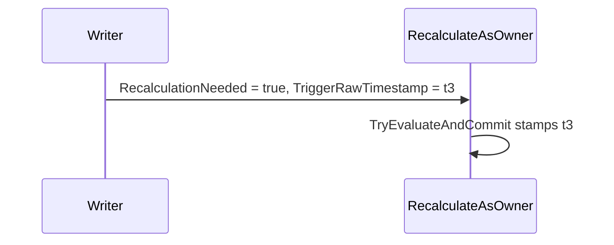

# PR review story

Turn one PR into a Markdown document a reviewer reads top to bottom instead of the file-ordered diff. Every production hunk appears verbatim exactly once, grouped into chapters by concept, with the related code the story needs shown beside it and a Mermaid diagram where a chapter changes an interaction. Each chapter ends with the tests that cover it as short pseudo code under their real method names, and the document ends with what the reader must still check in the code.

## Tooling

`pr_story.py` (next to this file) is the single source for the diff. It fetches the PR into `refs/pr-story/<N>` and diffs with the histogram algorithm, so its hunks are more readable than `gh pr diff`. Pass the PR number, or `git:<range>` for a local branch. Run it without arguments for the placeholder syntax. Every rendered block starts with a link to its lines at the PR head commit on GitHub.

```bash
python3 .claude/skills/pr-review-story/pr_story.py files 642     # categories, hunk numbers, tests, unchanged uses
python3 .claude/skills/pr-review-story/pr_story.py diff 642      # the diff to read
python3 .claude/skills/pr-review-story/pr_story.py show 642 <path> 9    # one hunk: hunk line, head line, text
python3 .claude/skills/pr-review-story/pr_story.py render 642 template.md pr-642-story.md
python3 .claude/skills/pr-review-story/pr_story.py check 642 pr-642-story.md
python3 .claude/skills/pr-review-story/pr_story.py post 642 pr-642-story.md --dry-run   # comment count; drop --dry-run to post
```

## Steps

1. Read the PR description (`gh pr view <N>`), then `files` and `diff`. Correct a wrong category by reading the file, for example a JSON file that is production configuration.
2. Plan chapters. A chapter is one concept a reviewer can judge on its own. Order them so each chapter only depends on earlier ones: contracts and new types, then the core mechanism, then callers and consumers, then wiring and configuration. Split one file's hunks across chapters when they serve different concepts. When one hunk mixes concepts, split it with excerpts (`n@a-b`, line numbers from `show`) so each part sits in its own chapter. Run `show` on every hunk of a multi-concept file: a hunk often ends with the doc comment of the next member.
3. Find the code each chapter needs beyond its hunks, reading the head files (`git show "${HEAD_REF}:path"`; in zsh write `${HEAD_REF}`, since `$HEAD_REF:s` is a modifier):
   - **Unchanged uses** listed by `files`: unchanged lines whose names now bind to a different declaration, so their meaning changed without their text.
   - **The unchanged remainder of a changed method** when the change only makes sense with it, such as the loop a new variable flows into.
   - **Related code outside the diff**: the callers of a changed method, the type or contract the change relies on, the consumer of a new value. `{{code}}` takes any file at head, also one the PR does not touch.

   Show what a reader needs to judge the change with `{{code:<path>:<a>-<b>}}` next to the hunks it belongs to, a few to about 25 lines per block, each introduced by one sentence on why it matters. Put the rest in "Check in code".
4. Write `template.md` in the session's scratchpad directory (system temp when there is none) in the shape below, with one placeholder line per code block. Never paste or retype code lines by hand, docs included.
5. `render`, then `check`. Fix every `UNUSED`, `ERROR`, `MISSING`, `UNMENTIONED` and `UNSHOWN USE` line in the template and render again until `check` prints `OK`.
6. Reply with the document's path, chapter titles, the reviewer notes and the "Check in code" list.
7. Ask whether to post the document as a PR comment, stating how many comments `post <N> <doc> --dry-run` reports. Post only after an explicit yes, with `post <N> <doc>`. It updates this story's earlier comments on the PR instead of adding new ones.

## Document shape

````markdown
# PR #<N>: <title>

<PR link> · +<added>/-<removed> · <the category counts line from `files`>

## Why
One paragraph from the PR description: the problem, then the approach.

## Reading order
| # | Chapter | Production files |

## 1. <Concept as a noun phrase>
One to three sentences: what this chapter changes and what to check in it.



{{hunk:src/path/File.cs:2,3|nodoc}}

One sentence on why this unchanged code matters, for example "the publish call below now reads the committed timestamp".
{{code:src/path/File.cs:250-262}}

**Covered by** `FileTests`
```text
WhenX_ThenY
    arrange: <the essential setup only>
    act:     <the call>
    assert:  <the expected outcome>
WhenOther_ThenZ(case1 | case2 | case3)    // theory: cases folded into one line
    ...
```
- `ExistingTests`: `hasDynamicScale: false` added in WhenA_ThenB, WhenC_ThenD

## Test-only changes
Present only when tests changed without production code they cover, such as a flaky-test fix: the same pseudo code, one sentence on why.

## Not shown verbatim
| File | Kind | Summary |
One row per non-production file not shown in full, one line each.

## Check in code
- Unchanged code: {{link:src/path/File.cs:300-340}} <what to verify there and why the document cannot show it>
- Read in full: `WhenX_ThenY` {{link:src/path/FileTests.cs:120-180}} <what the pseudo code cannot show, such as thread coordination or timeouts>
- Run: <CI, benchmark or load test the PR depends on, with the status the description reports>

## Reviewer notes
- [PR] <risk, open item or skipped verification the description states>
- [unverified] <observation from reading the diff, phrased as a question to check>
````

## Rules for the content

- **Covered by** lists every new, changed and removed test from `files` whose subject is that chapter's code, directly under that code. A test spanning chapters goes under the last chapter it needs. A chapter without tests of its own ends with `**Covered by** tests in chapters <n, m>` (earlier or later), or `**Covered by** no test` when nothing exercises it. Tests that only change mechanically (a renamed call, an added argument) become one bullet per file that names each test. Test helpers and test models are named in a sentence, not shown.
- Pseudo code keeps the real method name verbatim, then three or fewer indented lines with the concrete values that make the case interesting.
- Use `|nodoc` on a block whose `///` comments restate the member name or signature. Omit `|nodoc` when the docs state a contract a caller must act on (threading, ownership, nullability, ordering) or when changing the docs is the point of the hunk.
- Prose states facts from the diff and the description. Inferences go only in Reviewer notes, tagged `[unverified]`. A note never claims a bug that was not reproduced.
- Docs changes go in "Not shown verbatim" unless a docs change is itself a contract change the reviewer must judge, such as a removed limitation. Then show that part as an excerpt placeholder in the relevant chapter.
- **Diagrams**: a chapter that changes an interaction a reader would otherwise rebuild in their head gets one Mermaid diagram before its code: a hand-off between threads or components as a `sequenceDiagram`, a lifecycle as a `stateDiagram-v2`, control flow across several methods as a `flowchart`. When the change is to the flow itself, show two consecutive diagrams labeled **Before** and **After**. Every participant, state and message names a real type, method, field or value from the code. A chapter whose change stays inside one method gets no diagram. Use Before and After only when the steps differ; when only a value they carry changes, use one diagram with a note. Keep `;` and unquoted `:` out of message and note text, which Mermaid parses as syntax.
- **Check in code** names concrete places with `{{link}}` placeholders. It always has an entry for each test whose correctness depends on concurrency, timing or a mock setup the pseudo code flattens, for each changed method's unchanged remainder that is not shown, and for each verification the PR claims but the document cannot prove. A reader who works through it and the chapters has reviewed the PR.
