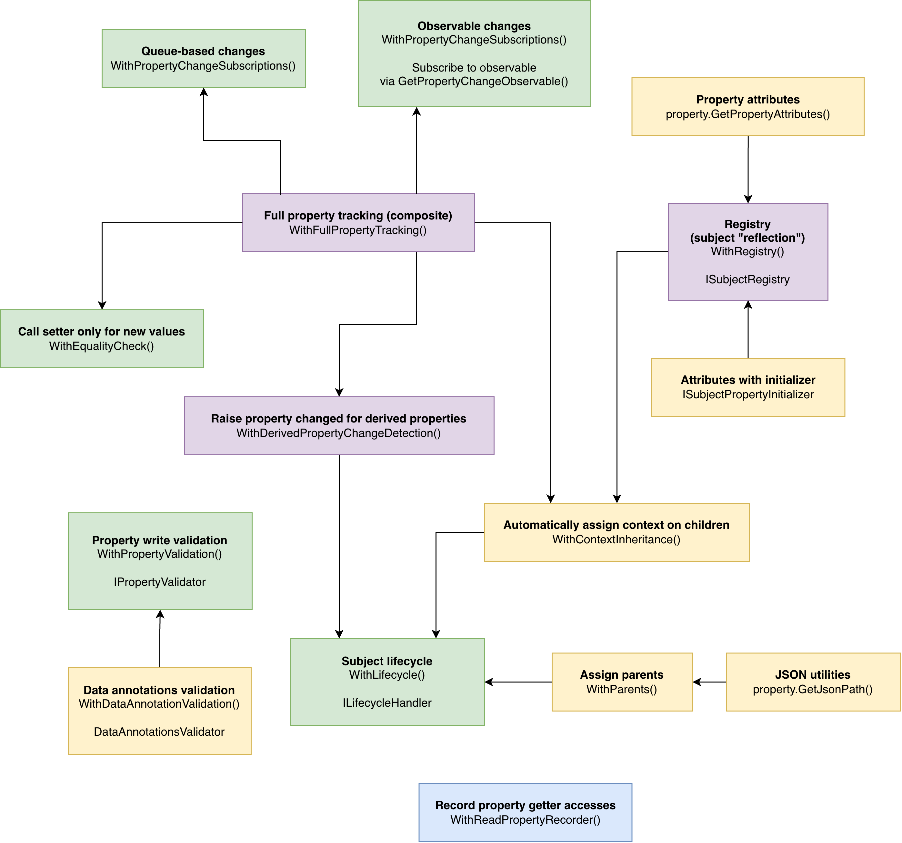

[](https://www.nuget.org/packages/Namotion.Interceptor)

> **Note**: This library is in active development. APIs may change between versions.

# Namotion.Interceptor for .NET

Namotion.Interceptor is a .NET library for building reactive applications with automatic property tracking and change propagation. It uses **C# 13 partial properties** and **source generation** to transform your classes into observable object graphs, without runtime reflection or proxy objects.

Simply mark your classes with `[InterceptorSubject]` and declare properties as `partial`. The source generator handles the rest: creating interception logic, change detection, derived property updates, and lifecycle management. Your domain models remain clean POCOs while gaining powerful reactive capabilities.

The library supports **bidirectional synchronization** with external systems. When a property changes locally, connectors propagate the change outward. When external data arrives, your object model updates and triggers change notifications. Built-in integrations include MQTT, OPC UA, ASP.NET Core, Blazor, and GraphQL, useful for IoT dashboards, industrial HMIs, real-time web apps, and data synchronization services.



## Why Namotion.Interceptor?

- **Reactive object graphs** - Property changes automatically propagate to derived properties and external systems
- **Zero runtime reflection** - All interception logic is generated at compile-time for maximum performance
- **Bidirectional synchronization** - Connect your object model to MQTT brokers, OPC UA servers, or databases with minimal code
- **Clean domain models** - Your classes stay as POCOs with simple attributes
- **INotifyPropertyChanged built-in** - Generated classes implement it automatically, including derived properties, for seamless UI data binding

## Packages

Namotion.Interceptor is structured as Core, Tracking, Validation, Registry, Connectors, and Integrations. Each builds on the previous, so you can adopt only what you need.

1. **Core**: `[InterceptorSubject]`, the source generator, and the read/write interceptor pipeline. Everything else plugs into this.
2. **Tracking**: observable and queue-based change streams, derived property recalculation, lifecycle attach/detach, transactions.
3. **Validation**: data-annotation and custom property validators that reject invalid writes before they reach your model.
4. **Registry**: runtime subject and property discovery, property metadata via attributes, dynamic properties, stable subject IDs.
5. **Connectors**: bidirectional synchronization with external systems (MQTT, OPC UA, WebSocket).
6. **Integrations**: host frameworks (ASP.NET Core, Blazor, GraphQL, MCP) that surface subjects through familiar APIs.

Several extension points let you plug in your own behavior:

| Extension Point | What it enables | Documentation |
|-----------------|-----------------|---------------|
| **Read/Write Interceptors** | Add cross-cutting concerns like logging, caching, or transformation to property access | [Interceptors](docs/interceptor.md) |
| **Lifecycle Handlers** | React to objects entering or leaving the object graph (cleanup, initialization) | [Tracking](docs/tracking.md) |
| **Custom Property Validation** | Implement custom validation logic beyond data annotations | [Validation](docs/validation.md) |
| **Custom Connectors** | Synchronize with any external system (databases, message queues, APIs) | [Connectors](docs/connectors.md) |

The rest of this README walks through each in turn, then lists every package with a documentation link.

## Requirements

- **.NET 9.0** or later (extensions and integrations)
- **.NET Standard 2.0** (core library only)
- **C# 13** with partial properties support
- IDE with source generator support (Visual Studio 2022, Rider, VS Code with C# extension)

## Installation

Add the core library and the source generator. Most projects also want the Tracking package for change events and derived properties.

```xml
<ItemGroup>
    <PackageReference Include="Namotion.Interceptor" Version="0.1.0" />
    <PackageReference Include="Namotion.Interceptor.Generator" Version="0.1.0"
                      OutputItemType="Analyzer" ReferenceOutputAssembly="false" />
    <PackageReference Include="Namotion.Interceptor.Tracking" Version="0.1.0" />
</ItemGroup>
```

Additional packages are listed in the [Package Reference](#package-reference) at the bottom.

## Core

The core library defines the central abstractions: the **interceptor subject** (a class whose property accesses route through a pipeline) and the **subject context** (the registry of services and interceptors that drives that pipeline). Everything else registers services into the context to do its work.

### Interceptor Subjects

An interceptor subject is any class marked with `[InterceptorSubject]` that uses C# 13 partial properties. Mark stored properties as `partial` and initialize them in the constructor:

```csharp
[InterceptorSubject]
public partial class Person
{
    public partial string FirstName { get; set; }
    public partial string LastName { get; set; }
    public partial Person[] Children { get; set; }

    [Derived]
    public string FullName => $"{FirstName} {LastName}";

    public Person()
    {
        FirstName = string.Empty;
        LastName = string.Empty;
        Children = [];
    }
}
```

To create instances, build a context and pass it in. The context is typically created once at startup and shared across the object graph:

```csharp
var context = InterceptorSubjectContext
    .Create()
    .WithFullPropertyTracking();

var person = new Person(context);
```

Only the root subject needs the context explicitly. Child subjects assigned to the parent's properties automatically inherit the same context, so the entire object graph participates in the same interception pipeline. Child subjects can be constructed without passing the context:

```csharp
var person = new Person(context);
person.Children = [new Person { FirstName = "Alice" }];  // Alice inherits the context automatically
```

Inheritance requires `WithContextInheritance()` on the context, which is bundled into `WithFullPropertyTracking()`.

For the patterns that work, the patterns that don't (collection mutation, explicit interface implementation, abstract properties), and the rules around constructors and initialization, see the [Subject Design Guidelines](docs/subject-guidelines.md).

### Generator

The source generator (`Namotion.Interceptor.Generator`) is the bridge between your `partial` declarations and the interception pipeline. It runs at compile-time.

For each partial property, the generator expands the declaration into a real getter and setter that route through the subject's context. A read passes through the chain of `IReadInterceptor`s. A write first runs your optional `OnXxxChanging` hook (which can cancel or coerce the value), then the chain of `IWriteInterceptor`s (where validation, change tracking, and source synchronization plug in), then the backing-field write, then `OnXxxChanged`, and finally raises `INotifyPropertyChanged`.

Concretely, for each `[InterceptorSubject]` class the generator emits:

- A backing field paired with the expanded getter and setter for every partial property.
- A constructor accepting `IInterceptorSubjectContext` (when no user constructor exists).
- `IInterceptorSubject`, `INotifyPropertyChanged`, and `IRaisePropertyChanged` implementations.
- Static metadata describing the class's properties.

For example, this hook trims whitespace and rejects empty names:

```csharp
partial void OnFirstNameChanging(ref string newValue, ref bool cancel)
{
    if (string.IsNullOrWhiteSpace(newValue)) cancel = true;
    else newValue = newValue.Trim();
}
```

Because everything is generated at compile-time, there is no runtime reflection or proxy creation. See [Generator](docs/generator.md) for supported features (inheritance, init-only, virtual/override, partial-class spanning) and limitations.

If partial properties aren't an option (for example, you need to add interfaces to a subject at runtime), the [Dynamic](docs/dynamic.md) package builds equivalent subjects from interfaces using Castle DynamicProxy.

### Interception Pipeline

Property reads and writes flow through a configurable chain of interceptors. Each interceptor receives the value plus a `next` delegate, so it can run code before and after the actual field access. This is how tracking, validation, sources, transactions, and everything else plug in.

```csharp
public class LoggingInterceptor : IWriteInterceptor
{
    public void WriteProperty<T>(ref PropertyWriteContext<T> context, WritePropertyDelegate<T> next)
    {
        Console.WriteLine($"Writing {context.Property.Name} = {context.NewValue}");
        next(ref context);
    }
}

var context = InterceptorSubjectContext
    .Create()
    .WithService(() => new LoggingInterceptor());
```

Methods can be intercepted similarly: implement `IMethodInterceptor` and suffix your method name with `WithoutInterceptor`. The generator emits a public wrapper (with the suffix dropped) that routes through the chain.

Interceptor ordering, fallback contexts, and the read/write pipeline diagrams are documented in [Interceptors and Contexts](docs/interceptor.md).

## Tracking

The Tracking package adds change observation, derived-property recalculation, and lifecycle events to the core pipeline. Most applications enable everything in one call:

```csharp
var context = InterceptorSubjectContext
    .Create()
    .WithFullPropertyTracking();
```

`WithFullPropertyTracking()` registers equality checking, derived-property change detection, the property-change observable and queue, and context inheritance for child subjects. Each feature can also be enabled individually if you only need part of the package.

The samples below use the `Person` class from the Core section above.

### Change Tracking

Subscribe to property changes anywhere in the graph through the observable:

```csharp
context
    .GetPropertyChangeObservable()
    .Subscribe(change =>
    {
        Console.WriteLine(
            $"Property '{change.Property.Name}' changed " +
            $"from '{change.GetOldValue<object?>()}' to '{change.GetNewValue<object?>()}'.");
    });

person.FirstName = "John";
// Property 'FirstName' changed from '' to 'John'.
// Property 'FullName' changed from ' ' to 'John '.

person.LastName = "Doe";
// Property 'LastName' changed from '' to 'Doe'.
// Property 'FullName' changed from 'John ' to 'John Doe'.
```

For high-throughput scenarios (>1000 changes/second, source synchronization, IoT pipelines), use the lock-free queue instead of the observable. It avoids per-event allocations and is the mechanism the connectors use internally. Both mechanisms are described in [Tracking](docs/tracking.md).

### Derived Properties

When `[Derived]` properties read other properties during evaluation, the tracking system records those reads as dependencies. When any dependency changes, the derived property is recalculated and fires its own change event. The example above shows `FullName` updating automatically whenever `FirstName` or `LastName` changes. Derived properties also work across the object graph (a derived property can depend on a child subject's property).

### Lifecycle Tracking

The tracking package also reports when subjects enter or leave the object graph:

```csharp
person.Children = [new Person { FirstName = "Alice" }, new Person { FirstName = "Bob" }];
// Attached: Alice
// Attached: Bob

person.Children = [];
// Detached: Alice
// Detached: Bob
```

Higher-level features rely on this to start and stop work as the graph grows and shrinks: the registry inserts and removes entries, the hosting package starts and stops services, and connectors subscribe and unsubscribe from external sources.

> **Note**: Property interceptors only fire when you assign to a property. Mutating a collection in-place (`person.Children[0] = ...`) does not trigger interception. Replace the whole collection instead. See [Subject Design Guidelines](docs/subject-guidelines.md) for details.

For batching multiple property writes into an atomic operation (with read-your-writes consistency, optimistic locking, and rollback on failure), see [Transactions](docs/tracking-transactions.md).

## Validation

The Validation package rejects invalid writes before they reach the backing field. Standard .NET data-annotation attributes like `[Required]`, `[MaxLength]`, and `[Range]` work out of the box once you add `WithDataAnnotationValidation()` to the context. Invalid writes throw `ValidationException` and the property keeps its previous value.

```csharp
[InterceptorSubject]
public partial class Person
{
    [Required, MaxLength(50)]
    public partial string FirstName { get; set; }
    // ... other properties unchanged
}

var context = InterceptorSubjectContext
    .Create()
    .WithFullPropertyTracking()
    .WithDataAnnotationValidation();

var person = new Person(context);
person.FirstName = "This name is way too long and exceeds the maximum length";
// Throws ValidationException; person.FirstName is unchanged.
```

For custom rules, cross-property validation, or external checks, implement `IPropertyValidator` and register it on the context. See [Validation](docs/validation.md).

## Registry

The Registry package keeps track of every subject in the graph and the metadata attached to it. Once enabled, subjects can be enumerated, looked up by ID, and extended with dynamic properties at runtime.

```csharp
var context = InterceptorSubjectContext
    .Create()
    .WithFullPropertyTracking()
    .WithRegistry();

var person = new Person(context);
var registered = person.TryGetRegisteredSubject();

foreach (var property in registered.Properties)
{
    Console.WriteLine($"{property.Name} ({property.Type.Name})");
}
```

Two patterns built on the registry are used heavily by other packages:

- **Property attributes**: strongly typed metadata stored as actual properties (e.g., a `Pressure_Minimum` companion to a `Pressure` property), discoverable at runtime, trackable like any other property, and bindable through connectors.
- **Stable subject IDs**: short string identifiers used by connectors (notably WebSocket) to reference subjects across the wire, with optional client-supplied IDs and a context-wide reverse index.

Both, plus dynamic property and attribute creation at runtime, are covered in [Registry](docs/registry.md).

## Connectors

A **connector** synchronizes a subject graph with an external system. It comes in two flavors:

- **Sources** (`ISubjectSource`): the external system is the source of truth. The connector loads initial state, subscribes to inbound updates, and writes local changes back. Each property has at most one source.
- **Servers**: the C# graph is the source of truth. The connector exposes properties to external clients and applies their incoming writes.

Both directions use the same path-mapping infrastructure (`[Path]` attributes, customizable path providers) and route through the property-change queue for backpressure-friendly delivery. The shared connector infrastructure also handles loop prevention (echoed values are deduplicated by source filtering), write retry queues during disconnection, and reconnection with state replay.

Writes are **local-first** by default: the in-process model updates immediately and the change is sent to the external system asynchronously. This keeps the local model responsive but means it can be temporarily ahead of the source. For scenarios that need the source to confirm before the local model updates (industrial control, financial data), wrap the writes in a [source transaction](docs/tracking-transactions.md): the local model only changes if the source accepts the write.

The MQTT connector illustrates a typical setup. Define your subject with topic mappings:

```csharp
[InterceptorSubject]
public partial class Sensor
{
    [Path("mqtt", "temperature")]
    public partial decimal Temperature { get; set; }

    [Path("mqtt", "humidity")]
    public partial decimal Humidity { get; set; }

    public Sensor()
    {
        Temperature = 0;
        Humidity = 0;
    }
}
```

Then register the client:

```csharp
builder.Services.AddMqttSubjectClient<Sensor>(
    brokerHost: "mqtt.example.com",
    sourceName: "mqtt",
    brokerPort: 1883,
    topicPrefix: "sensors/room1");
```

Property changes now flow in both directions automatically:

```csharp
var sensor = serviceProvider.GetRequiredService<Sensor>();

// Local change is published to the broker
sensor.Temperature = 25.5m;

// Inbound MQTT messages update the property and trigger change notifications
```

The same pattern applies to [OPC UA](docs/connectors-opcua.md) (industrial automation, dynamic property discovery, companion specifications) and [WebSocket](docs/connectors-websocket.md) (digital twin synchronization with sequence numbers and heartbeats). Implementation details for sources, servers, ownership, and write retry are in [Connectors](docs/connectors.md). The wire format used for partial state synchronization is documented in [Subject Updates](docs/connectors-subject-updates.md).

## Integrations

Integrations expose subjects through .NET host frameworks. They reuse the tracking and registry packages (no protocol of their own) and are designed to drop into existing applications.

- **[ASP.NET Core](docs/aspnetcore.md)** - `MapSubjectWebApis<T>` adds REST endpoints for reading the subject graph as JSON, updating properties via JSON paths, and exposing structure metadata. Integrates with data-annotation validation and OpenAPI/Swagger.
- **[Blazor](docs/blazor.md)** - `<TrackingScope>` automatically re-renders content when any property accessed inside it (or anywhere in its descendant graph) changes. Works with both server and WebAssembly hosting models.
- **[GraphQL](docs/graphql.md)** - adds a `root` query and a `root` subscription via HotChocolate, streaming property changes to subscribed clients.
- **[MCP](docs/mcp.md)** *(experimental)* - exposes the subject registry as Model Context Protocol tools (`browse`, `search`, `get_property`, `set_property`, `list_types`) so AI agents can navigate and interact with the object graph.

For background-service scenarios (a subject that runs as `BackgroundService`, or services dynamically attached and detached from a subject), the [Hosting](docs/hosting.md) package wires `WithHostedServices()` into the .NET Generic Host so attach/detach drives `StartAsync`/`StopAsync`.

## Package Reference

### Core

| Package | Description | Documentation |
|---------|-------------|---------------|
| **Namotion.Interceptor** | Property interception with compile-time source generation | [Interceptors](docs/interceptor.md) |
| **Namotion.Interceptor.Generator** | Source generator for `[InterceptorSubject]` classes (add as analyzer) | [Generator](docs/generator.md) |
| **Namotion.Interceptor.Dynamic** | Create subjects from interfaces at runtime | [Dynamic](docs/dynamic.md) |

### Tracking

| Package | Description | Documentation |
|---------|-------------|---------------|
| **Namotion.Interceptor.Tracking** | Change tracking, derived properties, lifecycle events, transactions | [Tracking](docs/tracking.md) |

### Validation

| Package | Description | Documentation |
|---------|-------------|---------------|
| **Namotion.Interceptor.Validation** | Property validation with data annotation support | [Validation](docs/validation.md) |

### Registry

| Package | Description | Documentation |
|---------|-------------|---------------|
| **Namotion.Interceptor.Registry** | Runtime property discovery, metadata, and dynamic properties | [Registry](docs/registry.md) |

### Connectors

| Package | Description | Documentation |
|---------|-------------|---------------|
| **Namotion.Interceptor.Connectors** | Base infrastructure for external system integration | [Connectors](docs/connectors.md) |
| **Namotion.Interceptor.Mqtt** | Bidirectional MQTT synchronization | [MQTT](docs/connectors-mqtt.md) |
| **Namotion.Interceptor.OpcUa** | OPC UA client and server integration | [OPC UA](docs/connectors-opcua.md) |
| **Namotion.Interceptor.WebSocket** | Real-time WebSocket synchronization | [WebSocket](docs/connectors-websocket.md) |

### Integrations

| Package | Description | Documentation |
|---------|-------------|---------------|
| **Namotion.Interceptor.AspNetCore** | ASP.NET Core integration for web APIs | [ASP.NET Core](docs/aspnetcore.md) |
| **Namotion.Interceptor.Blazor** | Automatic re-rendering on property changes | [Blazor](docs/blazor.md) |
| **Namotion.Interceptor.GraphQL** | GraphQL subscriptions for real-time updates | [GraphQL](docs/graphql.md) |
| **Namotion.Interceptor.Mcp** | MCP server for AI agent access to the subject registry | [MCP](docs/mcp.md) |
| **Namotion.Interceptor.Hosting** | Hosted service lifecycle management | [Hosting](docs/hosting.md) |

For more examples, see the `Samples` directory in the solution.
