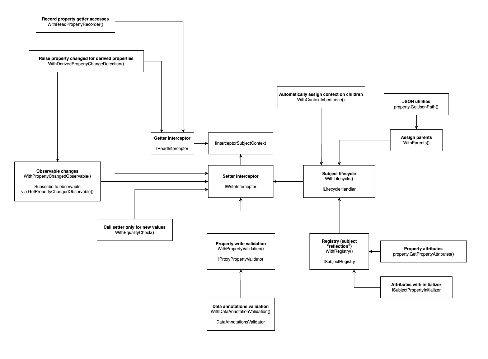

[](https://www.nuget.org/packages/Namotion.Interceptor)

> **Note**: This library is in active development. APIs may change between versions.

# Namotion.Interceptor for .NET

Namotion.Interceptor is a .NET library for building reactive applications with automatic property tracking and change propagation. It uses **C# 13 partial properties** and **source generation** to transform your classes into observable object graphs - without runtime reflection or proxy objects.

Simply mark your classes with `[InterceptorSubject]` and declare properties as `partial`. The source generator handles the rest: creating interception logic, change detection, derived property updates, and lifecycle management. Your domain models remain clean POCOs while gaining powerful reactive capabilities.

The library supports **bidirectional synchronization** with external systems. When a property changes locally, connectors propagate the change outward. When external data arrives, your object model updates and triggers change notifications. Built-in integrations include MQTT, OPC UA, ASP.NET Core, Blazor, and GraphQL - useful for IoT dashboards, industrial HMIs, real-time web apps, and data synchronization services.



## Why Namotion.Interceptor?

- **Reactive object graphs** - Property changes automatically propagate to derived properties and external systems
- **Zero runtime reflection** - All interception logic is generated at compile-time for maximum performance
- **Bidirectional synchronization** - Connect your object model to MQTT brokers, OPC UA servers, or databases with minimal code
- **Clean domain models** - Your classes stay as POCOs with simple attributes

## Core Concepts

### Interceptor Subjects

An **interceptor subject** is a class marked with `[InterceptorSubject]` that uses C# 13 partial properties. The source generator transforms your partial properties into fully tracked properties that route through an interception pipeline - no runtime reflection required.

```csharp
// Your code:
[InterceptorSubject]
public partial class Car
{
    public partial string Name { get; set; }
    public partial Tire[] Tires { get; set; }
}

// Generated code (simplified):
public partial class Car : IInterceptorSubject
{
    private string _name;

    public partial string Name
    {
        get => Context.GetPropertyValue("Name", () => _name);
        set => Context.SetPropertyValue("Name", value, v => _name = v);
    }

    // Constructor, metadata, IInterceptorSubject implementation...
}
```

### Derived Properties

Mark computed properties with `[Derived]` for automatic dependency tracking. When any property used in the calculation changes, the derived property is automatically re-evaluated and fires its own change event:

```csharp
[InterceptorSubject]
public partial class Person
{
    public partial string FirstName { get; set; }
    public partial string LastName { get; set; }

    [Derived]
    public string FullName => $"{FirstName} {LastName}";
}

person.FirstName = "John";
// Fires: FirstName changed, FullName changed

person.LastName = "Doe";
// Fires: LastName changed, FullName changed
```

The system records which properties are read during derived property evaluation, then automatically recalculates when any dependency changes. This works across the entire object graph.

> **Note**: Requires `WithDerivedPropertyChangeDetection()` or `WithFullPropertyTracking()` on the context.

### Interception Pipeline

Property reads and writes flow through a configurable chain of interceptors. Each interceptor receives a `next` delegate and can run code before and after calling it - enabling validation, transformation, change detection, and more. See [interceptors documentation](docs/interceptor.md) for details.

## Requirements

- **.NET 9.0** or later (extensions and integrations)
- **.NET Standard 2.0** (core library only)
- **C# 13** with partial properties support
- IDE with source generator support (Visual Studio 2022, Rider, VS Code with C# extension)

## Installation

Add both the core library and the source generator to your project:

```xml
<ItemGroup>
    <PackageReference Include="Namotion.Interceptor" Version="0.1.0" />
    <PackageReference Include="Namotion.Interceptor.Generator" Version="0.1.0"
                      OutputItemType="Analyzer" ReferenceOutputAssembly="false" />
</ItemGroup>
```

For change tracking and derived properties, also add:

```xml
<PackageReference Include="Namotion.Interceptor.Tracking" Version="0.1.0" />
```

## Samples

The following samples build on this `Person` class:

```csharp
[InterceptorSubject]
public partial class Person
{
    public partial string FirstName { get; set; }
    public partial string LastName { get; set; }
    public partial Person[] Children { get; set; }

    [Derived]
    public string FullName => $"{FirstName} {LastName}";

    public Person()
    {
        FirstName = string.Empty;
        LastName = string.Empty;
        Children = [];
    }
}
```

For detailed patterns and best practices, see the [Subject Design Guidelines](docs/subject-guidelines.md).

### Basic Usage

Create a context and instantiate your subject:

```csharp
var context = InterceptorSubjectContext
    .Create()
    .WithFullPropertyTracking();

var person = new Person(context);
```

### Change Tracking

Subscribe to property changes across your object graph:

```csharp
context
    .GetPropertyChangeObservable()
    .Subscribe(change =>
    {
        Console.WriteLine(
            $"Property '{change.Property.Name}' changed " +
            $"from '{change.OldValue}' to '{change.NewValue}'.");
    });

person.FirstName = "John";
// Property 'FirstName' changed from '' to 'John'.
// Property 'FullName' changed from ' ' to 'John '.

person.LastName = "Doe";
// Property 'LastName' changed from '' to 'Doe'.
// Property 'FullName' changed from 'John ' to 'John Doe'.
```

### Lifecycle Tracking

Track when objects enter or leave your object graph:

```csharp
person.Children = [new Person { FirstName = "Alice" }, new Person { FirstName = "Bob" }];
// Attached: Alice
// Attached: Bob

person.Children = [];
// Detached: Alice
// Detached: Bob
```

### Bidirectional Synchronization with External Systems

The core tracking capabilities enable powerful integrations. Here's an example with MQTT:

```csharp
[InterceptorSubject]
public partial class Sensor
{
    [Path("mqtt", "temperature")]
    public partial decimal Temperature { get; set; }

    [Path("mqtt", "humidity")]
    public partial decimal Humidity { get; set; }

    public Sensor()
    {
        Temperature = 0;
        Humidity = 0;
    }
}
```

Configure the MQTT client in your application:

```csharp
builder.Services.AddMqttSubjectClient<Sensor>(
    brokerHost: "mqtt.example.com",
    sourceName: "mqtt",
    brokerPort: 1883,
    topicPrefix: "sensors/room1");
```

Now property changes synchronize automatically:

```csharp
var sensor = serviceProvider.GetRequiredService<Sensor>();

// Changes publish to MQTT broker
sensor.Temperature = 25.5m;

// External MQTT messages update the property
// (and trigger change notifications)
```

Similar patterns work with OPC UA, databases, and other external systems. See the [MQTT](docs/connectors/mqtt.md), [OPC UA](docs/connectors/opcua.md), and [Connectors](docs/connectors.md) documentation for details.

## Extensibility

Namotion.Interceptor is designed to be extended:

| Extension Point | What it enables | Documentation |
|-----------------|-----------------|---------------|
| **Read/Write Interceptors** | Add cross-cutting concerns like logging, caching, or transformation to property access | [Interceptors](docs/interceptor.md) |
| **Lifecycle Handlers** | React to objects entering or leaving the object graph (cleanup, initialization) | [Tracking](docs/tracking.md) |
| **Custom Connectors** | Synchronize with any external system (databases, message queues, APIs) | [Connectors](docs/connectors.md) |
| **Custom Property Validation** | Implement custom validation logic beyond data annotations | [Validation](docs/validation.md) |

## Packages

### Core

| Package | Description | Documentation |
|---------|-------------|---------------|
| **Namotion.Interceptor** | Property interception with compile-time source generation | [Interceptors](docs/interceptor.md) |
| **Namotion.Interceptor.Generator** | Source generator for `[InterceptorSubject]` classes (add as analyzer) | |

### Foundation

| Package | Description | Documentation |
|---------|-------------|---------------|
| **Namotion.Interceptor.Tracking** | Change tracking, derived properties, lifecycle events, transactions | [Tracking](docs/tracking.md) |
| **Namotion.Interceptor.Registry** | Runtime property discovery, metadata, and dynamic properties | [Registry](docs/registry.md) |
| **Namotion.Interceptor.Validation** | Property validation with data annotation support | [Validation](docs/validation.md) |
| **Namotion.Interceptor.Dynamic** | Create subjects from interfaces at runtime | [Dynamic](docs/dynamic.md) |
| **Namotion.Interceptor.Hosting** | Hosted service lifecycle management | [Hosting](docs/hosting.md) |

### Connectors

| Package | Description | Documentation |
|---------|-------------|---------------|
| **Namotion.Interceptor.Connectors** | Base infrastructure for external system integration | [Connectors](docs/connectors.md) |
| **Namotion.Interceptor.Mqtt** | Bidirectional MQTT synchronization | [MQTT](docs/connectors/mqtt.md) |
| **Namotion.Interceptor.OpcUa** | OPC UA client and server integration | [OPC UA](docs/connectors/opcua.md) |

**[Namotion.Interceptor.Mqtt](docs/mqtt.md)** - MQTT client/server integration for IoT scenarios

**[Namotion.Interceptor.OpcUa](docs/opcua.md)** - OPC UA client/server integration for industrial automation
