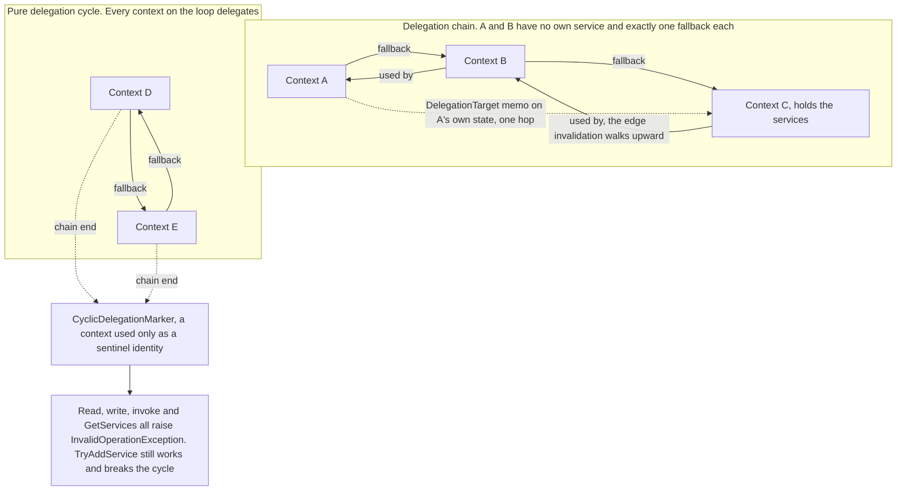
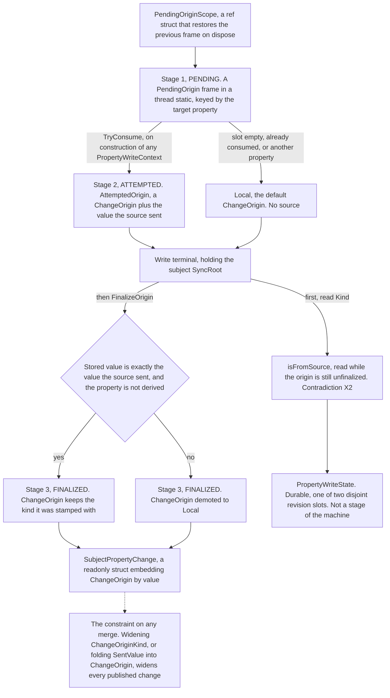
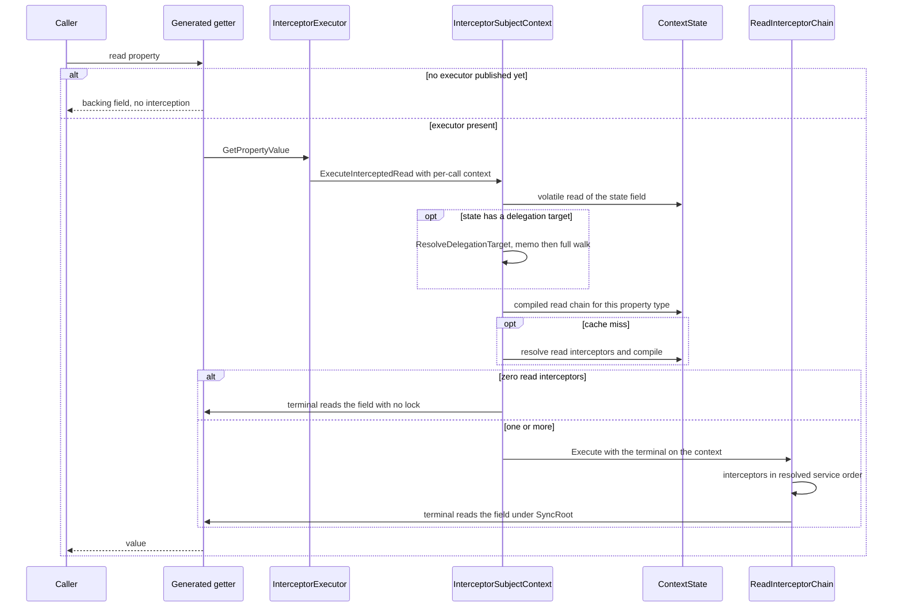
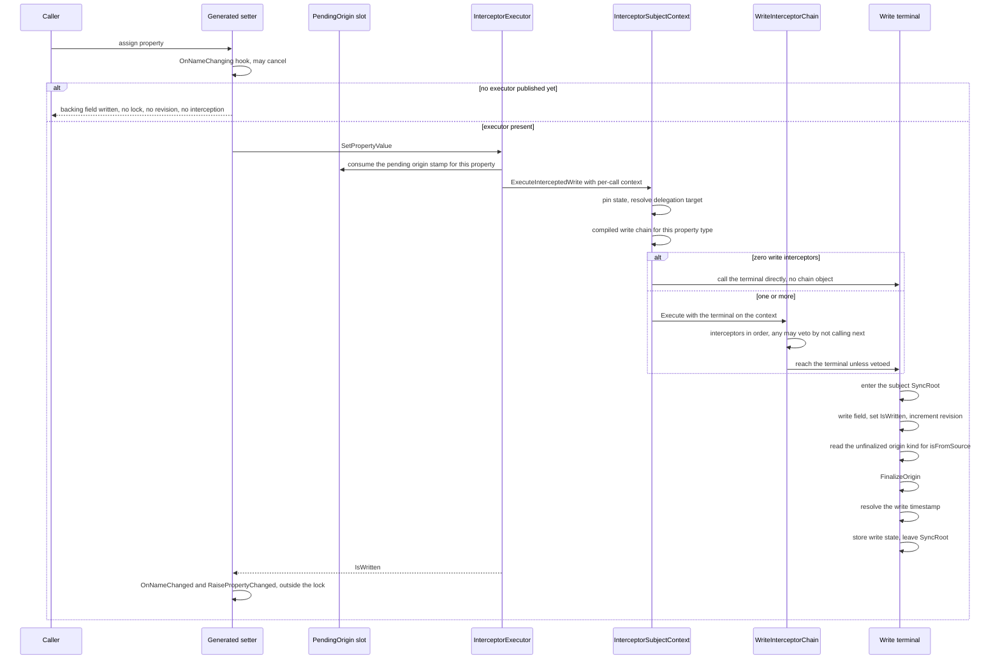
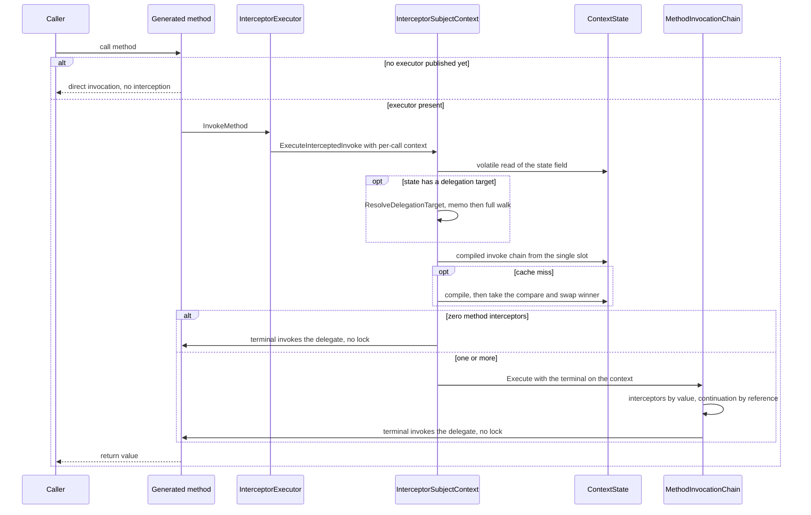
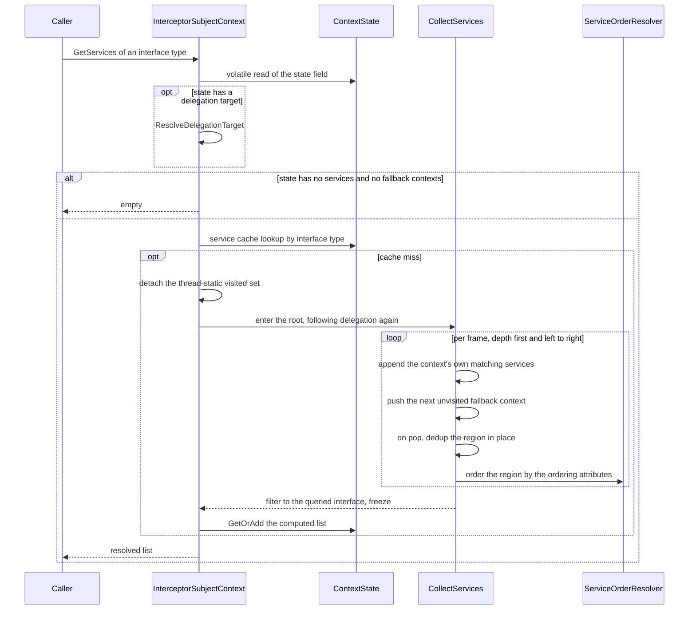
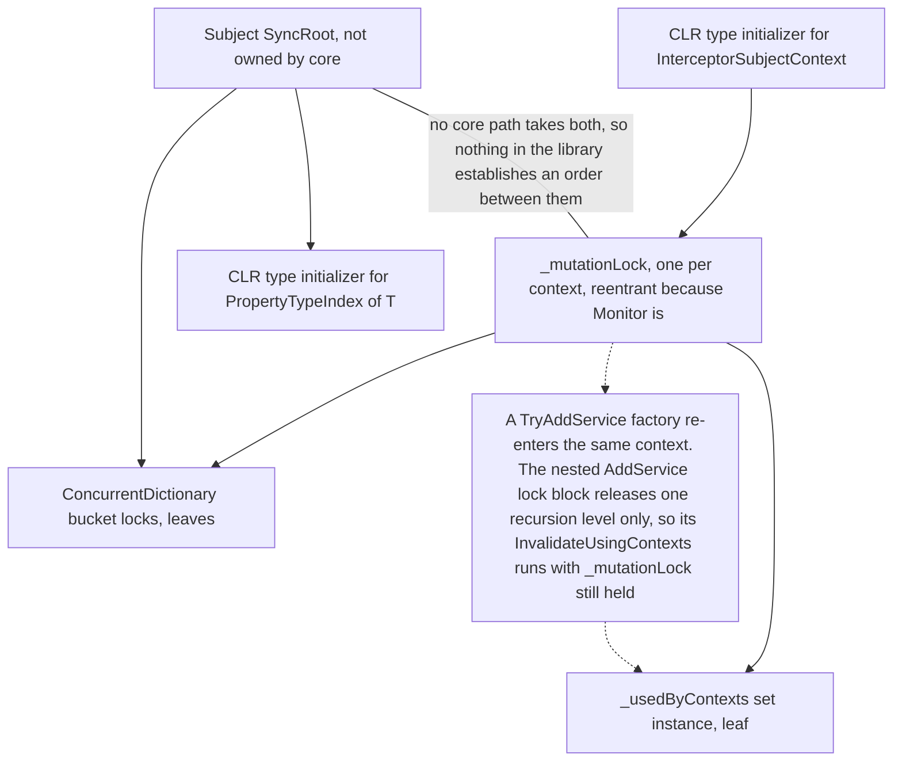

# Core Context: Architecture Dossier

Area: `src/Namotion.Interceptor/` (the core library, .NET Standard 2.0). 36 files, 3544 lines.
Boundary: Tracking, Registry, Connectors and the source generator are out of scope and get their own dossiers. Where core defines a contract those libraries depend on, the contract is in scope and the consumer's use of it is not.
Written against: `src/` at `b36ec531f` (`origin/master`). This branch changes no file under `src/`, so the code described here is master's.
Verified: in two rounds, and no section is now unverified.
Round 1, 2026-09-20, four independent readers over sections 2, 3, 4 and 5. 181 claims checked, 154 confirmed in substance, 63 corrected in substance, wording or citation, 13 claims added that no reader had found. The two counts overlap: 27 claims failed on substance, the rest of the 63 were confirmed in substance and corrected in wording or citation.
Round 2, 2026-09-21, two independent readers over sections 1, 6, 7 and 8. 58 claims checked over sections 1 and 6, 49 confirmed; over sections 7 and 8, every size, every commit attribution and a paginated sweep of all 63 open pull requests. Applying the verdicts corrected 69 claims: 14 in section 1, one coverage cell in section 2, 8 in section 6, 38 in section 7 and 8 in section 8. All 20 candidates gained the two required fields, **What is lost** and **Reach**.

Citation convention: a bare `:123` refers to the file named in the enclosing subsection's canonical implementation. A full path is given whenever the file changes.

## Summary

| | |
|---|---|
| Area | `src/Namotion.Interceptor/`, 36 files, 3544 lines. One file, `InterceptorSubjectContext.cs`, is 1095 of them |
| Use cases | 25, every one of them Undecided. No maintainer has ruled on any, so nothing here may be read as defended. [Section 1](#1-supported-use-cases) |
| Invariants | 65, of which 42 are covered by a test and 23 are unverified. [Section 2](#2-contracts-and-invariants) |
| Concepts | 24, of which 13 have more than one implementation. Three of the 13 are justified in writing, one of those three only in part. [Section 3](#3-concept-census) |
| Contradictions | 3. X1 and X3 are the same shape twice, an access that does not take the lock the contract promises. X2 is imprecise documentation over deliberate code. [Contradictions](#contradictions) |
| Flows | 4, and all four open with the same byte-identical six-line prologue. [Section 4](#4-flows) |
| Locks | 2 kinds core owns, 1 it does not own, 2 it enters without naming. Ten `lock (` sites in total, and no other synchronization primitive anywhere in core. [Lock order](#lock-order) |
| Gaps | 22: 10 Known broken, 7 Unspecified, 5 Best effort. Ten come from the analysis in sections 2 to 5, twelve from open issues. [Section 6](#6-gaps-and-limitations) |
| Candidates | 20, none ruled. 1,417 production lines if every recommendation is accepted, of which C1 alone is 764. Four of the 20 remove a capability rather than only an API shape. [Section 7](#7-candidates) |
| Backlog | 34 items dispositioned: 14 issues and 20 of the 63 open pull requests. [Section 8](#8-backlog-disposition) |

The findings that matter most:

1. **A subject nothing has attached is not intercepted at all.** Until something touches `.Context`, every write to it takes no lock, consumes no revision, records no write state and runs no interceptor, which makes invariants I22, I25 and I50 silently inapplicable. Contradiction [X3](#contradictions).
2. **Whether a read is synchronized is decided by the registered service set, not by the contract.** A read takes `SyncRoot` only when at least one read interceptor is registered. Contradiction [X1](#contradictions), with all nine cells in the [lock coverage matrix](#lock-coverage).
3. **A detach lifecycle callback that removes the same fallback again does not terminate.** The membership test it passes is unlocked, and the registration it would clear is only cleared after the callbacks have run. [Reentrancy](#reentrancy).
4. **User code runs under the subject's `SyncRoot` in three places and none of them is documented**: the caller-supplied timestamp function, the property type's own equality comparer, and chain compilation on a write nested inside the terminal. [Reentrancy](#reentrancy).
5. **The multi-context topology is both the biggest mechanism here and the bug class that keeps regenerating.** Fallback, delegation and invalidation are 666 of `InterceptorSubjectContext.cs`'s 1095 lines, and the prologue that pins the state and resolves the delegation target is byte identical at four call sites. Removing it is [C1](#c1-multi-context-topology), 764 lines and 54 percent of everything this document proposes, and it deletes the mechanism six of the ten Known broken gaps live on. It also takes U2 away outright and leaves U3, attach and detach after construction, needing a replacement mechanism rather than surviving by itself.
6. **Two competing rewrites already agree on that removal, byte for byte.** #494 and #501 make the identical +193/-753 change to `InterceptorSubjectContext.cs`, and disagree almost entirely inside the executor, so ruling C1 and choosing between the two pull requests are separate decisions. [Section 8](#8-backlog-disposition).
7. **`IMethodInterceptor` has no implementation in any shipping library**, so the compiled chain the method invocation flow caches is always the identity terminal. That is [C2](#c2-method-interception), 403 lines across core and the generator, and removing it retracts a capability `README.md:159` advertises as shipping. [Interceptor](#interceptor), [method invocation](#method-invocation).
8. **23 of the 65 invariants have no test**, among them the timestamp encoding (I37, I38), four consecutive write state rules (I39 to I42) and the pending origin's non-inheritance by nested writes (I36). [Section 2](#2-contracts-and-invariants).

What is still missing, so nobody mistakes a recorded fact for a decided one:

- **Every ruling.** Section 1's Ruling column is blank on all 25 rows, section 7's `Ruling` line is blank on all 20 candidates, and section 8's dispositions are recommendations that nothing has executed. Nothing here is decided, only recorded.
- **X1 and X3 are unclassified.** X2 is the only contradiction carrying a verdict, so two of the three sharpest findings above cannot be acted on until the maintainer says whether the code or the documentation is wrong. That is gap [G4](#6-gaps-and-limitations), and candidates [C18](#c18-x1-the-read-terminal-pair) and [C19](#c19-x3-the-unattached-subject) are both blocked behind it with opposite-signed answers: one makes the library slower to keep a promise, the other keeps the speed and retracts the promise.
- **Test cover is thinner than the "42 covered" headline.** 23 invariants have no test and 8 of those are load bearing (G5), 10 of the 42 covered rows pin only part of their claim (G6), and 1 test cannot fail on what its name claims (G7).
- **Two numbers this document does not have.** G18's two memory characteristics of the copy-on-write state are unmeasured, and C5's extract-the-write-terminal recommendation needs a machine-code diff before it can be accepted, because its correctness argument and its performance argument point in opposite directions.
- **The choice between #494 and #501 is out of scope here.** Section 8 shows that the two agree on C1 and disagree on lifecycle ownership inside the executor, which this dossier does not analyse.
- **One recorded defect is not fixed.** [G10](#6-gaps-and-limitations), where section 3's totals sentence mis-sums its own evidence, stands as written because section 3 was verified in the first round and out of scope for the second. Section 3's "221 lines" for the three chain classes reads two low for the same reason, as [section 7](#7-candidates)'s counting convention notes.
- **What is lost is recorded, but not ruled.** Every candidate now states the capability it removes, and four of the 20 remove one: C1 (U2, and U3 needs a replacement), C2 (U7), C3 (the open-ended half of U8) and C9 (atomic get-or-add returning the winning value, on U15). C18 and C19 each lose something on one branch of a classification the maintainer has not made. That is a record of the price, not a judgment that it is worth paying.

## 1. Supported use cases

What core promises, in the caller's words. `src/Namotion.Interceptor.Tests/VerifyChecksTests.PublicApi.verified.txt` is the public surface being mapped: `src/Namotion.Interceptor.Tests/VerifyTests.cs:15` snapshots `typeof(IInterceptorSubject).Assembly`, so it is core's API and nothing else's. Every public member has its lines priced in at least one row's Cost column, but five members are described by no row's use case sentence; the coverage notes after the table name them, and name the rows whose capability has no demonstrated caller. Line counts are whole-file sizes of `src/Namotion.Interceptor/` unless a sub-range from section 3 or 5 is cited.

| # | Use case | Status | Cost | Ruling |
|---|---|---|---|---|
| U1 | A plain class becomes an intercepted subject by carrying one attribute, with no runtime reflection and no base class to inherit from. | Undecided | The marker (`Attributes/InterceptorSubjectAttribute.cs:4`, 6 lines) and the five-member contract core defines and never implements (`IInterceptorSubject.cs:5`, 34 lines). Everything satisfying it is generated, so core pays 40 lines and the generator pays the rest. Section 3, [subject](#subject). | |
| U2 | A subject graph resolves services through more than one context, via registered fallback contexts. | Undecided | Fallback contexts, delegation targets, the cyclic marker, upward invalidation, the per-context used-by set, five thread-static traversal buffers. 666 of the 1095 lines of `InterceptorSubjectContext.cs`, per section 3. | |
| U3 | A subject can be attached to and detached from a context after construction, and every service registered on that context is told. | Undecided | `AddFallbackContext` and `RemoveFallbackContext` on the public contract (`IInterceptorSubjectContext.cs:9`), the two-method callback interface (`Interceptors/ILifecycleInterceptor.cs:3`, 16 lines) and the executor's two overrides that fire the callbacks around the base mutator (`Interceptors/InterceptorExecutor.cs:111`, `:127`), roughly 30 of that file's 143 lines. Section 5 records that the detach half does not terminate under re-entry. | |
| U4 | A service registered once at the top of a deep subject graph is found from any subject in that graph, and the lookup does not get slower as the graph gets deeper. | Undecided | The one-hop delegation edge (`InterceptorSubjectContext.cs:957`), the memoized chain end (`:973`) and the cyclic marker (`:40`), plus the six-line state-pin prologue repeated byte identically at four call sites (`:109`, `:238`, `:252`, `:266`). Delegation resolution is `:277-481`, 205 of the 666 lines U2 also pays. Section 3, [delegation target](#delegation-target). | |
| U5 | A read of any property runs through services registered on the context before the backing field is touched. | Undecided | `Interceptors/IReadInterceptor.cs` (48 lines), `Cache/ReadInterceptorChain.cs` (73) and `Cache/ReadInterceptorFactory.cs` (26). The three chain classes together are 221 lines, per section 3, [interceptor chain](#interceptor-chain). Whether the read takes the subject's `SyncRoot` is decided by the registered service set, contradiction [X1](#contradictions). | |
| U6 | A write of any property can be observed, transformed or vetoed by registered services before it reaches the backing field. | Undecided | `Interceptors/IWriteInterceptor.cs` (335 lines, the largest file after the context), `Cache/WriteInterceptorChain.cs` (73) and `Cache/WriteInterceptorFactory.cs` (74), whose two terminals are the same body twice. Section 3, [terminal operation](#terminal-operation). | |
| U7 | A method call on a subject can be intercepted the same way a property access is. | Undecided | `Interceptors/IMethodInterceptor.cs` (37 lines), `Cache/MethodInvocationChain.cs` (77), `Cache/MethodInvocationFactory.cs` (22), the single-slot chain cache on the state (`InterceptorSubjectContext.cs:962`, `:1090`) and one of the four prologue copies (`:266` to `:271`). The chain's type parameter has exactly one instantiation in the repository, and the interface has no implementation in any shipping library, so the cached chain is always the identity terminal. Section 4, [method invocation](#method-invocation). | |
| U8 | The order registered services run in is declared on the service type rather than at the registration site. | Undecided | `Ordering/ServiceOrderResolver.cs`, 310 lines, of which the First and Last groups cost 126 (partitioning `:43-112`, cross-group validation `:244-299`), plus the four attribute types (44 lines). `[RunsLast]` has no shipping use and `[RunsFirst]` exactly one. Section 3, [service ordering](#service-ordering). | |
| U9 | A context is created and configured fluently from one entry point, and a `WithX()` extension registers its service exactly once whatever order the extensions are called in. | Undecided | The static entry point `InterceptorSubjectContext.Create()` (`InterceptorSubjectContext.cs:94`), `TryAddService` (`:187`), `AddService` (`:213`), the retrieval pair (`:107`, `:224`) and three one-line wrappers (`InterceptorSubjectContextExtensions.cs:16`, `:31`, `:45`, 49 lines). `TryAddService` holds `_mutationLock` across both caller-supplied delegates (`:195`, `:200`), which is gaps [G13](#6-gaps-and-limitations), G14 and G16. | |
| U10 | Two changes to the same property can be ranked against each other after the fact, across detach and reattach. | Undecided | One plain `long` per subject incremented under `SyncRoot` (`Interceptors/InterceptorExecutor.cs:28`), two disjoint durable slots (`PropertyWriteState.cs:39`, `:55`, file 70 lines) recombined on the read side (`PropertyReference.cs:143`), and a per-call copy on the write context. Three carriers, justified in writing. Section 3, [commit revision](#commit-revision). A revision ranks only against the same property (I45). | |
| U11 | The instant of the last write to a property is readable without holding a change subscription. | Undecided | `TryGetWriteTimestamp` (`PropertyReference.cs:92`) over one `long` field (`PropertyWriteState.cs:22`), created through the same `GetOrAdd` as the revision slots (`PropertyReference.cs:222`). Zero means never written and a genuine `0001-01-01` cannot be told apart from it (I39, Unverified). | |
| U12 | A caller can decide the timestamp a write is stamped with, carry alongside it the instant the value was received from a source, read both back from anywhere inside the write, or replace the clock process wide. | Undecided | `SubjectChangeContext.cs`, 149 lines: the ambient scope pair (`:115`, `:130`), the ambient read `Current` (`:56`), the received timestamp it carries (`:100`), the single capture point (`:45`) and the process-wide settable clock (`:33`). The same three-way sentinel decision is implemented a second time on the write context (`Interceptors/IWriteInterceptor.cs:207`), which section 3 calls a finding. Section 5 records that the caller's function runs under the subject's `SyncRoot` and that nothing documents it. | |
| U13 | A source marks a property it has already published, so a later change can be filtered out of the echo back to it. | Undecided | One one-way volatile flag (`PropertyWriteState.cs:69`, its rule stated at `:58`), set at `PropertyReference.cs:168` and returned from `TryGetWriteState` (`:134`). Deliberately not per source, which is what lets it hold no source reference to release on detach (I42, Unverified). | |
| U14 | A write carries the provenance of the source that sent it, and the provenance survives only if the stored value is exactly the value the source sent. | Undecided | A three-stage machine over four types plus a thread static: `ChangeOrigin.cs` (59 lines), `AttemptedOrigin.cs` (21), `PendingOrigin.cs` (79) and the carry-and-finalize half of `Interceptors/IWriteInterceptor.cs` (`:101`, `:245` to `:335`). Section 3, [change origin](#change-origin), records that the three stages are named in one place, that one type per stage is not justified, and that any merge has to answer for the published struct's width. | |
| U15 | Any library hangs its own state off a subject, or off one property of a subject, without core knowing about it. | Undecided | One `ConcurrentDictionary<(string?, string), object?>` on the contract (`IInterceptorSubject.cs:20`), three subject-scoped accessors (`InterceptorSubjectExtensions.cs:5`, `:10`, `:21`, 24 lines) and six property-scoped ones (`PropertyReference.cs:31` to `:80`). Section 3, [subject data](#subject-data), calls the split two implementations that should be one, unjustified anywhere in the code. Core uses the same table for its own write state (`PropertyReference.cs:87`). | |
| U16 | Properties can be added to a subject after construction, described without a `PropertyInfo`. | Undecided | `AddProperties` on the contract (`IInterceptorSubject.cs:31`) and `SubjectPropertyMetadata.cs`, 121 lines, three constructors over one private combiner (`:98`) whose parameter count is justified at `:97`. The property table is read with no lock on every `PropertyReference.Metadata` access (`:25`), which section 5 records as the only state in core using neither `Volatile` nor `Interlocked`. | |
| U17 | A property's attributes include the ones declared on the interfaces it implements, deduplicated by `AllowMultiple`. | Undecided | `PropertyInfoExtensions.cs`, 102 lines, with two process-wide caches (`:14`, `:92`). The dedup half of I62 has a test, and so does the class-before-interface half. Only the interface-declaration-order half is unpinned, per gap [G7](#6-gaps-and-limitations). | |
| U18 | A property can be marked computed rather than stored, so nothing writes it back and its getter is never invoked under the lock. | Undecided | `Attributes/DerivedAttribute.cs` (6 lines), the derived flag (`SubjectPropertyMetadata.cs:115`) and the two places the write path consults it (`Interceptors/IWriteInterceptor.cs:254`, `:270`). The origin demotion is decided without invoking the getter (I28, Unverified). | |
| U19 | A subject binds to `INotifyPropertyChanged` consumers without allocating event arguments per change. | Undecided | `IRaisePropertyChanged.cs` (14 lines) and `PropertyChangedEventArgsCache.cs` (22). Neither has a caller inside core. Section 3, [property changed notification](#property-changed-notification). | |
| U20 | A value is written into a property through the full interception chain without going through the generated setter. | Undecided | `PropertyReferenceExtensions.cs`, 31 lines: `GetPropertyReference` (`:7`) and the public `SetPropertyValueWithInterception` (`:12`). The public overload enters the chain as `TProperty = object`, which is why both interceptor contracts call the type parameter a hint (`Interceptors/IReadInterceptor.cs:11`, `Interceptors/IWriteInterceptor.cs:13`). Gap [G19](#6-gaps-and-limitations). | |
| U21 | A `PropertyReference` keys a dictionary, and two references are equal exactly when the subject instance and the name match. | Undecided | One nested comparer (`PropertyReference.cs:257`) with `Equals`, `GetHashCode` and both operators delegating to it (`:228`, `:240`, `:246`, `:252`). The struct caches no metadata so every copy stays cheap (`:20`). I59, Unverified. | |
| U22 | A property or method is read, written or invoked by its name at runtime, on a subject whose members the caller does not know at compile time. | Undecided | `Interceptors/IInterceptorExecutor.cs` (33 lines) plus the three entry points and the compare-and-swap publisher on `Interceptors/InterceptorExecutor.cs` (143 lines). The interface carries a standing removal note in the code (`Interceptors/IInterceptorExecutor.cs:3`) and three shipping libraries outside core name it: Registry (`src/Namotion.Interceptor.Registry/Abstractions/RegisteredSubject.cs:336`, `:337`), Dynamic (`src/Namotion.Interceptor.Dynamic/DynamicSubject.cs:10`, `DynamicSubjectFactory.cs:66`) and the generator, which types every generated subject's backing field as it (`src/Namotion.Interceptor.Generator/SubjectCodeGenerator.cs:190`). Section 3, [context](#context). | |
| U23 | A subject is constructed with no context and attached later. | Undecided | Nothing in core: the parameterless constructor and the null-`_context` bypass are generated (`src/Namotion.Interceptor.Generator/SubjectCodeGenerator.cs:515`, `:521`, `:535`). The price is that until something touches `.Context`, every write takes no lock, consumes no revision, records no write state and runs no interceptor, making I22, I25 and I50 silently inapplicable. Contradiction [X3](#contradictions). | |
| U24 | A service query never blocks and never deadlocks against a concurrent topology mutation, including in a cyclic fallback graph. | Undecided | The immutable state snapshot published by `Interlocked.Exchange` under `_mutationLock` (`InterceptorSubjectContext.cs:797`, `:799`), publish and invalidation (`:779-943`, 165 lines, the label section 3 uses because the range also holds `PublishState` and `GetOrCreateUsedByContexts`), the per-context used-by set (`:77-80`) and five thread-static traversal buffers (`:54-67`) whose retain-or-drop policy is written out three times (`:324`, `:590`, `:871`). The 165 lines are part of the 666 U2 pays; the used-by field and the buffers are the 19 lines beside them that C1 counts separately. I1, I2. | |
| U25 | Concurrent writes to one subject each take a distinct revision and none is lost. | Undecided | The subject's `SyncRoot` taken by both write terminals (`Cache/WriteInterceptorFactory.cs:19`, `:50`), a plain increment inside it (`:30`, `:58`) and interlocked durable stores (`PropertyReference.cs:184`, `:188`, `:192`). No core path reads the counter outside the lock (section 5). I22, I47. | |

Status meanings: Supported means guaranteed and defended. Best effort means it usually works and is not guaranteed. Unsupported means explicitly ruled out. Undecided means nobody has ruled, which is not the same as supported.

Every row is Undecided, and that is a statement about this document rather than about the code. No maintainer has ruled on any of them, so nothing above may be read as defended. No public member of core documents itself as unsupported, so the table contains no Unsupported row.

Coverage notes, because an unmapped capability would be a finding of its own:

- **Every public member is priced by a row, and five are described by none.** Every member in the API snapshot falls inside the lines some row's Cost column counts, but five have no use case sentence of their own, and the earlier claim that every member "maps to a row" was too strong. `SubjectPropertyMetadata.IsIntercepted` (`SubjectPropertyMetadata.cs:38`) and `IsPublic` (`:53`) are metadata flags whose consumers are Registry and Dynamic, outside this dossier's boundary, and only I61 states what `IsPublic` means. `HasFallbackContext` (`InterceptorSubjectContext.cs:149`) is `protected`, a subclass-facing membership test the executor uses (`Interceptors/InterceptorExecutor.cs:129`), which is where gap [G9](#6-gaps-and-limitations) lives. `PropertyReference`'s public constructor (`PropertyReference.cs:9`) and `PropertyWriteContext.GetFinalValue()` (`Interceptors/IWriteInterceptor.cs:245`) are mechanisms inside U15, U20 and U6 rather than capabilities a caller asks for. None of the five is deliberately unsupported; none has been ruled on either.
- **Two capabilities have a row but no demonstrated caller.** `IMethodInterceptor` (U7) has zero implementations in any shipping library, the only three being in test assemblies (section 3, [interceptor](#interceptor)). `PropertyReference.GetOrSetPropertyData` (`PropertyReference.cs:54`, part of U15) has zero callers anywhere in the repository, tests included, its only other mention being the cross-reference at `:63`.
- **U14's stamping entry point is not in core, and it is not out of reach.** Core exposes no way to apply an origin: `ChangeOrigin.FromSource` (`ChangeOrigin.cs:50`) and `ChangeOrigin.Confirmed` (`:57`) are public, while the slot that carries a stamp into a write is `internal` (`PendingOrigin.cs:21`, `:37`), visible only to the four assemblies on the `InternalsVisibleTo` list (`src/Namotion.Interceptor/Namotion.Interceptor.csproj:16` to `:19`). **The public entry point lives in Tracking, and any consumer can reach it**: `SubjectChangeContextExtensions.SetValueFromOrigin` is `public` (`src/Namotion.Interceptor.Tracking/Change/SubjectChangeContextExtensions.cs:43`) and calls `PendingOrigin.Set` at `:49`, `SetValueFromSource` at `:66` forwards to it, and Connectors re-exports the same call for a registered property (`src/Namotion.Interceptor.Connectors/RegisteredSubjectPropertyExtensions.cs:16`). So U14 is a capability every connector uses today, reached one library over. Ruling it down on the ground that nothing outside core can stamp an origin would break every connector.

## 2. Contracts and invariants

Assertions that hold, each stated so it could be tested. Harvested from the inline comments and XML documentation in `src/Namotion.Interceptor/`, cited at the line where the rule is stated or enforced.

| # | Invariant | Evidence | Covered |
|---|---|---|---|
| I1 | A service query takes no context lock. It pins one snapshot with a single volatile read and walks other contexts' snapshots the same way, so the downward service walk and the upward invalidation walk cannot form a lock cycle, including in cyclic fallback graphs. | `src/Namotion.Interceptor/InterceptorSubjectContext.cs:18`, `:109` | `WhenFallbackContextIsMutatedWhileSubjectIsWritten_ThenNoDeadlockOccurs` |
| I2 | Lock order is `_mutationLock` then a `_usedByContexts` set lock, never the reverse. No path takes a second `_mutationLock`. | `src/Namotion.Interceptor/InterceptorSubjectContext.cs:22` | `WhenTwoContextsAddEachOtherAsFallbackConcurrently_ThenNoDeadlockOccurs` |
| I3 | The `factory` and `exists` delegates of `TryAddService` may read any context and may mutate the calling context, but must not mutate a different context. Two threads doing so acquire two mutation locks in opposite orders and deadlock. | `src/Namotion.Interceptor/IInterceptorSubjectContext.cs:24` | `WhenServiceFactoryRegistersIntoSameContext_ThenNoDeadlockOccurs` |
| I4 | R2: every mutator publishes its new state under `_mutationLock` with a single `Interlocked.Exchange` and no compare-and-swap loop, so no mutator can lose another's topology. The exchange is a full fence because the publisher then reads other contexts' state to drive invalidation. | `src/Namotion.Interceptor/InterceptorSubjectContext.cs:780`, `:799` | `WhenServicesAreAddedConcurrentlyWithQueries_ThenQuiescentStateSeesAllServices` |
| I5 | R3: invalidation makes exactly one unconditional compare-and-swap attempt. No early-out when caches look absent, and no retry on failure. | `src/Namotion.Interceptor/InterceptorSubjectContext.cs:803`, `:812` | `WhenContextIsInvalidated_ThenItsStateObjectIsReplaced` (the no-early-out half only; the test arranges a state that carries no caches. Exactly one attempt and no retry are untested) |
| I6 | R4: `AddFallbackContext` registers into the fallback's used-by set before publishing, and `RemoveFallbackContext` unregisters only after publishing, so a used-by set is always a superset of the true using set. A missing entry would leave a compiled chain above it permanently stale. | `src/Namotion.Interceptor/InterceptorSubjectContext.cs:131`, `:170` | `WhenFallbackIsRemovedWhileInvalidationWalksTheSameSet_ThenNoInvalidationIsLost` |
| I7 | `ContextState.WithoutCaches` always allocates a new instance, even for a state that carries no caches. Returning `this` would make the invalidation compare-and-swap a no-op and break the cycle confirmation, which proves a loop from a state being installed exactly once. | `src/Namotion.Interceptor/InterceptorSubjectContext.cs:1002`, `:1009` | `WhenContextIsInvalidated_ThenItsStateObjectIsReplaced` |
| I8 | A state's `DelegationTarget` is non-null exactly when the state has no own services and exactly one fallback context. It is derived in the constructor, so no reader can observe it disagreeing with the two fields it comes from. | `src/Namotion.Interceptor/InterceptorSubjectContext.cs:979` | `WhenRandomContextGraphIsResolved_ThenServiceOrderMatchesTheRecursiveWalk` |
| I9 | The cyclic delegation marker is recorded only on the states of contexts on a loop that was confirmed still closed, never on the acyclic run leading into it. The confirmation compares pinned state identities, not the fallback lists those states point at. | `src/Namotion.Interceptor/InterceptorSubjectContext.cs:396`, `:399`, stated at `:437`, enforced at `:456` | `WhenAcyclicPrefixLeadsIntoDelegationCycle_ThenOnlyTheCycleRecordsTheVerdict` |
| I10 | The service walk is depth first and left to right, each context contributing its own services ahead of everything its fallback contexts contribute. Duplicates are dropped keeping the first occurrence, and ordering attributes are applied once per context rather than once at the end. | `src/Namotion.Interceptor/InterceptorSubjectContext.cs:604`, `:701`, `:726` | `WhenRandomContextGraphIsResolved_ThenServiceOrderMatchesTheRecursiveWalk` |
| I11 | A fallback graph in which every context on the loop delegates (no own service, exactly one fallback) resolves nothing and raises `InvalidOperationException`. A loop containing at least one context with a service of its own resolves normally. | `src/Namotion.Interceptor/IInterceptorSubjectContext.cs:52`, `src/Namotion.Interceptor/InterceptorSubjectContext.cs:366` | `WhenTwoContextsFormDelegationCycle_ThenEveryResolvingOperationThrows`, `WhenCycleContainsContextWithService_ThenResolvingSucceeds` |
| I12 | That exception surfaces from intercepted property reads, property writes and method invocations as well, because all three resolve the delegation chain the same way. | `src/Namotion.Interceptor/IInterceptorSubjectContext.cs:54`, `src/Namotion.Interceptor/InterceptorSubjectContext.cs:242`, `:256`, `:270` | `WhenTwoContextsFormDelegationCycle_ThenEveryResolvingOperationThrows` |
| I13 | `TryAddService` still works on a fallback graph that is a pure delegation cycle: its existence check walks services directly from the pinned state instead of resolving a delegation target first, so registering a service there breaks the cycle. | `src/Namotion.Interceptor/IInterceptorSubjectContext.cs:29`, `src/Namotion.Interceptor/InterceptorSubjectContext.cs:195` | `WhenTryAddServiceIsCalledOnDelegationCycle_ThenItAddsServiceAndBreaksCycle` |
| I14 | Every context builds its own initial `ContextState`. No shared empty instance exists, because caches live on the state and one shared instance would let unrelated contexts contaminate each other. | `src/Namotion.Interceptor/InterceptorSubjectContext.cs:70` | Unverified |
| I15 | The service walk, the delegation walk and the invalidation walk are all iterative with an explicit worklist, never recursive, because all three graphs are as deep as the subject graph. | `src/Namotion.Interceptor/InterceptorSubjectContext.cs:369`, `:600`, `:833` | `WhenVeryDeepChainHasMultiFallbackNodes_ThenServicesResolveThroughAllOfThem` (service walk), `WhenDelegationChainIsVeryDeepWithoutCycle_ThenEveryResolvingOperationSucceeds` (delegation walk), `WhenVeryDeepChainWasInvalidated_ThenTheInvalidationBuffersAreNotRetained` and `WhenServiceIsAddedAtRootOfVeryDeepChain_ThenTheMutationCompletes` (invalidation walk, neither named by the row before) |
| I16 | `TryGetService` returns the single match, returns `default` for none, and throws `InvalidOperationException` when more than one service of the type resolves. | `src/Namotion.Interceptor/InterceptorSubjectContext.cs:227`, `:231` | `WhenAddingTwoServices_ThenListCanBeRetrieved` (the throw-on-more-than-one clause only; "returns `default` for none" is untested) |
| I17 | A thread-static traversal buffer is dropped rather than cleared once it exceeds `MaximumRetainedTraversalSize` (1024), because `Clear` keeps capacity and one deep walk would otherwise hold that memory on the thread for the life of the process. | `src/Namotion.Interceptor/InterceptorSubjectContext.cs:28`, `:324`, `:590`, `:871` | `WhenVeryDeepChainWasWalked_ThenTheWalkBuffersAreNotRetained` |
| I18 | `ComputeServices` detaches the thread-static visited set for the duration of the walk, so a service equality callback that reenters service lookup gets a set of its own. | `src/Namotion.Interceptor/InterceptorSubjectContext.cs:579`, `:581` | `WhenServiceComparisonReentersLookup_ThenNestedAndCachedResultsContainRegisteredServices` |
| I19 | The emptiness of a used-by set is never tested outside that set's lock, because `HashSet.Count` is composed of two independently mutated fields and an unlocked read can compute a count that was never true. | `src/Namotion.Interceptor/InterceptorSubjectContext.cs:898` | Unverified |
| I20 | The invalidation walk snapshots a used-by set under that set's lock and queues the contexts after releasing it. It never calls into another context while holding a set lock. | `src/Namotion.Interceptor/InterceptorSubjectContext.cs:907`, `:912` | Unverified |
| I21 | Every cache (service cache, compiled read and write chains, method invocation chain, recorded chain terminal) belongs to the state it was computed from, so a topology change, which publishes a new state, can never keep an entry computed from pre-mutation topology. | `src/Namotion.Interceptor/InterceptorSubjectContext.cs:497`, `:553`, `:959` | `WhenTopologyAndServicesAreMutatedConcurrently_ThenQuiescentResolutionMatchesFinalTopology` |
| I22 | The terminal write is the only place a commit revision is consumed. It increments `InterceptorExecutor.Revision` with a plain `++` while the subject's `SyncRoot` is held, and asserts that the context's executor owns the locked subject. | `src/Namotion.Interceptor/Cache/WriteInterceptorFactory.cs:28`, `:30`, `:58`, `src/Namotion.Interceptor/Interceptors/InterceptorExecutor.cs:16` | `WhenOnePropertyIsWrittenConcurrently_ThenEveryCommitTakesADistinctRevision` |
| I23 | A vetoed write and a write stopped by the equality check never reach the terminal and consume no revision. A derived property's recalculation does reach the terminal, with a no-op write delegate, and takes a revision of its own. | `src/Namotion.Interceptor/Interceptors/InterceptorExecutor.cs:24` | Unverified |
| I24 | The terminal reads `Origin.Kind` to decide `isFromSource` before calling `FinalizeOrigin`. Reading it after would count a source write whose value a hook changed as local, letting it discard a local write that had already committed. | `src/Namotion.Interceptor/Cache/WriteInterceptorFactory.cs:35`, `:37`, `:63`, `:65` | `WhenFinalOriginIsResolvedBeforeWrite_ThenTheAttemptedOriginRemainsAvailableToTheTerminal` |
| I25 | A commit writes exactly one of the two revision slots, never both. The timestamp is recorded either way. | `src/Namotion.Interceptor/PropertyReference.cs:176`, `:186` | `WhenFinalOriginIsResolvedBeforeWrite_ThenTheAttemptedOriginRemainsAvailableToTheTerminal` (the FromSource direction of "never both" only; "the timestamp is recorded either way" is untested) |
| I26 | `LastNonSourceCommitRevision` excludes `FromSource` commits but includes `Confirmed` commits. The asymmetry is load-bearing and must not be "fixed" in either direction. | `src/Namotion.Interceptor/PropertyWriteState.cs:29`, `:34`, `:36`, enforced at `src/Namotion.Interceptor/Cache/WriteInterceptorFactory.cs:35` | `WhenFinalOriginIsResolvedBeforeWrite_ThenTheAttemptedOriginRemainsAvailableToTheTerminal` (the FromSource exclusion only) |
| I27 | A stamped origin survives finalization only when the stored value is exactly the value the source sent. Otherwise the origin becomes Local, because the value was computed locally. | `src/Namotion.Interceptor/Interceptors/IWriteInterceptor.cs:280`, `:292` | `WhenStoredValueDiffersFromSentValue_ThenOriginIsFinalizedToLocal` |
| I28 | A derived property's origin is always demoted to Local, decided without invoking the getter, because the getter must not run under the subject's `SyncRoot`. | `src/Namotion.Interceptor/Interceptors/IWriteInterceptor.cs:267`, `:270` | Unverified |
| I29 | A boxed value the generated setter would have accepted keeps its origin, including an enum delivered as its boxed underlying integer and a nullable enum. A box the setter would have rejected demotes to Local rather than throwing. | `src/Namotion.Interceptor/Interceptors/IWriteInterceptor.cs:305`, `:321`, `:330` | `WhenSentValueIsNullableEnumUnderlyingInteger_ThenOriginSurvivesAsFromSource`, `WhenSentValueTypeMismatchesValueTypeProperty_ThenOriginIsFinalizedToLocalWithoutThrowing` |
| I30 | `ChangeOrigin.Source` is non-null exactly when `Kind` is not Local. The only constructor is private and both stamping factories reject a null source. | `src/Namotion.Interceptor/ChangeOrigin.cs:39`, `:42`, `:51`, `:58` | `WhenFactoryReceivesNullSource_ThenThrows`, `WhenDefault_ThenKindIsLocalAndSourceIsNull` |
| I31 | Only transaction commit replay may stamp `Confirmed`. Stamping it elsewhere claims an acknowledgment the source never gave. Documented, not enforced by the type. | `src/Namotion.Interceptor/ChangeOrigin.cs:54` | Unverified |
| I32 | `ChangeOriginKind` is byte-backed so the runtime can fold it into padding inside `SubjectPropertyChange`, and must not be widened. | `src/Namotion.Interceptor/ChangeOrigin.cs:4`, `:8` | Unverified |
| I33 | A pending origin stamp is one-shot and per property: `TryConsume` matches on the property reference and clears the slot, so at most one write consumes it. | `src/Namotion.Interceptor/PendingOrigin.cs:52`, `:55` | `WhenTargetDoesNotMatch_ThenConsumeReturnsLocalAndSlotStaysSet`, `WhenConsumedTwice_ThenSecondConsumeReturnsLocal` |
| I34 | Constructing any `PropertyWriteContext`, including from test and benchmark code, consumes the pending stamp for the matching property as a side effect. | `src/Namotion.Interceptor/Interceptors/IWriteInterceptor.cs:113`, `:128`, `:151` | Unverified. `WhenWriteIsSetFromSource_ThenOriginIsFromSourceBeforeAndAfterWrite` only shows that a stamped write reaches the interceptors as FromSource, which holds for any consumption point ahead of the first interceptor. No test constructs a `PropertyWriteContext` by hand and shows the slot drained |
| I35 | A pending origin scope captures the previous frame and restores it on dispose, so a cancelled write cannot leak a stamp and a nested stamped write cannot destroy an outer stamp. | `src/Namotion.Interceptor/PendingOrigin.cs:39`, `:78` | `WhenNestedSetScopeIsDisposed_ThenOuterStampIsRestored`, `WhenScopeIsDisposedWithoutConsumption_ThenSlotIsCleared` |
| I36 | Nested writes (hooks, `INotifyPropertyChanged` handlers, derived recalculations) never inherit a pending origin: the slot is either already consumed or targets a different property. | `src/Namotion.Interceptor/PendingOrigin.cs:11`, `:12` | Unverified |
| I37 | A write's timestamp is resolved at most once and cached on the write context, so the terminal write, the change publishers, transaction capture and derived recalculation all observe the same value whatever order they read it in. | `src/Namotion.Interceptor/Interceptors/IWriteInterceptor.cs:158`, `:229` | Unverified |
| I38 | The cached timestamp is encoded: zero means unresolved, a positive value is the resolved ticks, and negative ticks below minus one are an explicit null-timestamp scope carrying the captured clock. Storage receives 0 for the negative case while change notifications receive the positive ticks. | `src/Namotion.Interceptor/Interceptors/IWriteInterceptor.cs:33`, `:186`, `src/Namotion.Interceptor/Cache/WriteInterceptorFactory.cs:39` | Unverified |
| I39 | `PropertyWriteState.TimestampTicks` of zero means never written, and a genuine `0001-01-01` cannot be told apart from it. | `src/Namotion.Interceptor/PropertyWriteState.cs:18` | Unverified |
| I40 | The 64-bit write state fields are read and written through `Interlocked` rather than plainly, because netstandard2.0 includes 32-bit runtimes where a plain `long` store can tear. | `src/Namotion.Interceptor/PropertyWriteState.cs:9`, `src/Namotion.Interceptor/PropertyReference.cs:184` | Unverified |
| I41 | `PublishedToAnySource` is one-way: it is set to true and never cleared, so racing writers write the same constant and no update can be lost. | `src/Namotion.Interceptor/PropertyWriteState.cs:58`, `src/Namotion.Interceptor/PropertyReference.cs:157` | Unverified |
| I42 | `PublishedToAnySource` is not per source, by design. A foreign sink's mark costs one redundant confirmation write rather than a wrong value, which is what lets the flag hold no source reference to release on detach. | `src/Namotion.Interceptor/PropertyWriteState.cs:65`, `src/Namotion.Interceptor/PropertyReference.cs:161` | Unverified |
| I43 | `includeSourceCommitsInRevision` governs the returned commit revision alone. The returned `publishedToAnySource` is independent of it. | `src/Namotion.Interceptor/PropertyReference.cs:110`, `:111`, `:143` | `WhenFinalOriginIsResolvedBeforeWrite_ThenTheAttemptedOriginRemainsAvailableToTheTerminal` (the revision half only) |
| I44 | `TryGetWriteState` returning false means no write state was ever recorded, which is not the same as never written: marking a property published records state too, so a never-written property can return true with a commit revision of 0. | `src/Namotion.Interceptor/PropertyReference.cs:105`, `:136` | Unverified |
| I45 | A revision is comparable only against another change to the same **property**. Revisions are per subject, and two properties of one subject draw from the same counter, which is why sharing a subject is not enough to make two revisions rank. Tracking states the looser subject-scoped rule on its published change, which diverges from this contract rather than restating it. | `src/Namotion.Interceptor/PropertyReference.cs:124`, `src/Namotion.Interceptor/Interceptors/InterceptorExecutor.cs:16`; the divergence at `src/Namotion.Interceptor.Tracking/Change/SubjectPropertyChange.cs:46` to `:47` | `WhenWrittenOnContextWithoutWriteInterceptors_ThenTerminalStillAssignsRevisions` |
| I46 | The revision counter is dense over committed writes and never reset, so revisions stay comparable across detach and reattach. | `src/Namotion.Interceptor/Interceptors/InterceptorExecutor.cs:18` | `WhenPropertiesWrittenThroughChain_ThenContextCarriesDenseIncreasingRevisions` (density only) |
| I47 | Exactly one executor exists per subject. It is published with a compare-and-swap rather than a lazy assignment, so two threads racing the first access cannot each publish one and discard the loser's revision counter. | `src/Namotion.Interceptor/Interceptors/InterceptorExecutor.cs:41`, `:58` | `WhenContextIsAccessedConcurrently_ThenAllThreadsSeeTheSameExecutor` |
| I48 | The terminal read, write and method invocation operations travel on the per-call context, not on a thread-static of the shared compiled chain, so reentrant calls cannot overwrite each other's terminal. | `src/Namotion.Interceptor/Cache/ReadInterceptorChain.cs:34`, `src/Namotion.Interceptor/Cache/WriteInterceptorChain.cs:34`, `src/Namotion.Interceptor/Cache/MethodInvocationChain.cs:39` | Unverified |
| I49 | An interceptor must forward the context it received to `next` by reference. A copied or freshly constructed context loses per-call state: the write contract names `IsWritten` and the terminal operation, the read contract names the terminal alone. | `src/Namotion.Interceptor/Interceptors/IWriteInterceptor.cs:17` to `:19`, `src/Namotion.Interceptor/Interceptors/IReadInterceptor.cs:15` to `:17` | Unverified |
| I50 | Both write terminals take the subject's `SyncRoot` for the field write, the revision increment, the origin finalization and the write state store. | `src/Namotion.Interceptor/Cache/WriteInterceptorFactory.cs:19`, `:50` | `WhenOnePropertyIsWrittenConcurrently_ThenEveryCommitTakesADistinctRevision` (the chained terminal at `:50` only, because the test registers an interceptor, and only for the revision increment: nothing asserts that `FinalizeOrigin` and `SetWriteState` sit inside the lock) |
| I51 | `ServiceOrderResolver.OrderByDependencies` returns a permutation of its input of the same length, which is what lets the service walk write the result straight back over the same buffer region. | `src/Namotion.Interceptor/Ordering/ServiceOrderResolver.cs:25` (the length-at-most-one early return, which preserves length too), `:50`, `:116`, relied on at `src/Namotion.Interceptor/InterceptorSubjectContext.cs:753` | `NoAttributes_PreservesRegistrationOrder` |
| I52 | Among services that no ordering attribute separates, registration order is preserved: the topological sort always takes the lowest input index from the ready set. | `src/Namotion.Interceptor/Ordering/ServiceOrderResolver.cs:147`, `:158` | `ServiceWithDependency_PreservesOrderOfUnrelatedServices` |
| I53 | A service type carrying both `[RunsFirst]` and `[RunsLast]` throws `InvalidOperationException`, including when it is the only service. | `src/Namotion.Interceptor/Ordering/ServiceOrderResolver.cs:80`, `:240` | `RunsFirstAndRunsLast_ThrowsException` (the `:240` single-service path only), `WhenConflictingGroupAttributesAppearAmongMultipleServices_ThenPartitioningRejectsThem` at `src/Namotion.Interceptor.Tests/Ordering/ServiceOrderResolverTests.cs:23` (the `:80` path, which is the duplicate section 3 proposes merging away) |
| I54 | A `[RunsFirst]` service may not declare `[RunsAfter]` a service that is not also `[RunsFirst]`, and a `[RunsLast]` service may not declare `[RunsBefore]` a service that is not also `[RunsLast]`. Both throw. | `src/Namotion.Interceptor/Ordering/ServiceOrderResolver.cs:264`, `:284` | `WhenFirstServiceRunsAfterLastService_ThenThrowsCrossGroupDependencyException`, `WhenLastServiceRunsBeforeFirstService_ThenThrowsCrossGroupDependencyException` |
| I55 | A cycle among `[RunsBefore]` and `[RunsAfter]` edges throws `InvalidOperationException` naming every service left with an in-degree above zero, which is the cycle plus anything blocked behind it rather than the cycle alone. | `src/Namotion.Interceptor/Ordering/ServiceOrderResolver.cs:167`, `:173` to `:182` | `CircularDependency_ThrowsWithTypeNames` |
| I56 | An ordering edge binds to every registered instance of the referenced type, not just the first, because a context aggregating fallback contexts can hold several instances of one service type. | `src/Namotion.Interceptor/Ordering/ServiceOrderResolver.cs:131`, `:142`, `:202` | `RunsBefore_WithDuplicatedTarget_OrdersBeforeAllInstances`, `WhenFallbackContextsRegisterSameServiceType_ThenOrderingAttributeBindsAgainstAllInstances` |
| I57 | Ordering applies within a group only. The First, Middle and Last groups are sorted separately and concatenated in that order. | `src/Namotion.Interceptor/Ordering/ServiceOrderResolver.cs:53` | `RunsFirst_RunsBeforeMiddleAndLast`, `RunsLast_RunsAfterFirstAndMiddle` |
| I58 | `PropertyReference.Metadata` performs the property table lookup on every access and caches nothing, which is what keeps the struct a readonly value type cheap to copy. | `src/Namotion.Interceptor/PropertyReference.cs:20` | Unverified |
| I59 | Two `PropertyReference` values are equal exactly when their subjects are the same instance and their names are ordinally equal. | `src/Namotion.Interceptor/PropertyReference.cs:262` | Unverified |
| I60 | Per-property write state lives in the subject's `Data` dictionary under the key `ni.wstate` scoped to the property name, created through `GetOrAdd` by whichever of the terminal write, `MarkAsPublishedToSource` and `SetWriteTimestamp` reaches it first, so it is not only a first-write allocation. | `src/Namotion.Interceptor/PropertyReference.cs:87`, `:170`, `:203`, `:222` | Unverified |
| I61 | `SubjectPropertyMetadata.IsDerived` is true exactly when a `DerivedAttribute` is among the property's attributes, and `IsPublic` is true for any metadata without a `PropertyInfo`, which includes every dynamic property but is not limited to them: `DynamicSubjectFactory` builds `PropertyInfo`-less metadata with `isDynamic: false`. | `src/Namotion.Interceptor/SubjectPropertyMetadata.cs:115`, `:117`, `src/Namotion.Interceptor.Dynamic/DynamicSubjectFactory.cs:38` to `:45` | Unverified |
| I62 | `GetCustomAttributesIncludingInterfaces` returns class attributes (including base class inheritance) first, then interface property attributes in interface declaration order. An attribute type with `AllowMultiple=false` that is already present is skipped. | Order stated at `src/Namotion.Interceptor/PropertyInfoExtensions.cs:25` to `:26` and implemented at `:48` (class attributes) and `:59` (interfaces, in `GetInterfaces()` order); dedup stated at `:32` and enforced at `:83` | The dedup half: `ClassAttributeWins_WhenAllowMultipleFalse`. The class-before-interface half: `CombinedInheritance_ClassAndInterface_CorrectOrder` (`src/Namotion.Interceptor.Tests/PropertyInfoExtensionsTests.cs:336`), whose fixture has two competing `AllowMultiple=false` values, `[Default("base")]` on the class (`:184`) and `[Default("interface")]` on the interface (`:178`), so `Assert.Equal("base", defaults[0].Value)` (`:347`) fails if the two seeding steps are swapped. Only the interface-declaration-order half is Unverified: `MultipleInterfaces_FirstInterfaceWins_WhenAllowMultipleFalse` asserts `single.Value == "first" \|\| single.Value == "second"` (`:248`), so it cannot fail on the first-interface-wins rule its name claims |
| I63 | On an executor, lifecycle interceptors are attached after the fallback context is added and detached before it is removed, so a callback always runs while the topology still describes the relationship. | `src/Namotion.Interceptor/Interceptors/InterceptorExecutor.cs:113`, `:120`, `:135`, `:138` | Unverified |
| I64 | `WithChangedTimestamp(null)` stores the null sentinel: the property stays marked never-written for storage while change-event consumers still receive a captured timestamp. | `src/Namotion.Interceptor/SubjectChangeContext.cs:119`, `src/Namotion.Interceptor/Interceptors/IWriteInterceptor.cs:227` | `ResolveChangedTimestamp_WithNullTimestamp_ReturnsZero` (the sentinel only) |
| I65 | Change context scopes nest: each captures the previous ambient value and restores it on dispose. `WithTimestamps` with a null `received` preserves the ambient received timestamp rather than clearing it. | `src/Namotion.Interceptor/SubjectChangeContext.cs:117`, `:135`, `:147` | `Scope_RestoresPreviousStateOnDispose`, `WithTimestamps_NullReceived_PreservesAmbientReceived` |

65 invariants, 42 covered by a test, 23 unverified.

### Contradictions

| # | Statement | Kind | Anchor |
|---|---|---|---|
| X1 | A read takes the subject's `SyncRoot` only when at least one read interceptor is registered, while the contract documents it unconditionally | Not established. The divergence is recorded and section 3 calls collapsing the read pair onto the locking terminal a candidate fix, but nothing rules which side is wrong | Contract `src/Namotion.Interceptor/IInterceptorSubject.cs:8` against the zero-interceptor terminal `src/Namotion.Interceptor/Cache/ReadInterceptorFactory.cs:12` |
| X2 | The origin is documented as finalized at the point `IsWritten` becomes true, and both terminals depend on it not being | Imprecise documentation over deliberate code, stated at `src/Namotion.Interceptor/Cache/WriteInterceptorFactory.cs:31` | Contract `src/Namotion.Interceptor/Interceptors/IWriteInterceptor.cs:105` against the terminals `src/Namotion.Interceptor/Cache/WriteInterceptorFactory.cs:35`, `:37` |
| X3 | A write lands with no lock, no revision and no interception at all while the subject's generated `_context` field is still null | Not established. The consequence is recorded, the verdict is not | Contract `src/Namotion.Interceptor/IInterceptorSubject.cs:8` against the generated setter `src/Namotion.Interceptor.Generator/SubjectCodeGenerator.cs:521` to `:524` |

#### Lock coverage

Where the subject's `SyncRoot` is actually taken, by operation and by registered service set. Every cell restates a fact established elsewhere in this document, and the contradiction ids sit in the cells they explain.

| Operation | `_context` still null | Context, zero interceptors of that kind | Context, one or more |
|---|---|---|---|
| Read | **Not taken.** The generated getter bypasses interception entirely (`src/Namotion.Interceptor.Generator/SubjectCodeGenerator.cs:515`). **X3** | **Not taken.** The zero-interceptor terminal reads the backing field with no lock (`src/Namotion.Interceptor/Cache/ReadInterceptorFactory.cs:12`). **X1** | Taken (`src/Namotion.Interceptor/Cache/ReadInterceptorFactory.cs:19`) |
| Write | **Not taken.** The generated setter writes the field through the raw accessor and reports the write as performed (`src/Namotion.Interceptor.Generator/SubjectCodeGenerator.cs:521` to `:524`). **X3** | Taken (`src/Namotion.Interceptor/Cache/WriteInterceptorFactory.cs:19`) | Taken (`src/Namotion.Interceptor/Cache/WriteInterceptorFactory.cs:50`) |
| Invoke | **Not taken** (`src/Namotion.Interceptor.Generator/SubjectCodeGenerator.cs:535`). **X3** | Not taken. Both terminal branches have identical bodies and neither locks (`src/Namotion.Interceptor/Cache/MethodInvocationFactory.cs:12`) | Not taken (`src/Namotion.Interceptor/Cache/MethodInvocationFactory.cs:18`) |

Reading the grid:

- The documented contract covers the six read and write cells, "the sync root used to synchronize read/writes of property fields" (`src/Namotion.Interceptor/IInterceptorSubject.cs:8`). Three of those six do not take the lock.
- X1 and X3 are one shape seen twice, which is why the two paragraphs below read as unrelated oddities on their own. X1 leaves an unsynchronized read racing a synchronized write. X3 removes the lock from both sides of the same column, and the switch between the two regimes is itself unsynchronized.
- The invoke row takes the lock in no column. Section 4 records that as a property of the path rather than as a contradiction.

**X1. `SyncRoot` is documented as covering reads, but a read only takes it when at least one read interceptor is registered.** `IInterceptorSubject.SyncRoot` is documented unconditionally as "the sync root used to synchronize read/writes of property fields" (`src/Namotion.Interceptor/IInterceptorSubject.cs:8`). Both write terminals take it (`src/Namotion.Interceptor/Cache/WriteInterceptorFactory.cs:19`, `:50`), and so does the read terminal built when read interceptors exist (`src/Namotion.Interceptor/Cache/ReadInterceptorFactory.cs:19`), but the zero-interceptor read terminal reads the backing field with no lock at all (`src/Namotion.Interceptor/Cache/ReadInterceptorFactory.cs:12`). Whether a read is synchronized against a concurrent write therefore depends on the registered service set, which the documented contract does not mention. X3 below is the write-side counterpart, where neither side takes the lock.

**X2. The origin is documented as finalized at the point `IsWritten` becomes true, and the terminal depends on it not being.** `PropertyWriteContext.Origin` states that the origin is finalized "when the terminal write lands (the same point `IsWritten` becomes true)" (`src/Namotion.Interceptor/Interceptors/IWriteInterceptor.cs:105`). In both terminals `IsWritten` is set (`src/Namotion.Interceptor/Cache/WriteInterceptorFactory.cs:22`, `:53`), then the still-unfinalized origin is read to compute `isFromSource` (`:35`, `:63`), and only then is `FinalizeOrigin` called (`:37`, `:65`). That window is deliberate and load-bearing, per the comment at `:31`, so it is the documentation that is imprecise rather than the code.

**X3. `SyncRoot` is documented as covering writes, and a write lands with no lock, no revision and no interception at all while the subject's `_context` field is still null.** This is the write-side twin of X1, and the wider of the two. `IInterceptorSubject.SyncRoot` is documented unconditionally (`src/Namotion.Interceptor/IInterceptorSubject.cs:8`) and both write terminals take it (`src/Namotion.Interceptor/Cache/WriteInterceptorFactory.cs:19`, `:50`), but the generated setter never reaches a terminal while the subject's `_context` field (`src/Namotion.Interceptor.Generator/SubjectCodeGenerator.cs:190`) is null: it writes the backing field through the raw accessor delegate and reports the write as performed (`src/Namotion.Interceptor.Generator/SubjectCodeGenerator.cs:521` to `:524`). That field is published lazily on first access to `IInterceptorSubject.Context` (`:194`), which the context-taking constructor triggers immediately (`:346`), so the hole belongs to a subject built by the parameterless constructor: until something touches `.Context`, every write to it takes no lock, consumes no revision, records no write state and runs no interceptor, which is I22, I25 and I50 all silently inapplicable. The read side has the same hole one level deeper (`:515`), and the invoke side at `:535`. Where X1 leaves an unsynchronized read racing a synchronized write, X3 leaves both sides unsynchronized, and the switch between the two regimes is itself unsynchronized: one thread taking the bypass while another publishes the executor and writes through the terminal are ordered by nothing. Section 5's backing-field row records the same fact from the state side.

## 3. Concept census

Each noun this area implements, and every place the same idea appears. Counts of "shipping uses" exclude `*.Tests`, `Namotion.Interceptor.Benchmark` and `Namotion.Interceptor.ConnectorTester`.

The 24 concepts at a glance. The subsections below are the evidence behind this table, and each row links to its own.

| Concept | Implementations | Split justified in code | Candidate |
|---|---|---|---|
| [Context](#context) | 2 | No. The code states the intent to remove one of them | Yes |
| [Service](#service) | 1 | Not applicable | No |
| [Service ordering](#service-ordering) | 2 | No | Yes |
| [Fallback context](#fallback-context) | 1 | Not applicable | No |
| [Delegation target](#delegation-target) | 4 | In part. The memoized chain end only | Yes |
| [Context state snapshot](#context-state-snapshot) | 1 | Not applicable | No |
| [Cache invalidation](#cache-invalidation) | 1 | Not applicable | No |
| [Interceptor](#interceptor) | 1, in four kinds | Not applicable | No |
| [Interceptor chain](#interceptor-chain) | 3 | No | Yes |
| [Terminal operation](#terminal-operation) | 2 write, 2 invoke | No | Yes |
| [Chain cache](#chain-cache) | 3 | No | Yes |
| [Process-wide memoization](#process-wide-memoization) | 1, in five instances | Not applicable | No |
| [Subject](#subject) | 1 | Not applicable | No |
| [Subject data](#subject-data) | 2 | No, and stated nowhere | Yes |
| [Property reference](#property-reference) | 1 | Not applicable | No |
| [Property metadata](#property-metadata) | 3 | Yes, `SubjectPropertyMetadata.cs:97` | No |
| [Change origin](#change-origin) | 4 types plus a thread static | No. The stages are named, one type per stage is not justified | Yes, constrained by the published struct's width |
| [Write state](#write-state) | 1 | Not applicable | No |
| [Commit revision](#commit-revision) | 3 carriers | Yes, `PropertyWriteState.cs:45` | No |
| [Timestamp](#timestamp) | 2 | No | Yes |
| [Ambient scope](#ambient-scope) | 2 | No | Yes |
| [Thread-static channel](#thread-static-channel) | 3 | In part. Two of the three divergences | Yes |
| [Lifecycle callback](#lifecycle-callback) | 1 | Not applicable | No |
| [Property changed notification](#property-changed-notification) | 1 | Not applicable | No |

Reading the table: Implementations is the count the subsection's own assessment states, so a row above 1 is one of the 13 the totals at the end of this section name. Split justified means the code states a reason for the duplication. Candidate means the assessment calls it something that should be one, which is a reading of the evidence and not a ruling: section 7, where candidates are ranked and ruled, is not yet written.

### Context

- **What it means:** the container that holds services, composes with other containers, and answers every intercepted operation on the subjects attached to it.
- **Canonical implementation:** `src/Namotion.Interceptor/InterceptorSubjectContext.cs:12`, one class whose entire topology lives in a single immutable snapshot published atomically (`:14`).
- **Other implementations of the same idea:**
  - `src/Namotion.Interceptor/IInterceptorSubjectContext.cs:9`, the public surface: six members, registration and composition only.
  - `src/Namotion.Interceptor/Interceptors/InterceptorExecutor.cs:5`, a context subclass bound to one subject, adding the read, write and invoke entry points (`:63`, `:70`, `:105`), the per-subject commit counter (`:28`) and the lifecycle attach and detach overrides (`:111`, `:127`). Every generated subject's `Context` property returns one of these, via `:47`, emitted at `src/Namotion.Interceptor.Generator/SubjectCodeGenerator.cs:194` over the backing field emitted at `:190`.
  - `src/Namotion.Interceptor/Interceptors/IInterceptorExecutor.cs:6`, that subclass's interface, which carries a standing removal note at `src/Namotion.Interceptor/Interceptors/IInterceptorExecutor.cs:3`: "TODO: Get rid of the executor (IInterceptorExecutor/InterceptorExecutor) completely."
  - `src/Namotion.Interceptor/InterceptorSubjectContext.cs:40`, a context instance used as a sentinel rather than as a context: the cyclic delegation marker, built by making a context its own fallback (`:99`).
- **Assessment:** two implementations that should be one, the plain context and the per-subject executor. The code states the intent itself at `src/Namotion.Interceptor/Interceptors/IInterceptorExecutor.cs:3`, and the executor interface still has two live consumers outside core (`src/Namotion.Interceptor.Registry/Abstractions/RegisteredSubject.cs:336`, `src/Namotion.Interceptor.Dynamic/DynamicSubject.cs:10`), so removal is not local to this area. Core depends on the executor type itself as well: `src/Namotion.Interceptor/PropertyReferenceExtensions.cs:15` casts to the interface and `:28` to the concrete `InterceptorExecutor`. The sentinel context is justified in writing at `src/Namotion.Interceptor/InterceptorSubjectContext.cs:37`: "A context rather than a marker object so that the slot can be typed: this class is not sealed, so a type test on an object slot compiles to a runtime helper call on every intercepted access."

### Service

- **What it means:** an object registered on a context and resolved by interface, the only extension point core offers.
- **Canonical implementation:** `src/Namotion.Interceptor/InterceptorSubjectContext.cs:952`, an `ImmutableArray<object>` on the state snapshot, resolved by the walk at `:612`.
- **Other implementations of the same idea:**
  - Two registration entry points that both end at the same publish: unconditional `AddService` (`:213`) and conditional `TryAddService` (`:187`).
  - Two retrieval entry points: `GetServices` returns all (`:107`), `TryGetService` returns the single match and throws on more than one (`:224`).
  - `src/Namotion.Interceptor/InterceptorSubjectContextExtensions.cs:16`, `:31` and `:45` are one-line wrappers over `TryAddService` and `TryGetService`, not second implementations.
- **Assessment:** one implementation. The registration split is a behavioural difference, not a duplicate: `TryAddService` runs its existence check directly against the pinned state so it still works inside a pure delegation cycle (`src/Namotion.Interceptor/IInterceptorSubjectContext.cs:29`).

### Service ordering

- **What it means:** the rule that decides the order registered services run in, expressed as attributes on service types.
- **Canonical implementation:** `src/Namotion.Interceptor/Ordering/ServiceOrderResolver.cs:12`, 310 lines: Kahn topological sort (`:121`) plus three-group partitioning (`:43`).
- **Other implementations of the same idea:**
  - Four attributes express it: `src/Namotion.Interceptor/Attributes/RunsBeforeAttribute.cs:8`, `src/Namotion.Interceptor/Attributes/RunsAfterAttribute.cs:8`, `src/Namotion.Interceptor/Attributes/RunsFirstAttribute.cs:7`, `src/Namotion.Interceptor/Attributes/RunsLastAttribute.cs:7`.
  - The "cannot have both `[RunsFirst]` and `[RunsLast]`" check exists twice with the same message text: `src/Namotion.Interceptor/Ordering/ServiceOrderResolver.cs:80` for the multi-service path, `:240` for the single-service path reached from `:24`.
  - `TopologicalSort` (`:114`) is a three-line wrapper over `TopologicalSortInto` (`:121`).
- **Assessment:** two implementations that should be one, for the both-attributes validation at `:80` and `:240`. The rest is one implementation.

Shipping use of the four attributes is lopsided, and the two groups the First and Last attributes exist for cost 126 of the 310 lines: partitioning at `:43-112` and cross-group validation at `:244-299`.

| Attribute | Shipping uses | Where |
|---|---|---|
| `[RunsBefore]` | 7, on six types | not enumerated in this document |
| `[RunsAfter]` | 3 | `src/Namotion.Interceptor.Tracking/Change/PropertyChangeInterceptor.cs:22`, `src/Namotion.Interceptor.Connectors/Monitoring/SourceMonitor.cs:19`, `src/Namotion.Interceptor.Hosting/HostedServiceHandler.cs:10` |
| `[RunsFirst]` | 1 | `src/Namotion.Interceptor.Tracking/PropertyValueEqualityCheckHandler.cs:10` |
| `[RunsLast]` | 0 | nowhere |

### Fallback context

- **What it means:** another context this one resolves through when it has no matching service of its own, which is how a subject inherits its parent graph's services.
- **Canonical implementation:** `src/Namotion.Interceptor/InterceptorSubjectContext.cs:953`, an `ImmutableArray<InterceptorSubjectContext>` on the state, mutated at `:119` and `:155`.
- **Other implementations of the same idea:**
  - `src/Namotion.Interceptor/InterceptorSubjectContext.cs:80`, the reverse index: the set of contexts that resolve through this one, kept as a superset of the true set (`:131`, `:170`) and used only to drive invalidation upward (`:888`).
  - `src/Namotion.Interceptor/Interceptors/InterceptorExecutor.cs:111` and `:127` override the two mutators to fire lifecycle callbacks around them.
- **Assessment:** one implementation, with a forward edge and a reverse index that are not interchangeable. Together with delegation and invalidation this is the largest mechanism in core: fallback management `:119-185` (67 lines), delegation resolution `:277-481` (205), the service walk `:549-777` (229), publish and invalidation `:779-943` (165), that is 666 of the file's 1095 lines before counting the state class.

The topology those 666 lines maintain. The forward fallback edge, the reverse used-by edge, the one-hop delegation memo and the cyclic marker, all cited in the rows above and in invariants I6 to I13.

### Delegation target

- **What it means:** the collapse of a context that contributes nothing of its own into the single fallback it resolves everything through, so a chain as deep as the subject graph costs one hop.
- **Canonical implementation:** `src/Namotion.Interceptor/InterceptorSubjectContext.cs:957`, derived in the state constructor at `:979` from "no own services and exactly one fallback".
- **Other implementations of the same idea:**
  - `:973`, the memoized transitive end of the chain, recorded per state (`:990`) and read on the fast path (`:287`).
  - `:40`, the cyclic marker stored in that same slot to mean "this chain has no end".
  - The prologue that pins the state and resolves the target appears four times, six physical lines each and byte identical (same md5): `:109-114` (`GetServices`), `:238-243` (`ExecuteInterceptedRead`), `:252-257` (`ExecuteInterceptedWrite`), `:266-271` (`ExecuteInterceptedInvoke`).
  - `:677` collapses the same chain a second way, inside the service walk, because a pure delegator gets no walk frame of its own.
- **Assessment:** four implementations that should be one, for the resolution prologue at `:109`, `:238`, `:252` and `:266`. The one-hop edge, the memoized end and the cyclic marker are three distinct facts rather than three copies, and the code states why the memo holds a context and not a state at `:970`: "A context and never a state: a context's state is replaced whenever anything below it changes, so a cached state would serve an abandoned one's caches."

### Context state snapshot

- **What it means:** the immutable object that carries a context's whole topology plus everything derived from it, replaced wholesale on every mutation so no reader can see a torn view.
- **Canonical implementation:** `src/Namotion.Interceptor/InterceptorSubjectContext.cs:945`, published by `Interlocked.Exchange` under the mutation lock (`:797`).
- **Other implementations of the same idea:** none. `:1007` produces the cache-free copy used for invalidation and must always allocate (`:1001`).
- **Assessment:** one implementation.

### Cache invalidation

- **What it means:** discarding everything derived from a topology that just changed, on this context and on every context above it.
- **Canonical implementation:** `src/Namotion.Interceptor/InterceptorSubjectContext.cs:809`, one unconditional compare-and-swap installing a cache-free state, driven upward by the worklist walk at `:844`.
- **Other implementations of the same idea:** the mutator's own publish at `:797` doubles as its own invalidation, because the state it publishes is already cache-free (`:850`).
- **Assessment:** one implementation.

### Interceptor

- **What it means:** a service that sits in the path of an intercepted operation and may observe, transform or suppress it.
- **Canonical implementation:** `src/Namotion.Interceptor/Interceptors/IWriteInterceptor.cs:8`, one generic method taking a by-reference context and a continuation.
- **Other implementations of the same idea:**
  - `src/Namotion.Interceptor/Interceptors/IReadInterceptor.cs:6`, the same shape for reads.
  - `src/Namotion.Interceptor/Interceptors/IMethodInterceptor.cs:3`, the same shape for method invocation, except that it takes the context by value (`:10`) while its continuation takes it by reference (`:13`).
  - `src/Namotion.Interceptor/Interceptors/ILifecycleInterceptor.cs:3`, two plain callbacks with no continuation, so it is not chained at all and is invoked directly from `src/Namotion.Interceptor/Interceptors/InterceptorExecutor.cs:120` and `:135`.
  - Each kind carries a per-call context struct (`IReadInterceptor.cs:30`, `IWriteInterceptor.cs:31`, `IMethodInterceptor.cs:15`), a public continuation delegate (`IReadInterceptor.cs:22`, `IWriteInterceptor.cs:23`, `IMethodInterceptor.cs:13`) and an internal compiled-chain delegate (`src/Namotion.Interceptor/Cache/Delegates.cs:5`, `:6`, `:7`).
- **Assessment:** four kinds, three of which are chained. `IMethodInterceptor` has zero implementations in any shipping library: the only implementations in the repository are `src/Namotion.Interceptor.Tests/Context/ContextConcurrencyFuzzTests.cs:862`, `src/Namotion.Interceptor.Generator.Tests/InterceptorSubjectTests.cs:23` and `src/Namotion.Interceptor.Generator.Tests/RecordingInterceptors.cs:37`.

### Interceptor chain

- **What it means:** the compiled middleware pipeline that walks the registered interceptors in order and ends at a terminal operation.
- **Canonical implementation:** `src/Namotion.Interceptor/Cache/WriteInterceptorChain.cs:7`, an index-driven walk with one pre-allocated continuation node per position (`:53`).
- **Other implementations of the same idea:**
  - `src/Namotion.Interceptor/Cache/ReadInterceptorChain.cs:7` with its node at `:52`, structurally identical, differing only in the delegate signature and the return value.
  - `src/Namotion.Interceptor/Cache/MethodInvocationChain.cs:7` with its node at `:57`, the same structure and the same single type parameter, plus a third constructor delegate (`:9`). That delegate is forced by the type parameter being **unconstrained** (`:13`, `:54`): the chain cannot call `InvokeMethod` on a `TInterceptor` it knows nothing about, so the factory injects `static (interceptor, context, next) => interceptor.InvokeMethod(context, next)` (`src/Namotion.Interceptor/Cache/MethodInvocationFactory.cs:17`). `IMethodInterceptor.InvokeMethod` taking its context by value (`src/Namotion.Interceptor/Interceptors/IMethodInterceptor.cs:10`) blocks nothing on its own, because a by-value parameter can be fed from a `ref` local.
  - Three factories with the same two-branch shape: `src/Namotion.Interceptor/Cache/ReadInterceptorFactory.cs:6`, `src/Namotion.Interceptor/Cache/WriteInterceptorFactory.cs:7`, `src/Namotion.Interceptor/Cache/MethodInvocationFactory.cs:6`.
- **Assessment:** three implementations that should be one, 221 lines across the three chain classes. Only the unconstrained type parameter separates the third, and it has exactly one instantiation anywhere in the repository, `MethodInvocationChain<IMethodInterceptor>` at `src/Namotion.Interceptor/Cache/MethodInvocationFactory.cs:15`. A generic parameter with one instantiation buys nothing and is cheaper to remove than an interface signature change would be.

### Terminal operation

- **What it means:** the innermost step of a chain, the one that actually touches the backing field or invokes the method, plus the bookkeeping that rides with a committed write.
- **Canonical implementation:** `src/Namotion.Interceptor/Cache/WriteInterceptorFactory.cs:13`, the zero-interceptor write terminal: lock, write, mark written, stamp the revision, read the origin, finalize it, record the write state.
- **Other implementations of the same idea:**
  - `src/Namotion.Interceptor/Cache/WriteInterceptorFactory.cs:46`, the chained write terminal, the same body again at `:46-70` against `:13-41`, differing only in returning `context.NewValue` at `:69`. The duplication is acknowledged rather than justified, at `:54`: "See the zero-interceptor terminal above for why the property is hoisted ...".
  - `src/Namotion.Interceptor/Cache/MethodInvocationFactory.cs:12` and `:18`, two lambdas with byte-identical bodies.
  - `src/Namotion.Interceptor/Cache/ReadInterceptorFactory.cs:12` and `:17`, which genuinely differ: the zero-interceptor read takes no lock, the chained read takes the subject's `SyncRoot` (`:19`). That difference is contradiction X1 in section 2.
  - The terminal is carried on the per-call context in all three kinds (`src/Namotion.Interceptor/Interceptors/IReadInterceptor.cs:35`, `IWriteInterceptor.cs:46`, `IMethodInterceptor.cs:27`) rather than on the shared chain, each with the same explanation.
- **Assessment:** two implementations that should be one for the write terminal, and two that should be one for the invoke terminal. The read pair is a behavioural difference and not a duplicate, but only the difference is established, not that it is intended: nothing at `src/Namotion.Interceptor/Cache/ReadInterceptorFactory.cs:12` or anywhere near it says the missing lock is deliberate, and section 2 records it as contradiction X1 against the unconditional `SyncRoot` contract at `src/Namotion.Interceptor/IInterceptorSubject.cs:8`. Collapsing the read pair onto the locking terminal is a candidate fix for X1 rather than something the split rules out.

### Chain cache

- **What it means:** memoizing a compiled chain and a resolved service list on the state they were computed from, so a topology change cannot leave one behind.
- **Canonical implementation:** `src/Namotion.Interceptor/InterceptorSubjectContext.cs:966` and `:967`, arrays indexed by a process-wide dense property type index (`:48`), grown by compare-and-swap (`:1064`).
- **Other implementations of the same idea:**
  - `:961`, the service cache, a `ConcurrentDictionary` filled with `GetOrAdd` (`:574`).
  - `:962`, the method invocation chain, a single slot filled by compare-and-swap (`:1090`), whose winner is returned rather than the caller's own build (`:543`).
  - `:973`, the resolved chain end, filled compare-and-swap-if-absent (`:990`).
  - Three near-identical get-then-create wrapper pairs at the context level: `:484` with `:495`, `:507` with `:518`, `:527` with `:538`. The state class already collapsed the read and write halves into shared helpers (`:1048`, `:1064`), the context-level wrappers were not.
- **Assessment:** three implementations that should be one for the get-then-create wrappers. `ContextState` carries five cache fields (`:961`, `:962`, `:966`, `:967`, `:973`) filled by four protocols, because the read and write arrays share `TryGetFunction` (`:1048`) and `SetFunction` (`:1064`). The read and write arrays are indexed rather than hashed for a stated reason (`:43`); nothing states why the other three slots need three protocols of their own.

### Process-wide memoization

- **What it means:** caching a derivation of a `Type`, a `PropertyInfo` or a property name for the life of the process.
- **Canonical implementation:** `src/Namotion.Interceptor/PropertyInfoExtensions.cs:14`, a `ConcurrentDictionary` keyed by `PropertyInfo`.
- **Other implementations of the same idea:** `src/Namotion.Interceptor/PropertyInfoExtensions.cs:92` keyed by attribute type, `src/Namotion.Interceptor/Ordering/ServiceOrderResolver.cs:14` keyed by service type, `src/Namotion.Interceptor/PropertyChangedEventArgsCache.cs:12` keyed by property name, and `src/Namotion.Interceptor/InterceptorSubjectContext.cs:48` which is not a dictionary but a static generic class whose single field (`:51`) hands out a dense index.
- **Assessment:** one implementation each, five one-line instances of the same pattern with five different keys and no shared logic to extract.

### Subject

- **What it means:** an object whose property access is intercepted, carrying a lock, a context, a property table and an untyped data bag.
- **Canonical implementation:** `src/Namotion.Interceptor/IInterceptorSubject.cs:5`, five members, all supplied by generated code.
- **Other implementations of the same idea:** `src/Namotion.Interceptor/Attributes/InterceptorSubjectAttribute.cs:4` is the marker that triggers the generation, and `src/Namotion.Interceptor/IRaisePropertyChanged.cs:7` is the optional second interface generated subjects implement.
- **Assessment:** one implementation. Core defines the contract and implements none of it.

### Subject data

- **What it means:** the per-subject untyped side-table other libraries hang state off, keyed by an optional property name plus a string key.
- **Canonical implementation:** `src/Namotion.Interceptor/IInterceptorSubject.cs:20`, one `ConcurrentDictionary<(string? property, string key), object?>`.
- **Other implementations of the same idea:**
  - Subject-scoped accessors passing a null property: `src/Namotion.Interceptor/InterceptorSubjectExtensions.cs:5`, `:10`, `:21`.
  - Property-scoped accessors passing the property name: `src/Namotion.Interceptor/PropertyReference.cs:31`, `:36`, `:42`, `:54`, `:68`, `:80`.
  - Core's own use of the same table for write state, under one short key (`src/Namotion.Interceptor/PropertyReference.cs:87`).
- **Assessment:** two implementations that should be one, differing only in whether the key tuple's first element is null (`src/Namotion.Interceptor/InterceptorSubjectExtensions.cs:7` against `src/Namotion.Interceptor/PropertyReference.cs:33`). The split is not justified anywhere in the code. Within the property-scoped family, `GetOrSetPropertyData` (`src/Namotion.Interceptor/PropertyReference.cs:54`) has zero callers anywhere in the repository, tests included; its only other mention is the cross-reference at `:63`.

### Property reference

- **What it means:** the runtime identity of one property on one subject, the value passed through every interception path.
- **Canonical implementation:** `src/Namotion.Interceptor/PropertyReference.cs:5`, a readonly struct of subject reference plus name.
- **Other implementations of the same idea:** equality lives once, in the nested comparer at `:257`, with `Equals`, `GetHashCode` and both operators delegating to it (`:228`, `:240`, `:246`, `:252`). `src/Namotion.Interceptor/PropertyReferenceExtensions.cs:7` is a one-line constructor alias.
- **Assessment:** one implementation. The struct deliberately caches no metadata, stated at `:20`: "the result is not cached, because PropertyReference is a value type copied throughout the codebase and an embedded cache would bloat every copy and force the struct to be mutable".

### Property metadata

- **What it means:** the compile-time description of a property: name, type, attributes, accessor delegates and the flags derived from them.
- **Canonical implementation:** `src/Namotion.Interceptor/SubjectPropertyMetadata.cs:6`, a readonly record struct held in the subject's property table (`src/Namotion.Interceptor/IInterceptorSubject.cs:25`).
- **Other implementations of the same idea:** three constructors, `:60` from a `PropertyInfo`, `:78` from explicit name and type, and the private `:98` where all the logic sits, including the two derived flags (`:115`, `:117`).
- **Assessment:** three implementations that should be one on shape, but not a finding. The evidence is a SonarAnalyzer S107 suppression rationale about parameter count at `src/Namotion.Interceptor/SubjectPropertyMetadata.cs:97` rather than a design note, and it does state the combiner intent: "The private constructor combines the existing public metadata shapes without an intermediate allocation." The two public constructors carry no logic of their own.

### Change origin

- **What it means:** the provenance of a property write, used downstream to decide whether a change is echoed back to the source that sent it.
- **Canonical implementation:** `src/Namotion.Interceptor/ChangeOrigin.cs:35`, a readonly struct of `ChangeOriginKind` plus an optional source.
- **Other implementations of the same idea:**
  - `src/Namotion.Interceptor/AttemptedOrigin.cs:8` wraps a `ChangeOrigin` with the value evidence it was stamped with, the "attempted" stage.
  - `src/Namotion.Interceptor/PendingOrigin.cs:21` holds the "pending" stage, in a thread-static frame struct (`:28`, `:35`) keyed by target property, consumed once (`:50`) and restored by a scope (`:69`).
  - `src/Namotion.Interceptor/Interceptors/IWriteInterceptor.cs:101` is where the attempted stage is carried through the write, consumed as a side effect of constructing any write context (`:120`, `:142`), and finalized at `:296` against the verdict computed at `:260`.
  - `src/Namotion.Interceptor/PropertyWriteState.cs:39` and `:55` record the finalized outcome as two disjoint revision slots, the selection made from a single boolean read off the origin at `src/Namotion.Interceptor/Cache/WriteInterceptorFactory.cs:35` and `:63`.
- **Assessment:** one three-stage state machine implemented across four types plus a thread static. The three stages are named in one place, `src/Namotion.Interceptor/PendingOrigin.cs:6`: "An origin moves through three stages: pending (set in the slot, waiting for its write), then attempted (consumed into the write context, carried unverified), then finalized (verified or demoted to Local at the terminal write)." That names the machine, it does not justify one type per stage.

The machine, and the constraint that stops the four types collapsing into one. The rows above carry the citations.

Why the four types do not collapse straightforwardly:

- `ChangeOriginKind` is byte-backed under an explicit instruction not to widen it (`src/Namotion.Interceptor/ChangeOrigin.cs:4` to `:6`: "Byte-backed deliberately: inside `SubjectPropertyChange` the runtime can fold a byte into padding where a wider enum could grow the struct. Do not widen.").
- `SubjectPropertyChange` is a readonly struct (`src/Namotion.Interceptor.Tracking/Change/SubjectPropertyChange.cs:6`) embedding `ChangeOrigin` by value (`:39`). Folding `AttemptedOrigin.SentValue` (`src/Namotion.Interceptor/AttemptedOrigin.cs:14`), which is write-time-only evidence, into `ChangeOrigin` would therefore widen every published change.
- `PendingOrigin` is a transfer mechanism rather than a representation.
- `src/Namotion.Interceptor/PropertyWriteState.cs:39` is not a fifth type in the machine: it is durable write state that consumes the finalized origin as a one-bit routing decision.

Any merge proposal has to say what happens to the published struct's width.

### Write state

- **What it means:** the durable per-property record the terminal write leaves behind, read by the delivery filters of every connector.
- **Canonical implementation:** `src/Namotion.Interceptor/PropertyWriteState.cs:13`, four fields in one object, stored in the subject data table under one key (`src/Namotion.Interceptor/PropertyReference.cs:87`).
- **Other implementations of the same idea:** the accessors are all in one place, `src/Namotion.Interceptor/PropertyReference.cs:92`, `:134`, `:168`, `:181`, `:201`, over one private getter (`:207`) and one private get-or-add (`:220`).
- **Assessment:** one implementation. Keeping four unrelated fields in one object is justified at `src/Namotion.Interceptor/PropertyWriteState.cs:4`: "kept as a single property data entry because it is read on every delivered change and each lookup hashes the property name and the key, so splitting it would double that cost."

### Commit revision

- **What it means:** a monotonic per-subject counter that labels committed writes so a later change can be ranked against an earlier one.
- **Canonical implementation:** `src/Namotion.Interceptor/Interceptors/InterceptorExecutor.cs:28`, one plain `long` incremented under the subject's lock.
- **Other implementations of the same idea:**
  - `src/Namotion.Interceptor/Interceptors/IWriteInterceptor.cs:61`, the per-call copy stamped on the write context at `src/Namotion.Interceptor/Cache/WriteInterceptorFactory.cs:30` and `:58`.
  - `src/Namotion.Interceptor/PropertyWriteState.cs:39` and `:55`, the durable record split across two slots by origin, recombined on the read side at `src/Namotion.Interceptor/PropertyReference.cs:143`.
- **Assessment:** three carriers of one number, and the split is justified in writing at `src/Namotion.Interceptor/PropertyWriteState.cs:45`: "Kept disjoint ... rather than as a combined last-of-any-kind field so that a commit writes exactly one of the two: recording the revision costs one interlocked store rather than two". One implementation, three carriers with distinct lifetimes.

### Timestamp

- **What it means:** the instant a write is stamped with, which storage and change notification need to read differently.
- **Canonical implementation:** `src/Namotion.Interceptor/Interceptors/IWriteInterceptor.cs:207`, the lazy resolver that caches a three-way encoding on the write context (`:37`), exposed as three properties (`:163`, `:179`, `:195`).
- **Other implementations of the same idea:**
  - `src/Namotion.Interceptor/SubjectChangeContext.cs:78`, the same three-way decision (no scope, positive ticks, negative sentinel) for callers with no write context, reached from `src/Namotion.Interceptor.Tracking/Change/DerivedPropertyChangeHandler.cs:79` and `src/Namotion.Interceptor.Tracking/Change/DerivedPropertyChangeHandlerExtensions.cs:55`. The explicit-null case is resolved differently on purpose: `:81` returns 0, while `src/Namotion.Interceptor/Interceptors/IWriteInterceptor.cs:227` returns the negated captured clock so both readings stay derivable.
  - `src/Namotion.Interceptor/SubjectChangeContext.cs:45` is the single capture point both use.
  - Zero means three things in three types: no scope active (`src/Namotion.Interceptor/SubjectChangeContext.cs:16`), not yet resolved (`src/Namotion.Interceptor/Interceptors/IWriteInterceptor.cs:33`), never written (`src/Namotion.Interceptor/PropertyWriteState.cs:18`).
- **Assessment:** two implementations that should be one, and this is a finding. What the code offers is not a justification for the split: `src/Namotion.Interceptor/SubjectChangeContext.cs:72` is a usage steer, "Within a write chain, prefer `PropertyWriteContext.WriteTimestamp` for stability across reads", and `:74` to `:75` records the divergence without arguing for it, "Negative scope ticks ... all map to 0 here." Nothing states why the same three-way sentinel decision has to be implemented twice.

### Ambient scope

- **What it means:** a disposable that swaps a thread-static value, then puts the previous one back, so nesting composes and an abandoned frame cannot leak.
- **Canonical implementation:** `src/Namotion.Interceptor/SubjectChangeContext.cs:139`, a readonly ref struct capturing the previous whole context value and restoring it on dispose (`:147`), entered from `:115` and `:130`.
- **Other implementations of the same idea:** `src/Namotion.Interceptor/PendingOrigin.cs:69`, the same capture-and-restore ref struct for the pending origin frame, entered at `:37` and restored at `:78`.
- **Assessment:** two implementations that should be one. The code notices the similarity without justifying the split, at `src/Namotion.Interceptor/PendingOrigin.cs:14`: "a zero-allocation stack through nested ref structs, like SubjectChangeContextScope". The two differ only in the type of the saved value.

### Thread-static channel

- **What it means:** state parked on the calling thread rather than passed as an argument.
- **Canonical implementation:** `src/Namotion.Interceptor/InterceptorSubjectContext.cs:55`, a reusable traversal buffer.
- **Other implementations of the same idea:** seven slots in total across three purposes. Five are reusable traversal buffers for the three graph walks (`src/Namotion.Interceptor/InterceptorSubjectContext.cs:55`, `:58`, `:61`, `:64`, `:67`); one carries the pending origin handoff (`src/Namotion.Interceptor/PendingOrigin.cs:35`); one carries the ambient change context (`src/Namotion.Interceptor/SubjectChangeContext.cs:11`). The retain-or-drop policy guarding buffer growth is written out three times against the same threshold (`src/Namotion.Interceptor/InterceptorSubjectContext.cs:28`): at `:324`, `:590` and `:871`.
- **Assessment:** three implementations that should be one, for the retain-or-drop policy. The threshold and its reasoning are stated once, at `:322`: "Dropped rather than cleared past the threshold: Clear() keeps the capacity, so one deep walk would hold an entry per level on this thread for the rest of the process." The three are not literally identical, and the code explains two of the three divergences:

| Site | Measures | How it diverges | Explained in the code |
|---|---|---|---|
| `:324` | a list's `Capacity` | measures a capacity where the other two measure a count | No |
| `:590` | a `HashSet`'s `Count` | acquires and releases differently, inverting the test to retain rather than to drop | Yes: "Service equality callbacks can reenter lookup, so an active walk must own its set" (`:580`) |
| `:871` | a `HashSet`'s `Count` | keys on the visited set rather than on the worklist | Yes: "a deep chain queues one context per pop, so the worklist stays short while visited takes an entry per level" (`:869` to `:870`) |

The three purposes are distinct and not collapsible into each other.

### Lifecycle callback

- **What it means:** notification that a subject has begun or stopped being served by a given context.
- **Canonical implementation:** `src/Namotion.Interceptor/Interceptors/ILifecycleInterceptor.cs:3`, two methods.
- **Other implementations of the same idea:** exactly one driver, `src/Namotion.Interceptor/Interceptors/InterceptorExecutor.cs:111` and `:127`, which resolves the callbacks from the context being added or removed rather than from itself and invokes them at `:120` and `:135`.
- **Assessment:** one implementation. It is the only interceptor kind with no chain and no cache, because it is not on an intercepted operation's path.

### Property changed notification

- **What it means:** the `INotifyPropertyChanged` bridge for generated subjects.
- **Canonical implementation:** `src/Namotion.Interceptor/IRaisePropertyChanged.cs:7`, one method.
- **Other implementations of the same idea:** `src/Namotion.Interceptor/PropertyChangedEventArgsCache.cs:10`, the event-argument cache the generated raiser uses.
- **Assessment:** one implementation. Neither type has a caller inside core. `PropertyChangedEventArgsCache` exists only for generated code (`src/Namotion.Interceptor.Generator/SubjectCodeGenerator.cs:173`) and the generator's ancestry rules (`src/Namotion.Interceptor.Generator/SubjectBaseContract.cs:120`). `IRaisePropertyChanged` has those two plus a shipping runtime consumer, the derived-property cascade at `src/Namotion.Interceptor.Tracking/Change/DerivedPropertyChangeHandler.cs:384`.

**Totals.** 24 concepts. 13 have more than one implementation: context, service ordering, delegation target, interceptor chain, terminal operation, chain cache, subject data, property metadata, change origin, commit revision, timestamp, ambient scope, thread-static channel. Of those, three are justified in writing and are not findings: property metadata (`SubjectPropertyMetadata.cs:97`), commit revision (`PropertyWriteState.cs:45`), and the part of delegation target covering the memoized chain end (`InterceptorSubjectContext.cs:970`). Timestamp is not among them: `SubjectChangeContext.cs:72` steers usage between the two implementations rather than justifying that there are two.

## 4. Flows

The four execution paths core owns. Every one of them begins with the same six-line prologue that pins the context state and resolves the delegation target, and three of them then look up a compiled chain on that pinned state.

### Property read

Canonical implementation: `src/Namotion.Interceptor/InterceptorSubjectContext.cs`. Bare citations in this subsection refer to it.

| Step | Mechanism | Location | Can it be skipped |
|---|---|---|---|
| 1 | The generated getter calls the interception helper, which bypasses the whole flow when the subject holds no executor yet | `src/Namotion.Interceptor.Generator/SubjectCodeGenerator.cs:515` | Skipped entirely for a subject built by the parameterless constructor that nothing has attached. The context-taking constructor publishes an executor immediately (`src/Namotion.Interceptor.Generator/SubjectCodeGenerator.cs:346`), so an attached subject never takes the bypass. |
| 2 | Construct the per-call read context carrying the property reference | `src/Namotion.Interceptor/Interceptors/InterceptorExecutor.cs:65` | No. The chain threads its terminal through this struct rather than a thread static (`src/Namotion.Interceptor/Interceptors/IReadInterceptor.cs:33`, `:35`). |
| 3 | Pin the context state with a volatile read | `:238` | No, this is what makes the query lock free (`:18`). |
| 4 | Resolve the delegation target when the pinned state has one | `:240`, `:242` | Only when the pinned state has an own service or a fallback count other than one, which is what leaves the field null (`:979`). |
| 5 | Inside the resolve, read the memoized chain end and reject the cyclic marker | `:289`, `:290` | Never skipped once step 4 runs. It yields a usable answer only after some walk has recorded the memo on this state, so the first resolution against a given state falls through to step 7 (`:973`). |
| 6 | Re-read the memoized terminal's own state and confirm it is still not delegating | `:292`, `:296` | Skipped whenever step 5 found no memo or found the cyclic marker. It cannot be dropped where it does run: the memo holds a context and never a state (`:283`), so only this re-read keeps it correct. |
| 7 | Full chain walk over the two thread-static traversal buffers | `:303`, `:311`, `:313`, `:314` | Skipped whenever steps 5 and 6 both succeed. It is also the only step that can raise the delegation cycle exception (`:366`, `:400`). |
| 8 | Look up the compiled read chain by dense property type index on the pinned state | `:486`, `:1053` | No. The cache lives on the state (`:959`), which is the object a topology change replaces. |
| 9 | On a miss, resolve the read interceptors from the same state, compile, store | `:500`, `:501`, `:502` | Skipped on every hit. The store re-tests the array's null-ness and bounds at `:1069`; only the compare and swap at `:1071` tests the slot itself. |
| 10 | Pick the terminal. Zero interceptors reads the backing field with no lock, one or more reads it under the subject's `SyncRoot` | `src/Namotion.Interceptor/Cache/ReadInterceptorFactory.cs:10`, `:12`, `:19` | The lock is skipped exactly when no read interceptor is registered. This is contradiction X1: `IInterceptorSubject.SyncRoot` is documented unconditionally (`src/Namotion.Interceptor/IInterceptorSubject.cs:8`), so whether a read is synchronized against a concurrent write is decided by the registered service set and not by the contract. |
| 11 | Run the chain: stamp the terminal on the per-call context, then walk interceptors by index | `src/Namotion.Interceptor/Cache/ReadInterceptorChain.cs:34`, `:41`, `:49` | Skipped entirely in the zero-interceptor case, where no chain object is built at all (`src/Namotion.Interceptor/Cache/ReadInterceptorFactory.cs:12`). |
| 12 | Terminal reads the backing field through the generated accessor delegate | `src/Namotion.Interceptor/Cache/ReadInterceptorFactory.cs:12`, `:21` | No. It is the only step that touches the field. |

Twelve steps, of which seven are conditional or skippable (1, 4, 5, 6, 7, 9, 11), plus the lock inside step 10. Steps 5, 6 and 7 are conditional because they sit inside step 4's resolve.

Gates crossed more than once on this path:

- "Does this state delegate" is tested three times: `:240` against the caller's state, `:296` against the memoized terminal's state, `:373` inside the walk loop. Each test is against a different context, so the repetition is structural rather than redundant.
- "Is the compiled chain already present" is tested at `:486`, then again at `:1069` for the array bounds and at `:1071` by the compare and swap.
- "Is the chain end the cyclic marker" is tested at `:290` and again at `:364`, after the walk has re-pinned the state.
- The state-pin and delegation-resolution prologue at `:238` to `:243` is byte identical to `:109` to `:114`, `:252` to `:257` and `:266` to `:271` (section 3, delegation target).

### Property write

Canonical implementation: `src/Namotion.Interceptor/Cache/WriteInterceptorFactory.cs` for the terminal, `src/Namotion.Interceptor/InterceptorSubjectContext.cs` for the dispatch. Bare citations in this subsection refer to `WriteInterceptorFactory.cs`, and dispatch lines are given in full.

| Step | Mechanism | Location | Can it be skipped |
|---|---|---|---|
| 1 | The changing hook runs before anything else and may cancel the write | `src/Namotion.Interceptor.Generator/SubjectCodeGenerator.cs:438` | Yes by default. It is declared as an unimplemented partial method (`src/Namotion.Interceptor.Generator/SubjectCodeGenerator.cs:379`), so the call compiles away unless the subject author writes a body. A body that sets `cancel` skips every remaining step (`src/Namotion.Interceptor.Generator/SubjectCodeGenerator.cs:439`). |
| 2 | Interception bypass when the subject holds no executor | `src/Namotion.Interceptor.Generator/SubjectCodeGenerator.cs:521`, `:523` | Same condition as the read path's step 1. The bypass writes the field with no lock, no revision and no write state, and still reports the write as performed (`src/Namotion.Interceptor.Generator/SubjectCodeGenerator.cs:524`). This is contradiction X3. |
| 3 | Construct the write context, which consumes the thread-static pending origin stamp as a side effect of construction | `src/Namotion.Interceptor/Interceptors/InterceptorExecutor.cs:72`, `src/Namotion.Interceptor/Interceptors/IWriteInterceptor.cs:128` | No, and it is unconditional: any construction drains the stamp, including from test and benchmark code (invariant I34). It is a no-op when the slot is empty or targets another property (`src/Namotion.Interceptor/PendingOrigin.cs:52`). |
| 4 | Pin the state and resolve the delegation target, the same six lines as the read | `src/Namotion.Interceptor/InterceptorSubjectContext.cs:252`, `:254`, `:256` | Same condition as the read path's step 4. |
| 5 | Look up the compiled write chain on the pinned state, build on a miss | `src/Namotion.Interceptor/InterceptorSubjectContext.cs:509`, `:518`, `:520`, `:522` | Skipped on a hit, with the same doubled absence test as the read path. |
| 6 | Run the chain. Any interceptor may veto by not calling `next` | `src/Namotion.Interceptor/Cache/WriteInterceptorChain.cs:34`, `:41`, `:50` | Skipped in the zero-interceptor case, which builds no chain object (`:13`). A veto skips every remaining step, leaves `IsWritten` false and consumes no revision (`src/Namotion.Interceptor/Interceptors/InterceptorExecutor.cs:24`). |
| 7 | Take the subject's `SyncRoot` | `:19`, `:50` | No. Both terminals take it unconditionally, which is the only reason the plain revision increment at `:30` and `:58` is exclusive (invariant I50). |
| 8 | Write the backing field through the generated delegate | `:21`, `:52` | No. |
| 9 | Set `IsWritten` | `:22`, `:53` | No. The generated setter's post-write hooks are gated on it (`src/Namotion.Interceptor.Generator/SubjectCodeGenerator.cs:439`) by way of `src/Namotion.Interceptor/Interceptors/InterceptorExecutor.cs:79`. |
| 10 | Assert that the context's executor owns the locked subject, then increment the per-subject revision with a plain increment | `:28`, `:30`, `:56`, `:58` | The assert is debug only. The increment is not skippable: this is the only place a revision is consumed (invariant I22). |
| 11 | Read `Origin.Kind` while the origin is still unfinalized, to decide `isFromSource` | `:35`, `:63` | No, and its position is load bearing. This is contradiction X2: the origin is documented as finalized at the point `IsWritten` becomes true (`src/Namotion.Interceptor/Interceptors/IWriteInterceptor.cs:105`), yet step 9 set `IsWritten` two steps earlier. Reading after finalization would count a source write whose value a hook changed as local (`:31`). |
| 12 | Finalize the origin | `:37`, `:65` | No. It has no effect when the origin is already Local, a fact `src/Namotion.Interceptor/Interceptors/IWriteInterceptor.cs:262` establishes and `:298` then establishes again. |
| 13 | Resolve the write timestamp, still under the lock | `:38`, `:66`, `src/Namotion.Interceptor/Interceptors/IWriteInterceptor.cs:201` | Skipped when the timestamp was already resolved earlier in the chain, or pre-populated by the cascade re-entry constructor (`src/Namotion.Interceptor/Interceptors/IWriteInterceptor.cs:150`). With zero write interceptors nothing resolves it earlier, so the clock capture (`src/Namotion.Interceptor/SubjectChangeContext.cs:51`) and any caller-supplied timestamp function (`:52`, snapshotted at `:49`) run under the subject's `SyncRoot`. |
| 14 | Record the write state: a `Subject.Data` lookup and insert, then one interlocked timestamp store plus one of two interlocked revision stores | `:39`, `:67`, `src/Namotion.Interceptor/PropertyReference.cs:183`, `:184`, `:188`, `:192` | No. The `GetOrAdd` at `src/Namotion.Interceptor/PropertyReference.cs:222` runs on every commit, not only the first. Which revision slot receives the write is decided by step 11's boolean, and a commit writes exactly one of the two (invariant I25). |
| 15 | Leave `SyncRoot`, return `IsWritten`, then run the changed hook and the property changed notification outside the lock | `src/Namotion.Interceptor/Interceptors/InterceptorExecutor.cs:79`, `src/Namotion.Interceptor.Generator/SubjectCodeGenerator.cs:441`, `:442` | Both are skipped when the write did not commit. The changed hook is an unimplemented partial method by default (`src/Namotion.Interceptor.Generator/SubjectCodeGenerator.cs:381`). |

Fifteen steps, of which six are conditional or skippable (1, 2, 5, 6, 13, 15).

Gates crossed more than once on this path:

- The origin kind is read three times inside the locked region: `:35` for `isFromSource`, then `src/Namotion.Interceptor/Interceptors/IWriteInterceptor.cs:262` inside `GetFinalOrigin`, then `:298` inside `FinalizeOrigin` against the value `GetFinalOrigin` just returned. When the origin is Local the second and third tests establish the same fact, and the assignment at `:300` overwrites a default value with a default value.
- `Property.Metadata` performs a property table lookup on every access (`src/Namotion.Interceptor/PropertyReference.cs:25`), and one write can read `IsDerived` from it twice: `src/Namotion.Interceptor/Interceptors/IWriteInterceptor.cs:270` under the lock and `:254` outside it. Not on a derived write, though. A derived property's own recalculation enters through the cascade constructor, which sets `FinalValueIsNewValue` (`src/Namotion.Interceptor/Interceptors/IWriteInterceptor.cs:149`, reached from `src/Namotion.Interceptor.Tracking/Change/DerivedPropertyChangeHandler.cs:382`), so `GetFinalValue` returns at `:247` to `:249` and never reaches `:254`. The two lookups co-occur on a source-stamped write to a non-derived property with the change interceptor publishing: `:270` runs under the lock, reached only because the origin is not Local (`:262`), and `:253`/`:254` run outside it from `src/Namotion.Interceptor.Tracking/Change/PropertyChangeInterceptor.cs:191` and `:238`, both after `next(...)` returns. On a purely local write `:270` is never reached at all.
- The state-pin and delegation-resolution prologue again (`src/Namotion.Interceptor/InterceptorSubjectContext.cs:252` to `:257`).

### Method invocation

Canonical implementation: `src/Namotion.Interceptor/InterceptorSubjectContext.cs`. Bare citations in this subsection refer to it.

| Step | Mechanism | Location | Can it be skipped |
|---|---|---|---|
| 1 | The generated method calls the interception helper, bypassed when the subject holds no executor | `src/Namotion.Interceptor.Generator/SubjectCodeGenerator.cs:535` | Same condition as the read path's step 1. |
| 2 | Construct the invocation context | `src/Namotion.Interceptor/Interceptors/InterceptorExecutor.cs:107` | No. The terminal rides on it and has to survive the by-value interceptor hops (`src/Namotion.Interceptor/Interceptors/IMethodInterceptor.cs:26`, with the field at `:27`). |
| 3 | Pin the state and resolve the delegation target, the same six lines a third time | `:266`, `:268`, `:270` | Same condition as the read path's step 4. |
| 4 | Read the compiled invoke chain from a single slot on the state, not from a property-type-indexed array | `:529`, `:998` | No. |
| 5 | On a miss, resolve the method interceptors from the same state, compile, then return the compare and swap winner rather than the local build | `:540`, `:541`, `:546`, `:1092` | Skipped on a hit. The read and write paths return their own build instead, for the reason stated at `:543`. |
| 6 | Pick the terminal. Both branches have identical bodies and neither takes `SyncRoot` | `src/Namotion.Interceptor/Cache/MethodInvocationFactory.cs:12`, `:18` | The chain branch is skipped whenever no method interceptor is registered, which is every shipping configuration: the interface has no implementation outside the test assemblies (section 3, interceptor). |
| 7 | Run the chain through a third delegate that exists only because the chain's type parameter is unconstrained, so it cannot call `InvokeMethod` itself | `src/Namotion.Interceptor/Cache/MethodInvocationChain.cs:13`, `:54`, injected at `src/Namotion.Interceptor/Cache/MethodInvocationFactory.cs:17` | Skipped with the chain. |
| 8 | Terminal invokes the generated delegate | `src/Namotion.Interceptor/Cache/MethodInvocationFactory.cs:12`, `:18` | No. |

Eight steps, of which four are conditional or skippable (1, 3, 5, 7). In a shipping configuration steps 6 and 7 never take the chain branch, so the compiled chain this path caches is always the identity terminal at `src/Namotion.Interceptor/Cache/MethodInvocationFactory.cs:12`.

Gates crossed more than once on this path:

- "Is the compiled chain already present" is tested at `:529` and again by the compare and swap at `:1092`.
- The state-pin and delegation-resolution prologue a third time (`:266` to `:271`), byte identical to the other three.
- No step on this path takes the subject's `SyncRoot`, where the read path takes it conditionally and the write path unconditionally.

### Service resolution

Canonical implementation: `src/Namotion.Interceptor/InterceptorSubjectContext.cs`. Bare citations in this subsection refer to it.

| Step | Mechanism | Location | Can it be skipped |
|---|---|---|---|
| 1 | Pin the context state with a volatile read | `:109` | No, this is what makes the query lock free (`:18`). |
| 2 | Resolve the delegation target when the pinned state has one | `:111`, `:113` | Only when the pinned state has an own service or a fallback count other than one (`:979`). |
| 3 | Short-circuit a state that has neither services nor fallback contexts | `:560`, `:982` | Skipped for any non-empty state. It exists so an empty context allocates no service cache (`:558`). |
| 4 | Look up the resolved list in the state's service cache, keyed by the queried interface type | `:565`, `:566` | No, but it can hit only after a first resolution against this same state. |
| 5 | Detach the thread-static visited set for the duration of the walk | `:579`, `:581` | Skipped on every service-cache hit, which returns at `:566` to `:569` before reaching `:571`. Cannot be dropped where it does run: a service equality callback that re-enters lookup must get a set of its own (invariant I18). |
| 6 | Enter the root context, which follows the delegation chain a second time | `:621`, `:685`, `:687` | Skipped on every cache hit, and a no-op in the case the code calls normal: when the caller already resolved delegation, `TryEnterContext` reads a null `DelegationTarget` at `:687` and returns at `:690` having performed zero hops, so only the `visited.Add` at `:685` runs. The code states the duplication as deliberate at `:550` to `:554`: the handed state is "normally one whose delegation the caller already resolved. That is an expectation and not a precondition: the walk re-follows delegation from whatever state it is handed." |
| 7 | Walk the fallback graph depth first and left to right over an explicit frame stack | `:630`, `:637`, `:647`, `:657` | Skipped on every cache hit. Not otherwise: the result order is observable and the walk shape is what produces it (`:603`). |
| 8 | On each pop, compact that context's buffer region in place, keeping the first occurrence | `:730`, `:735`, `:741` | Skipped with the walk on a cache hit. For an empty region the early return at `:744` skips "the copy out of and back into the buffer, not any ordering work" (`:746`), an empty region having none to do. The dedup itself runs the services' own `Equals` and `GetHashCode`. |
| 9 | Order each region by the ordering attributes | `:754`, `src/Namotion.Interceptor/Ordering/ServiceOrderResolver.cs:19` | Skipped with the walk on a cache hit, and for an empty region (`:747`). A region of one skips the sort but still validates (`src/Namotion.Interceptor/Ordering/ServiceOrderResolver.cs:24`). |
| 10 | Scan every service for `[RunsFirst]` or `[RunsLast]` to decide whether partitioning is needed | `src/Namotion.Interceptor/Ordering/ServiceOrderResolver.cs:30`, `:40` | Skipped on every cache hit, and unreachable for a region of 0 or 1, which returns at `src/Namotion.Interceptor/Ordering/ServiceOrderResolver.cs:21` to `:25`. Single-service regions are the common case after the per-context reduction. Where it does run it finds nothing in almost every shipping configuration: `[RunsLast]` has no shipping use and `[RunsFirst]` exactly one (section 3, service ordering). |
| 11 | Partition into three groups, validate the cross-group edges, sort each group | `src/Namotion.Interceptor/Ordering/ServiceOrderResolver.cs:45`, `:47`, `:55`, `:60`, `:65` | Skipped whenever step 10 found neither attribute, which routes the call to a single sort at `:40`. |
| 12 | Topological sort over the ordering edges, always taking the lowest ready index so registration order survives | `src/Namotion.Interceptor/Ordering/ServiceOrderResolver.cs:145`, `:148`, `:158` | Skipped for a group of one (`src/Namotion.Interceptor/Ordering/ServiceOrderResolver.cs:125`). Raises on a cycle (`src/Namotion.Interceptor/Ordering/ServiceOrderResolver.cs:169`). |
| 13 | Filter the collected list to the queried interface and freeze it into an `ImmutableArray` | `:585`, `:586` | Skipped on every cache hit. It is an extra pass and an extra allocation on top of the per-frame `type.IsInstanceOfType` test the walk already applied at `:712`. |
| 14 | Retain or drop the thread-static visited set against the shared threshold | `:590`, `:28` | Skipped on every cache hit. Never skipped once the walk has run: it is the `finally` of the same `try`. |
| 15 | Publish the computed list into the state's service cache | `:574` | Skipped on every cache hit. On a miss `GetOrAdd` canonicalizes racing computations, so it re-tests the presence step 4 already tested. |
| 16 | `TryGetService` applies the arity rule on top of the resolved list | `:226`, `:227`, `:231` | Skipped for callers that use `GetServices` directly (`:107`). |

Sixteen steps, of which fourteen are conditional or skippable. Only the state pin (1) and the cache lookup (4) always run on a non-empty state: everything from step 5 to step 15 is skipped on a service-cache hit, which returns at `:566` to `:569`, and steps 2, 3, 9, 10, 11, 12 and 16 are conditional on top of that.

Gates crossed more than once on this path:

- Delegation is followed at `:111` and `:113`, then followed again at `:687`. This is the one duplicate gate the code documents as intentional (`:550` to `:554`), and the duplicated work is near zero: the second site is a single null check that performs zero hops in the documented normal case, and it runs only on a cache miss. It is a weak deletion candidate and should not be priced as a win.
- "Is the answer already cached" is tested at `:566` and again at `:574`.
- The queried type filters the same service twice: `type.IsInstanceOfType(service)` during the walk (`:712`), then `.OfType<TInterface>()` over the collected list (`:585`).
- The per-service ordering attribute lookup is repeated up to five times in one resolution: `src/Namotion.Interceptor/Ordering/ServiceOrderResolver.cs:32` for the fast-path scan, `:79` for the group count, `:105` for the partition, `:188` for the dependency graph, and `:259` or `:279` for the cross-group validation. That list is not execution order: `:259` and `:279` run from `:47` before `:188` runs from `:55`, `:60` or `:65`. A sixth site exists at `:239` (`ValidateService`), mutually exclusive with the other five because it only runs on the length-at-most-one path. Every pass hits the same process-wide dictionary (`src/Namotion.Interceptor/Ordering/ServiceOrderResolver.cs:303`).
- The "cannot have both `[RunsFirst]` and `[RunsLast]`" rule is enforced twice with the same message, at `src/Namotion.Interceptor/Ordering/ServiceOrderResolver.cs:80` and `:240` (section 3, service ordering).
- The state-pin and delegation-resolution prologue a fourth time (`:109` to `:114`), byte identical to the other three.

## 5. Threading and shared state

Every piece of mutable state core owns, and what holds it together. Bare citations in this section refer to `src/Namotion.Interceptor/InterceptorSubjectContext.cs`; every other file is given in full.

| State | Owner | Protected by | Ordering guarantee | Read without the lock |
|---|---|---|---|---|
| `_state`, the whole topology snapshot plus everything derived from it | one context (`:72`) | `_mutationLock` for mutators (`:123`, `:159`, `:189`, `:215`); the publish itself is an `Interlocked.Exchange` (`:799`); invalidation installs a cache-free copy with one unconditional compare and swap holding no lock (`:811`, `:812`) | The interlocked publish is a full fence, so the using-set and other-context reads the publisher makes next cannot be satisfied from before it (`:785` to `:790`) | Yes, on every query path, always through `Volatile.Read` (`:109`, `:238`, `:252`, `:266`, `:292`, `:356`, `:387`, `:456`, `:640`, `:694`, `:811`), and once off a query path at `:152`, where `HasFallbackContext` reads it with no lock. That one is the gate the Reentrancy subsection below hinges on. Every other `Volatile.Read(ref _state)` (`:125`, `:161`, `:191`, `:205`, `:217`) sits inside `_mutationLock` |
| `_usedByContexts`, the reverse index reference | the context it belongs to (`:80`) | created once by compare and swap and never replaced, which is what lets callers lock the set itself (`:828`, `:829`) | none needed, it is a single reference store | Yes (`:173`, `:822`, `:901`) |
| The contents of a `_usedByContexts` set | same | the set instance is its own lock (`:78`, `:137`, `:176`, `:912`) | Leaf lock. The bodies only add, remove or copy, and `InterceptorSubjectContext` overrides neither `Equals` nor `GetHashCode`, so no user code can run under it | Never. Emptiness is deliberately not tested outside the lock (`:898` to `:900`), invariant I19 |
| `ContextState._serviceCache` | one state (`:961`) | created by compare and swap (`:1021`, `:1022`), filled by `GetOrAdd` (`:574`) | Entries belong to the state, so a topology change strands them rather than having to evict them (`:959`) | Yes, `Volatile.Read` (`:1015`) |
| `ContextState._readFunctions` and `._writeFunctions` | one state (`:966`, `:967`) | the array is replaced by compare and swap when it has to grow (`:1083`), an element by compare and swap against null (`:1071`) | A store lost to a concurrent growth costs the next caller one recompilation (`:1059` to `:1062`) | Yes, `Volatile.Read` then a plain index (`:1053` to `:1055`) |
| `ContextState._methodInvocationFunction` | one state (`:962`) | a single slot, compare and swap against null (`:1092`) | the winner is handed back to every racer (`:546`) | Yes, `Volatile.Read` (`:998`) |
| `ContextState._resolvedTerminal` | one state (`:973`) | compare and swap if absent (`:992`) | Quiescent, not instantaneous: the recorded chain may never have existed all at once, and it converges because a replaced state is never pinned again (`:416` to `:418`) | Yes, `Volatile.Read` (`:987`) |
| `_lastPropertyTypeIndex` and the per-type index derived from it | process wide (`:32`, `:48`) | `Interlocked.Increment` inside a static generic initializer (`:51`) | one index per closed generic, assigned once | The index is immutable after initialization |
| `InterceptorExecutor.Revision` | one subject's executor (`src/Namotion.Interceptor/Interceptors/InterceptorExecutor.cs:28`) | the subject's `SyncRoot`, taken by both write terminals (`src/Namotion.Interceptor/Cache/WriteInterceptorFactory.cs:19`, `:50`); the increment itself is a plain increment (`src/Namotion.Interceptor/Cache/WriteInterceptorFactory.cs:30`, `:58`) | Monotonic, dense over committed writes, never reset (`src/Namotion.Interceptor/Interceptors/InterceptorExecutor.cs:18`) | No path in core reads it outside the lock. The value is copied onto the per-call write context while the lock is held (`src/Namotion.Interceptor/Cache/WriteInterceptorFactory.cs:30`, `:58`) |
| A subject's property backing field | the subject | the subject's `SyncRoot` on every write that reaches a terminal (`src/Namotion.Interceptor/Cache/WriteInterceptorFactory.cs:19`, `:50`) and on a read only when at least one read interceptor is registered (`src/Namotion.Interceptor/Cache/ReadInterceptorFactory.cs:19`). Nothing at all while the subject's generated `_context` field is still null: the setter writes the field directly and returns (`src/Namotion.Interceptor.Generator/SubjectCodeGenerator.cs:521` to `:524`), which is contradiction X3 | none at all for the unsynchronized read, and none at all for a write taken before the executor is published | Yes, on the zero-interceptor read terminal (`src/Namotion.Interceptor/Cache/ReadInterceptorFactory.cs:12`, contradiction X1) and on both sides before the executor exists (`src/Namotion.Interceptor.Generator/SubjectCodeGenerator.cs:515`, `:521`, contradiction X3). The answer to this column is decided by the registered service set and by whether anything has touched `.Context` yet, not by the documented contract (`src/Namotion.Interceptor/IInterceptorSubject.cs:8`) |
| The generated `_context` field, which decides whether any of the above applies | one subject (`src/Namotion.Interceptor.Generator/SubjectCodeGenerator.cs:190`) | published by compare and swap inside `InterceptorExecutor.GetOrCreate` (`src/Namotion.Interceptor/Interceptors/InterceptorExecutor.cs:58`), so two threads racing the first access cannot each publish one | one executor per subject, published exactly once (invariant I47) | Yes, and plainly rather than through `Volatile`, at every interception site: `src/Namotion.Interceptor.Generator/SubjectCodeGenerator.cs:194`, `:515`, `:521`, `:528`, `:535`. This is the switch behind contradiction X3 |
| `CyclicDelegationMarker` | process wide (`:40`) | nothing. It is a full `InterceptorSubjectContext` with its own mutable `_state` and `_usedByContexts`, used only as a sentinel identity | benign: nothing mutates it after its initializer (`:99` to `:104`) | Yes, by reference comparison only (`:290`, `:364`) |
| `PropertyWriteState.TimestampTicks`, `.LastNonSourceCommitRevision`, `.LastSourceCommitRevision` | one property of one subject (`src/Namotion.Interceptor/PropertyWriteState.cs:22`, `:39`, `:55`) | `Interlocked.Exchange` alone, because netstandard2.0 covers 32-bit runtimes where a plain 64-bit store can tear (`src/Namotion.Interceptor/PropertyReference.cs:184`, `:188`, `:192`). `SyncRoot` is incidental: it happens to be held on the terminal path, but `SetWriteTimestamp` mutates `TimestampTicks` holding nothing (`src/Namotion.Interceptor/PropertyReference.cs:201`, `:203`) and its only production callers are outside the lock, in Tracking (`src/Namotion.Interceptor.Tracking/Change/DerivedPropertyChangeHandler.cs:79`, `:344`). The class remark at `src/Namotion.Interceptor/PropertyWriteState.cs:9`, "Written under the subject's lock, read without it", is therefore not true of that field | The timestamp store precedes the revision store and both are interlocked, so a reader can observe the new timestamp with the previous revision but not the reverse | Yes, through `Interlocked.Read` (`src/Namotion.Interceptor/PropertyReference.cs:96`, `:138`, `:144`). A stale read can only lower the result, which delivers a redundant change rather than dropping a live one (`src/Namotion.Interceptor/PropertyReference.cs:140` to `:142`) |
| `PropertyWriteState.PublishedToAnySource` | same (`src/Namotion.Interceptor/PropertyWriteState.cs:69`) | nothing, deliberately. It is `volatile` and one way, so racing writers store the same constant and no update can be lost (`src/Namotion.Interceptor/PropertyWriteState.cs:58`, `src/Namotion.Interceptor/PropertyReference.cs:170`) | visibility only, supplied by the volatile qualifier | Yes (`src/Namotion.Interceptor/PropertyReference.cs:147`) |
| `IInterceptorSubject.Data`, the untyped per-subject side table | the subject (`src/Namotion.Interceptor/IInterceptorSubject.cs:20`) | it is a `ConcurrentDictionary`; core's own write-state entry is created with `GetOrAdd` (`src/Namotion.Interceptor/PropertyReference.cs:222`) | per entry only. Nothing orders one entry against another | Yes, from every accessor (`src/Namotion.Interceptor/PropertyReference.cs:33`, `:44`, `:209`) |
| `IInterceptorSubject.Properties`, the property table | the subject (`src/Namotion.Interceptor/IInterceptorSubject.cs:25`) | the contract's only mutator is `AddProperties` (`src/Namotion.Interceptor/IInterceptorSubject.cs:31`), which the generated implementation performs under the subject's `SyncRoot` (`src/Namotion.Interceptor.Generator/SubjectCodeGenerator.cs:207`) | the merged dictionary is published as one reference, by a plain store (`src/Namotion.Interceptor.Generator/SubjectCodeGenerator.cs:210`) read by a plain read (`:510`). It is the only state in this table that uses neither `Volatile` nor `Interlocked`; it is safe because a managed reference store is atomic and the lock on the mutator side orders the merge, but a reader outside that lock has no ordering against it | Yes. `PropertyReference.Metadata` reads it on every access with no lock (`src/Namotion.Interceptor/PropertyReference.cs:25`), including from inside the write terminal's locked region (`src/Namotion.Interceptor/Interceptors/IWriteInterceptor.cs:270`) |
| `SubjectChangeContext._customTimestampFunction` | process wide (`src/Namotion.Interceptor/SubjectChangeContext.cs:25`) | nothing. A plain static field behind a public settable property (`src/Namotion.Interceptor/SubjectChangeContext.cs:33`, `:36`) | none | Yes. The read snapshots the field once so a concurrent reset cannot null it between the test and the call (`src/Namotion.Interceptor/SubjectChangeContext.cs:47` to `:52`) |
| `ServiceOrderResolver.Cache` | process wide (`src/Namotion.Interceptor/Ordering/ServiceOrderResolver.cs:14`) | `GetOrAdd` on a `ConcurrentDictionary` (`src/Namotion.Interceptor/Ordering/ServiceOrderResolver.cs:303`) | none needed, the value is a pure function of the key type | Yes |
| `PropertyInfoExtensions.Cache`, `PropertyInfoExtensions.AllowMultipleCache`, `PropertyChangedEventArgsCache._cache` | process wide (`src/Namotion.Interceptor/PropertyInfoExtensions.cs:14`, `:92`, `src/Namotion.Interceptor/PropertyChangedEventArgsCache.cs:12`) | `GetOrAdd` on a `ConcurrentDictionary` (`src/Namotion.Interceptor/PropertyInfoExtensions.cs:40` for `Cache`, `:96` for `AllowMultipleCache`, `src/Namotion.Interceptor/PropertyChangedEventArgsCache.cs:21`) | none needed | Yes |
| The seven thread-static slots | the calling thread | nothing, because nothing is shared | see Ambient channels below | not applicable |

Five cache fields on `ContextState` are filled by four protocols:

| Protocol | Field | Filled at |
|---|---|---|
| `GetOrAdd` | the service cache (`:961`) | `:574` |
| Compare and swap, growing the array | the read and write chain arrays (`:966`, `:967`), which share `TryGetFunction` (`:1048`) and `SetFunction` (`:1064`) | element swap `:1071`, array swap `:1083` |
| Compare and swap on a single slot | the method invocation chain (`:962`) | `:1092` |
| Compare and swap if absent | the resolved chain end (`:973`) | `:992` |

The reason the two chain arrays are indexed rather than hashed is stated at `:43`. Nothing states why the remaining three need three protocols.

### Lock order

Core takes exactly two kinds of lock of its own, plus one it does not own and two it enters without naming.

1. `_mutationLock`, one per context, serializing that context's mutators and never held on a query path (`:74`, `:75`).
2. A `_usedByContexts` set instance, used as its own lock (`:78`, `:79`).
3. The subject's `SyncRoot`, which core does not own and which the generated subject supplies (`src/Namotion.Interceptor/IInterceptorSubject.cs:10`, `src/Namotion.Interceptor.Generator/SubjectCodeGenerator.cs:203`).
4. `ConcurrentDictionary` bucket locks, entered under both outer locks: `src/Namotion.Interceptor/Ordering/ServiceOrderResolver.cs:303` under `_mutationLock` and `src/Namotion.Interceptor/PropertyReference.cs:222` under `SyncRoot`. Leaves, so they do not affect the order conclusion.
5. The CLR type-initializer lock, which nests inside-out in two places. `CreateCyclicDelegationMarker` (`:99` to `:104`) takes a `_mutationLock` and a set lock **inside** the `InterceptorSubjectContext` type initializer (`:40`), and `PropertyTypeIndex<T>`'s initializer (`:51`) can be triggered under `SyncRoot`, on a nested write started from inside a write terminal (`:486`, `:509`). Both are safe here because each initializer touches only fresh or interlocked state, but they are locks and the inventory is not two plus one.

An arrow means the lock at the tail may be held while the lock at the head is acquired. The dotted path is the recursion the verification pass found, which the rows under the diagram carry the citations for.

The stated order is `_mutationLock` then a set lock, never the reverse (`:22`), with no path taking a second `_mutationLock` (`:24`). Both hold for core's own code, verified against every lock site rather than taken from the comment:

- `_mutationLock` is entered at `:123`, `:159`, `:189` and `:215`. A set lock is entered at `:137` (inside the first), `:176` (inside the second) and `:912`. The `:912` site is reached from `InvalidateUsingContexts`, which every mutator calls only after its own lock block has closed (`:145`, `:183`, `:209`, `:221`). That is true lexically and not at runtime: `TryAddService` holds `_mutationLock` across `factory()` (`:189` to `:207`, the call at `:200`), and a factory that re-enters the same context, which the contract expressly permits (`src/Namotion.Interceptor/IInterceptorSubjectContext.cs:23` to `:24`) and which `:202` to `:204` anticipates, reaches `AddService`, whose own `lock` block at `:215` to `:219` releases only one recursion level. Its `InvalidateUsingContexts()` at `:221` therefore runs with `_mutationLock` still held, and `:912` takes a set lock underneath it. The same applies to `:145` and `:183` through a reentrant `AddFallbackContext` or `RemoveFallbackContext`. The conclusion is unaffected: the acquisition order is still `_mutationLock` then a set lock, and the set lock is still a leaf, so there is no cycle.
- No set-lock body calls out. They add (`:139`), remove (`:178`) or copy the set (`:914` to `:923`), and the snapshot is deliberately queued only after the lock is released (`:907`, `:912`, `:926`).
- No core path nests `_mutationLock`. `AddFallbackContext` reaches into the fallback context only to create or take its set (`:136`), `RemoveFallbackContext` reads its field directly (`:173`), and `PublishState` takes nothing (`:797`).

The inventory is exhaustive, which is worth having in writing because a later change can be checked against it.

- `src/Namotion.Interceptor/` contains exactly ten `lock (` sites: `:123`, `:137`, `:159`, `:176`, `:189`, `:215` and `:912` in `InterceptorSubjectContext.cs`, plus `Cache/WriteInterceptorFactory.cs:19` and `:50` and `Cache/ReadInterceptorFactory.cs:19`.
- There is no `Monitor.Enter`, `SemaphoreSlim`, `ReaderWriterLock` or `SpinLock` anywhere in core.
- No violation of the stated order was found after checking the four `_mutationLock` bodies, the three set-lock bodies, the three `SyncRoot` bodies, the reentrant-mutator path, the executor's lifecycle overrides and the cyclic marker's self-registration at `:102`.

If the order were violated, two contexts registering each other as a fallback concurrently would deadlock: each thread would hold its own `_mutationLock` and wait for the other's set lock while the other waits for its. That is exactly what the leaf property of the set lock prevents, and the invariant table records the test that pins it (invariant I2).

Two qualifications the comment does not make:

- The nesting `:24` rules out is still reachable through user code. `TryAddService` runs both its delegates while `_mutationLock` is held (`:195` for `exists`, `:200` for `factory`), and the service walk it drives runs the registered services' own `Equals` and `GetHashCode` (`:735`). The contract forbids mutating a different context from there, and states the deadlock as the reason (`src/Namotion.Interceptor/IInterceptorSubjectContext.cs:23` to `:27`). Nothing enforces it.
- `SyncRoot` is not in the stated order at all, and both orderings against `_mutationLock` are reachable through user code. A write terminal holds `SyncRoot` while resolving the timestamp, which calls the caller-supplied timestamp function (`src/Namotion.Interceptor/Cache/WriteInterceptorFactory.cs:38`, `src/Namotion.Interceptor/Interceptors/IWriteInterceptor.cs:201`, `:216`, `src/Namotion.Interceptor/SubjectChangeContext.cs:52`), and while finalizing the origin, which calls the property type's own equality comparer (`src/Namotion.Interceptor/Cache/WriteInterceptorFactory.cs:37`, `src/Namotion.Interceptor/Interceptors/IWriteInterceptor.cs:282`). A `TryAddService` factory conversely holds `_mutationLock` and may construct or write a subject, taking a `SyncRoot`. No core path takes both, so nothing in the library establishes an order between them.

### Ambient channels

Seven thread-static slots, in three groups. No method in `src/Namotion.Interceptor/` is declared `async`, so no core path can itself suspend between setting a slot and reading it. The constraint that matters is therefore about callers, and about the two slots callers can enter.

| Slot | Carries | Set by | Consumed by | Lifetime | Survives an `await` |
|---|---|---|---|---|---|
| `_invalidationVisited` (`:55`) | the contexts an upward invalidation walk has already reached | `:846`, on demand | `:852`, `:928`, `:937` | one `InvalidateUsingContexts` call, then cleared or dropped in the finally (`:871` to `:880`) | The question cannot arise: the walk runs no user code at all (`:840`) and cannot suspend |
| `_invalidationPending` (`:58`) | the worklist of that same walk | `:847`, on demand | `:855`, `:860`, `:861`, `:930`, `:939` | same call, same finally | Same |
| `_serviceQueryVisited` (`:61`) | the contexts a downward service walk has already entered | `:579` takes it and `:581` detaches it for the duration | `:685` | one `ComputeServices` call; reinstalled or dropped in the finally (`:590` to `:594`) | No. A service equality callback can re-enter lookup mid-walk, which is why the slot is detached rather than shared (invariant I18). It could not survive a suspension, and nothing on the path can suspend |
| `_delegationCycleVisited` (`:64`) | the contexts a delegation walk has hopped through | `:313`, on demand | `:349`, `:380` | one `ResolveDelegationChain` call, cleared or dropped in the finally (`:324` to `:333`) | The question cannot arise, but not for the reason the service-walk row gives. This buffer is taken with `??=` and left installed (`:313`, `:314`), never detached the way `:581` detaches its set. It is safe because the delegation walk runs no user code: `Volatile.Read`, `ReferenceEquals`, `HashSet.Add` keyed by context, and the `Interlocked.CompareExchange` at `:992`. Nothing on it can re-enter and nothing on it can suspend. That matters, because a nested walk would `Clear()` the outer walk's buffers on every pass (`:349`, `:350`) |
| `_delegationCyclePath` (`:67`) | the ordered hops plus the state each was pinned on, which is what the cycle confirmation compares | `:314`, on demand | `:350`, `:385`, `:427`, `:446`, `:456` | same call, same finally | Same as `_delegationCycleVisited` above, and for the same reason |
| `PendingOrigin._frame` (`src/Namotion.Interceptor/PendingOrigin.cs:35`) | one pending origin stamp: a target property, the declared origin and the value the source sent | `src/Namotion.Interceptor/PendingOrigin.cs:37`, `:40` | `src/Namotion.Interceptor/PendingOrigin.cs:50`, from either write context constructor (`src/Namotion.Interceptor/Interceptors/IWriteInterceptor.cs:128`, `:151`) | one-shot: the first matching write clears it (`src/Namotion.Interceptor/PendingOrigin.cs:55`), and the scope restores the previous frame on dispose (`src/Namotion.Interceptor/PendingOrigin.cs:78`) | No, and it must not. The class states it: "Thread-static by design: set and consume happen synchronously within one call frame, never across await" (`src/Namotion.Interceptor/PendingOrigin.cs:17`, `:18`). The only enforcement is that `PendingOriginScope` is a `ref struct` (`src/Namotion.Interceptor/PendingOrigin.cs:69`), so the compiler rejects a `using` whose scope spans an `await` in the same method. Nothing stops a caller from awaiting a call made inside the scope and having the continuation resume on another thread with an empty slot |
| `SubjectChangeContext._current` (`src/Namotion.Interceptor/SubjectChangeContext.cs:11`) | the ambient changed and received timestamps for the writes on this thread | `src/Namotion.Interceptor/SubjectChangeContext.cs:118`, `:133`, both public entry points (`:115`, `:130`) | `src/Namotion.Interceptor/SubjectChangeContext.cs:58` and `:96`, and through the lazy write-timestamp resolver (`src/Namotion.Interceptor/Interceptors/IWriteInterceptor.cs:212`). `SubjectChangeContext.cs:78` is not a slot consumer: it reads its own instance fields on an already-copied struct, so it consumes the value rather than the slot | from entering the scope to disposing it, which restores the previous whole value (`src/Namotion.Interceptor/SubjectChangeContext.cs:147`) | No. `SubjectChangeContextScope` is a `readonly ref struct` (`src/Namotion.Interceptor/SubjectChangeContext.cs:139`), so the compiler rejects a `using` spanning an `await` in the same method, and the slot is per thread, so a continuation resuming elsewhere sees the default. This is the slot to watch, because it is public and it fails silently: with no scope the resolver falls back to capturing the current clock (`src/Namotion.Interceptor/SubjectChangeContext.cs:86`, `src/Namotion.Interceptor/Interceptors/IWriteInterceptor.cs:216`) rather than raising |

Three observations about the set as a whole:

- The retain-or-drop policy that keeps a deep walk from pinning memory on a thread for the life of the process is written out three times against one threshold (`:28`): at `:324`, `:590` and `:871`. The reasoning is stated once, at `:322`. The three copies are not literally identical: `:324` tests a list's `Capacity`, while `:590` and `:871` test a set's `Count`, and `:590` inverts the comparison to decide retention rather than release. Section 3 (thread-static channel) records which two of those three divergences the code explains and which one it does not.
- The five traversal buffers are pure scratch space, so losing one to a thread switch would cost only an allocation. The two origin and timestamp slots carry meaning, and losing one changes the recorded result rather than the cost. Nothing in the type system distinguishes the two groups.
- The two `ref struct` claims in the last column were checked by compiling, not by argument. A `readonly ref struct` scope held across an `await` in the same method fails with `error CS4007`, and a caller that starts an async call **inside** the scope compiles clean, with the callee's post-await continuation resuming on an empty slot. Both halves hold. Core is `LangVersion=preview` (`src/Namotion.Interceptor/Namotion.Interceptor.csproj:7`); under `LangVersion` below 13 the first case is `CS4012`, which is stricter still.

### Reentrancy

Every path on which user code can re-enter core, what runs there, and under which lock. The detail that does not fit a cell follows the table.

| Path | What user code runs | Under which lock | Documented in the code |
|---|---|---|---|
| A `TryAddService` factory or existence predicate re-enters the same context and publishes | the `factory` and `exists` delegates (`:195`, `:200`) | `_mutationLock` of that context, held across both. `Monitor` is reentrant, and the outer call re-reads the state afterwards so the nested publish is not lost (`:202` to `:206`) | Yes. Re-entering a **different** context's mutator is forbidden, with the deadlock spelt out (`src/Namotion.Interceptor/IInterceptorSubjectContext.cs:23` to `:27`) |
| The per-context dedup calls a registered service's `Equals` or `GetHashCode` (`:735`), which may re-enter service lookup | the service's own equality members | none on a plain query path, which takes no context lock (invariant I1). `_mutationLock` when the walk is driven from a `TryAddService` factory, and `SyncRoot` on the nested-write row below | Yes. `ComputeServices` detaches the visited set for exactly this reason, so the nested walk gets one of its own (`:579` to `:581`, invariant I18) |
| Reads, writes and invocations re-enter each other freely | any interceptor or hook on the inner call | not a lock question. Each call's terminal rides on the per-call context rather than on the shared chain instance | Yes (`src/Namotion.Interceptor/Interceptors/IReadInterceptor.cs:33` to `:35`, `src/Namotion.Interceptor/Interceptors/IWriteInterceptor.cs:44` to `:46`, `src/Namotion.Interceptor/Interceptors/IMethodInterceptor.cs:24` to `:27`, invariant I48) |
| Same-property re-entry from the changing hook | the generated changing hook body | none. It runs ahead of interception (section 4, write step 1) | Yes, and unsupported: the inner invocation consumes the pending stamp (`src/Namotion.Interceptor/PendingOrigin.cs:16`, `:17`) |
| Nested writes from hooks, property changed handlers or derived recalculations | the hook or handler body | none for the changed hook and the notification, which run after `SyncRoot` is released (section 4, write step 15) | Yes. They never inherit a pending stamp, because the slot is either already consumed or targets a different property (`src/Namotion.Interceptor/PendingOrigin.cs:11` to `:13`) |
| Origin finalization would invoke a derived property's getter | the derived getter, which is deliberately not invoked | `SyncRoot`, which is exactly why it is not invoked | Yes (`src/Namotion.Interceptor/Interceptors/IWriteInterceptor.cs:267` to `:270`) |
| The write terminal resolves the write timestamp | whatever `SubjectChangeContext.GetTimestampFunction` was set to (`src/Namotion.Interceptor/SubjectChangeContext.cs:36`, `:52`) | the subject's `SyncRoot` (`src/Namotion.Interceptor/Cache/WriteInterceptorFactory.cs:38`, `:66`, resolving through `src/Namotion.Interceptor/Interceptors/IWriteInterceptor.cs:201`, `:216`, and the explicit-null-scope branch at `:227`) | **No** |
| A write nested inside the terminal compiles a chain | the registered services' own `Equals` and `GetHashCode` (`:735`) | the subject's `SyncRoot` | **No** |
| Origin finalization compares the stored value against the value the source sent | `EqualityComparer<TProperty>.Default.Equals` for the property type (`src/Namotion.Interceptor/Interceptors/IWriteInterceptor.cs:282`, `:328`) | the subject's `SyncRoot` (`src/Namotion.Interceptor/Cache/WriteInterceptorFactory.cs:37`, `:65`) | **No** |
| `GetFinalValue` reads a derived property's final value and re-enters the read path | the public property getter, so the whole read flow including its `SyncRoot` terminal (`src/Namotion.Interceptor/Interceptors/IWriteInterceptor.cs:255`, `src/Namotion.Interceptor.Generator/SubjectCodeGenerator.cs:306`) | none. Interceptors call it after `next` returns, by which point the terminal has released `SyncRoot` | **No.** The documentation calls it "user code at publish time" (`src/Namotion.Interceptor/Interceptors/IWriteInterceptor.cs:66`) without naming the re-entry |
| A detach lifecycle callback calls `RemoveFallbackContext` again for the same pair | the lifecycle callback (`src/Namotion.Interceptor/Interceptors/InterceptorExecutor.cs:135`) | none. The membership test it passes is unlocked (`src/Namotion.Interceptor/Interceptors/InterceptorExecutor.cs:129`, reading `InterceptorSubjectContext.cs:152`) | **No, and it does not terminate** |
| Two threads remove the same fallback concurrently | the detach callbacks, on both threads | none. The same unlocked membership test | **No.** Nothing in the contract says a detach callback fires at most once (`src/Namotion.Interceptor/Interceptors/ILifecycleInterceptor.cs:11` to `:15`) |

Detail that does not fit a cell:

- **The timestamp function is not confined to the zero-write-interceptor case.** The standard tracking interceptor reads the timestamp only after `next` (`src/Namotion.Interceptor.Tracking/Change/PropertyChangeInterceptor.cs:158` and `:163` against `:188` and `:242`), so resolution still lands inside the terminal's lock with tracking enabled. A function that writes a property of the same subject re-enters the write path under the already-held lock, takes a revision of its own, and resolves the timestamp again for the inner write, because the inner context's cache starts at zero (`src/Namotion.Interceptor/Interceptors/IWriteInterceptor.cs:127`).
- **The nested-write compilation path in full**: `ExecuteInterceptedWrite` (`:259`) to `CreateWriteInterceptorFunction` (`:518`) to `ComputeServices` to `ReduceFrame` to `distinctServices.Add` (`:735`), all in `InterceptorSubjectContext.cs`.
- **The equality comparer is reached only for a write that is both stamped and non-derived.** A Local origin is tested at `src/Namotion.Interceptor/Interceptors/IWriteInterceptor.cs:262` and returns at `:264`, and a derived property is tested at `:270` and returns at `:272`.
- **Why the detach recursion does not terminate.** Attach callbacks run after the base mutator returned and its lock was released (`src/Namotion.Interceptor/Interceptors/InterceptorExecutor.cs:113`, `:120`); detach callbacks run before the base mutator is called at all (`src/Namotion.Interceptor/Interceptors/InterceptorExecutor.cs:131`, `:135`, `:138`). Attach is idempotent, because the base mutator returns false for a fallback already present (`InterceptorSubjectContext.cs:126`, `:128`). Detach is not, and it does not merely fire twice. The base mutator that would clear the registration is only reached at `src/Namotion.Interceptor/Interceptors/InterceptorExecutor.cs:138`, after the callbacks, so a callback that removes the same pair again still sees the fallback registered, runs the callbacks again, and recurses until the stack is gone.
- **The duplicate fire is a separate consequence of the same unlocked test**, which is a second gate on a check the base mutator makes again under the lock (`InterceptorSubjectContext.cs:162`). Two threads can both pass `src/Namotion.Interceptor/Interceptors/InterceptorExecutor.cs:129`, both run the detach callbacks, and only one then passes `InterceptorSubjectContext.cs:162`. That is a duplicate fire rather than a non-terminating one.

Forbidden by construction rather than by contract: the invalidation walk runs no user code whatsoever, so it cannot be re-entered (`InterceptorSubjectContext.cs:840`), and the `_usedByContexts` set lock is a leaf because its element type carries no user-supplied equality.

## 6. Gaps and limitations

Two sources. G1 to G10 are what the analysis in sections 2 to 5 found, including three defects in the analysis itself. The gap rows below cite twelve distinct open issues, which are the twelve of the fourteen carrying `area: core` that describe this area: #539, #402, #411, #403, #404, #406, #410, #409, #224, #222, #464 and #443. The other two, #219 and #552, describe no file here, as the notes after the table record. Kind is this document's classification, not a maintainer ruling.

| # | Gap | Kind | Issue |
|---|---|---|---|
| G1 | Whether a read is synchronized against a concurrent write is decided by the registered service set. `IInterceptorSubject.SyncRoot` documents the lock unconditionally (`src/Namotion.Interceptor/IInterceptorSubject.cs:8`), the zero-interceptor read terminal takes nothing (`src/Namotion.Interceptor/Cache/ReadInterceptorFactory.cs:12`). Contradiction [X1](#contradictions), no verdict. | Unspecified | none |
| G2 | The origin is documented as finalized at the point `IsWritten` becomes true (`src/Namotion.Interceptor/Interceptors/IWriteInterceptor.cs:105`) and both terminals depend on it not being (`src/Namotion.Interceptor/Cache/WriteInterceptorFactory.cs:35`, `:37`). Classified as imprecise documentation over deliberate code; the documentation still says it. Contradiction [X2](#contradictions). | Unspecified | none |
| G3 | The contract does not say what a write does before anything has touched `.Context`. It takes no lock, consumes no revision, records no write state and runs no interceptor (`src/Namotion.Interceptor.Generator/SubjectCodeGenerator.cs:521` to `:524`), which makes I22, I25 and I50 silently inapplicable, and the switch between the two regimes is itself unsynchronized. Contradiction [X3](#contradictions), no verdict. | Unspecified | none |
| G4 | Only one of the three contradictions carries a verdict on whether the code or the documentation is wrong. X2 does. X1 and X3 are recorded as "Not established" ([Contradictions](#contradictions)), so two thirds of this document's sharpest findings cannot be acted on without a ruling first. | Unspecified | none |
| G5 | 23 of the 65 invariants have no test. Eight of those are load bearing and have no coverage at all: I19 (used-by emptiness never tested outside the lock), I20 (the invalidation walk never calls out while holding a set lock), I23 (a vetoed write consumes no revision), I28 (a derived property's origin is demoted without invoking the getter), I31 (only transaction commit replay may stamp `Confirmed`), I40 (the 64-bit write state fields go through `Interlocked`), I48 (the terminal rides on the per-call context, not a thread static) and I63 (lifecycle callbacks run while the topology still describes the relationship). Each is a rule a refactor could break with a green suite. [Section 2](#2-contracts-and-invariants). | Best effort | none |
| G6 | The headline "42 covered" reads stronger than the rows. Ten of the 42 say the named tests pin only part of the claim: I5, I16, I25, I26, I43, I46, I50, I53 and I64 carry it as a parenthetical, and I62 states it in prose, where the interface-declaration-order half stays Unverified. The untested halves include "exactly one attempt and no retry" (I5), "returns `default` for none" (I16), "the timestamp is recorded either way" (I25), the `Confirmed` inclusion (I26) and whether `FinalizeOrigin` and `SetWriteState` sit inside the lock (I50). | Best effort | none |
| G7 | One test cannot fail on what its name claims. `MultipleInterfaces_FirstInterfaceWins_WhenAllowMultipleFalse` (`src/Namotion.Interceptor.Tests/PropertyInfoExtensionsTests.cs:238`) asserts `single.Value == "first" \|\| single.Value == "second"` (`:248`), which holds whichever interface wins. `CombinedInheritance_ClassAndInterface_CorrectOrder` (`:336`) does pin its half and is not vacuous: `DefaultAttribute` is `AllowMultiple=false` (`:36`), the fixture supplies two competing values, `[Default("base")]` on `BaseWithInterface` (`:184`) and `[Default("interface")]` on `IWithDefault` (`:178`), and the implementation seeds class attributes first (`src/Namotion.Interceptor/PropertyInfoExtensions.cs:74`) then appends interface ones behind dedup (`:80` to `:87`), so swapping the two makes `Assert.Equal("base", defaults[0].Value)` (`:347`) fail. So only the interface-declaration-order half of I62 is unpinned, not the whole ordering rule, and the statement it would pin (`src/Namotion.Interceptor/PropertyInfoExtensions.cs:26`) is part of what #539 wants to redefine. | Known broken | #539 |
| G8 | `PropertyWriteState`'s class remark says "Written under the subject's lock, read without it" (`src/Namotion.Interceptor/PropertyWriteState.cs:9`), which is false for `TimestampTicks`. `PropertyReference.SetWriteTimestamp` (`:201`) mutates it with `Interlocked.Exchange` holding nothing (`:203`), and both production callers are in Tracking, outside `SyncRoot` (`src/Namotion.Interceptor.Tracking/Change/DerivedPropertyChangeHandler.cs:79`, `:344`). Either the remark or the callers is wrong, and nothing decides which. | Unspecified | none |
| G9 | The detach path does not terminate, it does not merely fire twice. A detach lifecycle callback that calls `RemoveFallbackContext` again for the same pair passes the unlocked membership test (`src/Namotion.Interceptor/Interceptors/InterceptorExecutor.cs:129`, reading `src/Namotion.Interceptor/InterceptorSubjectContext.cs:152`), and the base mutator that would clear the registration is only reached afterwards (`src/Namotion.Interceptor/Interceptors/InterceptorExecutor.cs:138`), so it recurses until the stack is gone. [Reentrancy](#reentrancy). #402 records the duplicate fire as its defect 2 and does not record the non-termination, so the issue understates this. | Known broken | #402 |
| G10 | [Section 3](#3-concept-census)'s totals sentence mis-sums its own evidence. It names delegation target among three concepts "justified in writing and are not findings", while that subsection's own assessment calls the four-times-repeated resolution prologue a finding and the at-a-glance table marks the row Candidate: Yes. Counting the Candidate column gives 11; subtracting three from the 13 multi-implementation concepts gives 10. This is a defect in this document, recorded rather than fixed, because section 3 is verified and out of scope for this pass. | Known broken | none |
| G11 | `InterceptorExecutor`'s fallback overrides re-derive at detach time what the attach already knew, and the code on this baseline matches what the issue quotes (`src/Namotion.Interceptor/Interceptors/InterceptorExecutor.cs:111` to `:141`). The issue's snippet is abridged, with each callback loop replaced by a `// ... AttachSubjectToContext for each` comment, but the structure is unchanged and all four consequences map onto the live code. Four consequences remain open: a remove racing an add silently undoes a live registration, a subject on a cyclic chain cannot be detached because the pre-removal resolve throws (I11, I12), an add whose resolve throws leaves the edge registered with no attach callback run, and the failed removal retains the subtree through the reverse used-by index. | Known broken | #402 |
| G12 | An add issued while a removal is between deciding and committing is refused as "already registered" and the edge then disappears. On this baseline the window is the lock-free form the issue calls pre-existing in shape: it spans the detach callbacks between the unlocked membership test (`src/Namotion.Interceptor/Interceptors/InterceptorExecutor.cs:129`) and the commit (`:138`). The two-phase form the issue is written against arrives only with #402's unmerged fix, PR #412, which is open and conflicting, and both issues say that form is **wider**, not narrower: #411 opens "Not closed by #402's fix, and widened by it" and #402 records that "two-phase removal widens the window to the duration of the detach callbacks". `TryTakeFallbackAttachment`, the claim step the issue's trace names, exists nowhere under `src/`. | Known broken | #411 |
| G13 | `TryAddService` is atomic per context, not per chain. Its existence check runs against the calling context's pinned state alone (`src/Namotion.Interceptor/InterceptorSubjectContext.cs:195`), so two threads registering the same service type, one on a delegating context and one on the context it delegates to, can both see it absent and both add. `TryGetService` then throws on the arity rule (`:231`, I16). I3 states atomicity against other mutators of the same context and says nothing about the chain. | Known broken | #403 |
| G14 | `TryAddService` invokes both caller-supplied delegates while holding `_mutationLock` (`src/Namotion.Interceptor/InterceptorSubjectContext.cs:195`, `:200`), so a factory that mutates a different context holds two mutation locks and two threads doing it in opposite orders hang, reproduced deterministically in the issue. I3 forbids it in writing (`src/Namotion.Interceptor/IInterceptorSubjectContext.cs:24`) and [Reentrancy](#reentrancy) records that nothing enforces it. Moving the factory out of the lock changes the meaning of "the factory ran", which is why it is still open. | Known broken | #404 |
| G15 | `AddService` appends unconditionally (`src/Namotion.Interceptor/InterceptorSubjectContext.cs:218`), while resolution deduplicates by value equality on the way out (`:735`). Registering one instance repeatedly against a long-lived context therefore retains every reference and copies a progressively larger immutable array, while `GetServices` returns it once. | Known broken | #406 |
| G16 | Service equality runs under `_mutationLock`, so it can invert the lock order across contexts. The per-context dedup calls the services' own `Equals` and `GetHashCode` (`src/Namotion.Interceptor/InterceptorSubjectContext.cs:735`), and [Reentrancy](#reentrancy) records that the walk reaches there under `_mutationLock` when driven from a `TryAddService` factory. Same shape as G14, reached through a different door. | Known broken | #406 |
| G17 | A detach that leaves property values set never calls `RemoveFallbackContext`, so the edge is stranded: a detached subtree keeps resolving services through its former parent, and a mutually referencing pair can become a pure delegation cycle nobody constructed, which then raises on every read, write, invoke and service query (I11, I12). The deciding code is `ContextInheritanceHandler` in Tracking and is outside this dossier's boundary; the state it leaves behind is inside it. | Known broken | #410 |
| G18 | Two memory characteristics of the copy-on-write state are deliberate and unmeasured. The compiled chain arrays are sized by a process-wide counter that never resets (`src/Namotion.Interceptor/InterceptorSubjectContext.cs:32`, handed out per property type at `:51`), so a terminal context's array is as long as the largest property type index the process ever issued; it is sized at `:1077` and swapped in at `:1083`. And `WithoutCaches` must always allocate (I7, `:1002`), so invalidating a delegating context now costs one state object where the previous design cost nothing. Neither affects correctness; neither has a number. | Best effort | #409 |
| G19 | `TProperty` is a hint, not the declared property type. Both interceptor contracts say so (`src/Namotion.Interceptor/Interceptors/IReadInterceptor.cs:11`, `src/Namotion.Interceptor/Interceptors/IWriteInterceptor.cs:13`), because the public `SetPropertyValueWithInterception` is non-generic and enters the chain as `object` (`src/Namotion.Interceptor/PropertyReferenceExtensions.cs:12`). An interceptor that branches on `TProperty` is therefore wrong on every dynamic and derived write, which is how the deadlock the issue describes was reached. | Best effort | #224 |
| G20 | Every per-property and per-subject state lookup hashes a string tuple against a `ConcurrentDictionary` (`src/Namotion.Interceptor/IInterceptorSubject.cs:20`), core's own write state included, on every commit and not only the first (`src/Namotion.Interceptor/PropertyReference.cs:222`, section 4, write step 14). #222 proposes replacing the table with slot arrays, a breaking change to `Data`'s type; #464 proposes the cheaper half, shortening the keys other libraries use, for which core's own `ni.wstate` (`src/Namotion.Interceptor/PropertyReference.cs:87`) is the precedent. | Best effort | #222, #464 |
| G21 | Core defines `IInterceptorSubject` and implements none of it (section 3, [subject](#subject)), so a hand-written base class that hosts generated subclasses has to satisfy the whole contract by hand. The issue puts that at about 70 lines plus three behavioural rules the compiler cannot check, one of whose failure modes is silent: writes land in the backing fields and no interceptor sees them. | Unspecified | #443 |
| G22 | `SubjectPropertyMetadata.Attributes` is a flattened collection with no declaration provenance, so a consumer cannot tell which declaration supplied an attribute, cannot see the ones precedence discarded, and cannot choose a different policy. Attributes on explicit interface implementations are dropped entirely. The one resolution rule core does implement is stated at `src/Namotion.Interceptor/PropertyInfoExtensions.cs:25` to `:26`, and its ordering half has no test that can fail (G7). | Unspecified | #539 |

22 gaps: 10 Known broken, 7 Unspecified, 5 Best effort.

Three results that are not gap rows, recorded so they are not re-derived:

- **The analysis refutes one issue claim.** #406's first concern, a reentrant equality callback poisoning the service cache with a partial result, does not hold against this baseline. `ComputeServices` detaches the thread-static visited set for the duration of the walk precisely so a nested query gets one of its own (`src/Namotion.Interceptor/InterceptorSubjectContext.cs:579`, `:581`), which is invariant I18, and `WhenServiceComparisonReentersLookup_ThenNestedAndCachedResultsContainRegisteredServices` (`src/Namotion.Interceptor.Tests/Context/ContextServiceReentrancyTests.cs:10`) covers it. What closed it is a later fix, not the age of the reproduction: the repro names `ComputeServices`, `_serviceQueryVisited` and `ReduceFrame`, all post-#400 symbols that live in the current tree (`:577`, `:61`, `:726`), and its mention of the pre-copy-on-write implementation is a secondary note. The fix is commit `997a7890e` ("fix: isolate visited sets during reentrant service lookup", PR #586), which replaced `_serviceQueryVisited ??= []` with the take-and-detach form now at `:579` and `:581`. Its other two concerns still hold and are G15 and G16.
- **Two issues carrying `area: core` describe no file in this area.** #219 (duplicate subject references in one collection property) names `RefreshCollectionIndices` and `RemoveChild` in Registry, and `SubjectUpdateFactory` and connector path resolution in Connectors (`src/Namotion.Interceptor.Connectors/Updates/Internal/SubjectUpdateFactory.cs`). #552 (enable Sonar for the Dynamic and Validation projects) names four project files, none of them core's. Both are for [section 8](#8-backlog-disposition) to dispose of rather than gaps here.
- **Four core defects carried no `area: core` label** until this pass added it: #402, #403, #404 and #406. All four produce the `TryAddService` and fallback-mutator gaps G9 and G11 to G16, which is to say the label was missing from exactly the issues that describe the largest mechanism in the area. Anyone filtering the backlog by area before this date saw ten issues, two of which were not core, and missed four that were.

## 7. Candidates

Ranked by expected reduction. Every size is a counted line range in the tree this document is written against (`b36ec531f`), never an estimate: each entry names the ranges it counted, and a whole-file figure means the file goes. Where an entry's lines are already claimed by a larger entry the size column says so, and the totals below count each line once.

Counting convention, because it moves several figures by one each. A whole-file size here is the number of lines of text in the file. Fourteen of core's 36 files end without a trailing newline, so `wc -l` reports one fewer than the file has: the area header's 3,544 is the `wc -l` total and the real total is 3,558. Section 3's "221 lines" for the three chain classes is `wc -l` derived and reads two low for the same reason; it is left as it stands because section 3 is out of scope for this pass.

Every entry carries **What is lost**, the capability, behaviour or contract that stops holding. A breaking change to the shape of the API is ordinary and is recorded under **Reach** as a cost, not a blocker. A regression in behaviour, capability or contract is different in kind and is stated in **What is lost**, naming the use case row and the invariants that stop applying. `None, API shape only` is a real answer and is written out rather than left implicit.

Every `Ruling` line is blank. This section recommends, it does not decide.

| # | Candidate | Tag | Size | Recommendation |
|---|---|---|---|---|
| [C1](#c1-multi-context-topology) | Multi-context topology | expensive-use-case | 764 | Rule on U2 |
| [C2](#c2-method-interception) | Method interception | unreachable | 403 | Remove, breaking change |
| [C3](#c3-the-first-and-last-ordering-groups) | The First and Last ordering groups | expensive-use-case | 167 | Remove after migration |
| [C4](#c4-the-per-subject-executor-as-a-context-subclass) | The per-subject executor as a context subclass | duplicate-concept | 33, plus 143 that move | Defer past C1 |
| [C5](#c5-the-write-terminal-written-twice) | The write terminal, written twice | duplicate-concept | 45, about 17 removable | Extract, measure first |
| [C6](#c6-three-chain-cache-get-then-create-pairs) | Three chain-cache get-then-create pairs | duplicate-concept | 65, about 10 removable | Merge each pair |
| [C7](#c7-two-implementations-of-the-three-way-timestamp-decision) | Two implementations of the timestamp decision | duplicate-concept | 46, about 12 removable | Share one resolver |
| [C8](#c8-the-state-pin-prologue-four-times) | The state-pin prologue, four times | duplicate-concept | 24, about 12 removable | Defer to C1 |
| [C9](#c9-propertyreferencegetorsetpropertydata-has-no-callers) | `PropertyReference.GetOrSetPropertyData` | unreachable | 11 | Remove, breaking change |
| [C10](#c10-two-save-and-restore-ambient-scope-ref-structs) | Two ambient scope ref structs | duplicate-concept | 21, nothing removable | Keep, a merge costs more than it saves |
| [C11](#c11-the-retain-or-drop-policy-written-three-times) | The retain-or-drop policy, three times | duplicate-concept | 25, about 10 removable | Defer to C1 |
| [C12](#c12-the-both-attributes-conflict-check-written-twice) | The both-attributes conflict check, twice | duplicate-concept | 6 | Defer to C3 |
| [C13](#c13-methodinvocationchains-type-parameter) | `MethodInvocationChain`'s type parameter | duplicate-concept | 6 | Remove, finishes #166 |
| [C14](#c14-the-origin-kind-read-three-times-under-the-lock) | The origin kind, read three times | accidental-complexity | 0 | Keep, premise refuted |
| [C15](#c15-subject-datas-two-accessor-families) | Subject data's two accessor families | duplicate-concept | 0 | Keep, nothing to share |
| [C16](#c16-the-queried-type-filtered-twice) | The queried type, filtered twice | accidental-complexity | 0 | Drop the second pass |
| [C17](#c17-the-invoke-terminals-two-identical-lambdas) | The invoke terminal's twin lambdas | duplicate-concept | 1 | Defer to C2 |
| [C18](#c18-x1-the-read-terminal-pair) | X1, the read terminal pair | conditional | 1 or much more | Classify X1 first |
| [C19](#c19-x3-the-unattached-subject) | X3, the unattached subject | conditional | not sizeable yet | Classify X3 first |
| [C20](#c20-x2-the-finalization-wording) | X2, the finalization wording | accidental-complexity | 1 | Reword the contract |

Totals, counting each line once: **1,417 production lines** if every recommendation above is accepted, of which **C1 is 764, or 54 percent**. Eight entries contribute, and the sum is written out so it never has to be reconstructed: C1 764, C2 403, C3 167, C4 33 (the interface, the only pure deletion there), C5 17, C6 10 (the two pairs that survive C2), C7 12 and C9 11. 1,210 of that is in `src/Namotion.Interceptor/`, which is 34 percent of the area's 3,544 lines; the remaining 207 is in `src/Namotion.Interceptor.Generator/` and belongs to C2. The other twelve entries contribute nothing for one of three reasons: a larger entry already claims their lines (C8, C11, C12, C13 and C17), the recommendation is to keep the code (C10, C14, C15), or the change is not a reduction (C16, C18, C19, C20).

One of those exclusions is conservative rather than exact. C11, C12, C13 and C17 do sit wholly inside a larger entry's counted ranges, but of C8's four prologue copies only `:266-271` does, inside C2's `:263-275`; `:109-114`, `:238-243` and `:252-257` lie in no counted range. So if C1 is accepted the prologue also shrinks at three sites this total never counted, and the 1,417 understates the reduction by roughly nine lines rather than overstating it.

### C1. Multi-context topology

- **Tag:** expensive-use-case
- **What exists:** fallback contexts, the reverse used-by index, the one-hop delegation edge, the memoized chain end, the cyclic marker, the upward invalidation walk and the five thread-static traversal buffers that serve the three graph walks. Section 3, [fallback context](#fallback-context) and [delegation target](#delegation-target).
- **Size:** 764 lines, counted as follows.

  | Part | Range | Lines |
  |---|---|---|
  | Fallback management | `InterceptorSubjectContext.cs:119-185` | 67 |
  | Delegation resolution | `:277-481` | 205 |
  | Service walk | `:549-777` | 229 |
  | Publish and invalidation | `:779-943` | 165 |
  | Cyclic marker and its factory | `:34-40`, `:99-104` | 13 |
  | Retained-size threshold and the five buffers | `:28`, `:54-67` | 15 |
  | The used-by field | `:77-80` | 4 |
  | `ContextState` delegation members | `:953`, `:955-957`, `:969-973`, `:979`, `:984-993` | 20 |
  | The executor's two lifecycle overrides | `Interceptors/InterceptorExecutor.cs:111-142` | 32 |
  | The two fallback members of the public contract | `IInterceptorSubjectContext.cs:62-75` | 14 |
  | | | **764** |

  The first four rows are the 666 lines section 3 reports. `HasFallbackContext` (`:149-153`) sits inside the first range and is not counted twice.
- **Why it exists:** established, in two layers. `AddFallbackContext` is original design, present at the project's rename commit (`5dcd9eb88`, #1, 2025-01-31; the repository's actual first commit is `7f6874d46`, 165 commits earlier), so no bug motivated the feature. Its current form is a rebuild: PR #400 (`e616c7697`) replaced the mutable-fields-and-locks design with the copy-on-write snapshot to close eight concurrency defects and two process crashes, every one of them a consequence of composing contexts. The 764 lines are therefore the price of making multi-context resolution safe, not the price of the feature working at all.
- **What is lost:** **[U2](#1-supported-use-cases) stops holding outright.** A subject graph can no longer resolve services through more than one context, and every invariant that describes composing them stops applying: I1 (a query takes no context lock), I2 (the two-lock order), I11 and I12 (the pure-delegation-cycle exception), I18 (the detached visited set), I19 and I20 (the used-by set rules) and I63 (lifecycle callbacks run while the topology still describes the relationship). **U4 and U24 become vacuous rather than lost**: with one context per subject there is no chain to shorten and no fallback graph to invalidate concurrently, so the capability they name cannot be asked for. **[U3](#1-supported-use-cases) is the one to be explicit about.** Attach and detach after construction, with every registered service told, is today carried by these same two members and by the executor's two lifecycle overrides this entry deletes. It does not have to be lost: PR #494 keeps attach and detach and re-provides them on a different mechanism. But nothing about removing the fallback pair preserves U3 by itself, so a ruling that accepts C1 without naming a replacement for U3 removes a capability, not just an API.
- **Reach:** the two members are consumed across the whole solution and in the published documentation. In code: `src/Namotion.Interceptor.Generator/SubjectCodeGenerator.cs:346`, which emits `AddFallbackContext` into every generated subject constructor and is by far the largest consumer; `src/Namotion.Interceptor.Tracking/Lifecycle/ContextInheritanceHandler.cs:19` and `:23`, the only production remover; `src/Namotion.Interceptor.OpcUa/Client/OpcUaSubjectLoader.cs:280`; `src/Namotion.Interceptor.Connectors/Updates/Internal/SubjectUpdateApplier.cs:180` and `SubjectItemsUpdateApplier.cs:229`; `src/Namotion.Interceptor.Dynamic/DynamicSubject.cs:15`; `src/HomeBlaze/HomeBlaze.Services/RootManager.cs:120`; and the benchmarks `src/Namotion.Interceptor.Benchmark/ContextDelegationDepthBenchmark.cs:37` and `DynamicSubjectBenchmark.cs:34`, `:51`. In documentation: `docs/dynamic.md:55`, `:102`, `:123`, `docs/interceptor.md:59`, `docs/generator.md:48` and `docs/design/generator-supported-shapes.md:58`, `:161`. Outside the solution, every consumer that composes contexts migrates, and every generated subject recompiles. All of that is cost, not a blocker.
- **Recommendation:** rule U2 unsupported and collapse to one context per subject. The cost is a breaking public API change (`AddFallbackContext` and `RemoveFallbackContext` leave `IInterceptorSubjectContext`) and a migration for every caller in the Reach list, which PR #494 puts at a large diff (19,789 additions, 6,736 deletions across the whole repository). What it buys beyond the 764 lines is the reason to prefer it over any other entry here: it deletes the mechanism that six of the ten Known broken gaps live on, [G9](#6-gaps-and-limitations), G11, G12, G13, G16 and G17, which is issues #402, #403, #410, #411 and part of #406. G14 lives on `TryAddService` rather than on the fallback pair and is not counted here, though a single-context model removes the cross-context deadlock it describes. That is the bug class that keeps regenerating, and no fix to any one of those issues removes the next one.
- **Decision needed:** is U2, a subject graph resolving services through more than one context, supported or unsupported? PRs #494 ("Simplify lifecycle ownership to one context") and #501 ("finalize race-safe single-context lifecycle protocol") are both blocked on that answer and both remove fallback contexts, so a ruling here also decides their fate.
- **Ruling:**

### C2. Method interception

- **Tag:** unreachable
- **What exists:** the `IMethodInterceptor` contract, its per-call context and continuation delegate, the compiled invocation chain, the single-slot chain cache on the state, the executor entry point, and the generator support that emits a wrapper for every opted-in method. Section 3, [interceptor](#interceptor); section 4, [method invocation](#method-invocation).
- **Size:** 403 lines, 196 in core and 207 in the generator.

  | Part | Location | Lines |
  |---|---|---|
  | The contract, the delegate and the context | `Interceptors/IMethodInterceptor.cs` (whole file) | 37 |
  | The chain | `Cache/MethodInvocationChain.cs` (whole file) | 77 |
  | The factory | `Cache/MethodInvocationFactory.cs` (whole file) | 22 |
  | The compiled-chain delegate | `Cache/Delegates.cs:7` | 1 |
  | Dispatch and the single-slot cache | `InterceptorSubjectContext.cs:263-275`, `:526-547`, `:962`, `:995-999`, `:1090-1093` | 45 |
  | The executor entry point | `Interceptors/InterceptorExecutor.cs:104-109`, `Interceptors/IInterceptorExecutor.cs:25-32` | 14 |
  | Method discovery and its model | `Generator/SubjectMethodMetadataExtractor.cs` (whole file), `Generator/Models/MethodMetadata.cs` (whole file) | 162 |
  | Wrapper emission and the helper | `Generator/SubjectCodeGenerator.cs:26`, `:464-496`, `:532-536` | 39 |
  | The member table and the metadata field | `Generator/GeneratedMemberTable.cs:15`, `:85-87`, `Generator/SubjectMetadataExtractor.cs:77`, `Generator/Models/SubjectMetadata.cs:17` | 6 |
  | | | **403** |

  The first three rows are the real line counts; `wc -l` reports 36, 76 and 21 because none of the three files ends with a newline. Not in the table, and a fourth generator site a remover has to visit: the `WithoutInterceptor` half of the NI0040 diagnostic description (`Generator/Diagnostics.cs:117`) becomes dead text.
- **Why it exists:** established. Added by PR #6 (`805b034a5`, "feature: Add method interceptor") on 2025-03-07, 35 days after the rename commit that opens this repository's history as `Namotion.Interceptor`. The commit names no consumer and fixes no bug, and none has appeared since.
- **What is lost:** **[U7](#1-supported-use-cases) stops holding.** A method call on a subject can no longer be intercepted the way a property access is, and this is a documented, advertised capability rather than dead internal code: `README.md:159` presents it as shipping ("Methods can be intercepted similarly: implement `IMethodInterceptor` and suffix your method name with `WithoutInterceptor`"), and `docs/generator.md:279` documents the emission rule. Two invariants narrow: I12 loses its invoke third, so a pure delegation cycle no longer raises from a method call because there is no intercepted method call, and I48 loses the `Cache/MethodInvocationChain.cs:39` half of its evidence. The invoke row of the [lock coverage matrix](#lock-coverage) disappears with the mechanism. Nothing else stops working: no shipping subject declares an interceptable method today, so no behaviour a shipping consumer relies on changes.
- **Reach:** inside the solution, three implementations, all in test assemblies (`src/Namotion.Interceptor.Tests/Context/ContextConcurrencyFuzzTests.cs:862`, `src/Namotion.Interceptor.Generator.Tests/InterceptorSubjectTests.cs:23`, `src/Namotion.Interceptor.Generator.Tests/RecordingInterceptors.cs:37`) and zero shipping ones. In documentation: `README.md:159`, `docs/generator.md:279`, `:485`, `:519` and `docs/design/generator-supported-shapes.md:229`, all of which describe a capability that would no longer exist. Outside the solution, four public types and one interface member leave the surface (`src/Namotion.Interceptor.Tests/VerifyChecksTests.PublicApi.verified.txt:179`, `:187`, `:209`, `:210`), and any consumer that named `*WithoutInterceptor` recompiles into a plain method. In the backlog, #264 is stacked on the generator model this deletes.
- **Recommendation:** remove it. Two independent facts make it unreachable rather than merely unused. `IMethodInterceptor` has no implementation outside test assemblies, the only three being `src/Namotion.Interceptor.Tests/Context/ContextConcurrencyFuzzTests.cs:862`, `src/Namotion.Interceptor.Generator.Tests/InterceptorSubjectTests.cs:23` and `src/Namotion.Interceptor.Generator.Tests/RecordingInterceptors.cs:37`. And no shipping subject declares an interceptable method: the generator only emits a wrapper for a method whose name ends in the opt-in postfix `WithoutInterceptor` (`src/Namotion.Interceptor.Generator/SubjectMethodMetadataExtractor.cs:14`, `:53`), and every occurrence of that postfix outside the generator's own source is in a test project. The cost is a breaking public API change: `IMethodInterceptor`, `InvokeMethodInterceptionDelegate`, `MethodInvocationContext` and `IInterceptorExecutor.InvokeMethod` all appear in the snapshot (`src/Namotion.Interceptor.Tests/VerifyChecksTests.PublicApi.verified.txt:179`, `:187`, `:209`, `:210`), and the generator change is not core-local. C13 and C17 fold into this entry.
- **Decision needed:** correcting the framing this exercise started with, the generator does **not** route every subject method through the plumbing, only names ending in `WithoutInterceptor`, of which there are zero outside tests. Given that, is method interception a capability to keep for a future consumer, or is it to be removed now and reintroduced if one appears?
- **Ruling:**

### C3. The First and Last ordering groups

- **Tag:** expensive-use-case
- **What exists:** the three-group partitioning that `[RunsFirst]` and `[RunsLast]` require, on top of the topological sort that `[RunsBefore]` and `[RunsAfter]` need anyway. Section 3, [service ordering](#service-ordering).
- **Size:** 167 lines, of which 149 are in `Ordering/ServiceOrderResolver.cs` and would take it from 310 lines to 161.

  | Part | Range | Lines |
  |---|---|---|
  | Partitioning: `OrderWithPartitioning`, `ValidateAndCountGroups`, `PartitionGroups` | `ServiceOrderResolver.cs:43-112` | 70 |
  | Cross-group validation, and the type-set helper only it uses | `:244-299` | 56 |
  | The fast-path scan that decides whether to partition | `:28-40` | 13 |
  | `ValidateService` and its call site | `:23-24`, `:237-242` | 8 |
  | The two group flags on the cached order info, plus the two declarations that narrow | `:306-307`, and `:14`, `:301` | 2 |
  | The two attribute types | `Attributes/RunsFirstAttribute.cs`, `Attributes/RunsLastAttribute.cs` (whole files) | 18 |
  | | | **167** |

  The attribute row is 9 plus 9. That agrees with section 1's [U8](#1-supported-use-cases), which prices all four ordering attributes at 44 = 13 + 13 + 9 + 9: this entry removes the two nines and leaves the two thirteens that `[RunsBefore]` and `[RunsAfter]` need.
- **Why it exists:** established. PR #116 (`f2ce3e33b`, "feature: Service ordering for handlers and interceptors") introduced all four attributes and the resolver in one commit, to fix non-deterministic handler order caused by `HashSet<object>` storage. Its own description names one consumer for `[RunsFirst]`, `PropertyValueEqualityCheckHandler`, and names no consumer for `[RunsLast]`. The shipping picture has not moved since: `[RunsLast]` has zero uses and `[RunsFirst]` exactly one, `src/Namotion.Interceptor.Tracking/PropertyValueEqualityCheckHandler.cs:10`, against 7 `[RunsBefore]` and 3 `[RunsAfter]`.
- **What is lost:** **the open-ended half of [U8](#1-supported-use-cases)**, the only half that cannot be migrated. `[RunsFirst]` means "before all services without this attribute" (`Attributes/RunsFirstAttribute.cs:4`), and no `[RunsBefore]` edge expresses that, because an edge names a type: a third-party write interceptor is ordered after the equality check today and would not be afterwards. The named half of U8 survives untouched. Three invariants stop applying: I53 (a type carrying both attributes throws), I54 (the two cross-group rules) and I57 (ordering applies within a group only, three groups concatenated). I51, I52, I55 and I56 are properties of the topological sort and hold unchanged.
- **Reach:** one shipping consumer, `src/Namotion.Interceptor.Tracking/PropertyValueEqualityCheckHandler.cs:10`, which migrates to five explicit `[RunsBefore]` edges. Three further arms belong to the repository's own service-ordering benchmark and would be deleted rather than migrated: `src/Namotion.Interceptor.Benchmark/ServiceOrderResolverBenchmark.cs:194`, `:198`, `:202` use `[RunsFirst]` and `:215`, `:218`, `:222` use `[RunsLast]`, so "zero uses of `[RunsLast]`" is true of shipping libraries and not of the repository. Outside the solution, both attribute types are public and any consumer using them migrates or loses the open-ended half.
- **Recommendation:** remove both attributes and the partitioning, after migrating the one user. The migration is the cost, and it is not free: `[RunsFirst]` means "before all services without this attribute" (`Attributes/RunsFirstAttribute.cs:4`), so replacing it needs one explicit `[RunsBefore]` edge per write interceptor it must precede. In shipping code that is five edges, against `LifecycleInterceptor`, `ValidationInterceptor`, `SubjectTransactionInterceptor`, `DerivedPropertyChangeHandler` and `PropertyChangeInterceptor`. The open-ended half cannot be migrated at all: a third-party write interceptor is ordered after the equality check today and would not be afterwards. Step 10 of the service resolution flow also disappears, a scan over every service on every cache miss that finds nothing in almost every shipping configuration.
- **Decision needed:** is "runs before everything I do not know about" a capability core keeps, or does ordering become edges between named types only? If it is kept, the 126 lines of partitioning and cross-group validation stay for one consumer.
- **Ruling:**

### C4. The per-subject executor as a context subclass

- **Tag:** duplicate-concept
- **What exists:** `InterceptorExecutor` (`Interceptors/InterceptorExecutor.cs:5`), a context subclass bound to one subject, and its interface `IInterceptorExecutor` (`Interceptors/IInterceptorExecutor.cs:6`). Section 3, [context](#context), counts the plain context and the executor as two implementations of one concept.
- **Size:** `Interceptors/IInterceptorExecutor.cs` is 33 lines and `Interceptors/InterceptorExecutor.cs` is 143. Only the interface is a pure deletion. Of the class, 32 lines are the fallback overrides that C1 already claims (`:111-142`), and the rest, the three entry points, the revision counter and the compare-and-swap publisher, move rather than disappear.
- **Why it exists:** established for the intent, not for the split. The executor is original design, present at the project's rename commit (`5dcd9eb88`, #1), not at the repository's first commit (`7f6874d46`), which is 165 commits earlier and predates the name. The standing removal note was added by PR #383 (`765ad6475`): "TODO: Get rid of the executor (IInterceptorExecutor/InterceptorExecutor) completely" (`Interceptors/IInterceptorExecutor.cs:3`).
- **What is lost:** None, API shape only. Everything the class carries has to keep working on whatever hosts it: the per-subject revision counter and its density rule (I46), the single-executor compare-and-swap (I47) and the by-name read, write and invoke entry points of [U22](#1-supported-use-cases) are moved, not dropped, and the entry recommends deferring precisely so they move once. The two fallback overrides that do disappear are C1's loss, counted there and not here. What makes this an API change rather than a refactor is that `IInterceptorExecutor` is public and the generator types every subject's backing field as it, so the shape every generated subject compiles against changes.
- **Reach:** `src/Namotion.Interceptor.Generator/SubjectCodeGenerator.cs:190`, which emits `private IInterceptorExecutor? _context;` into every generated subject and is the reason this is not core-local; `src/Namotion.Interceptor.Registry/Abstractions/RegisteredSubject.cs:336` and `:337`, two casts rather than the one section 3 records; `src/Namotion.Interceptor.Dynamic/DynamicSubject.cs:10` and `src/Namotion.Interceptor.Dynamic/DynamicSubjectFactory.cs:66`; inside core, `PropertyReferenceExtensions.cs:15` casts to the interface and `:28` to the concrete class; and `src/Namotion.Interceptor.Benchmark/SubjectSourceBenchmark.cs:108` constructs a write context from the concrete `InterceptorExecutor`. Outside the solution, every generated subject recompiles and any consumer naming the interface migrates.
- **Recommendation:** defer until C1 is ruled. Removal is not core-local and the reach is wider than section 3 records: besides `src/Namotion.Interceptor.Registry/Abstractions/RegisteredSubject.cs:336` and `src/Namotion.Interceptor.Dynamic/DynamicSubject.cs:10`, the generator types every subject's backing field as the interface (`src/Namotion.Interceptor.Generator/SubjectCodeGenerator.cs:190`), so every generated subject in existence depends on it. Core itself casts to both the interface and the concrete class (`PropertyReferenceExtensions.cs:15`, `:28`). If C1 is accepted the executor loses its two fallback overrides and the distinction between a context and an executor narrows to the subject binding, which is when this becomes cheap. Doing it first means reworking the generator twice.
- **Decision needed:** does the standing TODO still reflect intent, and is it to be scheduled after C1 rather than as its own piece of work?
- **Ruling:**

### C5. The write terminal, written twice

- **Tag:** duplicate-concept
- **What exists:** the zero-interceptor write terminal (`Cache/WriteInterceptorFactory.cs:13-41`) and the chained one (`:46-70`), the same commit sequence twice: lock, write, mark written, stamp the revision, read the unfinalized origin kind, finalize, record the write state. The only difference is the `return context.NewValue;` at `:69`. Section 3, [terminal operation](#terminal-operation).
- **Size:** 45 lines across the two terminals, `:15-39` (25) and `:48-67` (20). They are not line-for-line duplicates of each other: the first carries two comment blocks that the second condenses into one cross-reference at `:54-55`. The identical executable body is 13 lines on each side, `:17-22`, `:28-30`, `:35` and `:37-39` against `:48-53`, `:56-58`, `:63` and `:65-67`. Extracting it into one static method leaves both lambdas one line each, removing about 17.
- **Why it exists:** established, and not where the entry previously said. Both terminals were created together by PR #55 (`2bd958b0c`, "feature: Improve OPC UA client"), so the zero-interceptor fast path is not what produced a second copy. What split them is PR #92 (`01c448727`), which added `lock (SyncRoot)` to the chained terminal only. PR #109 (`ada2c86d3`) merely rewrote the guard condition from an array length to an `ImmutableArray` length. The duplication is a consequence of the fast path and not its purpose, and the code acknowledges it rather than justifying it, at `:54`: "See the zero-interceptor terminal above for why the property is hoisted".
- **What is lost:** None, API shape only, and not even that: `WriteInterceptorFactory` is `internal`, so nothing leaves the public surface. The commit sequence is unchanged, so I22, I24, I25 and I50 keep holding, at one site instead of two. The risk this entry carries is a performance regression on the write path, which is a cost to measure and not a capability that stops being available.
- **Reach:** one call site each, both inside core: `InterceptorSubjectContext.cs:521` builds the write chain and `:501` the read one. No consumer outside core can name either factory. In the backlog, four open pull requests edit this file and would each have to be extracted against or rebased: #535, #494, #501 and #592, plus #87, which is recommended for closing.
- **Recommendation:** extract, but measure before keeping it. The shared body is about 23 lines of intermediate language, well over the default inlining budget, so both terminals gain a call on the write hot path where today the body is inlined into a static lambda. The repository's own standard for a change of this shape is a machine-code diff rather than a second benchmark run, and this is the one entry in the list whose correctness argument and performance argument point in opposite directions. Note that the duplication is exactly where invariants I22, I24 and I50 live, all three of which name both terminal sites, so a single body is worth real money in review cost. I25 belongs to the same commit sequence but cites only `PropertyReference.cs:176` and `:186`, not the terminals.
- **Decision needed:** is a call on the write path acceptable in exchange for one copy of the commit sequence, subject to a disassembly check showing nothing else moved?
- **Ruling:**

### C6. Three chain-cache get-then-create pairs

- **Tag:** duplicate-concept
- **What exists:** `GetReadInterceptorFunction` with `CreateReadInterceptorFunction` (`InterceptorSubjectContext.cs:484`, `:495`), `GetWriteInterceptorFunction` with `CreateWriteInterceptorFunction` (`:507`, `:518`), and `GetMethodInvocationFunction` with `CreateMethodInvocationFunction` (`:527`, `:538`). Section 3, [chain cache](#chain-cache).
- **Size:** 65 lines, `:483-547`. Merging each pair into one method removes three signatures, three brace pairs and three forwarding returns, about 15 lines, of which about 10 survive if C2 removes the third pair.
- **Why it exists:** established, and PR #400 (`e616c7697`) is exactly the commit that created the split rather than the six methods. The three `Get*` names predate it: `GetReadInterceptorFunction` and `GetWriteInterceptorFunction` came in with PR #45 (`bdfc21df5`) and `GetMethodInvocationFunction` with PR #55 (`2bd958b0c`). #400 added the three `Create*` methods as pure additions and rewrote the three `Get*` methods to take a `ContextState`. The same duplication one layer down was collapsed in that same commit: `ContextState` shares `TryGetFunction` (`:1048`) and `SetFunction` (`:1064`) between the read and write arrays. The context-level wrappers were simply not given the same treatment.
- **What is lost:** None, API shape only, and not even that: all six methods are private to `InterceptorSubjectContext`. The merge is behaviour preserving as long as the cold half stays a separate non-inlined callee, which the recommendation requires; if it does not, the loss is speed on the intercepted read and write path, not a capability.
- **Reach:** six private methods with call sites only inside `InterceptorSubjectContext.cs`: the `Get*` half is called from the three prologue-bearing entry points (`:245`, `:259`, `:273`) and the `Create*` half from the `Get*` half alone. Nothing outside the file, and nothing outside core, can name any of them.
- **Recommendation:** merge each pair. The split has no stated reason, and the state class in the same file is the precedent for merging. The only caveat is that the `Get` half carries `[MethodImpl(MethodImplOptions.AggressiveInlining)]` and the `Create` half deliberately does not, which is a hot-path and cold-path split rather than an accident; a merged method must keep the cold half in a separate non-inlined callee or the hot path grows.
- **Decision needed:** is the hot-path and cold-path split the reason for the six methods? If it is, the reason belongs in a comment rather than in a shape, and the pairs still merge as long as the cold half stays a separate callee.
- **Ruling:**

### C7. Two implementations of the three-way timestamp decision

- **Tag:** duplicate-concept
- **What exists:** `SubjectChangeContext.ResolveChangedTimestamp` (`SubjectChangeContext.cs:78-87`) and `PropertyWriteContext.ResolveAndCacheWriteTimestamp` (`Interceptors/IWriteInterceptor.cs:207-231`) both decide the same three cases: no scope active, positive ticks from a scope, and the explicit-null sentinel. Section 3, [timestamp](#timestamp).
- **Size:** 46 lines including documentation, `SubjectChangeContext.cs:68-87` and `Interceptors/IWriteInterceptor.cs:206-231`. A shared static resolver returning the encoded value leaves each caller two lines, removing about 12.
- **Why it exists:** established. Both arrived in one commit, PR #303 (`016661520`, "fix: Ensure property write timestamp matches published change event"), which fixed a real drift defect found by the connector tester: storage and the change queue each called the clock separately and got different values. The write-context resolver exists to cache per write; the scope resolver serves callers with no write context.
- **What is lost:** None, API shape only, and only inside the `InternalsVisibleTo` boundary: `SubjectChangeContext.ResolveChangedTimestamp` is `internal` (`SubjectChangeContext.cs:78`) and `ResolveAndCacheWriteTimestamp` is `private` (`Interceptors/IWriteInterceptor.cs:207`), so nothing leaves the public surface. This is conditional on one thing, which is why it is written out: the two resolvers deliberately disagree on the explicit-null case, `SubjectChangeContext.cs:81` returning 0 and `Interceptors/IWriteInterceptor.cs:227` returning the negated captured clock, and that divergence is invariant I38. A merge that resolves it to one answer instead of decoding at the call site breaks I38, which has no test.
- **Reach:** the scope resolver has two shipping callers, both in Tracking: `src/Namotion.Interceptor.Tracking/Change/DerivedPropertyChangeHandler.cs:79` and `src/Namotion.Interceptor.Tracking/Change/DerivedPropertyChangeHandlerExtensions.cs:55`, plus `src/Namotion.Interceptor.Tests/SubjectChangeContextTests.cs`, which is the only cover the encoding has. The write-context resolver has three call sites, all inside `Interceptors/IWriteInterceptor.cs` (`:169`, `:185`, `:201`). Nothing outside the solution reaches either.
- **Recommendation:** share one resolver. The verification pass moved this from "justified" back to a finding, and it is right to: `SubjectChangeContext.cs:72` is a usage steer, "Within a write chain, prefer `PropertyWriteContext.WriteTimestamp` for stability across reads", and `:74` to `:75` records the divergence without arguing for it. The divergence itself is genuine and must survive the merge: `SubjectChangeContext.cs:81` returns 0 for the explicit-null case while `Interceptors/IWriteInterceptor.cs:227` returns the negated captured clock so both readings stay derivable. That is one line at each call site over a shared body, not a reason for two bodies. The risk is that neither I37 nor I38 has a test, so the encoding has no net under it.
- **Decision needed:** merge the two resolvers onto the encoded form, with the scope caller decoding to 0? And separately, should I37 and I38 get a test before the merge rather than after?
- **Ruling:**

### C8. The state-pin prologue, four times

- **Tag:** duplicate-concept
- **What exists:** six physical lines, byte identical at `InterceptorSubjectContext.cs:109-114` (`GetServices`), `:238-243` (read), `:252-257` (write) and `:266-271` (invoke): pin the state with a volatile read, default the resolved context to `this`, and replace both when the pinned state has a delegation target. Section 3, [delegation target](#delegation-target).
- **Size:** 24 lines. A shared helper taking the state by `out` leaves one line per site, removing about 12. Only `:266-271` is inside a range another entry counts (C2's `:263-275`); the other three sites are uncounted anywhere, which is why the section total is conservative rather than inflated here.
- **Why it exists:** established. All four sites took this shape in PR #400 (`e616c7697`), which introduced the pinned state. The one-hop shortcut itself is older: PR #31 (`6a423ebbc`) added `_noServicesSingleFallbackContext` with the same "redirect the call to the fallback context" reasoning, and #400 reified it as `ContextState.DelegationTarget`.
- **What is lost:** None, API shape only, and not even that: all four sites are inside `InterceptorSubjectContext`, one public method and three `internal` ones. The extraction is behaviour preserving as long as the helper inlines, which the recommendation requires; if it does not, the loss is speed on every intercepted access, not a capability.
- **Reach:** four sites in one file, `InterceptorSubjectContext.cs:109-114` (`GetServices`), `:238-243` (`ExecuteInterceptedRead`), `:252-257` (`ExecuteInterceptedWrite`) and `:266-271` (`ExecuteInterceptedInvoke`). Nothing outside the file, and nothing outside core, reaches the shape.
- **Recommendation:** defer to C1 and do nothing on its own. If U2 is ruled unsupported there is no delegation target, the prologue collapses to a single volatile read at each site and this entry disappears with it. If U2 is kept, extract the helper, with the same caveat as C6: all four sites are `[MethodImpl(MethodImplOptions.AggressiveInlining)]` and the shape exists so the no-delegation case stays a predictable branch, so the helper must inline or the change is a regression on every intercepted access.
- **Decision needed:** none of its own. This is a consequence of C1.
- **Ruling:**

### C9. `PropertyReference.GetOrSetPropertyData` has no callers

- **Tag:** unreachable
- **What exists:** `PropertyReference.cs:54`, a one-line wrapper over `Subject.Data.GetOrAdd`. Zero callers anywhere in the repository, tests included; its only other mention is the cross-reference at `:63`.
- **Size:** 11 lines, `:47-57`, documentation included. It is also a public API removal, `src/Namotion.Interceptor.Tests/VerifyChecksTests.PublicApi.verified.txt` carries it.
- **Why it exists:** established, with the clearest history in this list. PR #114 (`e9b487286`, "feature: Add subject and source transactions") added the method together with its single caller, `property.GetOrSetPropertyData(SourceKey, source)`. PR #354 (`7b5780234`, "Add source monitoring") removed that caller and replaced it with `TryAddPropertyData`, whose documentation states the reason in the same commit: use it "when the caller must distinguish a first write from a subsequent one, which `GetOrSetPropertyData` cannot express" (`PropertyReference.cs:63`). The method has been dead since.
- **What is lost:** one operation on [U15](#1-supported-use-cases), and it is a genuine narrowing rather than an API shape change. `GetOrSetPropertyData` is an atomic get-or-add that **returns the winning value** (`Subject.Data.GetOrAdd`, `:56`); `TryAddPropertyData` returns a `bool` and never yields the value already present (`:70`). Once it is gone, nothing in the remaining API expresses atomic get-or-add-returning-value in one operation: recovering it costs a `TryAddPropertyData` then a `TryGetPropertyData`, two calls that are individually atomic and not atomic together. No invariant names it and nothing in the repository calls it, so nothing breaks today. The claim that the replacement is "strictly more expressive" is true only of the single historical use, which needed to distinguish a first write from a later one, and it is not true of the operation in general.
- **Reach:** zero callers anywhere in the repository, tests and benchmarks included; the only other mention is the cross-reference in `TryAddPropertyData`'s documentation (`:63`), which would need rewording. Outside the solution the method is public and shipped on NuGet, so a consumer using it migrates to the two-call form or keeps its own helper.
- **Recommendation:** remove it. It is a published NuGet API so removal is breaking, and the argument for removing it anyway is that the one use it ever had is served better by the public, documented method that replaced it, while the operation it uniquely expressed has had no caller since.
- **Decision needed:** remove now, or keep as published surface until the next deliberate breaking release?
- **Ruling:**

### C10. Two save-and-restore ambient scope ref structs

- **Tag:** duplicate-concept
- **What exists:** `SubjectChangeContextScope` (`SubjectChangeContext.cs:139-148`) and `PendingOriginScope` (`PendingOrigin.cs:69-79`), the same shape twice: capture the previous thread-static value, restore it on dispose. Section 3, [ambient scope](#ambient-scope).
- **Size:** 21 lines, `SubjectChangeContext.cs:139-148` (10) and `PendingOrigin.cs:69-79` (11). Nothing is removable: see the recommendation.
- **Why it exists:** established as accretion rather than design. `SubjectChangeContextScope` was created by PR #72 (`e2576ff7c`, "feature: Add received timestamp"), not by the later timestamp fixes #190 and #198 that reshaped the file around it; `PendingOriginScope` arrived months later with PR #366 (`f7fc9bf7c`, "Typed ChangeOrigin with one-shot source stamping"), whose author noticed the resemblance without acting on it: "a zero-allocation stack through nested ref structs, like SubjectChangeContextScope" (`PendingOrigin.cs:14`).
- **What is lost:** None. The recommendation is to keep both, so nothing stops holding. I35 and I65, the two restore-on-dispose rules, stay where they are.
- **Reach:** neither type is named at a call site, because both are only ever held by a `using` over the factory that returns them. `SubjectChangeContextScope` is produced by `SubjectChangeContext.WithChangedTimestamp` and `WithTimestamps`, consumed at `src/Namotion.Interceptor.Tracking/Change/SubjectChangeContextExtensions.cs:48`, `src/Namotion.Interceptor.Tracking/Transactions/SubjectPropertyChangeOperations.cs:131`, `src/Namotion.Interceptor.Connectors/Paths/PathExtensions.cs:82`, `src/Namotion.Interceptor.Connectors/Updates/Internal/SubjectUpdateApplyContext.cs:55`, three sites in `src/Namotion.Interceptor.ConnectorTester/` and `src/Namotion.Interceptor.Benchmark/RegistryBenchmark.cs:112`. `PendingOriginScope` is produced by `PendingOrigin.Set` and consumed at `SubjectChangeContextExtensions.cs:49` and `SubjectPropertyChangeOperations.cs:139`. `PendingOriginScope` is `internal`; `SubjectChangeContextScope` is public through its factory alone.
- **Recommendation:** keep both, on size rather than on impossibility. Restoring a value means writing back one specific thread-static field and the two do it by different means: `SubjectChangeContext.cs:147` assigns `_current` directly, `PendingOrigin.cs:78` calls `PendingOrigin.Restore`. A generic ref struct cannot name either field, and the previous reason given here, that only a static abstract interface member or a delegate could bridge that and both are out, was not exhaustive and will not survive an informed reader. A struct-constrained policy generic compiles on `netstandard2.0` (`src/Namotion.Interceptor/Namotion.Interceptor.csproj:4`) and costs no indirect call, because the runtime specialises the body per struct type argument: an `interface IAmbientSlot<T> { void Restore(T previous); }` with `ref struct AmbientScope<T, TSlot> where TSlot : struct, IAmbientSlot<T>` dispatching on `default(TSlot)`. Both restore targets are legal type arguments, `SubjectChangeContext` being a `public readonly struct` (`SubjectChangeContext.cs:5`) and `PendingOrigin.PendingFrame` an `internal struct` (`PendingOrigin.cs:28`), neither a ref struct. The reason to keep the split is that the generic form needs an interface, two policy structs and the generic scope, roughly 22 lines to replace 21, so the merge is a wash at best and more likely a small net addition. The comment at `PendingOrigin.cs:14` is the honest state of it: the same pattern, not the same code.
- **Decision needed:** confirm the split is accepted so the next reader does not re-derive this, ideally by promoting the observation at `PendingOrigin.cs:14` into a stated reason that says the merge costs more than it saves.
- **Ruling:**

### C11. The retain-or-drop policy, written three times

- **Tag:** duplicate-concept
- **What exists:** the rule that a thread-static traversal buffer past `MaximumRetainedTraversalSize` is dropped rather than cleared, written out three times against one threshold (`InterceptorSubjectContext.cs:28`): at `:324-333`, `:590-594` and `:871-880`. Section 3, [thread-static channel](#thread-static-channel).
- **Size:** 25 lines across the three sites, `:324-333` (10), `:590-594` (5) and `:871-880` (10), of which about 10 are removable. The reasoning is stated once, at `:322`.
- **Why it exists:** established. All three sites arrived with PR #400 (`e616c7697`), which introduced four of the five buffers. `_serviceQueryVisited` is older, from PR #139 (`f71f66e15`, "fix: Thread-Safety & Various Fixes"), and PR #586 (`997a7890e`) later reworked its site to isolate visited sets during reentrant lookup.
- **What is lost:** None, API shape only, and not even that: the threshold and all five buffers are private statics on `InterceptorSubjectContext`. Invariant I17, the drop-rather-than-clear rule, would have to keep holding at every surviving site, which is what makes this a unification and not a simplification.
- **Reach:** three sites in one file (`:324`, `:590`, `:871`) against one threshold (`:28`). Nothing outside the file, and nothing outside core, reaches any of it. If C1 is accepted, two of the three sites go with the walks they serve.
- **Recommendation:** defer to C1. The three copies are not literally identical and section 3's table records that the code explains two of the three divergences: `:590` inverts the test to retain rather than drop because a service equality callback can re-enter (`:580`, invariant I18), and `:871` keys on the visited set rather than the worklist (`:869`). Only `:324` measuring a list's `Capacity` where the other two measure a `Count` is unexplained. If U2 is ruled unsupported the delegation walk and the invalidation walk both disappear and two of the three sites go with them, leaving nothing to unify.
- **Decision needed:** none of its own, beyond C1. If U2 is kept, the `Capacity` against `Count` divergence at `:324` is worth one sentence in the code either way.
- **Ruling:**

### C12. The both-attributes conflict check, written twice

- **Tag:** duplicate-concept
- **What exists:** "cannot have both `[RunsFirst]` and `[RunsLast]`" thrown with identical message text at `Ordering/ServiceOrderResolver.cs:81` (the multi-service path, inside `ValidateAndCountGroups`) and `:241` (the single-service path, inside `ValidateService`, reached from `:24`). Section 3, [service ordering](#service-ordering).
- **Size:** 6 lines, `:237-242`.
- **Why it exists:** established. Both sites came in with PR #116 (`f2ce3e33b`), the commit that introduced the resolver. The single-service path exists because `OrderByDependencies` returns early for an input of length at most one (`:21-25`) and would otherwise skip validation entirely.
- **What is lost:** None, API shape only, and not even that: `ValidateService` and `ValidateAndCountGroups` are private to `ServiceOrderResolver`. Invariant I53 must keep holding on both paths, the single-service one and the multi-service one, which is why the recommendation says a merge must keep both tests green rather than deleting one as redundant.
- **Reach:** two sites in one file, `Ordering/ServiceOrderResolver.cs:81` and `:241`, reached from `:24`. Two tests bind to them, `RunsFirstAndRunsLast_ThrowsException` and `WhenConflictingGroupAttributesAppearAmongMultipleServices_ThenPartitioningRejectsThem` (`src/Namotion.Interceptor.Tests/Ordering/ServiceOrderResolverTests.cs:23`). Nothing outside core reaches either site; consumers see only the thrown `InvalidOperationException` and its message, which is identical at both.
- **Recommendation:** defer to C3. If the First and Last groups go, both checks go and `ValidateService` goes with them. If C3 is rejected, merge the two onto one private helper. Whoever does it should note that invariant I53 cites both sites and both tests that cover them, `RunsFirstAndRunsLast_ThrowsException` for `:241` and `WhenConflictingGroupAttributesAppearAmongMultipleServices_ThenPartitioningRejectsThem` (`src/Namotion.Interceptor.Tests/Ordering/ServiceOrderResolverTests.cs:23`) for `:81`, so a merge that routes both paths through one site must keep both tests green rather than deleting one as redundant.
- **Decision needed:** none of its own, beyond C3.
- **Ruling:**

### C13. `MethodInvocationChain`'s type parameter

- **Tag:** duplicate-concept
- **What exists:** `MethodInvocationChain<TInterceptor>` (`Cache/MethodInvocationChain.cs:7`) with an unconstrained type parameter, which forces a third constructor delegate because the chain cannot call `InvokeMethod` on a type it knows nothing about (`:9`, `:14`, `:20`, `:24`, `:54`), injected as `static (interceptor, context, next) => interceptor.InvokeMethod(context, next)` at `Cache/MethodInvocationFactory.cs:17`. It has exactly one instantiation in the repository, `MethodInvocationChain<IMethodInterceptor>` at `Cache/MethodInvocationFactory.cs:15`. Section 3, [interceptor chain](#interceptor-chain).
- **Size:** 6 lines, plus the type parameter at four declaration sites. The type is `internal`, so no public API changes.
- **Why it exists:** established, and this is the strongest pruning evidence in the exercise. PR #166 (`015f7e9dd`, "performance: Simplify interceptor chain by removing generic interceptor type") removed exactly this parameter from the read and write chains and measured the result: writes about 7 percent faster, 201.9 nanoseconds to 188.1, and reads about 6 percent faster, 279.2 to 261.4, with no behavioural or memory change. The commit touched `ReadInterceptorChain.cs`, `ReadInterceptorFactory.cs`, `WriteInterceptorChain.cs`, `WriteInterceptorFactory.cs` and `InterceptorSubjectContext.cs`, and did not touch `MethodInvocationChain.cs`. The type parameter is the unfinished third of a completed, measured refactor.
- **What is lost:** None, API shape only, and not even that: `MethodInvocationChain<TInterceptor>` is `internal sealed`, so no public API changes. The chain's behaviour is unchanged because the parameter has exactly one instantiation, and PR #166 made the identical change to the read and write chains with no behavioural or memory change measured.
- **Reach:** one instantiation, `Cache/MethodInvocationFactory.cs:15`, plus the declaration sites inside `Cache/MethodInvocationChain.cs` (`:7`, `:9`, `:13-15`, `:18-21`, `:54`, `:59`, `:64`). Nothing outside those two files, and nothing outside core, names the type.
- **Recommendation:** remove it if C2 is rejected; if C2 is accepted, the whole file goes and this is moot. The measured precedent means the direction of the performance effect is known rather than guessed, which is rare in this list.
- **Decision needed:** none of its own. This is the cheapest of the three chain-collapse moves and it is entirely contained in C2.
- **Ruling:**

### C14. The origin kind, read three times under the lock

- **Tag:** accidental-complexity
- **What exists:** inside the terminal's locked region the origin kind is read at `Cache/WriteInterceptorFactory.cs:35` to compute `isFromSource`, then at `Interceptors/IWriteInterceptor.cs:262` inside `GetFinalOrigin`, then at `:298` inside `FinalizeOrigin` against the value `GetFinalOrigin` just returned. Section 4, [property write](#property-write).
- **Size:** 7 lines, `Interceptors/IWriteInterceptor.cs:296-302`, of which 0 are removable. See the recommendation.
- **Why it exists:** established. The three-stage machine came in with PR #366 (`f7fc9bf7c`), and was hardened by PR #374 (`86037e36f`) and PR #420 (`f561d1964`). `GetFinalOrigin` returns an origin rather than a verdict because a consumer outside core needs the value: `src/Namotion.Interceptor.Tracking/Transactions/SubjectTransactionInterceptor.cs:115` binds the whole `ChangeOrigin` it returns.
- **What is lost:** None. The recommendation is to keep the code as it stands, so nothing stops holding. Recorded because the shape this entry examined and rejected would have lost something real: reducing `GetFinalOrigin` to a boolean is a behaviour change in Tracking, not a signature migration, because `src/Namotion.Interceptor.Tracking/Transactions/SubjectTransactionInterceptor.cs:115` binds the whole `ChangeOrigin` and `:121` hands it to `TryCaptureChange`, so the transaction records which origin produced a captured change. That is why the rule about an in-solution consumer being a cost rather than a blocker does not reopen this one.
- **Reach:** `GetFinalOrigin` is `internal` (`Interceptors/IWriteInterceptor.cs:260`) with one in-core caller, `FinalizeOrigin` (`:298`), one shipping caller outside core, `src/Namotion.Interceptor.Tracking/Transactions/SubjectTransactionInterceptor.cs:115`, and one test, `src/Namotion.Interceptor.Tests/OriginWriteContextTests.cs:46`. Nothing outside the `InternalsVisibleTo` boundary can reach it.
- **Recommendation:** keep it as it is. This entry was going to propose collapsing `GetFinalOrigin` to the boolean its in-core caller reduces it to, and checking the callers refutes that: besides `FinalizeOrigin` (`:298`), it has a shipping consumer outside core that binds the whole returned origin (`src/Namotion.Interceptor.Tracking/Transactions/SubjectTransactionInterceptor.cs:115`), plus a test at `src/Namotion.Interceptor.Tests/OriginWriteContextTests.cs:46`. Giving `FinalizeOrigin` a private predicate of its own adds a method rather than removing one. The residual observation, section 4's "the assignment at `:300` overwrites a default value with a default value", also needs an unestablished fact first: it holds only if a Local `_attempted` can never carry a non-null `SentValue` (`AttemptedOrigin.cs:14`). The payoff would be one store on the write path.
- **Decision needed:** none, unless the no-op store at `:300` is worth establishing whether a Local `_attempted` can carry a non-null `SentValue`. Note that invariant I28, the rule living in `GetFinalOrigin` at `:270`, is one of the eight load-bearing untested ones listed in [G5](#6-gaps-and-limitations), so this code has less cover than its position on the write path deserves.
- **Ruling:**

### C15. Subject data's two accessor families

- **Tag:** duplicate-concept
- **What exists:** three subject-scoped accessors passing a null property name (`InterceptorSubjectExtensions.cs:5`, `:10`, `:21`) and six property-scoped ones passing the name (`PropertyReference.cs:31`, `:36`, `:42`, `:54`, `:68`, `:80`), over one `ConcurrentDictionary<(string?, string), object?>` (`IInterceptorSubject.cs:20`). Section 3, [subject data](#subject-data).
- **Size:** 0 removable lines. `InterceptorSubjectExtensions.cs` is 25 lines and the property-scoped family spans `PropertyReference.cs:31-85`, but eight of the nine bodies are a single dictionary call and there is no shared logic to extract. The ninth, `TryRemovePropertyData` (`:80-84`), is a cast to `ICollection<KeyValuePair<...>>` plus a `Remove` across two lines (`:82-83`), which is still no shared logic. The two families also hang off different receivers, an `IInterceptorSubject` and a `PropertyReference`, so neither can be expressed as the other without changing the call sites.
- **Why it exists:** not established. Both families are original-era: `InterceptorSubjectExtensions.cs` traces to PR #4 (`d1af06467`) and the property-scoped accessors predate the rename. No commit states why the split exists, and neither does the code.
- **What is lost:** None. The recommendation changes no code, so nothing stops holding. None of the three options it puts to the maintainer removes anything either: two add operations and the third adds a sentence of documentation.
- **Reach:** nine public extension methods over the one table `IInterceptorSubject.Data` exposes (`IInterceptorSubject.cs:20`), used by every library that hangs state off a subject, which is what [U15](#1-supported-use-cases) promises. Core itself is one of those consumers, through `ni.wstate` (`PropertyReference.cs:87`). Since nothing is removed, the reach is a statement of how much would move if a later entry ever did remove something here, not a cost to pay now.
- **Recommendation:** downgrade this from the finding section 3 records. The real observation is not duplicated logic but an asymmetric API: the property family has three operations the subject family lacks, `RemovePropertyData`, `TryRemovePropertyData` and `GetOrSetPropertyData`, the last of which is C9. Closing the asymmetry adds lines rather than removing them.
- **Decision needed:** should the subject-scoped family gain the missing operations, stay as it is, or be documented as deliberately minimal? None of the three is a reduction.
- **Ruling:**

### C16. The queried type, filtered twice

- **Tag:** accidental-complexity
- **What exists:** the service walk tests `type.IsInstanceOfType(service)` per service (`InterceptorSubjectContext.cs:712`), then `ComputeServices` runs `.OfType<TInterface>()` over the collected list (`:585`) with the same type. Section 4, [service resolution](#service-resolution), step 13.
- **Size:** 0 net lines. The `OfType` pass would be replaced by a builder loop of the same length, so this is an allocation and a second type test per service on every cache miss, not a size reduction.
- **Why it exists:** established. The `OfType` pass is original, present before the rename (`5dcd9eb88`) and reshaped by PR #31 (`6a423ebbc`). The walk-side filter is newer: PR #400 moved dedup from registration into the walk, and the state class records the consequence in the same commit at `InterceptorSubjectContext.cs:947-951`, "the walk filters by the queried type first". The redundancy is the older filter left in place after the newer one was added.
- **What is lost:** None, API shape only, and not even that: both filters are private to `InterceptorSubjectContext`. The result is identical because both tests apply the same type: the walk has already dropped everything `type.IsInstanceOfType` rejects (`:712`) before `.OfType<TInterface>()` (`:585`) runs over what survived, so the second pass can only pass everything through. Invariant I10, the walk's order and dedup rule, is unaffected.
- **Reach:** two sites in one file, `InterceptorSubjectContext.cs:585` and `:712`, both private and both on the service-cache-miss path. Nothing outside core reaches either.
- **Recommendation:** drop the second pass and build the immutable array directly, on the next occasion that file is open for another reason. It is correct today and the win is small: it runs only on a service-cache miss, which section 4 records as the path everything from step 5 to step 15 shares.
- **Decision needed:** is a per-cache-miss allocation worth a change to a walk covered by `WhenRandomContextGraphIsResolved_ThenServiceOrderMatchesTheRecursiveWalk` and little else? If C1 is accepted the walk is rewritten anyway and this should be folded into that work.
- **Ruling:**

### C17. The invoke terminal's two identical lambdas

- **Tag:** duplicate-concept
- **What exists:** `Cache/MethodInvocationFactory.cs:12` and `:18`, byte-identical bodies, `static (ref context, innerInvokeMethod) => innerInvokeMethod(context.Subject, context.Parameters)`. Neither takes the subject's `SyncRoot`, which is why the invoke row of the [lock coverage matrix](#lock-coverage) is empty in every column. Section 3, [terminal operation](#terminal-operation).
- **Size:** 1 line.
- **Why it exists:** established. Both took their current shape in PR #383 (`765ad6475`), which threaded the terminals through the per-call context to remove thread statics.
- **What is lost:** None, API shape only, and not even that: `MethodInvocationFactory` is `internal`. Both branches already have the same body, so merging them changes nothing a caller can observe, including the fact that neither takes the subject's `SyncRoot`.
- **Reach:** two lambdas in one file, `Cache/MethodInvocationFactory.cs:12` and `:18`, with one call site, `InterceptorSubjectContext.cs:541`. Nothing outside core reaches either.
- **Recommendation:** defer to C2, which deletes the file. On its own it is a one-line change with no argument against it and no argument for spending a review on it.
- **Decision needed:** none of its own.
- **Ruling:**

### C18. X1, the read terminal pair

- **Tag:** conditional, pending a classification
- **What exists:** two read terminals that genuinely differ. The zero-interceptor one reads the backing field with no lock (`Cache/ReadInterceptorFactory.cs:12`); the chained one reads it under the subject's `SyncRoot` (`:19`). `IInterceptorSubject.SyncRoot` documents the lock unconditionally as "the sync root used to synchronize read/writes of property fields" (`IInterceptorSubject.cs:8`). Contradiction [X1](#contradictions), gap [G1](#6-gaps-and-limitations).
- **Size:** depends entirely on the classification. Making the zero-interceptor terminal lock turns its one-line lambda at `:12` into the six-line locking form already at `:17-22`. Narrowing the contract instead is one sentence. Neither is a reduction.
- **Why it exists:** not established, and only the read side is affected. Both read terminals were created together by PR #55 (`2bd958b0c`); what made them differ is PR #92 (`01c448727`), which added `lock (SyncRoot)` to the chained terminal alone, in both the read and the write factory. The write side has since closed that gap, so `Cache/WriteInterceptorFactory.cs:19` locks in the zero-interceptor write terminal too and only the read fast path is unlocked. PR #109 (`ada2c86d3`) touched neither lock, rewriting only the guard condition. No commit message or comment states that the missing lock on the read fast path is deliberate, so section 3's earlier assessment that the difference is "deliberate" was overstated: only the difference is established, not the intent.
- **What is lost:** depends on the classification, and both answers cost something. Classified as stale documentation, what is lost is a **documented contract**: `IInterceptorSubject.SyncRoot` promises synchronization for property field reads and writes unconditionally (`IInterceptorSubject.cs:8`), and narrowing it retracts that promise for any read on a context with no read interceptor, which is the common case. The invariants stay as they are, because none of them states the unconditional rule; the retraction lands on the contract text and on a new use case row, not on section 2. Classified as a defect, nothing is lost at all: the fast path keeps every guarantee and pays a lock. This is the one place in the list where "what is lost" is the question rather than a consequence of the answer.
- **Reach:** the unlocked terminal itself is one lambda with one call site, `Cache/ReadInterceptorFactory.cs:12` reached from `InterceptorSubjectContext.cs:501`, both internal. The contract sentence has the wider reach: `IInterceptorSubject.SyncRoot` is public, every generated subject implements it, and the guarantee is what every consumer reading a property concurrently with a write depends on today, whether or not it knows the guarantee is conditional.
- **Recommendation:** conditional, and the condition is his to set.

  | If X1 is classified as | Then the work is |
  |---|---|
  | Stale documentation | Narrow `IInterceptorSubject.cs:8` to say a read is synchronized only when a read interceptor is registered, and record the two-regime behaviour as a supported use case. One sentence, no code, and a documented guarantee retracted. |
  | A defect | Collapse the pair onto the locking terminal (`Cache/ReadInterceptorFactory.cs:12` gains the lock). One line of code, and a measurable cost on every uninstrumented read, which is the case the fast path was built for. Nothing is lost. |

  Section 3 already says the collapse "is a candidate fix for X1 rather than something the split rules out". What this document cannot do is pick, because the two answers have opposite signs: one makes the library slower to keep a promise, the other keeps the speed and retracts the promise.
- **Decision needed:** is a property read on a context with no read interceptor guaranteed to be synchronized against a concurrent write? Yes makes it a defect, no makes it a documentation fix.
- **Ruling:**

### C19. X3, the unattached subject

- **Tag:** conditional, pending a classification
- **What exists:** while a subject's generated `_context` field is null, every write takes no lock, consumes no revision, records no write state and runs no interceptor (`src/Namotion.Interceptor.Generator/SubjectCodeGenerator.cs:521` to `:524`), and still reports the write as performed. Reads (`:515`) and invocations (`:535`) have the same hole. Invariants I22, I25 and I50 are silently inapplicable there, and the switch between the two regimes is itself unsynchronized. Contradiction [X3](#contradictions), gap [G3](#6-gaps-and-limitations), use case U23.
- **Size:** not sizeable until classified. As a documentation fix it is one paragraph on `IInterceptorSubject.SyncRoot` and one row in section 1. As a defect it is a change to the generated read, write and invoke helpers in a source generator whose output every consumer recompiles, which is the widest blast radius of anything in this list.
- **Why it exists:** established as a consequence rather than a decision. The bypass serves U23, constructing a subject with no context and attaching it later, which nothing in core implements: the parameterless constructor and the null-context bypass are both generated. No commit records a decision that writes before attachment are unsynchronized; it falls out of the field being null.
- **What is lost:** depends on the classification, and only one branch loses anything. Classified as intended behaviour, what is lost is stated rather than changed: [U23](#1-supported-use-cases) drops from an implied guarantee to Best effort, and I22, I25 and I50 gain an explicit precondition, that a context has been attached, which they do not carry today. No code moves, so no consumer sees a behaviour change; what it removes is the reader's right to assume the three invariants hold everywhere. Classified as a defect, nothing is lost: every write becomes intercepted and the unattached fast path becomes slower or disappears.
- **Reach:** the generated members, which is every subject in existence: `src/Namotion.Interceptor.Generator/SubjectCodeGenerator.cs:515` (read), `:521` to `:524` (write) and `:535` (invoke). The behaviour is also documented outside core, at `docs/design/generator-supported-shapes.md:161`, which describes writes before the context is published and the fast path they take. Every consumer recompiles for the defect branch; none recompiles for the documentation branch. That is the widest blast radius of anything in this list.
- **Recommendation:** conditional, and this one should be classified before C1 rather than after, because a single-context model changes what "attached" means and PR #494 already replaces `IInterceptorSubject.Context` with an executor and removes `SyncRoot` from the public contract entirely.

  | If X3 is classified as | Then the work is |
  |---|---|
  | Intended behaviour | Say so: a subject is not intercepted until something touches `.Context`, writes before that point are unsynchronized and unranked, and U23 is Best effort rather than Supported. Documentation only. |
  | A defect | Publish the executor eagerly, or make the bypass path take the subject's lock. Both are generator changes, and the second pays a lock on every write to an unattached subject, which is the case the bypass exists to make free. |
- **Decision needed:** is a subject that nothing has attached expected to behave like an attached one, or is it explicitly outside the contract until first attachment?
- **Ruling:**

### C20. X2, the finalization wording

- **Tag:** accidental-complexity
- **What exists:** `PropertyWriteContext.Origin` states that the origin is finalized "when the terminal write lands (the same point `IsWritten` becomes true)" (`Interceptors/IWriteInterceptor.cs:105`). In both terminals `IsWritten` is set (`Cache/WriteInterceptorFactory.cs:22`, `:53`), the still-unfinalized origin is then read to compute `isFromSource` (`:35`, `:63`), and only then is `FinalizeOrigin` called (`:37`, `:65`). Contradiction [X2](#contradictions), gap [G2](#6-gaps-and-limitations).
- **Size:** 1 line of documentation.
- **Why it exists:** established. The window is deliberate and load-bearing, and the comment at `Cache/WriteInterceptorFactory.cs:31-34` says so: finalization demotes a stamped origin to Local when a hook changed the value, which is right for publishing and wrong for the write-state decision, because counting a source write as local would let it discard a local write that had already committed. That is invariant I24, and it has a test. The documentation simply describes a simpler ordering than the code implements.
- **What is lost:** None. The code is unchanged and the reword describes what it already does: I24 pins the current ordering and has a test, so the new wording states a rule that already holds rather than retracting one that did. The sentence being replaced never described the code, so no consumer could have relied on it and been right.
- **Reach:** one documentation line, `Interceptors/IWriteInterceptor.cs:105`, on a public member. No code site changes. The same ordering is described correctly in three other places that need no edit: invariant I24, contradiction X2 and gap [G2](#6-gaps-and-limitations).
- **Recommendation:** reword `Interceptors/IWriteInterceptor.cs:105` to say the origin is finalized inside the terminal write, after `IsFromSource` routing has been decided, and cross-reference `Cache/WriteInterceptorFactory.cs:31`. This is the only contradiction of the three that already carries a verdict, so it needs no classification, only the edit.
- **Decision needed:** confirm the reword rather than a code change, given that I24 pins the current ordering.
- **Ruling:**

### Explicitly rejected

Two things that look like candidates and are not, recorded so nobody re-derives them.

| Rejected | Why |
|---|---|
| Delegation resolved twice on the service path, `InterceptorSubjectContext.cs:111` and `:113` then again at `:687` | Section 4 prices it at near zero. The second site is a single null check that performs zero hops in the documented normal case, and it runs only on a cache miss. The code states the duplication as deliberate at `:550` to `:554`: the walk "re-follows delegation from whatever state it is handed", which is what makes the handed state an expectation rather than a precondition. Removing it would buy nothing and would turn a tolerated input into an unchecked one. |
| Merging the four origin types into fewer | The width of the published struct is the answer, and it is unfavourable. `ChangeOriginKind` is byte-backed under an explicit instruction not to widen it (`ChangeOrigin.cs:4` to `:6`), and `SubjectPropertyChange` is a readonly struct embedding `ChangeOrigin` by value (`src/Namotion.Interceptor.Tracking/Change/SubjectPropertyChange.cs:39`). Folding `AttemptedOrigin.SentValue` (`AttemptedOrigin.cs:14`), which is write-time-only evidence, into `ChangeOrigin` adds an object reference to every published change, on the type every connector's delivery path carries. `PendingOrigin` is a transfer mechanism rather than a representation, and `PropertyWriteState` is durable state that consumes the finalized origin as one bit. The four types have four lifetimes; only the naming makes them look like one thing four times. C14 records what checking the one remaining redundancy in this area turned up. |

## 8. Backlog disposition

Every open issue and pull request that reaches this area, with what this document recommends doing about it. **Nothing below is executed.** A disposition carries exactly the standing of a section 7 recommendation: the maintainer rules, and the repository rule is that an issue is not closed before the pull request that resolves it merges.

Two method notes, because both halves of this are easy to get wrong.

- **Issues.** Fourteen open issues carry `area: core`. Section 6 dispositioned them: twelve became gaps G7, G9 and G11 to G22, and two name no file in this area at all. Twelve issues against fourteen gap rows, because #402 produces two of them (G9 and G11), #406 produces two (G15 and G16), #539 produces two (G7 and G22), and #222 and #464 share G20. Four of the twelve (#402, #403, #404, #406) carried no `area: core` label until this pass added it, so anyone who filtered the backlog by area before 2026-09-20 was missing exactly the issues that describe the largest mechanism in the area.
- **Pull requests.** 20 of the 63 open pull requests touch `src/Namotion.Interceptor/`. `gh pr view <n> --json files` caps at 100 files and silently reports zero core files for anything larger, which is why #489, #494, #501 and #538 all read as not touching core at all. `gh api repos/RicoSuter/Namotion.Interceptor/pulls/<n>/files --paginate` is the only form that reports them, and every core file count below comes from it. Anyone redoing this must paginate.

### Issues

| Issue | Disposition | Rationale |
|---|---|---|
| #219 | Not core, relabel | Names `RefreshCollectionIndices` and `RemoveChild` in Registry, and `SubjectUpdateFactory` and connector path resolution in Connectors ([section 6](#6-gaps-and-limitations)). It already carries `area: registry` and `area: tracking`, so the relabel is to drop `area: core` and keep those two, adding a connectors area if the `SubjectUpdateFactory` half is to be visible. |
| #222 | Gap G20 | Replace the per-property `ConcurrentDictionary` on the subject contract (`src/Namotion.Interceptor/IInterceptorSubject.cs:20`) with slot arrays. Breaking: it changes the type of `Data`, which core's own write state uses (`src/Namotion.Interceptor/PropertyReference.cs:87`). |
| #224 | Gap G19 | `TProperty` is a hint rather than the declared property type because the public entry point enters the chain as `object` (`src/Namotion.Interceptor/PropertyReferenceExtensions.cs:12`). Typed dispatch is a public API change to `SetPropertyValueWithInterception`, which use case U20 records. |
| #402 | Gaps G9, G11 | The executor's two fallback overrides are byte for byte what the issue quotes (`src/Namotion.Interceptor/Interceptors/InterceptorExecutor.cs:111` to `:141`). [Section 5](#reentrancy) found that the detach path does not terminate, which the issue records only as a duplicate fire, so #402 understates its own defect 2. Its fix #412 is superseded, see below. |
| #403 | Gap G13 | `TryAddService` checks existence against the calling context's pinned state alone (`src/Namotion.Interceptor/InterceptorSubjectContext.cs:195`), so it is atomic per context and not per chain. Blocked on the C1 ruling: with one context per subject there is no chain for it to be non-atomic across. |
| #404 | Gap G14 | Both caller-supplied delegates run while `_mutationLock` is held (`:195`, `:200`), which I3 forbids in writing (`src/Namotion.Interceptor/IInterceptorSubjectContext.cs:24`) and nothing enforces. Moving the factory out of the lock changes the meaning of "the factory ran", which is why it is still open. |
| #406 | Gaps G15, G16, one claim refuted | Duplicate retention (`:218` against the dedup at `:735`) and service equality running under `_mutationLock` (`:735`) both hold. The cache-poisoning reproduction does not, see the note below the table. |
| #409 | Gap G18 | Two deliberate memory characteristics of the copy-on-write state with no number attached: chain arrays sized by a process-wide counter that never resets (`:32`, handed out at `:51`, sized at `:1077`) and the always-allocating `WithoutCaches` (I7, `:1002`). A measurement, not a defect. |
| #410 | Gap G17 | The deciding code, `ContextInheritanceHandler`, is in Tracking and outside this dossier's boundary; the stranded edge it leaves behind is inside it. PR #322 is the open fix. |
| #411 | Gap G12 | On this baseline the window is the lock-free form: it spans the detach callbacks, between the unlocked membership test (`src/Namotion.Interceptor/Interceptors/InterceptorExecutor.cs:129`) and the commit (`:138`). The two-phase form the issue is written against arrives only with #402's unmerged fix, PR #412, which is open and conflicting, and both issues say that form is wider rather than narrower: #411 opens "Not closed by #402's fix, and widened by it". So the issue and the code disagree about which form is in front of the reader, not about which is worse. |
| #443 | Gap G21 | Core defines `IInterceptorSubject` and implements none of it ([section 3](#subject)), so a hand-written base pays roughly 70 lines plus three behavioural rules the compiler cannot check, one of whose failure modes is silent. |
| #464 | Gap G20 | The cheaper half of #222: shorten the `Data` keys instead of replacing the table. Core's own `ni.wstate` (`src/Namotion.Interceptor/PropertyReference.cs:87`) is the precedent, so unlike #222 this needs no breaking change. |
| #539 | Gaps G7, G22 | `SubjectPropertyMetadata.Attributes` carries no declaration provenance, and the one resolution rule core does implement (`src/Namotion.Interceptor/PropertyInfoExtensions.cs:25` to `:26`) has an ordering half that no test can fail (G7). The issue wants to redefine exactly that rule, so fixing G7 is a prerequisite rather than a separate cleanup. |
| #552 | Not core, relabel | Names four project files, all Dynamic and Validation, none of them core's ([section 6](#6-gaps-and-limitations)). Its Sonar rollout siblings each carry the area of the projects they cover (#549 `area: registry`, #557 `area: opcua`, #559 `area: build`), and there is no `area: dynamic` or `area: validation` label, so the relabel needs one created or `area: build` following #559. |

**What survives of #406.** Its first concern, a reentrant service equality callback poisoning the service cache with a partial result, does not hold against this baseline. `ComputeServices` detaches the thread-static visited set for the duration of the walk precisely so a nested query gets one of its own (`src/Namotion.Interceptor/InterceptorSubjectContext.cs:579`, `:581`, invariant I18), covered by `WhenServiceComparisonReentersLookup_ThenNestedAndCachedResultsContainRegisteredServices` (`src/Namotion.Interceptor.Tests/Context/ContextServiceReentrancyTests.cs:10`). What closed it is a later fix, not the age of the reproduction. The repro is written against post-#400 code: it names `ComputeServices`, `_serviceQueryVisited` and `ReduceFrame`, all of which live in the current tree (`:577`, `:61`, `:726`), and its mention of the pre-copy-on-write implementation is a secondary note. The fix is commit `997a7890e` ("fix: isolate visited sets during reentrant service lookup", PR #586), which replaced `_serviceQueryVisited ??= []` with the take-and-detach form now at `:579` and `:581`. Its other two concerns are untouched by that and are G15 and G16. The disposition is therefore to amend the issue, not to close it: a partly stale issue is a disposition like any other.

### Pull requests

| PR | Core files | Disposition | Rationale |
|---|---|---|---|
| #592 | 5 | Keep, depends on I24 | Records `Mutated` inside the terminal's lock, before origin finalization and write-state stamping, which is the window invariant I24 pins and `src/Namotion.Interceptor/Cache/WriteInterceptorFactory.cs:31` states. Adds `PropertyWriteOutcome.cs` (+76) riding the thread-static frame `PendingOrigin` already consumes. |
| #587 | 4 | Close, superseded | #592's description states that it supersedes #587 and why: #587 generated a per-class replay path keyed by property name, which dropped runtime-added and virtual partial properties and required every consumer to regenerate. Close when #592 merges, not before. |
| #578 | 4 | Candidate C1 | Third in the #494, #538, #578 stack and targets #538, so it inherits the C1 ruling. Its own core diff grows the executor C4 would dissolve: +35 to `Interceptors/InterceptorExecutor.cs` and a new `Interceptors/InterceptorExecutorExtensions.cs` (+48). |
| #538 | 10 | Candidate C1 | Targets #494's branch `rewrite/single-context-lifecycle`, so it inherits the C1 ruling. Replaces #527, cutting the production delta from +522 to +91 lines. |
| #535 | 5 | Candidate C5 | Rewrites the write terminal (`Cache/WriteInterceptorFactory.cs` +46/-34) and adds `IPropertyWriteGuard` to core, which is the file and the commit sequence C5 wants written once. Its own description calls it an experimental draft that does not resolve #373. |
| #501 | 21 | Candidate C1 | Agrees with #494 on C1 byte for byte and disagrees on the executor. See below. |
| #498 | 2 | Keep, depends on I31 | Exempts only `Confirmed` from revalidation (`ChangeOrigin.cs` +2/-1, `Interceptors/IWriteInterceptor.cs` +21/-4), so it rests on I31, "only transaction commit replay may stamp `Confirmed`" (`src/Namotion.Interceptor/ChangeOrigin.cs:54`). I31 is documented, not enforced by the type, and is one of the eight load-bearing untested invariants [G5](#6-gaps-and-limitations) lists. |
| #494 | 17 | Candidate C1 | See below. |
| #489 | 1 | Candidate C1 | Its entire core diff is two new internal fallback operations, `TryGetSubjectFallbackContext` and `ReplaceFallbackContext` (+74 to `InterceptorSubjectContext.cs`), built on the mechanism C1 deletes. |
| #474 | 1 | Candidate C1 | +245/-59 to `InterceptorSubjectContext.cs`, an internal ownership route integrated into "service traversal, delegation, cycle handling, and cache-free state replacement" in its own words, all inside ranges C1 counts. It is the base of #419. |
| #472 | 6 | Gap G13 | Validates unique authorities across a resolved context cone, which is the chain-wide uniqueness G13 says `TryAddService` does not give, though at resolution time rather than at registration. It adds 118 lines plus `IUniqueContextService` and `UniqueContextServiceMetadata` to the mechanism C1 deletes, and its own description records that no performance conclusion exists yet. |
| #412 | 5 | Close, superseded | See below. |
| #372 | 2 | Close, superseded | Superseded by the value assertion design, which states it and says why: synthesizing a `Correction` outside the write pipeline loses the ordering guarantees an ordinary change gets for free, and the branch re-earned them by hand (`docs/superpowers/specs/2026-07-16-value-assertion-design.md:3`, `:13`, `:144`, on branch `feature/value-assertions`). That design plans to cherry-pick #372's behavioural tests, so the branch is harvested rather than discarded. |
| #358 | 1 | Passes through core | Adds one diagnostics file, `Diagnostics/ModelTrace.cs` (+40). The rest is the TLA+ model of the OPC UA client lifecycle and describes nothing in this area. |
| #322 | 2 | Gap G17 | The open fix for #410: it snapshots the parent's ancestor chain at first property attach and removes those ancestors on last detach. It adds `GetFallbackContexts()` to the public `IInterceptorSubjectContext` (+6), a member C1 deletes. |
| #268 | 1 | Passes through core | Its entire core diff removes a two-line `TODO(perf)` comment from `IInterceptorSubject.cs` (+0/-2). The work is the Registry member hierarchy. |
| #264 | 3 | Candidate C2 | Adds `[SubjectMethod]` metadata to core (`SubjectMethodMetadata.cs` +127, `Attributes/SubjectMethodAttribute.cs` +9, `IInterceptorSubject.cs` +11) and merges it into the same generator model C2 counts as a whole-file removal: `Generator/Models/MethodMetadata.cs` gains `IsIntercepted` and `IsSubjectMethod` side by side. Stacked on #268. |
| #186 | 3 | Close, speculative | Moves property metadata construction from the generator to runtime reflection cached per type (`SubjectPropertyMetadataCache.cs` +199, `Attributes/InterceptedAttribute.cs` +10). That reverses the promise use case U1 records and `AGENTS.md:51` states, "zero runtime reflection through compile-time code generation", and its one performance claim, "Same performance", carries no measurement. Open since 2026-02-03. |
| #87 | 2 | Close, speculative | Skips write interception for registered interceptors that currently have no consumer (`Cache/WriteInterceptorFactory.cs` +11/-1, `Interceptors/IWriteInterceptor.cs` +12/-1). Its own description neither measures the win nor defends the approach: "Might degrade performance when they are used" and "Maybe better to not register them at all". Open since 2025-10-31. The idea survives inside C5 if the terminal is ever unified. |
| #54 | 5 | Candidate C4 | See below. |

#### #494 and #501: one candidate already agreed, one question still open

They make a **byte-identical** change to `InterceptorSubjectContext.cs`, +193/-753, verified by md5 over the patch text the API returns for that file in each pull request: `8a0053947c9b39c002a1569226914623` on both, 1144 patch lines each. Six further core files carry byte-identical patches too, `IInterceptorSubject.cs` (+23/-10), `IInterceptorSubjectContext.cs` (+21/-29), the new `ISingletonContextService.cs` (+12), `InterceptorSubjectExtensions.cs` (+182), `Ordering/ServiceOrderResolver.cs` (+1/-1) and the new `SubjectAttachmentAnchorKind.cs` (+27). #494's 17 core files are a strict subset of #501's 21.

That deletion is within a hundred lines of the 666 that [section 3](#fallback-context) measures as the multi-context topology and that [C1](#c1-multi-context-topology) counts as its first four rows. So C1, the largest entry in section 7, is neither hypothetical nor contested between the two competing rewrites. **They already agree on it.**

Their disagreement is almost entirely in the executor:

| Core file | #494 | #501 |
|---|---|---|
| `Interceptors/InterceptorExecutor.cs` | +335/-40 | +1290/-69 |
| `Interceptors/SubjectPropertyRegistration.cs` | +130/-0 | +208/-0 |
| `Interceptors/OwnershipReservation.cs` | absent | +109/-0 |
| `Interceptors/StructuralWriteLease.cs` | absent | +98/-0 |
| `Interceptors/IWriteInterceptor.cs` | +14/-6 | +103/-73 |
| `Cache/WriteInterceptorFactory.cs` | +10/-9 | +24/-57 |
| `Cache/ReadInterceptorFactory.cs` | +5/-2 | +17/-3 |

**These are two decisions, not one.** The C1 ruling asks whether U2, a subject graph resolving services through more than one context, is supported. Both pull requests answer no, identically, and [C1](#c1-multi-context-topology) recommends that answer. Choosing between #494 and #501 asks how lifecycle ownership works inside the executor, a different question with a different blast radius, and this document does not answer it: section 3 counts the executor as one of two implementations of the context concept and [C4](#c4-the-per-subject-executor-as-a-context-subclass) defers it. The maintainer can therefore rule C1 without choosing a pull request, and the ruling narrows what the choice is then about.

#### #54: the only attempt on record at C4

`refactor: Remove/inline executor code` (#54), opened 2025-09-30, still open, not a draft, +138/-86 across 14 files of which 5 are core. It is the same direction as [C4](#c4-the-per-subject-executor-as-a-context-subclass) and as the standing removal note at `src/Namotion.Interceptor/Interceptors/IInterceptorExecutor.cs:3`.

What it does is C4's "move rather than disappear" half exactly. It empties `Interceptors/IInterceptorExecutor.cs` (+0/-10, all ten lines, though the API reports the file as modified rather than removed: it survives at zero bytes), strips the three entry points out of `InterceptorExecutor` (+1/-25), leaving the class with its subject field and its fallback overrides, retypes the generated backing field from `IInterceptorExecutor` to `IInterceptorSubjectContext`, and moves the construction of `PropertyReadContext`, `PropertyWriteContext<TProperty>` and `MethodInvocationContext` into the generated members, which then call `ExecuteInterceptedRead`, `ExecuteInterceptedWrite` and `ExecuteInterceptedInvoke` directly. `PropertyReferenceExtensions` loses its cast to the interface the same way (+2/-2).

**What it shows.** It carries no comments and no reviews, so nothing states why it stalled. Its entire description is a benchmark comparison, and that comparison is a regression. The four `RegistryBenchmark` rows that isolate a single intercepted operation are 1.9 to 3.8 times slower on the branch: `Write` 1,108.20 ns against 289.35, `Read` 1,190.77 against 310.02, `DerivedAverage` 744.31 against 209.36, `IncrementDerivedAverage` 12,289.67 against 6,389.59. Eight of the ten remaining rows move between minus 7.3 and plus 2.7 percent, which is the noise band that makes those four multiples a signal rather than a bad run. Two do not, and they weaken the argument rather than supporting it: `CreateCompleteUpdate` is 60.8 percent slower on the branch and `TryGetSourcePath` 25.6 percent, neither of which isolates an intercepted operation. So the run is not clean, and the four multiples are large enough to survive that.

**What it means for C4.** It confirms C4's "defer past C1" recommendation and adds a reason section 7 does not give. C4 defers because removal is not core-local and doing it first means reworking the generator twice. #54 adds that the naive form was tried and measured, and that the measurement was bad enough that a C1 ruling alone will not unblock it: C4 needs a gate on the intercepted read and write path, to the repository's disassembly standard, exactly as C5 does. Two caveats stop this from being decisive. The numbers are the branch's own and were taken against a master that predates both PR #400 (`e616c7697`, the copy-on-write rewrite) and PR #383 (`765ad6475`, which moved the terminals onto the per-call context), so they do not transfer to `b36ec531f` unchanged. And the branch is stale in a way that has to be redone rather than rebased: it patches `InterceptorSubjectGenerator.cs` at lines 116 and 276, and that emission has since moved to `src/Namotion.Interceptor.Generator/SubjectCodeGenerator.cs:190` and `:194`, leaving the file it patches at 153 lines with no `_context` in it at all.

#### #412: superseded by #419

#412, `[superseded] Own each fallback edge by the interceptors its attach resolved`, closes #402 by giving every edge added through the executor a record of the interceptors its attach resolved and using that record as the edge's ownership token. Its title says superseded and its body does not say by what.

**#419 superseded it.** `Redesign subject ownership around explicit roots` (#419) carries a follow-up comment from the maintainer whose issue-update table reads "#412: Close unmerged, referencing this work" (comment of 2026-08-05 on #419). The same table keeps #402 open on its defect 1 alone and closes defects 2 to 5, so closing #412 does not close #402.

**One caveat before closing it.** #419 currently contains three files, two specifications and one plan under `docs/superpowers/`, and zero files under `src/`. What supersedes #412 today is therefore a design and a plan, not an implementation. #419 is also stacked on #474, which this table puts on C1. Closing #412 now leaves #402's defects with no open pull request that touches core.

### Sequencing constraints

Section 7 ranks candidates by reduction and says nothing about merge order. These are the four places where a ruling and an open pull request collide, and each is order-sensitive in one direction only: ruling is cheap now and expensive after the merge.

| If the maintainer rules | Then |
|---|---|
| C1 remove, U2 unsupported | #472 (+118 plus two new types into the resolution cone), #489 (+74, two new fallback operations), #474 (+245/-59, an ownership route woven into delegation and invalidation) and #322 (a new public `GetFallbackContexts()`) are each written against the mechanism that then goes away, so each is rewritten or rebased onto nothing. #494, #501, #538 and #578 perform the removal themselves, so the ruling unblocks them rather than blocking them. |
| C2 remove, method interception | #264 has to be ruled on first. It puts `IsIntercepted` and `IsSubjectMethod` side by side in `Generator/Models/MethodMetadata.cs`, a file C2's size table counts as a whole-file deletion. After #264 merges, C2 stops being a delete and becomes a split, and the 162-line discovery row of that table stops being accurate. |
| C4 remove, the executor subclass | Every line added to `Interceptors/InterceptorExecutor.cs` before the ruling is a line C4 has to move afterwards. #501 adds 1,290, #494 adds 335, #578 adds 35 plus a new extensions file. |
| C5 extract, one write terminal | #535 (+46/-34), #87 (+11/-1), #592 (+2), #494 (+10/-9) and #501 (+24/-57) all edit `Cache/WriteInterceptorFactory.cs`. #494 is the likeliest of the five to merge. Extracting the shared commit body after any of them lands means redoing the extraction against a terminal that has grown another conditional. |

### Counts

34 backlog items: 14 issues and 20 pull requests.

| Disposition | Issues | Pull requests | Total |
|---|---|---|---|
| Gap G`<n>` | 12 | 2 | 14 |
| Candidate C`<n>` | 0 | 9 | 9 |
| Close, superseded | 0 | 3 | 3 |
| Close, speculative | 0 | 2 | 2 |
| Keep, depends on I`<n>` | 0 | 2 | 2 |
| Not core, relabel | 2 | 0 | 2 |
| Passes through core | 0 | 2 | 2 |

Nine of the twenty pull requests map onto a candidate, and six of those nine onto C1 alone. That is the same concentration [section 7](#7-candidates)'s totals report from the other side, where C1 is 54 percent of the available reduction.
