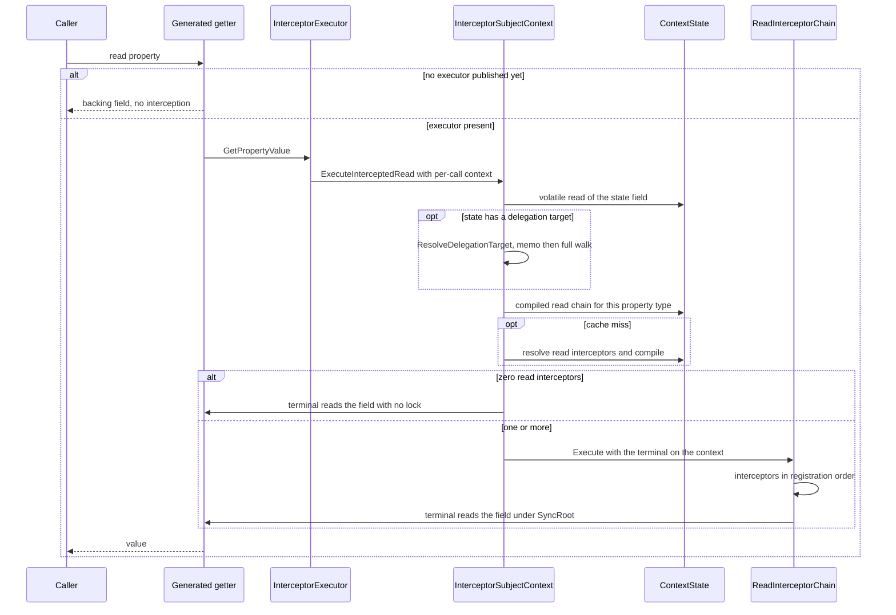
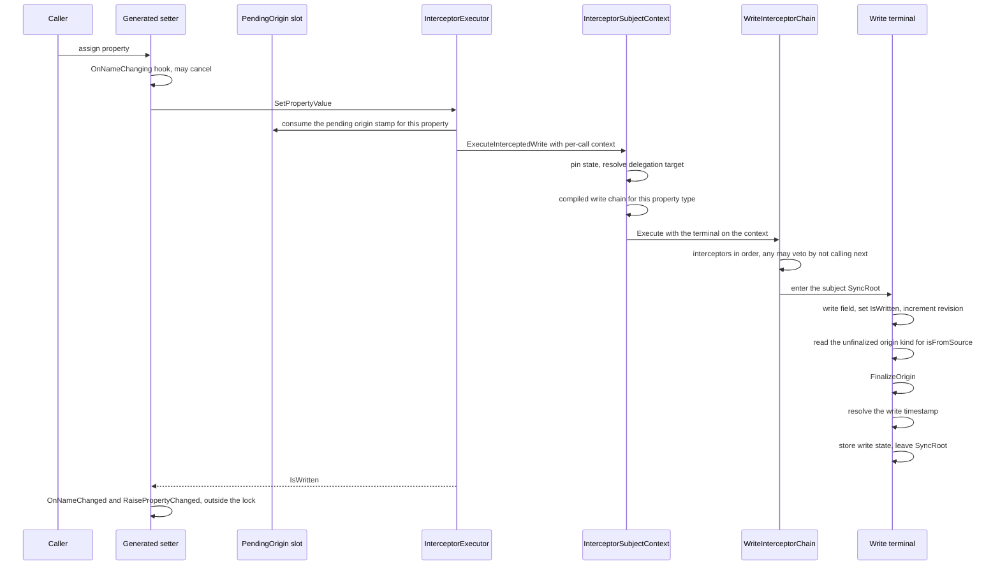
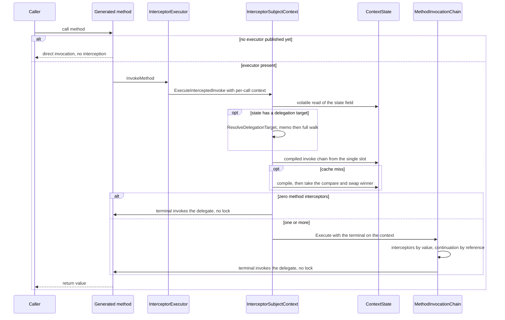
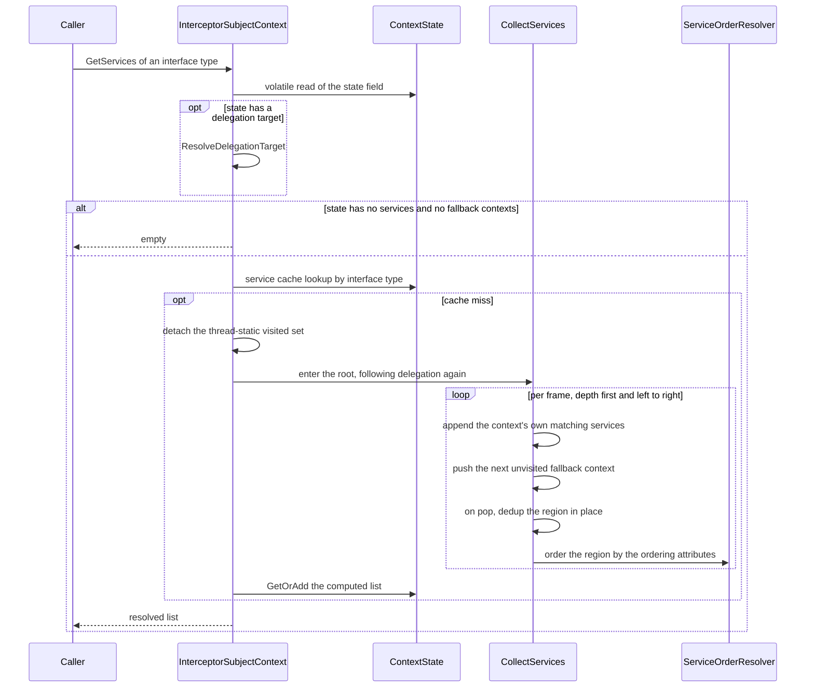

# Core Context: Architecture Dossier

Area: `src/Namotion.Interceptor/` (the core library, .NET Standard 2.0). 36 files, 3544 lines.
Boundary: Tracking, Registry, Connectors and the source generator are out of scope and get their own dossiers. Where core defines a contract those libraries depend on, the contract is in scope and the consumer's use of it is not.
Written against: `src/` at `b36ec531f` (`origin/master`). This branch changes no file under `src/`, so the code described here is master's.
Verified: pending

Citation convention: a bare `:123` refers to the file named in the enclosing subsection's canonical implementation. A full path is given whenever the file changes.

## 1. Supported use cases

| # | Use case | Status | Cost | Ruling |
|---|---|---|---|---|
| | | | | |

Status meanings: Supported means guaranteed and defended. Best effort means it usually works and is not guaranteed. Unsupported means explicitly ruled out. Undecided means nobody has ruled, which is not the same as supported.

## 2. Contracts and invariants

Assertions that hold, each stated so it could be tested. Harvested from the inline comments and XML documentation in `src/Namotion.Interceptor/`, cited at the line where the rule is stated or enforced.

| # | Invariant | Evidence | Covered |
|---|---|---|---|
| I1 | A service query takes no context lock. It pins one snapshot with a single volatile read and walks other contexts' snapshots the same way, so the downward service walk and the upward invalidation walk cannot form a lock cycle, including in cyclic fallback graphs. | `src/Namotion.Interceptor/InterceptorSubjectContext.cs:18`, `:109` | `WhenFallbackContextIsMutatedWhileSubjectIsWritten_ThenNoDeadlockOccurs` |
| I2 | Lock order is `_mutationLock` then a `_usedByContexts` set lock, never the reverse. No path takes a second `_mutationLock`. | `src/Namotion.Interceptor/InterceptorSubjectContext.cs:22` | `WhenTwoContextsAddEachOtherAsFallbackConcurrently_ThenNoDeadlockOccurs` |
| I3 | The `factory` and `exists` delegates of `TryAddService` may read any context and may mutate the calling context, but must not mutate a different context. Two threads doing so acquire two mutation locks in opposite orders and deadlock. | `src/Namotion.Interceptor/IInterceptorSubjectContext.cs:24` | `WhenServiceFactoryRegistersIntoSameContext_ThenNoDeadlockOccurs` |
| I4 | R2: every mutator publishes its new state under `_mutationLock` with a single `Interlocked.Exchange` and no compare-and-swap loop, so no mutator can lose another's topology. The exchange is a full fence because the publisher then reads other contexts' state to drive invalidation. | `src/Namotion.Interceptor/InterceptorSubjectContext.cs:780`, `:799` | `WhenServicesAreAddedConcurrentlyWithQueries_ThenQuiescentStateSeesAllServices` |
| I5 | R3: invalidation makes exactly one unconditional compare-and-swap attempt. No early-out when caches look absent, and no retry on failure. | `src/Namotion.Interceptor/InterceptorSubjectContext.cs:803`, `:812` | `WhenContextIsInvalidated_ThenItsStateObjectIsReplaced` |
| I6 | R4: `AddFallbackContext` registers into the fallback's used-by set before publishing, and `RemoveFallbackContext` unregisters only after publishing, so a used-by set is always a superset of the true using set. A missing entry would leave a compiled chain above it permanently stale. | `src/Namotion.Interceptor/InterceptorSubjectContext.cs:131`, `:170` | `WhenFallbackIsRemovedWhileInvalidationWalksTheSameSet_ThenNoInvalidationIsLost` |
| I7 | `ContextState.WithoutCaches` always allocates a new instance, even for a state that carries no caches. Returning `this` would make the invalidation compare-and-swap a no-op and break the cycle confirmation, which proves a loop from a state being installed exactly once. | `src/Namotion.Interceptor/InterceptorSubjectContext.cs:1002`, `:1009` | `WhenContextIsInvalidated_ThenItsStateObjectIsReplaced` |
| I8 | A state's `DelegationTarget` is non-null exactly when the state has no own services and exactly one fallback context. It is derived in the constructor, so no reader can observe it disagreeing with the two fields it comes from. | `src/Namotion.Interceptor/InterceptorSubjectContext.cs:979` | `WhenRandomContextGraphIsResolved_ThenServiceOrderMatchesTheRecursiveWalk` |
| I9 | The cyclic delegation marker is recorded only on the states of contexts on a loop that was confirmed still closed, never on the acyclic run leading into it. The confirmation compares pinned state identities, not the fallback lists those states point at. | `src/Namotion.Interceptor/InterceptorSubjectContext.cs:396`, `:399`, `:443` | `WhenAcyclicPrefixLeadsIntoDelegationCycle_ThenOnlyTheCycleRecordsTheVerdict` |
| I10 | The service walk is depth first and left to right, each context contributing its own services ahead of everything its fallback contexts contribute. Duplicates are dropped keeping the first occurrence, and ordering attributes are applied once per context rather than once at the end. | `src/Namotion.Interceptor/InterceptorSubjectContext.cs:604`, `:701`, `:726` | `WhenRandomContextGraphIsResolved_ThenServiceOrderMatchesTheRecursiveWalk` |
| I11 | A fallback graph in which every context on the loop delegates (no own service, exactly one fallback) resolves nothing and raises `InvalidOperationException`. A loop containing at least one context with a service of its own resolves normally. | `src/Namotion.Interceptor/IInterceptorSubjectContext.cs:52`, `src/Namotion.Interceptor/InterceptorSubjectContext.cs:366` | `WhenTwoContextsFormDelegationCycle_ThenEveryResolvingOperationThrows`, `WhenCycleContainsContextWithService_ThenResolvingSucceeds` |
| I12 | That exception surfaces from intercepted property reads, property writes and method invocations as well, because all three resolve the delegation chain the same way. | `src/Namotion.Interceptor/IInterceptorSubjectContext.cs:54`, `src/Namotion.Interceptor/InterceptorSubjectContext.cs:242`, `:256`, `:270` | `WhenTwoContextsFormDelegationCycle_ThenEveryResolvingOperationThrows` |
| I13 | `TryAddService` still works on a fallback graph that is a pure delegation cycle: its existence check walks services directly from the pinned state instead of resolving a delegation target first, so registering a service there breaks the cycle. | `src/Namotion.Interceptor/IInterceptorSubjectContext.cs:29`, `src/Namotion.Interceptor/InterceptorSubjectContext.cs:195` | `WhenTryAddServiceIsCalledOnDelegationCycle_ThenItAddsServiceAndBreaksCycle` |
| I14 | Every context builds its own initial `ContextState`. No shared empty instance exists, because caches live on the state and one shared instance would let unrelated contexts contaminate each other. | `src/Namotion.Interceptor/InterceptorSubjectContext.cs:70` | Unverified |
| I15 | The service walk, the delegation walk and the invalidation walk are all iterative with an explicit worklist, never recursive, because all three graphs are as deep as the subject graph. | `src/Namotion.Interceptor/InterceptorSubjectContext.cs:369`, `:600`, `:833` | `WhenVeryDeepChainHasMultiFallbackNodes_ThenServicesResolveThroughAllOfThem`, `WhenDelegationChainIsVeryDeepWithoutCycle_ThenEveryResolvingOperationSucceeds` |
| I16 | `TryGetService` returns the single match, returns `default` for none, and throws `InvalidOperationException` when more than one service of the type resolves. | `src/Namotion.Interceptor/InterceptorSubjectContext.cs:227`, `:231` | `WhenAddingTwoServices_ThenListCanBeRetrieved` |
| I17 | A thread-static traversal buffer is dropped rather than cleared once it exceeds `MaximumRetainedTraversalSize` (1024), because `Clear` keeps capacity and one deep walk would otherwise hold that memory on the thread for the life of the process. | `src/Namotion.Interceptor/InterceptorSubjectContext.cs:28`, `:324`, `:590`, `:871` | `WhenVeryDeepChainWasWalked_ThenTheWalkBuffersAreNotRetained` |
| I18 | `ComputeServices` detaches the thread-static visited set for the duration of the walk, so a service equality callback that reenters service lookup gets a set of its own. | `src/Namotion.Interceptor/InterceptorSubjectContext.cs:579`, `:581` | `WhenServiceComparisonReentersLookup_ThenNestedAndCachedResultsContainRegisteredServices` |
| I19 | The emptiness of a used-by set is never tested outside that set's lock, because `HashSet.Count` is composed of two independently mutated fields and an unlocked read can compute a count that was never true. | `src/Namotion.Interceptor/InterceptorSubjectContext.cs:898` | Unverified |
| I20 | The invalidation walk snapshots a used-by set under that set's lock and queues the contexts after releasing it. It never calls into another context while holding a set lock. | `src/Namotion.Interceptor/InterceptorSubjectContext.cs:907`, `:912` | Unverified |
| I21 | Every cache (service cache, compiled read and write chains, method invocation chain, recorded chain terminal) belongs to the state it was computed from, so a topology change, which publishes a new state, can never keep an entry computed from pre-mutation topology. | `src/Namotion.Interceptor/InterceptorSubjectContext.cs:497`, `:553`, `:959` | `WhenTopologyAndServicesAreMutatedConcurrently_ThenQuiescentResolutionMatchesFinalTopology` |
| I22 | The terminal write is the only place a commit revision is consumed. It increments `InterceptorExecutor.Revision` with a plain `++` while the subject's `SyncRoot` is held, and asserts that the context's executor owns the locked subject. | `src/Namotion.Interceptor/Cache/WriteInterceptorFactory.cs:28`, `:30`, `:58`, `src/Namotion.Interceptor/Interceptors/InterceptorExecutor.cs:16` | `WhenOnePropertyIsWrittenConcurrently_ThenEveryCommitTakesADistinctRevision` |
| I23 | A vetoed write and a write stopped by the equality check never reach the terminal and consume no revision. A derived property's recalculation does reach the terminal, with a no-op write delegate, and takes a revision of its own. | `src/Namotion.Interceptor/Interceptors/InterceptorExecutor.cs:24` | Unverified |
| I24 | The terminal reads `Origin.Kind` to decide `isFromSource` before calling `FinalizeOrigin`. Reading it after would count a source write whose value a hook changed as local, letting it discard a local write that had already committed. | `src/Namotion.Interceptor/Cache/WriteInterceptorFactory.cs:35`, `:37`, `:63`, `:65` | `WhenFinalOriginIsResolvedBeforeWrite_ThenTheAttemptedOriginRemainsAvailableToTheTerminal` |
| I25 | A commit writes exactly one of the two revision slots, never both. The timestamp is recorded either way. | `src/Namotion.Interceptor/PropertyReference.cs:176`, `:186` | `WhenFinalOriginIsResolvedBeforeWrite_ThenTheAttemptedOriginRemainsAvailableToTheTerminal` |
| I26 | `LastNonSourceCommitRevision` excludes `FromSource` commits but includes `Confirmed` commits. The asymmetry is load-bearing and must not be "fixed" in either direction. | `src/Namotion.Interceptor/PropertyWriteState.cs:29`, `:34`, `:36`, enforced at `src/Namotion.Interceptor/Cache/WriteInterceptorFactory.cs:35` | `WhenFinalOriginIsResolvedBeforeWrite_ThenTheAttemptedOriginRemainsAvailableToTheTerminal` (the FromSource exclusion only) |
| I27 | A stamped origin survives finalization only when the stored value is exactly the value the source sent. Otherwise the origin becomes Local, because the value was computed locally. | `src/Namotion.Interceptor/Interceptors/IWriteInterceptor.cs:280`, `:292` | `WhenStoredValueDiffersFromSentValue_ThenOriginIsFinalizedToLocal` |
| I28 | A derived property's origin is always demoted to Local, decided without invoking the getter, because the getter must not run under the subject's `SyncRoot`. | `src/Namotion.Interceptor/Interceptors/IWriteInterceptor.cs:267`, `:270` | Unverified |
| I29 | A boxed value the generated setter would have accepted keeps its origin, including an enum delivered as its boxed underlying integer and a nullable enum. A box the setter would have rejected demotes to Local rather than throwing. | `src/Namotion.Interceptor/Interceptors/IWriteInterceptor.cs:305`, `:321`, `:330` | `WhenSentValueIsNullableEnumUnderlyingInteger_ThenOriginSurvivesAsFromSource`, `WhenSentValueTypeMismatchesValueTypeProperty_ThenOriginIsFinalizedToLocalWithoutThrowing` |
| I30 | `ChangeOrigin.Source` is non-null exactly when `Kind` is not Local. The only constructor is private and both stamping factories reject a null source. | `src/Namotion.Interceptor/ChangeOrigin.cs:39`, `:51`, `:58` | `WhenFactoryReceivesNullSource_ThenThrows`, `WhenDefault_ThenKindIsLocalAndSourceIsNull` |
| I31 | Only transaction commit replay may stamp `Confirmed`. Stamping it elsewhere claims an acknowledgment the source never gave. Documented, not enforced by the type. | `src/Namotion.Interceptor/ChangeOrigin.cs:54` | Unverified |
| I32 | `ChangeOriginKind` is byte-backed so the runtime can fold it into padding inside `SubjectPropertyChange`, and must not be widened. | `src/Namotion.Interceptor/ChangeOrigin.cs:4`, `:8` | Unverified |
| I33 | A pending origin stamp is one-shot and per property: `TryConsume` matches on the property reference and clears the slot, so at most one write consumes it. | `src/Namotion.Interceptor/PendingOrigin.cs:52`, `:55` | `WhenTargetDoesNotMatch_ThenConsumeReturnsLocalAndSlotStaysSet`, `WhenConsumedTwice_ThenSecondConsumeReturnsLocal` |
| I34 | Constructing any `PropertyWriteContext`, including from test and benchmark code, consumes the pending stamp for the matching property as a side effect. | `src/Namotion.Interceptor/Interceptors/IWriteInterceptor.cs:113`, `:128`, `:151` | `WhenWriteIsSetFromSource_ThenOriginIsFromSourceBeforeAndAfterWrite` |
| I35 | A pending origin scope captures the previous frame and restores it on dispose, so a cancelled write cannot leak a stamp and a nested stamped write cannot destroy an outer stamp. | `src/Namotion.Interceptor/PendingOrigin.cs:39`, `:78` | `WhenNestedSetScopeIsDisposed_ThenOuterStampIsRestored`, `WhenScopeIsDisposedWithoutConsumption_ThenSlotIsCleared` |
| I36 | Nested writes (hooks, `INotifyPropertyChanged` handlers, derived recalculations) never inherit a pending origin: the slot is either already consumed or targets a different property. | `src/Namotion.Interceptor/PendingOrigin.cs:12` | Unverified |
| I37 | A write's timestamp is resolved at most once and cached on the write context, so the terminal write, the change publishers, transaction capture and derived recalculation all observe the same value whatever order they read it in. | `src/Namotion.Interceptor/Interceptors/IWriteInterceptor.cs:158`, `:229` | Unverified |
| I38 | The cached timestamp is encoded: zero means unresolved, a positive value is the resolved ticks, a negative value is an explicit null-timestamp scope carrying the captured clock. Storage receives 0 for the negative case while change notifications receive the positive ticks. | `src/Namotion.Interceptor/Interceptors/IWriteInterceptor.cs:33`, `:186`, `src/Namotion.Interceptor/Cache/WriteInterceptorFactory.cs:39` | Unverified |
| I39 | `PropertyWriteState.TimestampTicks` of zero means never written, and a genuine `0001-01-01` cannot be told apart from it. | `src/Namotion.Interceptor/PropertyWriteState.cs:18` | Unverified |
| I40 | The 64-bit write state fields are read and written through `Interlocked` rather than plainly, because netstandard2.0 includes 32-bit runtimes where a plain `long` store can tear. | `src/Namotion.Interceptor/PropertyWriteState.cs:9`, `src/Namotion.Interceptor/PropertyReference.cs:184` | Unverified |
| I41 | `PublishedToAnySource` is one-way: it is set to true and never cleared, so racing writers write the same constant and no update can be lost. | `src/Namotion.Interceptor/PropertyWriteState.cs:58`, `src/Namotion.Interceptor/PropertyReference.cs:157` | Unverified |
| I42 | `PublishedToAnySource` is not per source, by design. A foreign sink's mark costs one redundant confirmation write rather than a wrong value, which is what lets the flag hold no source reference to release on detach. | `src/Namotion.Interceptor/PropertyWriteState.cs:65`, `src/Namotion.Interceptor/PropertyReference.cs:161` | Unverified |
| I43 | `includeSourceCommitsInRevision` governs the returned commit revision alone. The returned `publishedToAnySource` is independent of it. | `src/Namotion.Interceptor/PropertyReference.cs:109`, `:143` | `WhenFinalOriginIsResolvedBeforeWrite_ThenTheAttemptedOriginRemainsAvailableToTheTerminal` (the revision half only) |
| I44 | `TryGetWriteState` returning false means no write state was ever recorded, which is not the same as never written: marking a property published records state too, so a never-written property can return true with a commit revision of 0. | `src/Namotion.Interceptor/PropertyReference.cs:105`, `:136` | Unverified |
| I45 | A revision is comparable only against another change to the same subject. Revisions are per subject, and two properties of one subject draw from the same counter. | `src/Namotion.Interceptor/PropertyReference.cs:124`, `src/Namotion.Interceptor/Interceptors/InterceptorExecutor.cs:16` | `WhenWrittenOnContextWithoutWriteInterceptors_ThenTerminalStillAssignsRevisions` |
| I46 | The revision counter is dense over committed writes and never reset, so revisions stay comparable across detach and reattach. | `src/Namotion.Interceptor/Interceptors/InterceptorExecutor.cs:18` | `WhenPropertiesWrittenThroughChain_ThenContextCarriesDenseIncreasingRevisions` (density only) |
| I47 | Exactly one executor exists per subject. It is published with a compare-and-swap rather than a lazy assignment, so two threads racing the first access cannot each publish one and discard the loser's revision counter. | `src/Namotion.Interceptor/Interceptors/InterceptorExecutor.cs:41`, `:58` | `WhenContextIsAccessedConcurrently_ThenAllThreadsSeeTheSameExecutor` |
| I48 | The terminal read, write and method invocation operations travel on the per-call context, not on a thread-static of the shared compiled chain, so reentrant calls cannot overwrite each other's terminal. | `src/Namotion.Interceptor/Cache/ReadInterceptorChain.cs:34`, `src/Namotion.Interceptor/Cache/WriteInterceptorChain.cs:34`, `src/Namotion.Interceptor/Cache/MethodInvocationChain.cs:39` | Unverified |
| I49 | An interceptor must forward the context it received to `next` by reference. A copied or freshly constructed context loses per-call state, including `IsWritten` and the terminal operation. | `src/Namotion.Interceptor/Interceptors/IWriteInterceptor.cs:17`, `src/Namotion.Interceptor/Interceptors/IReadInterceptor.cs:15` | Unverified |
| I50 | Both write terminals take the subject's `SyncRoot` for the field write, the revision increment, the origin finalization and the write state store. | `src/Namotion.Interceptor/Cache/WriteInterceptorFactory.cs:19`, `:51` | `WhenOnePropertyIsWrittenConcurrently_ThenEveryCommitTakesADistinctRevision` |
| I51 | `ServiceOrderResolver.OrderByDependencies` returns a permutation of its input of the same length, which is what lets the service walk write the result straight back over the same buffer region. | `src/Namotion.Interceptor/Ordering/ServiceOrderResolver.cs:50`, `:116`, relied on at `src/Namotion.Interceptor/InterceptorSubjectContext.cs:753` | `NoAttributes_PreservesRegistrationOrder` |
| I52 | Among services that no ordering attribute separates, registration order is preserved: the topological sort always takes the lowest input index from the ready set. | `src/Namotion.Interceptor/Ordering/ServiceOrderResolver.cs:147`, `:158` | `ServiceWithDependency_PreservesOrderOfUnrelatedServices` |
| I53 | A service type carrying both `[RunsFirst]` and `[RunsLast]` throws `InvalidOperationException`, including when it is the only service. | `src/Namotion.Interceptor/Ordering/ServiceOrderResolver.cs:80`, `:240` | `RunsFirstAndRunsLast_ThrowsException` |
| I54 | A `[RunsFirst]` service may not declare `[RunsAfter]` a service that is not also `[RunsFirst]`, and a `[RunsLast]` service may not declare `[RunsBefore]` a service that is not also `[RunsLast]`. Both throw. | `src/Namotion.Interceptor/Ordering/ServiceOrderResolver.cs:264`, `:284` | `WhenFirstServiceRunsAfterLastService_ThenThrowsCrossGroupDependencyException`, `WhenLastServiceRunsBeforeFirstService_ThenThrowsCrossGroupDependencyException` |
| I55 | A cycle among `[RunsBefore]` and `[RunsAfter]` edges throws `InvalidOperationException` naming the services on the cycle. | `src/Namotion.Interceptor/Ordering/ServiceOrderResolver.cs:167` | `CircularDependency_ThrowsWithTypeNames` |
| I56 | An ordering edge binds to every registered instance of the referenced type, not just the first, because a context aggregating fallback contexts can hold several instances of one service type. | `src/Namotion.Interceptor/Ordering/ServiceOrderResolver.cs:131`, `:142`, `:202` | `RunsBefore_WithDuplicatedTarget_OrdersBeforeAllInstances`, `WhenFallbackContextsRegisterSameServiceType_ThenOrderingAttributeBindsAgainstAllInstances` |
| I57 | Ordering applies within a group only. The First, Middle and Last groups are sorted separately and concatenated in that order. | `src/Namotion.Interceptor/Ordering/ServiceOrderResolver.cs:53` | `RunsFirst_RunsBeforeMiddleAndLast`, `RunsLast_RunsAfterFirstAndMiddle` |
| I58 | `PropertyReference.Metadata` performs the property table lookup on every access and caches nothing, which is what keeps the struct a readonly value type cheap to copy. | `src/Namotion.Interceptor/PropertyReference.cs:20` | Unverified |
| I59 | Two `PropertyReference` values are equal exactly when their subjects are the same instance and their names are ordinally equal. | `src/Namotion.Interceptor/PropertyReference.cs:262` | Unverified |
| I60 | Per-property write state lives in the subject's `Data` dictionary under the key `ni.wstate` scoped to the property name, created on first write through `GetOrAdd`. | `src/Namotion.Interceptor/PropertyReference.cs:87`, `:222` | Unverified |
| I61 | `SubjectPropertyMetadata.IsDerived` is true exactly when a `DerivedAttribute` is among the property's attributes, and `IsPublic` is true for any metadata without a `PropertyInfo`, which is every dynamic property. | `src/Namotion.Interceptor/SubjectPropertyMetadata.cs:115`, `:117` | Unverified |
| I62 | `GetCustomAttributesIncludingInterfaces` returns class attributes (including base class inheritance) first, then interface property attributes in interface declaration order. An attribute type with `AllowMultiple=false` that is already present is skipped. | `src/Namotion.Interceptor/PropertyInfoExtensions.cs:23`, `:29`, `:83` | `ClassAttributeWins_WhenAllowMultipleFalse`, `MultipleInterfaces_FirstInterfaceWins_WhenAllowMultipleFalse` |
| I63 | On an executor, lifecycle interceptors are attached after the fallback context is added and detached before it is removed, so a callback always runs while the topology still describes the relationship. | `src/Namotion.Interceptor/Interceptors/InterceptorExecutor.cs:113`, `:120`, `:135`, `:138` | Unverified |
| I64 | `WithChangedTimestamp(null)` stores the null sentinel: the property stays marked never-written for storage while change-event consumers still receive a captured timestamp. | `src/Namotion.Interceptor/SubjectChangeContext.cs:119`, `src/Namotion.Interceptor/Interceptors/IWriteInterceptor.cs:227` | `ResolveChangedTimestamp_WithNullTimestamp_ReturnsZero` (the sentinel only) |
| I65 | Change context scopes nest: each captures the previous ambient value and restores it on dispose. `WithTimestamps` with a null `received` preserves the ambient received timestamp rather than clearing it. | `src/Namotion.Interceptor/SubjectChangeContext.cs:117`, `:135`, `:147` | `Scope_RestoresPreviousStateOnDispose`, `WithTimestamps_NullReceived_PreservesAmbientReceived` |

65 invariants, 43 covered by a test, 22 unverified.

### Contradictions

**X1. `SyncRoot` is documented as covering reads, but a read only takes it when at least one read interceptor is registered.** `IInterceptorSubject.SyncRoot` is documented unconditionally as "the sync root used to synchronize read/writes of property fields" (`src/Namotion.Interceptor/IInterceptorSubject.cs:8`). Both write terminals take it (`src/Namotion.Interceptor/Cache/WriteInterceptorFactory.cs:19`, `:51`), and so does the read terminal built when read interceptors exist (`src/Namotion.Interceptor/Cache/ReadInterceptorFactory.cs:19`), but the zero-interceptor read terminal reads the backing field with no lock at all (`src/Namotion.Interceptor/Cache/ReadInterceptorFactory.cs:12`). Whether a read is synchronized against a concurrent write therefore depends on the registered service set, which the documented contract does not mention.

**X2. The origin is documented as finalized at the point `IsWritten` becomes true, and the terminal depends on it not being.** `PropertyWriteContext.Origin` states that the origin is finalized "when the terminal write lands (the same point `IsWritten` becomes true)" (`src/Namotion.Interceptor/Interceptors/IWriteInterceptor.cs:105`). In both terminals `IsWritten` is set (`src/Namotion.Interceptor/Cache/WriteInterceptorFactory.cs:22`, `:53`), then the still-unfinalized origin is read to compute `isFromSource` (`:35`, `:63`), and only then is `FinalizeOrigin` called (`:37`, `:65`). That window is deliberate and load-bearing, per the comment at `:31`, so it is the documentation that is imprecise rather than the code.

## 3. Concept census

Each noun this area implements, and every place the same idea appears. Counts of "shipping uses" exclude `*.Tests`, `Namotion.Interceptor.Benchmark` and `Namotion.Interceptor.ConnectorTester`.

### Context

- **What it means:** the container that holds services, composes with other containers, and answers every intercepted operation on the subjects attached to it.
- **Canonical implementation:** `src/Namotion.Interceptor/InterceptorSubjectContext.cs:12`, one class whose entire topology lives in a single immutable snapshot published atomically (`:14`).
- **Other implementations of the same idea:**
  - `src/Namotion.Interceptor/IInterceptorSubjectContext.cs:9`, the public surface: six members, registration and composition only.
  - `src/Namotion.Interceptor/Interceptors/InterceptorExecutor.cs:5`, a context subclass bound to one subject, adding the read, write and invoke entry points (`:63`, `:70`, `:105`), the per-subject commit counter (`:28`) and the lifecycle attach and detach overrides (`:111`, `:127`). Every generated subject's `Context` property returns one of these, via `:47`, emitted at `src/Namotion.Interceptor.Generator/SubjectCodeGenerator.cs:190`.
  - `src/Namotion.Interceptor/Interceptors/IInterceptorExecutor.cs:6`, that subclass's interface, which carries a standing removal note at `src/Namotion.Interceptor/Interceptors/IInterceptorExecutor.cs:3`: "TODO: Get rid of the executor (IInterceptorExecutor/InterceptorExecutor) completely."
  - `src/Namotion.Interceptor/InterceptorSubjectContext.cs:40`, a context instance used as a sentinel rather than as a context: the cyclic delegation marker, built by making a context its own fallback (`:99`).
- **Assessment:** two implementations that should be one, the plain context and the per-subject executor. The code states the intent itself at `src/Namotion.Interceptor/Interceptors/IInterceptorExecutor.cs:3`, and the executor interface still has live consumers outside core (`src/Namotion.Interceptor.Registry/Abstractions/RegisteredSubject.cs:336`, `src/Namotion.Interceptor.Dynamic/DynamicSubject.cs:10`, `src/Namotion.Interceptor/PropertyReferenceExtensions.cs:15`), so removal is not local to this area. The sentinel context is justified in writing at `src/Namotion.Interceptor/InterceptorSubjectContext.cs:37`: "A context rather than a marker object so that the slot can be typed: this class is not sealed, so a type test on an object slot compiles to a runtime helper call on every intercepted access."

### Service

- **What it means:** an object registered on a context and resolved by interface, the only extension point core offers.
- **Canonical implementation:** `src/Namotion.Interceptor/InterceptorSubjectContext.cs:952`, an `ImmutableArray<object>` on the state snapshot, resolved by the walk at `:612`.
- **Other implementations of the same idea:**
  - Two registration entry points that both end at the same publish: unconditional `AddService` (`:213`) and conditional `TryAddService` (`:187`).
  - Two retrieval entry points: `GetServices` returns all (`:107`), `TryGetService` returns the single match and throws on more than one (`:224`).
  - `src/Namotion.Interceptor/InterceptorSubjectContextExtensions.cs:16`, `:31` and `:45` are one-line wrappers over `TryAddService` and `TryGetService`, not second implementations.
- **Assessment:** one implementation. The registration split is a behavioural difference, not a duplicate: `TryAddService` runs its existence check directly against the pinned state so it still works inside a pure delegation cycle (`src/Namotion.Interceptor/IInterceptorSubjectContext.cs:29`).

### Service ordering

- **What it means:** the rule that decides the order registered services run in, expressed as attributes on service types.
- **Canonical implementation:** `src/Namotion.Interceptor/Ordering/ServiceOrderResolver.cs:12`, 310 lines: Kahn topological sort (`:121`) plus three-group partitioning (`:43`).
- **Other implementations of the same idea:**
  - Four attributes express it: `src/Namotion.Interceptor/Attributes/RunsBeforeAttribute.cs:8`, `src/Namotion.Interceptor/Attributes/RunsAfterAttribute.cs:8`, `src/Namotion.Interceptor/Attributes/RunsFirstAttribute.cs:7`, `src/Namotion.Interceptor/Attributes/RunsLastAttribute.cs:7`.
  - The "cannot have both `[RunsFirst]` and `[RunsLast]`" check exists twice with the same message text: `src/Namotion.Interceptor/Ordering/ServiceOrderResolver.cs:80` for the multi-service path, `:240` for the single-service path reached from `:24`.
  - `TopologicalSort` (`:114`) is a three-line wrapper over `TopologicalSortInto` (`:121`).
- **Assessment:** two implementations that should be one, for the both-attributes validation at `:80` and `:240`. The rest is one implementation. Shipping use of the four attributes is lopsided: `[RunsLast]` has zero shipping uses, `[RunsFirst]` exactly one (`src/Namotion.Interceptor.Tracking/PropertyValueEqualityCheckHandler.cs:10`), `[RunsAfter]` three (`src/Namotion.Interceptor.Tracking/Change/PropertyChangeInterceptor.cs:22`, `src/Namotion.Interceptor.Connectors/Monitoring/SourceMonitor.cs:19`, `src/Namotion.Interceptor.Hosting/HostedServiceHandler.cs:10`), `[RunsBefore]` seven on six types. The two groups the First and Last attributes exist for cost 126 of the 310 lines: partitioning at `:43-112` and cross-group validation at `:244-299`.

### Fallback context

- **What it means:** another context this one resolves through when it has no matching service of its own, which is how a subject inherits its parent graph's services.
- **Canonical implementation:** `src/Namotion.Interceptor/InterceptorSubjectContext.cs:953`, an `ImmutableArray<InterceptorSubjectContext>` on the state, mutated at `:119` and `:155`.
- **Other implementations of the same idea:**
  - `src/Namotion.Interceptor/InterceptorSubjectContext.cs:80`, the reverse index: the set of contexts that resolve through this one, kept as a superset of the true set (`:131`, `:170`) and used only to drive invalidation upward (`:888`).
  - `src/Namotion.Interceptor/Interceptors/InterceptorExecutor.cs:111` and `:127` override the two mutators to fire lifecycle callbacks around them.
- **Assessment:** one implementation, with a forward edge and a reverse index that are not interchangeable. Together with delegation and invalidation this is the largest mechanism in core: fallback management `:119-185` (67 lines), delegation resolution `:277-481` (205), the service walk `:549-777` (229), publish and invalidation `:779-943` (165), that is 666 of the file's 1095 lines before counting the state class.

### Delegation target

- **What it means:** the collapse of a context that contributes nothing of its own into the single fallback it resolves everything through, so a chain as deep as the subject graph costs one hop.
- **Canonical implementation:** `src/Namotion.Interceptor/InterceptorSubjectContext.cs:957`, derived in the state constructor at `:979` from "no own services and exactly one fallback".
- **Other implementations of the same idea:**
  - `:973`, the memoized transitive end of the chain, recorded per state (`:990`) and read on the fast path (`:287`).
  - `:40`, the cyclic marker stored in that same slot to mean "this chain has no end".
  - The four-line prologue that pins the state and resolves the target appears verbatim four times: `:109-114` (`GetServices`), `:238-243` (`ExecuteInterceptedRead`), `:252-257` (`ExecuteInterceptedWrite`), `:266-271` (`ExecuteInterceptedInvoke`).
  - `:677` collapses the same chain a second way, inside the service walk, because a pure delegator gets no walk frame of its own.
- **Assessment:** four implementations that should be one, for the resolution prologue at `:109`, `:238`, `:252` and `:266`. The one-hop edge, the memoized end and the cyclic marker are three distinct facts rather than three copies, and the code states why the memo holds a context and not a state at `:969`: "A context and never a state: a context's state is replaced whenever anything below it changes, so a cached state would serve an abandoned one's caches."

### Context state snapshot

- **What it means:** the immutable object that carries a context's whole topology plus everything derived from it, replaced wholesale on every mutation so no reader can see a torn view.
- **Canonical implementation:** `src/Namotion.Interceptor/InterceptorSubjectContext.cs:945`, published by `Interlocked.Exchange` under the mutation lock (`:797`).
- **Other implementations of the same idea:** none. `:1007` produces the cache-free copy used for invalidation and must always allocate (`:1001`).
- **Assessment:** one implementation.

### Cache invalidation

- **What it means:** discarding everything derived from a topology that just changed, on this context and on every context above it.
- **Canonical implementation:** `src/Namotion.Interceptor/InterceptorSubjectContext.cs:809`, one unconditional compare-and-swap installing a cache-free state, driven upward by the worklist walk at `:844`.
- **Other implementations of the same idea:** the mutator's own publish at `:797` doubles as its own invalidation, because the state it publishes is already cache-free (`:850`).
- **Assessment:** one implementation.

### Interceptor

- **What it means:** a service that sits in the path of an intercepted operation and may observe, transform or suppress it.
- **Canonical implementation:** `src/Namotion.Interceptor/Interceptors/IWriteInterceptor.cs:8`, one generic method taking a by-reference context and a continuation.
- **Other implementations of the same idea:**
  - `src/Namotion.Interceptor/Interceptors/IReadInterceptor.cs:6`, the same shape for reads.
  - `src/Namotion.Interceptor/Interceptors/IMethodInterceptor.cs:3`, the same shape for method invocation, except that it takes the context by value (`:10`) while its continuation takes it by reference (`:13`).
  - `src/Namotion.Interceptor/Interceptors/ILifecycleInterceptor.cs:3`, two plain callbacks with no continuation, so it is not chained at all and is invoked directly from `src/Namotion.Interceptor/Interceptors/InterceptorExecutor.cs:120` and `:135`.
  - Each kind carries a per-call context struct (`IReadInterceptor.cs:30`, `IWriteInterceptor.cs:31`, `IMethodInterceptor.cs:15`), a public continuation delegate (`IReadInterceptor.cs:22`, `IWriteInterceptor.cs:23`, `IMethodInterceptor.cs:13`) and an internal compiled-chain delegate (`src/Namotion.Interceptor/Cache/Delegates.cs:5`, `:6`, `:7`).
- **Assessment:** four kinds, three of which are chained. `IMethodInterceptor` has zero implementations in any shipping library: the only implementations in the repository are `src/Namotion.Interceptor.Tests/Context/ContextConcurrencyFuzzTests.cs:862`, `src/Namotion.Interceptor.Generator.Tests/InterceptorSubjectTests.cs:23` and `src/Namotion.Interceptor.Generator.Tests/RecordingInterceptors.cs:37`.

### Interceptor chain

- **What it means:** the compiled middleware pipeline that walks the registered interceptors in order and ends at a terminal operation.
- **Canonical implementation:** `src/Namotion.Interceptor/Cache/WriteInterceptorChain.cs:7`, an index-driven walk with one pre-allocated continuation node per position (`:53`).
- **Other implementations of the same idea:**
  - `src/Namotion.Interceptor/Cache/ReadInterceptorChain.cs:7` with its node at `:52`, structurally identical, differing only in the delegate signature and the return value.
  - `src/Namotion.Interceptor/Cache/MethodInvocationChain.cs:7` with its node at `:57`, the same structure plus a third constructor delegate (`:9`) and a second type parameter, both forced by `IMethodInterceptor.InvokeMethod` taking its context by value (`src/Namotion.Interceptor/Interceptors/IMethodInterceptor.cs:10`), which stops the chain from calling the interceptor directly.
  - Three factories with the same two-branch shape: `src/Namotion.Interceptor/Cache/ReadInterceptorFactory.cs:6`, `src/Namotion.Interceptor/Cache/WriteInterceptorFactory.cs:7`, `src/Namotion.Interceptor/Cache/MethodInvocationFactory.cs:6`.
- **Assessment:** three implementations that should be one, 221 lines across the three chain classes. Only the by-value interface signature separates the third, and nothing in the code justifies that signature.

### Terminal operation

- **What it means:** the innermost step of a chain, the one that actually touches the backing field or invokes the method, plus the bookkeeping that rides with a committed write.
- **Canonical implementation:** `src/Namotion.Interceptor/Cache/WriteInterceptorFactory.cs:13`, the zero-interceptor write terminal: lock, write, mark written, stamp the revision, read the origin, finalize it, record the write state.
- **Other implementations of the same idea:**
  - `src/Namotion.Interceptor/Cache/WriteInterceptorFactory.cs:46`, the chained write terminal, the same body again at `:46-70` against `:13-41`, differing only in returning `context.NewValue` at `:69`. The duplication is acknowledged rather than justified, at `:54`: "See the zero-interceptor terminal above for why the property is hoisted".
  - `src/Namotion.Interceptor/Cache/MethodInvocationFactory.cs:12` and `:18`, two lambdas with byte-identical bodies.
  - `src/Namotion.Interceptor/Cache/ReadInterceptorFactory.cs:12` and `:19`, which genuinely differ: the zero-interceptor read takes no lock, the chained read takes the subject's `SyncRoot`. That difference is contradiction X1 in section 2.
  - The terminal is carried on the per-call context in all three kinds (`src/Namotion.Interceptor/Interceptors/IReadInterceptor.cs:35`, `IWriteInterceptor.cs:46`, `IMethodInterceptor.cs:27`) rather than on the shared chain, each with the same explanation.
- **Assessment:** two implementations that should be one for the write terminal, and two that should be one for the invoke terminal. The read pair is a deliberate behavioural difference and not a duplicate.

### Chain cache

- **What it means:** memoizing a compiled chain and a resolved service list on the state they were computed from, so a topology change cannot leave one behind.
- **Canonical implementation:** `src/Namotion.Interceptor/InterceptorSubjectContext.cs:966` and `:967`, arrays indexed by a process-wide dense property type index (`:48`), grown by compare-and-swap (`:1064`).
- **Other implementations of the same idea:**
  - `:961`, the service cache, a `ConcurrentDictionary` filled with `GetOrAdd` (`:574`).
  - `:962`, the method invocation chain, a single slot filled by compare-and-swap (`:1090`), whose winner is returned rather than the caller's own build (`:543`).
  - `:973`, the resolved chain end, filled compare-and-swap-if-absent (`:990`).
  - Three near-identical get-then-create wrapper pairs at the context level: `:484` with `:495`, `:507` with `:518`, `:527` with `:538`. The state class already collapsed the read and write halves into shared helpers (`:1048`, `:1064`), the context-level wrappers were not.
- **Assessment:** three implementations that should be one for the get-then-create wrappers, and four distinct fill protocols for four cache slots on one object. The read and write arrays are indexed rather than hashed for a stated reason (`:43`); nothing states why four slots need four protocols.

### Process-wide memoization

- **What it means:** caching a derivation of a `Type`, a `PropertyInfo` or a property name for the life of the process.
- **Canonical implementation:** `src/Namotion.Interceptor/PropertyInfoExtensions.cs:14`, a `ConcurrentDictionary` keyed by `PropertyInfo`.
- **Other implementations of the same idea:** `src/Namotion.Interceptor/PropertyInfoExtensions.cs:92` keyed by attribute type, `src/Namotion.Interceptor/Ordering/ServiceOrderResolver.cs:14` keyed by service type, `src/Namotion.Interceptor/PropertyChangedEventArgsCache.cs:12` keyed by property name, and `src/Namotion.Interceptor/InterceptorSubjectContext.cs:48` which is not a dictionary but a static generic field handing out a dense index.
- **Assessment:** one implementation each, five one-line instances of the same pattern with five different keys and no shared logic to extract.

### Subject

- **What it means:** an object whose property access is intercepted, carrying a lock, a context, a property table and an untyped data bag.
- **Canonical implementation:** `src/Namotion.Interceptor/IInterceptorSubject.cs:5`, five members, all supplied by generated code.
- **Other implementations of the same idea:** `src/Namotion.Interceptor/Attributes/InterceptorSubjectAttribute.cs:4` is the marker that triggers the generation, and `src/Namotion.Interceptor/IRaisePropertyChanged.cs:7` is the optional second interface generated subjects implement.
- **Assessment:** one implementation. Core defines the contract and implements none of it.

### Subject data

- **What it means:** the per-subject untyped side-table other libraries hang state off, keyed by an optional property name plus a string key.
- **Canonical implementation:** `src/Namotion.Interceptor/IInterceptorSubject.cs:20`, one `ConcurrentDictionary<(string? property, string key), object?>`.
- **Other implementations of the same idea:**
  - Subject-scoped accessors passing a null property: `src/Namotion.Interceptor/InterceptorSubjectExtensions.cs:5`, `:10`, `:21`.
  - Property-scoped accessors passing the property name: `src/Namotion.Interceptor/PropertyReference.cs:31`, `:36`, `:42`, `:54`, `:68`, `:80`.
  - Core's own use of the same table for write state, under one short key (`src/Namotion.Interceptor/PropertyReference.cs:87`).
- **Assessment:** two implementations that should be one, differing only in whether the key tuple's first element is null (`src/Namotion.Interceptor/InterceptorSubjectExtensions.cs:7` against `src/Namotion.Interceptor/PropertyReference.cs:33`). The split is not justified anywhere in the code. Within the property-scoped family, `GetOrSetPropertyData` (`src/Namotion.Interceptor/PropertyReference.cs:54`) has zero callers anywhere in the repository, tests included; its only other mention is the cross-reference at `:63`.

### Property reference

- **What it means:** the runtime identity of one property on one subject, the value passed through every interception path.
- **Canonical implementation:** `src/Namotion.Interceptor/PropertyReference.cs:5`, a readonly struct of subject reference plus name.
- **Other implementations of the same idea:** equality lives once, in the nested comparer at `:257`, with `Equals`, `GetHashCode` and both operators delegating to it (`:228`, `:240`, `:246`, `:252`). `src/Namotion.Interceptor/PropertyReferenceExtensions.cs:7` is a one-line constructor alias.
- **Assessment:** one implementation. The struct deliberately caches no metadata, stated at `:20`: "the result is not cached, because PropertyReference is a value type copied throughout the codebase and an embedded cache would bloat every copy and force the struct to be mutable".

### Property metadata

- **What it means:** the compile-time description of a property: name, type, attributes, accessor delegates and the flags derived from them.
- **Canonical implementation:** `src/Namotion.Interceptor/SubjectPropertyMetadata.cs:6`, a readonly record struct held in the subject's property table (`src/Namotion.Interceptor/IInterceptorSubject.cs:25`).
- **Other implementations of the same idea:** three constructors, `:60` from a `PropertyInfo`, `:78` from explicit name and type, and the private `:98` where all the logic sits, including the two derived flags (`:115`, `:117`).
- **Assessment:** three implementations that should be one on shape, but the split is justified in writing at `src/Namotion.Interceptor/SubjectPropertyMetadata.cs:97`: "The private constructor combines the existing public metadata shapes without an intermediate allocation." The two public constructors carry no logic of their own.

### Change origin

- **What it means:** the provenance of a property write, used downstream to decide whether a change is echoed back to the source that sent it.
- **Canonical implementation:** `src/Namotion.Interceptor/ChangeOrigin.cs:35`, a readonly struct of `ChangeOriginKind` plus an optional source.
- **Other implementations of the same idea:**
  - `src/Namotion.Interceptor/AttemptedOrigin.cs:8` wraps a `ChangeOrigin` with the value evidence it was stamped with, the "attempted" stage.
  - `src/Namotion.Interceptor/PendingOrigin.cs:21` holds the "pending" stage, in a thread-static frame struct (`:28`, `:35`) keyed by target property, consumed once (`:50`) and restored by a scope (`:69`).
  - `src/Namotion.Interceptor/Interceptors/IWriteInterceptor.cs:101` is where the attempted stage is carried through the write, consumed as a side effect of constructing any write context (`:120`, `:142`), and finalized at `:296` against the verdict computed at `:260`.
  - `src/Namotion.Interceptor/PropertyWriteState.cs:39` and `:55` record the finalized outcome as two disjoint revision slots, the selection made from a single boolean read off the origin at `src/Namotion.Interceptor/Cache/WriteInterceptorFactory.cs:35` and `:63`.
- **Assessment:** one three-stage state machine implemented across four types plus a thread static. The three stages are named in one place, `src/Namotion.Interceptor/PendingOrigin.cs:6`: "An origin moves through three stages: pending (set in the slot, waiting for its write), then attempted (consumed into the write context, carried unverified), then finalized (verified or demoted to Local at the terminal write)." That names the machine, it does not justify one type per stage. Four implementations that should be one. `src/Namotion.Interceptor/PropertyWriteState.cs:39` is not a fifth: it is durable write state that consumes the finalized origin as a one-bit routing decision.

### Write state

- **What it means:** the durable per-property record the terminal write leaves behind, read by the delivery filters of every connector.
- **Canonical implementation:** `src/Namotion.Interceptor/PropertyWriteState.cs:13`, four fields in one object, stored in the subject data table under one key (`src/Namotion.Interceptor/PropertyReference.cs:87`).
- **Other implementations of the same idea:** the accessors are all in one place, `src/Namotion.Interceptor/PropertyReference.cs:92`, `:134`, `:168`, `:181`, `:201`, over one private getter (`:207`) and one private get-or-add (`:220`).
- **Assessment:** one implementation. Keeping four unrelated fields in one object is justified at `src/Namotion.Interceptor/PropertyWriteState.cs:4`: "kept as a single property data entry because it is read on every delivered change and each lookup hashes the property name and the key, so splitting it would double that cost."

### Commit revision

- **What it means:** a monotonic per-subject counter that labels committed writes so a later change can be ranked against an earlier one.
- **Canonical implementation:** `src/Namotion.Interceptor/Interceptors/InterceptorExecutor.cs:28`, one plain `long` incremented under the subject's lock.
- **Other implementations of the same idea:**
  - `src/Namotion.Interceptor/Interceptors/IWriteInterceptor.cs:61`, the per-call copy stamped on the write context at `src/Namotion.Interceptor/Cache/WriteInterceptorFactory.cs:30` and `:58`.
  - `src/Namotion.Interceptor/PropertyWriteState.cs:39` and `:55`, the durable record split across two slots by origin, recombined on the read side at `src/Namotion.Interceptor/PropertyReference.cs:143`.
- **Assessment:** three carriers of one number, and the split is justified in writing at `src/Namotion.Interceptor/PropertyWriteState.cs:45`: "Kept disjoint ... rather than as a combined last-of-any-kind field so that a commit writes exactly one of the two: recording the revision costs one interlocked store rather than two". One implementation, three carriers with distinct lifetimes.

### Timestamp

- **What it means:** the instant a write is stamped with, which storage and change notification need to read differently.
- **Canonical implementation:** `src/Namotion.Interceptor/Interceptors/IWriteInterceptor.cs:207`, the lazy resolver that caches a three-way encoding on the write context (`:37`), exposed as three properties (`:163`, `:179`, `:195`).
- **Other implementations of the same idea:**
  - `src/Namotion.Interceptor/SubjectChangeContext.cs:78`, the same three-way decision (no scope, positive ticks, negative sentinel) for callers with no write context, reached from `src/Namotion.Interceptor.Tracking/Change/DerivedPropertyChangeHandler.cs:79` and `src/Namotion.Interceptor.Tracking/Change/DerivedPropertyChangeHandlerExtensions.cs:55`. The explicit-null case is resolved differently on purpose: `:81` returns 0, while `src/Namotion.Interceptor/Interceptors/IWriteInterceptor.cs:227` returns the negated captured clock so both readings stay derivable.
  - `src/Namotion.Interceptor/SubjectChangeContext.cs:45` is the single capture point both use.
  - Zero means three things in three types: no scope active (`src/Namotion.Interceptor/SubjectChangeContext.cs:16`), not yet resolved (`src/Namotion.Interceptor/Interceptors/IWriteInterceptor.cs:33`), never written (`src/Namotion.Interceptor/PropertyWriteState.cs:18`).
- **Assessment:** two implementations that should be one, and the difference is justified in writing at `src/Namotion.Interceptor/SubjectChangeContext.cs:73`: "Within a write chain, prefer `PropertyWriteContext.WriteTimestamp` for stability across reads", with the negative-encoding mapping stated at `:75`: "Negative scope ticks ... all map to 0 here."

### Ambient scope

- **What it means:** a disposable that swaps a thread-static value, then puts the previous one back, so nesting composes and an abandoned frame cannot leak.
- **Canonical implementation:** `src/Namotion.Interceptor/SubjectChangeContext.cs:139`, a readonly ref struct capturing the previous whole context value and restoring it on dispose (`:147`), entered from `:115` and `:130`.
- **Other implementations of the same idea:** `src/Namotion.Interceptor/PendingOrigin.cs:69`, the same capture-and-restore ref struct for the pending origin frame, entered at `:37` and restored at `:78`.
- **Assessment:** two implementations that should be one. The code notices the similarity without justifying the split, at `src/Namotion.Interceptor/PendingOrigin.cs:14`: "a zero-allocation stack through nested ref structs, like SubjectChangeContextScope". The two differ only in the type of the saved value.

### Thread-static channel

- **What it means:** state parked on the calling thread rather than passed as an argument.
- **Canonical implementation:** `src/Namotion.Interceptor/InterceptorSubjectContext.cs:55`, a reusable traversal buffer.
- **Other implementations of the same idea:** seven slots in total across three purposes. Five are reusable traversal buffers for the three graph walks (`src/Namotion.Interceptor/InterceptorSubjectContext.cs:55`, `:58`, `:61`, `:64`, `:67`); one carries the pending origin handoff (`src/Namotion.Interceptor/PendingOrigin.cs:35`); one carries the ambient change context (`src/Namotion.Interceptor/SubjectChangeContext.cs:11`). The retain-or-drop policy guarding buffer growth is written out three times against the same threshold (`src/Namotion.Interceptor/InterceptorSubjectContext.cs:28`): at `:324`, `:590` and `:871`.
- **Assessment:** three implementations that should be one, for the retain-or-drop policy. The threshold and its reasoning are stated once, at `:322`: "Dropped rather than cleared past the threshold: Clear() keeps the capacity, so one deep walk would hold an entry per level on this thread for the rest of the process." The `:590` copy uses the visited set's count while the other two use a list's capacity, so the three are not literally identical. The three purposes are distinct and not collapsible into each other.

### Lifecycle callback

- **What it means:** notification that a subject has begun or stopped being served by a given context.
- **Canonical implementation:** `src/Namotion.Interceptor/Interceptors/ILifecycleInterceptor.cs:3`, two methods.
- **Other implementations of the same idea:** exactly one driver, `src/Namotion.Interceptor/Interceptors/InterceptorExecutor.cs:111` and `:127`, which resolves the callbacks from the context being added or removed rather than from itself and invokes them at `:120` and `:135`.
- **Assessment:** one implementation. It is the only interceptor kind with no chain and no cache, because it is not on an intercepted operation's path.

### Property changed notification

- **What it means:** the `INotifyPropertyChanged` bridge for generated subjects.
- **Canonical implementation:** `src/Namotion.Interceptor/IRaisePropertyChanged.cs:7`, one method.
- **Other implementations of the same idea:** `src/Namotion.Interceptor/PropertyChangedEventArgsCache.cs:10`, the event-argument cache the generated raiser uses.
- **Assessment:** one implementation. Neither type has a caller inside core: both exist for generated code (`src/Namotion.Interceptor.Generator/SubjectCodeGenerator.cs:173`) and for the generator's ancestry rules (`src/Namotion.Interceptor.Generator/SubjectBaseContract.cs:120`).

**Totals.** 24 concepts. 13 have more than one implementation: context, service ordering, delegation target, interceptor chain, terminal operation, chain cache, subject data, property metadata, change origin, commit revision, timestamp, ambient scope, thread-static channel. Of those, four are justified in writing and are not findings: property metadata (`SubjectPropertyMetadata.cs:97`), commit revision (`PropertyWriteState.cs:45`), timestamp (`SubjectChangeContext.cs:73`), and the part of delegation target covering the memoized chain end (`InterceptorSubjectContext.cs:969`).

## 4. Flows

The four execution paths core owns. Every one of them begins with the same four-line prologue that pins the context state and resolves the delegation target, and three of them then look up a compiled chain on that pinned state.

### Property read

Canonical implementation: `src/Namotion.Interceptor/InterceptorSubjectContext.cs`. Bare citations in this subsection refer to it.

| Step | Mechanism | Location | Can it be skipped |
|---|---|---|---|
| 1 | The generated getter calls the interception helper, which bypasses the whole flow when the subject holds no executor yet | `src/Namotion.Interceptor.Generator/SubjectCodeGenerator.cs:515` | Skipped entirely for a subject built by the parameterless constructor that nothing has attached. The context-taking constructor publishes an executor immediately (`src/Namotion.Interceptor.Generator/SubjectCodeGenerator.cs:346`), so an attached subject never takes the bypass. |
| 2 | Construct the per-call read context carrying the property reference | `src/Namotion.Interceptor/Interceptors/InterceptorExecutor.cs:65` | No. The chain threads its terminal through this struct rather than a thread static (`src/Namotion.Interceptor/Interceptors/IReadInterceptor.cs:33`, `:35`). |
| 3 | Pin the context state with a volatile read | `:238` | No, this is what makes the query lock free (`:18`). |
| 4 | Resolve the delegation target when the pinned state has one | `:240`, `:242` | Only when the pinned state has an own service or a fallback count other than one, which is what leaves the field null (`:979`). |
| 5 | Inside the resolve, read the memoized chain end and reject the cyclic marker | `:289`, `:290` | Only on the first resolution against a given state, where the memo is still null (`:973`). |
| 6 | Re-read the memoized terminal's own state and confirm it is still not delegating | `:292`, `:296` | No. The memo holds a context and never a state (`:283`), so this re-read is what keeps it correct. |
| 7 | Full chain walk over the two thread-static traversal buffers | `:303`, `:311`, `:313`, `:314` | Skipped whenever steps 5 and 6 both succeed. It is also the only step that can raise the delegation cycle exception (`:366`, `:400`). |
| 8 | Look up the compiled read chain by dense property type index on the pinned state | `:486`, `:1053` | No. The cache lives on the state (`:959`), which is the object a topology change replaces. |
| 9 | On a miss, resolve the read interceptors from the same state, compile, store | `:500`, `:501`, `:502` | Skipped on every hit. The store re-tests absence at `:1069` and again with the compare and swap at `:1071`. |
| 10 | Pick the terminal. Zero interceptors reads the backing field with no lock, one or more reads it under the subject's `SyncRoot` | `src/Namotion.Interceptor/Cache/ReadInterceptorFactory.cs:10`, `:12`, `:19` | The lock is skipped exactly when no read interceptor is registered. This is contradiction X1: `IInterceptorSubject.SyncRoot` is documented unconditionally (`src/Namotion.Interceptor/IInterceptorSubject.cs:8`), so whether a read is synchronized against a concurrent write is decided by the registered service set and not by the contract. |
| 11 | Run the chain: stamp the terminal on the per-call context, then walk interceptors by index | `src/Namotion.Interceptor/Cache/ReadInterceptorChain.cs:34`, `:41`, `:49` | Skipped entirely in the zero-interceptor case, where no chain object is built at all (`src/Namotion.Interceptor/Cache/ReadInterceptorFactory.cs:12`). |
| 12 | Terminal reads the backing field through the generated accessor delegate | `src/Namotion.Interceptor/Cache/ReadInterceptorFactory.cs:12`, `:21` | No. It is the only step that touches the field. |

Twelve steps, of which six are conditional or skippable (1, 4, 5, 7, 9, 11), plus the lock inside step 10.

Gates crossed more than once on this path:

- "Does this state delegate" is tested three times: `:240` against the caller's state, `:296` against the memoized terminal's state, `:373` inside the walk loop. Each test is against a different context, so the repetition is structural rather than redundant.
- "Is the compiled chain already present" is tested at `:486`, then again at `:1069` for the array bounds and at `:1071` by the compare and swap.
- "Is the chain end the cyclic marker" is tested at `:290` and again at `:364`, after the walk has re-pinned the state.
- The state-pin and delegation-resolution prologue at `:238` to `:243` is the same four lines as `:109` to `:114`, `:252` to `:257` and `:266` to `:271` (section 3, delegation target).

### Property write

Canonical implementation: `src/Namotion.Interceptor/Cache/WriteInterceptorFactory.cs` for the terminal, `src/Namotion.Interceptor/InterceptorSubjectContext.cs` for the dispatch. Bare citations in this subsection refer to `WriteInterceptorFactory.cs`, and dispatch lines are given in full.

| Step | Mechanism | Location | Can it be skipped |
|---|---|---|---|
| 1 | The changing hook runs before anything else and may cancel the write | `src/Namotion.Interceptor.Generator/SubjectCodeGenerator.cs:438` | Yes by default. It is declared as an unimplemented partial method (`src/Namotion.Interceptor.Generator/SubjectCodeGenerator.cs:379`), so the call compiles away unless the subject author writes a body. A body that sets `cancel` skips every remaining step (`src/Namotion.Interceptor.Generator/SubjectCodeGenerator.cs:439`). |
| 2 | Interception bypass when the subject holds no executor | `src/Namotion.Interceptor.Generator/SubjectCodeGenerator.cs:521`, `:523` | Same condition as the read path's step 1. The bypass writes the field with no lock, no revision and no write state, and still reports the write as performed (`src/Namotion.Interceptor.Generator/SubjectCodeGenerator.cs:524`). |
| 3 | Construct the write context, which consumes the thread-static pending origin stamp as a side effect of construction | `src/Namotion.Interceptor/Interceptors/InterceptorExecutor.cs:72`, `src/Namotion.Interceptor/Interceptors/IWriteInterceptor.cs:128` | No, and it is unconditional: any construction drains the stamp, including from test and benchmark code (invariant I34). It is a no-op when the slot is empty or targets another property (`src/Namotion.Interceptor/PendingOrigin.cs:52`). |
| 4 | Pin the state and resolve the delegation target, the same four lines as the read | `src/Namotion.Interceptor/InterceptorSubjectContext.cs:252`, `:254`, `:256` | Same condition as the read path's step 4. |
| 5 | Look up the compiled write chain on the pinned state, build on a miss | `src/Namotion.Interceptor/InterceptorSubjectContext.cs:509`, `:518`, `:520`, `:522` | Skipped on a hit, with the same doubled absence test as the read path. |
| 6 | Run the chain. Any interceptor may veto by not calling `next` | `src/Namotion.Interceptor/Cache/WriteInterceptorChain.cs:34`, `:41`, `:50` | Skipped in the zero-interceptor case, which builds no chain object (`:13`). A veto skips every remaining step, leaves `IsWritten` false and consumes no revision (`src/Namotion.Interceptor/Interceptors/InterceptorExecutor.cs:24`). |
| 7 | Take the subject's `SyncRoot` | `:19`, `:50` | No. Both terminals take it unconditionally, which is the only reason the plain revision increment at `:30` and `:58` is exclusive (invariant I50). |
| 8 | Write the backing field through the generated delegate | `:21`, `:52` | No. |
| 9 | Set `IsWritten` | `:22`, `:53` | No. The generated setter's post-write hooks are gated on it (`src/Namotion.Interceptor.Generator/SubjectCodeGenerator.cs:439`) by way of `src/Namotion.Interceptor/Interceptors/InterceptorExecutor.cs:79`. |
| 10 | Assert that the context's executor owns the locked subject, then increment the per-subject revision with a plain increment | `:28`, `:30`, `:56`, `:58` | The assert is debug only. The increment is not skippable: this is the only place a revision is consumed (invariant I22). |
| 11 | Read `Origin.Kind` while the origin is still unfinalized, to decide `isFromSource` | `:35`, `:63` | No, and its position is load bearing. This is contradiction X2: the origin is documented as finalized at the point `IsWritten` becomes true (`src/Namotion.Interceptor/Interceptors/IWriteInterceptor.cs:105`), yet step 9 set `IsWritten` two steps earlier. Reading after finalization would count a source write whose value a hook changed as local (`:31`). |
| 12 | Finalize the origin | `:37`, `:65` | No. It has no effect when the origin is already Local, a fact `src/Namotion.Interceptor/Interceptors/IWriteInterceptor.cs:262` establishes and `:298` then establishes again. |
| 13 | Resolve the write timestamp, still under the lock | `:38`, `:66`, `src/Namotion.Interceptor/Interceptors/IWriteInterceptor.cs:201` | Skipped when the timestamp was already resolved earlier in the chain, or pre-populated by the cascade re-entry constructor (`src/Namotion.Interceptor/Interceptors/IWriteInterceptor.cs:150`). With zero write interceptors nothing resolves it earlier, so the clock capture and any caller-supplied timestamp function run under the subject's `SyncRoot` (`src/Namotion.Interceptor/SubjectChangeContext.cs:49`, `:52`). |
| 14 | Record the write state: one interlocked timestamp store plus one of two interlocked revision stores | `:39`, `:67`, `src/Namotion.Interceptor/PropertyReference.cs:184`, `:188`, `:192` | No. Which revision slot receives the write is decided by step 11's boolean, and a commit writes exactly one of the two (invariant I25). |
| 15 | Leave `SyncRoot`, return `IsWritten`, then run the changed hook and the property changed notification outside the lock | `src/Namotion.Interceptor/Interceptors/InterceptorExecutor.cs:79`, `src/Namotion.Interceptor.Generator/SubjectCodeGenerator.cs:441`, `:442` | Both are skipped when the write did not commit. The changed hook is an unimplemented partial method by default (`src/Namotion.Interceptor.Generator/SubjectCodeGenerator.cs:381`). |

Fifteen steps, of which six are conditional or skippable (1, 2, 5, 6, 13, 15).

Gates crossed more than once on this path:

- The origin kind is read three times inside the locked region: `:35` for `isFromSource`, then `src/Namotion.Interceptor/Interceptors/IWriteInterceptor.cs:262` inside `GetFinalOrigin`, then `:298` inside `FinalizeOrigin` against the value `GetFinalOrigin` just returned. When the origin is Local the second and third tests establish the same fact, and the assignment at `:300` overwrites a default value with a default value.
- `Property.Metadata` performs a property table lookup on every access (`src/Namotion.Interceptor/PropertyReference.cs:25`), and a derived write reads `IsDerived` from it twice: `src/Namotion.Interceptor/Interceptors/IWriteInterceptor.cs:270` under the lock and `:254` outside it.
- The state-pin and delegation-resolution prologue again (`src/Namotion.Interceptor/InterceptorSubjectContext.cs:252` to `:257`).

### Method invocation

Canonical implementation: `src/Namotion.Interceptor/InterceptorSubjectContext.cs`. Bare citations in this subsection refer to it.

| Step | Mechanism | Location | Can it be skipped |
|---|---|---|---|
| 1 | The generated method calls the interception helper, bypassed when the subject holds no executor | `src/Namotion.Interceptor.Generator/SubjectCodeGenerator.cs:535` | Same condition as the read path's step 1. |
| 2 | Construct the invocation context | `src/Namotion.Interceptor/Interceptors/InterceptorExecutor.cs:107` | No. The terminal rides on it and has to survive the by-value interceptor hops (`src/Namotion.Interceptor/Interceptors/IMethodInterceptor.cs:24`, `:27`). |
| 3 | Pin the state and resolve the delegation target, the same four lines a third time | `:266`, `:268`, `:270` | Same condition as the read path's step 4. |
| 4 | Read the compiled invoke chain from a single slot on the state, not from a property-type-indexed array | `:529`, `:998` | No. |
| 5 | On a miss, resolve the method interceptors from the same state, compile, then return the compare and swap winner rather than the local build | `:540`, `:541`, `:546`, `:1092` | Skipped on a hit. The read and write paths return their own build instead, for the reason stated at `:543`. |
| 6 | Pick the terminal. Both branches have identical bodies and neither takes `SyncRoot` | `src/Namotion.Interceptor/Cache/MethodInvocationFactory.cs:12`, `:18` | The chain branch is skipped whenever no method interceptor is registered, which is every shipping configuration: the interface has no implementation outside the test assemblies (section 3, interceptor). |
| 7 | Run the chain through a third delegate that exists only because the interceptor takes its context by value | `src/Namotion.Interceptor/Cache/MethodInvocationChain.cs:54`, `src/Namotion.Interceptor/Interceptors/IMethodInterceptor.cs:10` | Skipped with the chain. |
| 8 | Terminal invokes the generated delegate | `src/Namotion.Interceptor/Cache/MethodInvocationFactory.cs:12`, `:18` | No. |

Eight steps, of which four are conditional or skippable (1, 3, 5, 7). In a shipping configuration steps 6 and 7 never take the chain branch, so the compiled chain this path caches is always the identity terminal at `src/Namotion.Interceptor/Cache/MethodInvocationFactory.cs:12`.

Gates crossed more than once on this path:

- "Is the compiled chain already present" is tested at `:529` and again by the compare and swap at `:1092`.
- The state-pin and delegation-resolution prologue a third time (`:266` to `:271`).
- No step on this path takes the subject's `SyncRoot`, where the read path takes it conditionally and the write path unconditionally.

### Service resolution

Canonical implementation: `src/Namotion.Interceptor/InterceptorSubjectContext.cs`. Bare citations in this subsection refer to it.

| Step | Mechanism | Location | Can it be skipped |
|---|---|---|---|
| 1 | Pin the context state with a volatile read | `:109` | No, this is what makes the query lock free (`:18`). |
| 2 | Resolve the delegation target when the pinned state has one | `:111`, `:113` | Only when the pinned state has an own service or a fallback count other than one (`:979`). |
| 3 | Short-circuit a state that has neither services nor fallback contexts | `:560`, `:982` | Skipped for any non-empty state. It exists so an empty context allocates no service cache (`:558`). |
| 4 | Look up the resolved list in the state's service cache, keyed by the queried interface type | `:565`, `:566` | No, but it can hit only after a first resolution against this same state. |
| 5 | Detach the thread-static visited set for the duration of the walk | `:579`, `:581` | No. A service equality callback that re-enters lookup must get a set of its own (invariant I18). |
| 6 | Enter the root context, which follows the delegation chain a second time | `:621`, `:685`, `:687` | Never skipped and never a no-op by construction. The code states the duplication as deliberate at `:550` to `:554`: the handed state is "normally one whose delegation the caller already resolved. That is an expectation and not a precondition: the walk re-follows delegation from whatever state it is handed." |
| 7 | Walk the fallback graph depth first and left to right over an explicit frame stack | `:630`, `:637`, `:647`, `:657` | No. The result order is observable and the walk shape is what produces it (`:603`). |
| 8 | On each pop, compact that context's buffer region in place, keeping the first occurrence | `:730`, `:735`, `:741` | The ordering work after it is skipped for an empty region (`:744`). The dedup itself runs the services' own `Equals` and `GetHashCode`. |
| 9 | Order each region by the ordering attributes | `:754`, `src/Namotion.Interceptor/Ordering/ServiceOrderResolver.cs:19` | Skipped for an empty region (`:747`). A region of one skips the sort but still validates (`src/Namotion.Interceptor/Ordering/ServiceOrderResolver.cs:24`). |
| 10 | Scan every service for `[RunsFirst]` or `[RunsLast]` to decide whether partitioning is needed | `src/Namotion.Interceptor/Ordering/ServiceOrderResolver.cs:30`, `:40` | No, and it finds nothing in almost every shipping configuration: `[RunsLast]` has no shipping use and `[RunsFirst]` exactly one (section 3, service ordering). |
| 11 | Partition into three groups, validate the cross-group edges, sort each group | `src/Namotion.Interceptor/Ordering/ServiceOrderResolver.cs:45`, `:47`, `:55`, `:60`, `:65` | Skipped whenever step 10 found neither attribute, which routes the call to a single sort at `:40`. |
| 12 | Topological sort over the ordering edges, always taking the lowest ready index so registration order survives | `src/Namotion.Interceptor/Ordering/ServiceOrderResolver.cs:145`, `:148`, `:158` | Skipped for a group of one (`src/Namotion.Interceptor/Ordering/ServiceOrderResolver.cs:125`). Raises on a cycle (`src/Namotion.Interceptor/Ordering/ServiceOrderResolver.cs:169`). |
| 13 | Retain or drop the thread-static visited set against the shared threshold | `:590`, `:28` | No. |
| 14 | Publish the computed list into the state's service cache | `:574` | No. `GetOrAdd` canonicalizes racing computations, so it re-tests the presence step 4 already tested. |
| 15 | `TryGetService` applies the arity rule on top of the resolved list | `:226`, `:227`, `:231` | Skipped for callers that use `GetServices` directly (`:107`). |

Fifteen steps, of which seven are conditional or skippable (2, 3, 9, 11, 12, 15, and the ordering half of 8).

Gates crossed more than once on this path:

- Delegation is followed at `:111` and `:113`, then followed again at `:687`. This is the one duplicate gate the code documents as intentional (`:550` to `:554`).
- "Is the answer already cached" is tested at `:566` and again at `:574`.
- The per-service ordering attribute lookup is repeated up to five times in one resolution: `src/Namotion.Interceptor/Ordering/ServiceOrderResolver.cs:32` for the fast-path scan, `:79` for the group count, `:105` for the partition, `:188` for the dependency graph, and `:259` or `:279` for the cross-group validation. Every pass hits the same process-wide dictionary (`src/Namotion.Interceptor/Ordering/ServiceOrderResolver.cs:303`).
- The "cannot have both `[RunsFirst]` and `[RunsLast]`" rule is enforced twice with the same message, at `src/Namotion.Interceptor/Ordering/ServiceOrderResolver.cs:80` and `:240` (section 3, service ordering).
- The state-pin and delegation-resolution prologue a fourth time (`:109` to `:114`).

## 5. Threading and shared state

Every piece of mutable state core owns, and what holds it together. Bare citations in this section refer to `src/Namotion.Interceptor/InterceptorSubjectContext.cs`; every other file is given in full.

| State | Owner | Protected by | Ordering guarantee | Read without the lock |
|---|---|---|---|---|
| `_state`, the whole topology snapshot plus everything derived from it | one context (`:72`) | `_mutationLock` for mutators (`:123`, `:159`, `:189`, `:215`); the publish itself is an `Interlocked.Exchange` (`:799`); invalidation installs a cache-free copy with one unconditional compare and swap holding no lock (`:811`, `:812`) | The interlocked publish is a full fence, so the using-set and other-context reads the publisher makes next cannot be satisfied from before it (`:785` to `:790`) | Yes, on every query path, always through `Volatile.Read` (`:109`, `:238`, `:252`, `:266`, `:292`, `:356`, `:387`, `:456`, `:640`, `:694`, `:811`) |
| `_usedByContexts`, the reverse index reference | the context it belongs to (`:80`) | created once by compare and swap and never replaced, which is what lets callers lock the set itself (`:828`, `:829`) | none needed, it is a single reference store | Yes (`:173`, `:822`, `:901`) |
| The contents of a `_usedByContexts` set | same | the set instance is its own lock (`:78`, `:137`, `:176`, `:912`) | Leaf lock. The bodies only add, remove or copy, and `InterceptorSubjectContext` overrides neither `Equals` nor `GetHashCode`, so no user code can run under it | Never. Emptiness is deliberately not tested outside the lock (`:898` to `:900`), invariant I19 |
| `ContextState._serviceCache` | one state (`:961`) | created by compare and swap (`:1021`, `:1022`), filled by `GetOrAdd` (`:574`) | Entries belong to the state, so a topology change strands them rather than having to evict them (`:959`) | Yes, `Volatile.Read` (`:1015`) |
| `ContextState._readFunctions` and `._writeFunctions` | one state (`:966`, `:967`) | the array is replaced by compare and swap when it has to grow (`:1083`), an element by compare and swap against null (`:1071`) | A store lost to a concurrent growth costs the next caller one recompilation (`:1059` to `:1062`) | Yes, `Volatile.Read` then a plain index (`:1053` to `:1055`) |
| `ContextState._methodInvocationFunction` | one state (`:962`) | a single slot, compare and swap against null (`:1092`) | the winner is handed back to every racer (`:546`) | Yes, `Volatile.Read` (`:998`) |
| `ContextState._resolvedTerminal` | one state (`:973`) | compare and swap if absent (`:992`) | Quiescent, not instantaneous: the recorded chain may never have existed all at once, and it converges because a replaced state is never pinned again (`:416` to `:418`) | Yes, `Volatile.Read` (`:987`) |
| `_lastPropertyTypeIndex` and the per-type index derived from it | process wide (`:32`, `:48`) | `Interlocked.Increment` inside a static generic initializer (`:51`) | one index per closed generic, assigned once | The index is immutable after initialization |
| `InterceptorExecutor.Revision` | one subject's executor (`src/Namotion.Interceptor/Interceptors/InterceptorExecutor.cs:28`) | the subject's `SyncRoot`, taken by both write terminals (`src/Namotion.Interceptor/Cache/WriteInterceptorFactory.cs:19`, `:50`); the increment itself is a plain increment (`src/Namotion.Interceptor/Cache/WriteInterceptorFactory.cs:30`, `:58`) | Monotonic, dense over committed writes, never reset (`src/Namotion.Interceptor/Interceptors/InterceptorExecutor.cs:18`) | No path in core reads it outside the lock. The value is copied onto the per-call write context while the lock is held (`src/Namotion.Interceptor/Cache/WriteInterceptorFactory.cs:30`, `:58`) |
| A subject's property backing field | the subject | the subject's `SyncRoot` on every write (`src/Namotion.Interceptor/Cache/WriteInterceptorFactory.cs:19`, `:50`) and on a read only when at least one read interceptor is registered (`src/Namotion.Interceptor/Cache/ReadInterceptorFactory.cs:19`) | none at all for the unsynchronized read | Yes, on the zero-interceptor read terminal (`src/Namotion.Interceptor/Cache/ReadInterceptorFactory.cs:12`). This is contradiction X1, and it means the answer to this column is decided by the registered service set rather than by the documented contract (`src/Namotion.Interceptor/IInterceptorSubject.cs:8`) |
| `PropertyWriteState.TimestampTicks`, `.LastNonSourceCommitRevision`, `.LastSourceCommitRevision` | one property of one subject (`src/Namotion.Interceptor/PropertyWriteState.cs:22`, `:39`, `:55`) | written under `SyncRoot` and through `Interlocked.Exchange`, because netstandard2.0 covers 32-bit runtimes where a plain 64-bit store can tear (`src/Namotion.Interceptor/PropertyWriteState.cs:9`, `src/Namotion.Interceptor/PropertyReference.cs:184`, `:188`, `:192`) | The timestamp store precedes the revision store and both are interlocked, so a reader can observe the new timestamp with the previous revision but not the reverse | Yes, through `Interlocked.Read` (`src/Namotion.Interceptor/PropertyReference.cs:96`, `:138`, `:144`). A stale read can only lower the result, which delivers a redundant change rather than dropping a live one (`src/Namotion.Interceptor/PropertyReference.cs:140` to `:142`) |
| `PropertyWriteState.PublishedToAnySource` | same (`src/Namotion.Interceptor/PropertyWriteState.cs:69`) | nothing, deliberately. It is `volatile` and one way, so racing writers store the same constant and no update can be lost (`src/Namotion.Interceptor/PropertyWriteState.cs:58`, `src/Namotion.Interceptor/PropertyReference.cs:170`) | visibility only, supplied by the volatile qualifier | Yes (`src/Namotion.Interceptor/PropertyReference.cs:147`) |
| `IInterceptorSubject.Data`, the untyped per-subject side table | the subject (`src/Namotion.Interceptor/IInterceptorSubject.cs:20`) | it is a `ConcurrentDictionary`; core's own write-state entry is created with `GetOrAdd` (`src/Namotion.Interceptor/PropertyReference.cs:222`) | per entry only. Nothing orders one entry against another | Yes, from every accessor (`src/Namotion.Interceptor/PropertyReference.cs:33`, `:44`, `:209`) |
| `IInterceptorSubject.Properties`, the property table | the subject (`src/Namotion.Interceptor/IInterceptorSubject.cs:25`) | the contract's only mutator is `AddProperties` (`src/Namotion.Interceptor/IInterceptorSubject.cs:31`), which the generated implementation performs under the subject's `SyncRoot` (`src/Namotion.Interceptor.Generator/SubjectCodeGenerator.cs:207`) | the merged dictionary is published as one reference | Yes. `PropertyReference.Metadata` reads it on every access with no lock (`src/Namotion.Interceptor/PropertyReference.cs:25`), including from inside the write terminal's locked region (`src/Namotion.Interceptor/Interceptors/IWriteInterceptor.cs:270`) |
| `SubjectChangeContext._customTimestampFunction` | process wide (`src/Namotion.Interceptor/SubjectChangeContext.cs:25`) | nothing. A plain static field behind a public settable property (`src/Namotion.Interceptor/SubjectChangeContext.cs:33`, `:36`) | none | Yes. The read snapshots the field once so a concurrent reset cannot null it between the test and the call (`src/Namotion.Interceptor/SubjectChangeContext.cs:47` to `:52`) |
| `ServiceOrderResolver.Cache` | process wide (`src/Namotion.Interceptor/Ordering/ServiceOrderResolver.cs:14`) | `GetOrAdd` on a `ConcurrentDictionary` (`src/Namotion.Interceptor/Ordering/ServiceOrderResolver.cs:303`) | none needed, the value is a pure function of the key type | Yes |
| `PropertyInfoExtensions.Cache`, `PropertyInfoExtensions.AllowMultipleCache`, `PropertyChangedEventArgsCache._cache` | process wide (`src/Namotion.Interceptor/PropertyInfoExtensions.cs:14`, `:92`, `src/Namotion.Interceptor/PropertyChangedEventArgsCache.cs:12`) | `GetOrAdd` on a `ConcurrentDictionary` (`src/Namotion.Interceptor/PropertyInfoExtensions.cs:96`, `src/Namotion.Interceptor/PropertyChangedEventArgsCache.cs:21`) | none needed | Yes |
| The seven thread-static slots | the calling thread | nothing, because nothing is shared | see Ambient channels below | not applicable |

Four cache slots on `ContextState` are filled by four different protocols: `GetOrAdd` for the service cache (`:574`), compare-and-swap-grow for the two chain arrays (`:1071`, `:1083`), compare and swap on a single slot for the invoke chain (`:1092`), and compare and swap if absent for the chain end (`:992`). The reason the two chain arrays are indexed rather than hashed is stated at `:43`. Nothing states why the remaining three need three protocols.

### Lock order

Core takes exactly two kinds of lock of its own, plus one it does not own.

1. `_mutationLock`, one per context, serializing that context's mutators and never held on a query path (`:74`, `:75`).
2. A `_usedByContexts` set instance, used as its own lock (`:78`, `:79`).
3. The subject's `SyncRoot`, which core does not own and which the generated subject supplies (`src/Namotion.Interceptor/IInterceptorSubject.cs:10`, `src/Namotion.Interceptor.Generator/SubjectCodeGenerator.cs:203`).

The stated order is `_mutationLock` then a set lock, never the reverse (`:22`), with no path taking a second `_mutationLock` (`:24`). Both hold for core's own code, verified against every lock site rather than taken from the comment:

- `_mutationLock` is entered at `:123`, `:159`, `:189` and `:215`. A set lock is entered at `:137` (inside the first), `:176` (inside the second) and `:912` (inside none of them, because `InvalidateUsingContexts` is always called after the mutator's lock block has closed: `:145`, `:183`, `:209`, `:221`).
- No set-lock body calls out. They add (`:139`), remove (`:178`) or copy the set (`:914` to `:923`), and the snapshot is deliberately queued only after the lock is released (`:907`, `:912`, `:926`).
- No core path nests `_mutationLock`. `AddFallbackContext` reaches into the fallback context only to create or take its set (`:136`), `RemoveFallbackContext` reads its field directly (`:173`), and `PublishState` takes nothing (`:797`).

If the order were violated, two contexts registering each other as a fallback concurrently would deadlock: each thread would hold its own `_mutationLock` and wait for the other's set lock while the other waits for its. That is exactly what the leaf property of the set lock prevents, and the invariant table records the test that pins it (invariant I2).

Two qualifications the comment does not make:

- The nesting `:24` rules out is still reachable through user code. `TryAddService` runs both its delegates while `_mutationLock` is held (`:195` for `exists`, `:200` for `factory`), and the service walk it drives runs the registered services' own `Equals` and `GetHashCode` (`:735`). The contract forbids mutating a different context from there, and states the deadlock as the reason (`src/Namotion.Interceptor/IInterceptorSubjectContext.cs:23` to `:27`). Nothing enforces it.
- `SyncRoot` is not in the stated order at all, and both orderings against `_mutationLock` are reachable through user code. A write terminal holds `SyncRoot` while resolving the timestamp, which calls the caller-supplied timestamp function (`src/Namotion.Interceptor/Cache/WriteInterceptorFactory.cs:38`, `src/Namotion.Interceptor/Interceptors/IWriteInterceptor.cs:201`, `:216`, `src/Namotion.Interceptor/SubjectChangeContext.cs:52`), and while finalizing the origin, which calls the property type's own equality comparer (`src/Namotion.Interceptor/Cache/WriteInterceptorFactory.cs:37`, `src/Namotion.Interceptor/Interceptors/IWriteInterceptor.cs:282`). A `TryAddService` factory conversely holds `_mutationLock` and may construct or write a subject, taking a `SyncRoot`. No core path takes both, so nothing in the library establishes an order between them.

### Ambient channels

Seven thread-static slots, in three groups. No method in `src/Namotion.Interceptor/` is declared `async`, so no core path can itself suspend between setting a slot and reading it. The constraint that matters is therefore about callers, and about the two slots callers can enter.

| Slot | Carries | Set by | Consumed by | Lifetime | Survives an `await` |
|---|---|---|---|---|---|
| `_invalidationVisited` (`:55`) | the contexts an upward invalidation walk has already reached | `:846`, on demand | `:852`, `:928`, `:937` | one `InvalidateUsingContexts` call, then cleared or dropped in the finally (`:871` to `:880`) | The question cannot arise: the walk runs no user code at all (`:840`) and cannot suspend |
| `_invalidationPending` (`:58`) | the worklist of that same walk | `:847`, on demand | `:855`, `:860`, `:861`, `:930`, `:939` | same call, same finally | Same |
| `_serviceQueryVisited` (`:61`) | the contexts a downward service walk has already entered | `:579` takes it and `:581` detaches it for the duration | `:685` | one `ComputeServices` call; reinstalled or dropped in the finally (`:590` to `:594`) | No. A service equality callback can re-enter lookup mid-walk, which is why the slot is detached rather than shared (invariant I18). It could not survive a suspension, and nothing on the path can suspend |
| `_delegationCycleVisited` (`:64`) | the contexts a delegation walk has hopped through | `:313`, on demand | `:349`, `:380` | one `ResolveDelegationChain` call, cleared or dropped in the finally (`:324` to `:333`) | Same as above |
| `_delegationCyclePath` (`:67`) | the ordered hops plus the state each was pinned on, which is what the cycle confirmation compares | `:314`, on demand | `:350`, `:385`, `:427`, `:446`, `:456` | same call, same finally | Same |
| `PendingOrigin._frame` (`src/Namotion.Interceptor/PendingOrigin.cs:35`) | one pending origin stamp: a target property, the declared origin and the value the source sent | `src/Namotion.Interceptor/PendingOrigin.cs:37`, `:40` | `src/Namotion.Interceptor/PendingOrigin.cs:50`, from either write context constructor (`src/Namotion.Interceptor/Interceptors/IWriteInterceptor.cs:128`, `:151`) | one-shot: the first matching write clears it (`src/Namotion.Interceptor/PendingOrigin.cs:55`), and the scope restores the previous frame on dispose (`src/Namotion.Interceptor/PendingOrigin.cs:78`) | No, and it must not. The class states it: "Thread-static by design: set and consume happen synchronously within one call frame, never across await" (`src/Namotion.Interceptor/PendingOrigin.cs:17`, `:18`). The only enforcement is that `PendingOriginScope` is a `ref struct` (`src/Namotion.Interceptor/PendingOrigin.cs:69`), so the compiler rejects a `using` whose scope spans an `await` in the same method. Nothing stops a caller from awaiting a call made inside the scope and having the continuation resume on another thread with an empty slot |
| `SubjectChangeContext._current` (`src/Namotion.Interceptor/SubjectChangeContext.cs:11`) | the ambient changed and received timestamps for the writes on this thread | `src/Namotion.Interceptor/SubjectChangeContext.cs:118`, `:133`, both public entry points (`:115`, `:130`) | `src/Namotion.Interceptor/SubjectChangeContext.cs:58`, `:78`, `:96`, and through the lazy write-timestamp resolver (`src/Namotion.Interceptor/Interceptors/IWriteInterceptor.cs:212`) | from entering the scope to disposing it, which restores the previous whole value (`src/Namotion.Interceptor/SubjectChangeContext.cs:147`) | No. `SubjectChangeContextScope` is a `readonly ref struct` (`src/Namotion.Interceptor/SubjectChangeContext.cs:139`), so the compiler rejects a `using` spanning an `await` in the same method, and the slot is per thread, so a continuation resuming elsewhere sees the default. This is the slot to watch, because it is public and it fails silently: with no scope the resolver falls back to capturing the current clock (`src/Namotion.Interceptor/SubjectChangeContext.cs:86`, `src/Namotion.Interceptor/Interceptors/IWriteInterceptor.cs:216`) rather than raising |

Two observations about the set as a whole:

- The retain-or-drop policy that keeps a deep walk from pinning memory on a thread for the life of the process is written out three times against one threshold (`:28`): at `:324`, `:590` and `:871`. The reasoning is stated once, at `:322`. The three copies are not literally identical: `:324` tests a list's `Capacity`, while `:590` and `:871` test a set's `Count`, and `:590` inverts the comparison to decide retention rather than release.
- The five traversal buffers are pure scratch space, so losing one to a thread switch would cost only an allocation. The two origin and timestamp slots carry meaning, and losing one changes the recorded result rather than the cost. Nothing in the type system distinguishes the two groups.

### Reentrancy

Documented in the code:

- A `TryAddService` factory or existence predicate may re-enter the same context and publish, because `Monitor` is reentrant. The outer call re-reads the state afterwards so the nested publish is not lost (`:202` to `:206`). Re-entering a different context's mutator is forbidden, with the deadlock spelt out (`src/Namotion.Interceptor/IInterceptorSubjectContext.cs:23` to `:27`).
- A registered service's `Equals` or `GetHashCode`, invoked by the per-context dedup (`:735`), may re-enter service lookup. `ComputeServices` detaches the visited set for exactly this reason so the nested walk gets one of its own (`:579` to `:581`, invariant I18).
- Reads, writes and invocations may re-enter each other freely, because each call's terminal rides on the per-call context rather than on the shared chain instance (`src/Namotion.Interceptor/Interceptors/IReadInterceptor.cs:33` to `:35`, `src/Namotion.Interceptor/Interceptors/IWriteInterceptor.cs:44` to `:46`, `src/Namotion.Interceptor/Interceptors/IMethodInterceptor.cs:24` to `:27`, invariant I48).
- Same-property re-entry from the changing hook is unsupported: the inner invocation consumes the pending stamp (`src/Namotion.Interceptor/PendingOrigin.cs:16`, `:17`).
- Nested writes, whether from hooks, property changed handlers or derived recalculations, never inherit a pending stamp, because the slot is either already consumed or targets a different property (`src/Namotion.Interceptor/PendingOrigin.cs:11` to `:13`).
- A derived property's getter must not run under `SyncRoot`, which is why origin finalization demotes a derived write without invoking it (`src/Namotion.Interceptor/Interceptors/IWriteInterceptor.cs:267` to `:270`).

Reachable and not documented anywhere:

- The caller-supplied timestamp function runs under the subject's `SyncRoot`. The terminal reads the raw write timestamp inside the lock (`src/Namotion.Interceptor/Cache/WriteInterceptorFactory.cs:38`, `:66`), which lazily resolves it (`src/Namotion.Interceptor/Interceptors/IWriteInterceptor.cs:201`, `:216`) and calls whatever `SubjectChangeContext.GetTimestampFunction` was set to (`src/Namotion.Interceptor/SubjectChangeContext.cs:36`, `:52`). With zero write interceptors nothing resolves the timestamp earlier, so this is the normal case rather than an edge one. A function that writes a property of the same subject re-enters the write path under the already-held lock, takes a revision of its own, and resolves the timestamp again for the inner write, because the inner context's cache starts at zero (`src/Namotion.Interceptor/Interceptors/IWriteInterceptor.cs:127`).
- The property type's own equality comparer runs under the same lock. Finalization (`src/Namotion.Interceptor/Cache/WriteInterceptorFactory.cs:37`, `:65`) reaches `EqualityComparer<TProperty>.Default.Equals` at `src/Namotion.Interceptor/Interceptors/IWriteInterceptor.cs:282` and `:328`. It is reached only for a stamped origin, since a Local one returns at `src/Namotion.Interceptor/Interceptors/IWriteInterceptor.cs:262`.
- Reading the final value of a derived property re-enters the read path. `GetFinalValue` invokes the metadata getter (`src/Namotion.Interceptor/Interceptors/IWriteInterceptor.cs:255`), whose delegate is the public property (`src/Namotion.Interceptor.Generator/SubjectCodeGenerator.cs:306`), so it runs the whole read flow including its `SyncRoot` terminal. The documentation calls this "user code at publish time" (`src/Namotion.Interceptor/Interceptors/IWriteInterceptor.cs:240`) without naming the re-entry. It is safe against the write lock only because interceptors call it after `next` returns, by which point the terminal has released `SyncRoot`.
- A lifecycle callback may re-enter the mutator that invoked it. Attach callbacks run after the base mutator returned and its lock was released (`src/Namotion.Interceptor/Interceptors/InterceptorExecutor.cs:113`, `:120`); detach callbacks run before the base mutator is called at all (`src/Namotion.Interceptor/Interceptors/InterceptorExecutor.cs:131`, `:135`, `:138`). Attach is idempotent, because the base mutator returns false for a fallback already present (`:126`, `:128`, both in `InterceptorSubjectContext.cs`). Detach is not: the membership test at `src/Namotion.Interceptor/Interceptors/InterceptorExecutor.cs:129` reads the state with no lock (`InterceptorSubjectContext.cs:152`), so a detach callback that calls `RemoveFallbackContext` again for the same pair still sees the fallback registered and fires the callbacks a second time.
- That same unlocked membership test is the second gate on a check the base mutator makes again under the lock (`InterceptorSubjectContext.cs:162`). Two threads removing the same fallback concurrently can both pass `src/Namotion.Interceptor/Interceptors/InterceptorExecutor.cs:129`, both run the detach callbacks, and only one then passes `InterceptorSubjectContext.cs:162`. Nothing in the contract says a detach callback fires at most once (`src/Namotion.Interceptor/Interceptors/ILifecycleInterceptor.cs:11` to `:15`).

Forbidden by construction rather than by contract: the invalidation walk runs no user code whatsoever, so it cannot be re-entered (`InterceptorSubjectContext.cs:840`), and the `_usedByContexts` set lock is a leaf because its element type carries no user-supplied equality.

## 6. Gaps and limitations

| # | Gap | Kind | Issue |
|---|---|---|---|
| | | | |

## 7. Candidates

## 8. Backlog disposition

| Issue / PR | Disposition | Rationale |
|---|---|---|
| | | |
