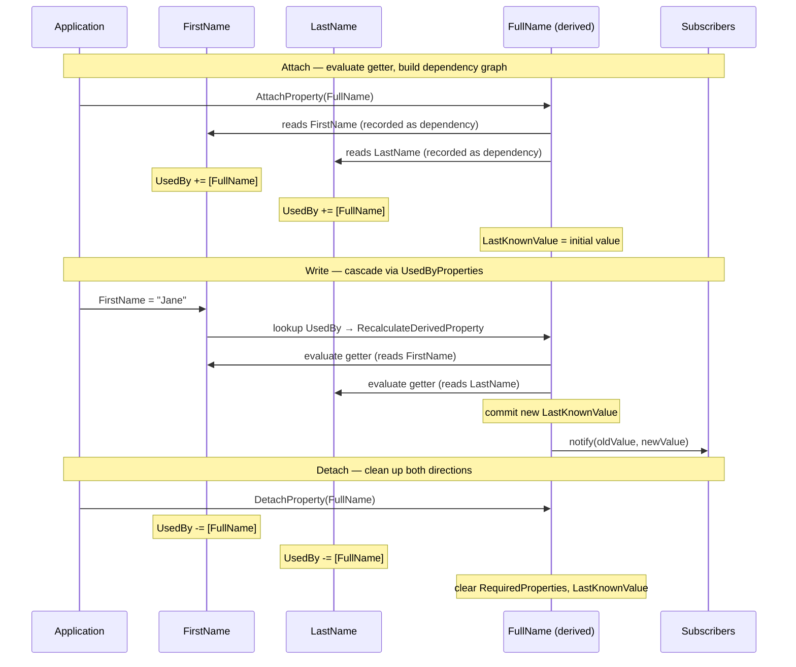
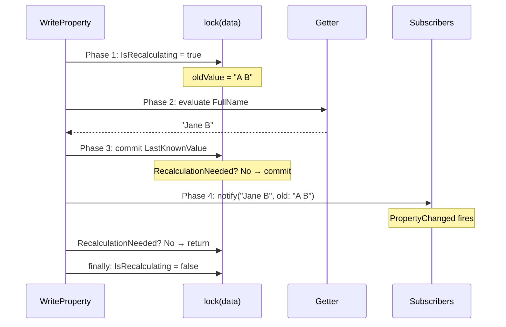
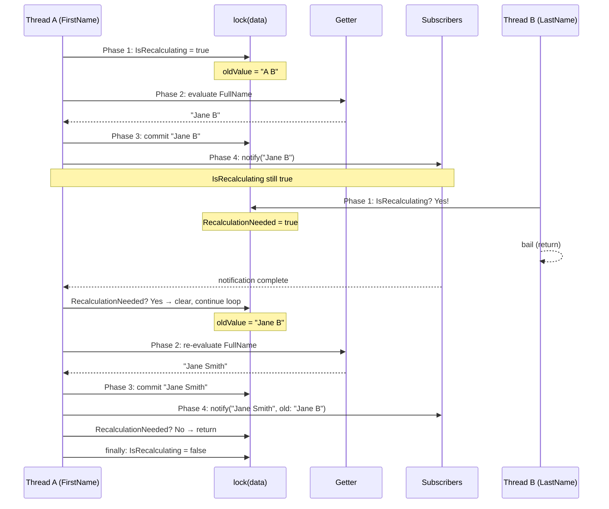
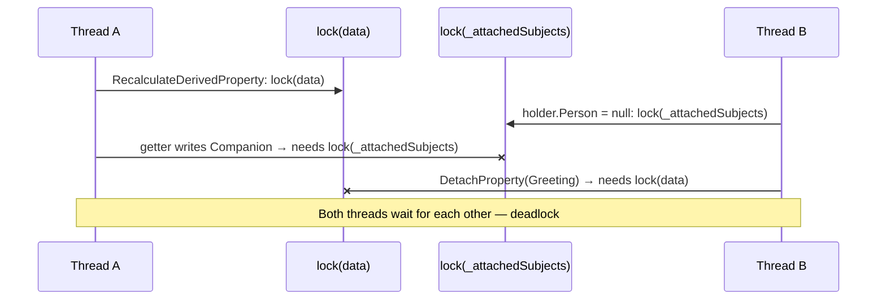
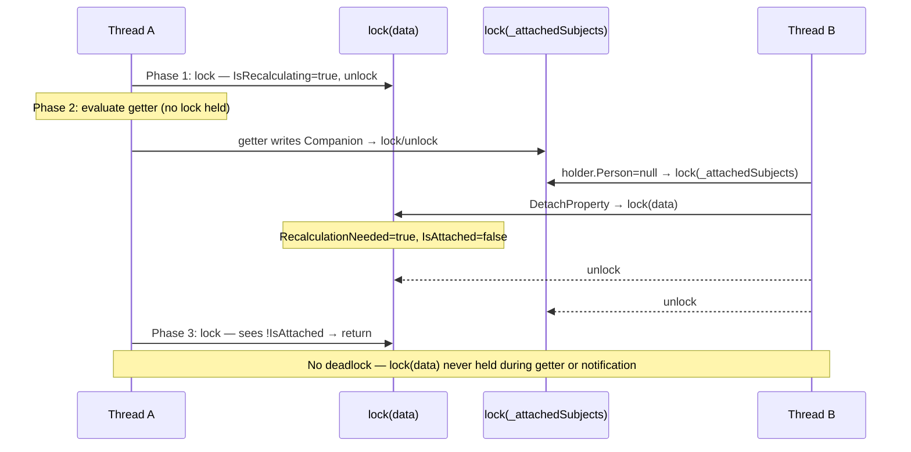
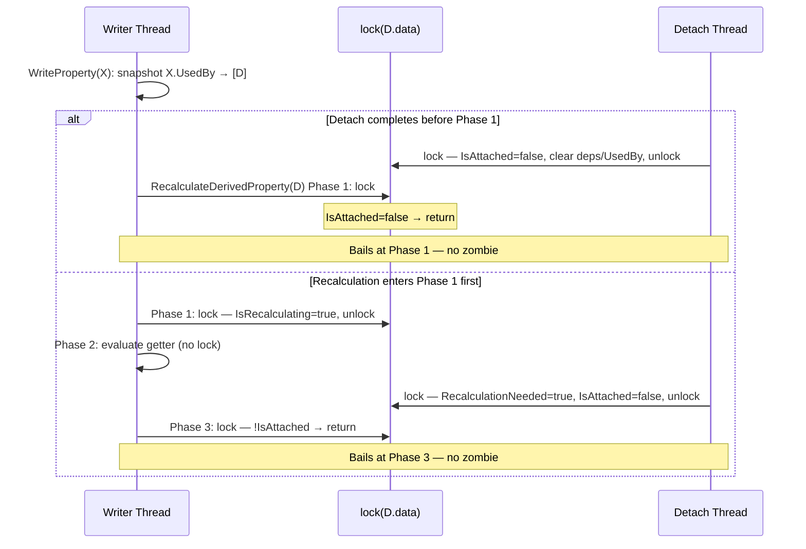
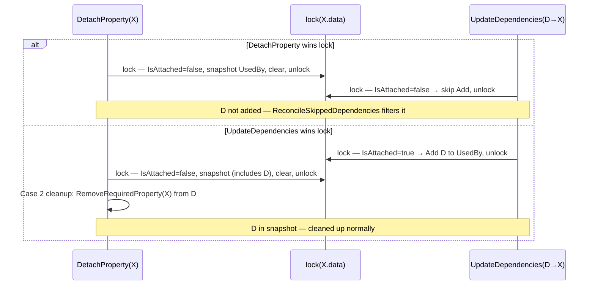

# Derived Property Change Detection: Internal Design

This document describes the internal architecture of the derived property tracking system in `Namotion.Interceptor.Tracking`. For user-facing documentation, see the [Tracking](../tracking.md) documentation.

## Overview

Derived properties are computed properties marked with `[Derived]`. They are not intercepted (no partial backing field), but their dependencies on intercepted properties are automatically tracked. When any dependency changes, the derived property is recalculated and a change notification is fired.

```csharp
[InterceptorSubject]
public partial class Person
{
    public partial string FirstName { get; set; }   // Intercepted (partial)
    public partial string LastName { get; set; }    // Intercepted (partial)

    [Derived]
    public string FullName => $"{FirstName} {LastName}";  // Not partial, just a regular property
}
```

The source generator detects `[Derived]` and sets `IsDerived = true` on `SubjectPropertyMetadata`, but does not generate a backing field. The getter body is the user's original C# expression.

Derived properties can also be added at runtime via `RegisteredSubject.AddDerivedProperty<T>(name, getValue, setValue)`. These work identically with the dependency tracking system — the getter/setter lambdas are wrapped in interception calls and dependencies are recorded on first evaluation.

## Interceptor Ordering

`DerivedPropertyChangeHandler` is annotated with `[RunsBefore(typeof(LifecycleInterceptor))]`. This ensures `AttachProperty` runs before lifecycle handlers, so derived property dependencies are recorded and the initial value is cached before other handlers see the property.

## Components

The system consists of five internal types, all in `Namotion.Interceptor.Tracking.Change`:

| Type | Role |
|------|------|
| `DerivedPropertyChangeHandler` | Main interceptor. Implements `IReadInterceptor`, `IWriteInterceptor`, `IPropertyLifecycleHandler`. Coordinates recording, recalculation, and cleanup. |
| `DerivedPropertyData` | Per-property state. Stores dependencies and used-by properties, cached value, and lifecycle flags. Stored in `Subject.Data` under key `"ni.dpd"`. |
| `PropertyReferenceCollection` | Lock-free copy-on-write collection for used-by properties (`UsedByProperties`). Uses CAS for thread-safe mutation. |
| `DerivedPropertyRecorder` | Thread-static recording buffer. Captures which properties are read during getter evaluation. Uses `ArrayPool` to avoid allocations in steady state. |
| `DerivedPropertyChangeHandlerExtensions` | Extension methods for accessing `DerivedPropertyData` via `PropertyReference`. |

## Dependency Graph

The system maintains a bidirectional dependency graph:

```
Dependencies (RequiredProperties):      Used-by properties (UsedByProperties):
  FullName → [FirstName, LastName]        FirstName → [FullName]
                                          LastName  → [FullName]
```

- **Dependencies** (`data.RequiredPropertiesSpan`): Which properties a derived property reads. Stored as a private `PropertyReference[]` with separate count, accessed via `ReadOnlySpan` under `lock(data)`. Buffer is reused when capacity is sufficient to avoid allocation on re-evaluation.
- **Used-by properties** (`data.GetUsedByProperties()`): Which derived properties depend on this property. Stored as private `PropertyReferenceCollection`, updated via lock-free CAS.

The two use different data structures because of their access patterns. Dependencies are always read and written under `lock(data)` (the derived property's own data), so a plain array with buffer reuse is sufficient. Used-by properties are read without any lock (`WriteProperty` iterates dependents via `GetUsedByProperties()` which does `Volatile.Read`) and mutated from multiple lock scopes (`Remove` is called under the *derived* property's lock, not the *source* property's lock — so two derived properties detaching concurrently can call `Remove` on the same source's `UsedByProperties`). This requires the lock-free CAS copy-on-write wrapper.

Both directions are needed:
- Dependencies enable cleanup when a derived property is detached (remove itself from all dependencies' used-by properties).
- Used-by properties enable recalculation when a source property is written (find all affected derived properties).

Dependencies can span subjects. For example, `Car.AveragePressure` depends on each `Tire.Pressure`. The dependency graph links properties across subject boundaries:

```
Dependencies:                             Used-by properties:
  Car.AveragePressure → [Tire0.Pressure,    Tire0.Pressure → [Car.AveragePressure]
                         Tire1.Pressure,    Tire1.Pressure → [Car.AveragePressure]
                         ...]               ...
```

When a tire is replaced, the old tire's `Pressure` is removed from `AveragePressure.RequiredProperties` (via recalculation recording the new dependency set) and the new tire's `Pressure` is added.

## Data Flow

The following trace shows the lifecycle of a derived property (`FullName`) depending on source properties (`FirstName`, `LastName`). Steps 2 (Read) and 4 (Recalculation) are embedded within Attach and Write respectively.



### 1. Attach (initialization)

When a subject is created with a context, `LifecycleInterceptor` fires `AttachProperty` for each property. For derived properties, `DerivedPropertyChangeHandler.AttachProperty` runs:

```
AttachProperty(FullName)
  lock(data)
    data.IsAttached = true
    try:
      data.LastKnownValue = EvaluateAndStabilize(data, FullName)
      SetWriteTimestampUtcTicks(...)
    catch:
      // Getter threw — value will be computed on the next dependency write.
```

`EvaluateAndStabilize` handles the dependency recording, generation check, and stabilization loop internally (see Section 4 for details). If the getter throws during initial evaluation (typically during concurrent state transitions), the exception is caught and `LastKnownValue` remains null. The next dependency write triggers recalculation which retries with consistent state.

The generation-based stabilization inside `EvaluateAndStabilize` works as follows:

```
EvaluateAndStabilize(data, FullName)
  generationBefore = Volatile.Read(_writeGeneration)
  try:
    StartRecordingTouchedProperties()
    result = getter.Invoke(subject)              // evaluates "FirstName + LastName"
      → ReadProperty(FirstName)                 // recorder captures FirstName
      → ReadProperty(LastName)                  // recorder captures LastName
    recordedDeps = recorder.FinishRecording()
    dependenciesChanged = data.UpdateDependencies(FullName, recordedDeps, recorder)
    if !dependenciesChanged || Volatile.Read(_writeGeneration) == generationBefore:
      return result                              // common path: no concurrent write
    // Concurrent write detected — stabilize
    for iteration in 0..<MaxStabilizationIterations:
      StartRecordingTouchedProperties()
      result = getter.Invoke(subject)
      recordedDeps = recorder.FinishRecording()
      if !data.UpdateDependencies(FullName, recordedDeps, recorder):
        break                                    // deps stabilized
    return result
  finally:
    DiscardActiveRecording()                     // always clears recorder buffer
```

On the common path (single-threaded construction), `_writeGeneration` is unchanged and the loop is skipped entirely — zero extra getter evaluations. If a concurrent write is detected, the full stabilization loop runs for correctness.

### 2. Read (recording)

When a property is read through the interceptor chain, `ReadProperty` checks if a recording is active:

```
ReadProperty(FirstName)
  result = next(ref context)                     // get actual value
  if (_recorder?.IsRecording)
    _recorder.TouchProperty(FirstName)           // add to current recording frame
  return result
```

The recorder is thread-static (`[ThreadStatic]`), so recordings on different threads don't interfere.

### 3. Write (recalculation trigger)

When a source property is written, `WriteProperty` triggers recalculation of all dependents:

```
WriteProperty(FirstName = "Jane")
  next(ref context)                              // write the value
  Interlocked.Increment(_writeGeneration)        // signal for AttachProperty/RecalculateDerivedProperty
  data = FirstName.TryGetDerivedPropertyData()
  if data is null → return                       // fast path: no tracking data
  // Self-recalculation: if this is a derived-with-setter property, recalculate it
  if data.HasRequiredProperties && Metadata.SetValue != null:
    RecalculateDerivedProperty(FirstName, timestamp)
  // Cascade: recalculate all dependent derived properties
  usedByItems = data.GetUsedByProperties()                      // Volatile.Read + Items span
  if usedByItems has entries:
    for each dependent (e.g., FullName):
      RecalculateDerivedProperty(FullName, timestamp)
```

The `_writeGeneration` increment uses `Interlocked.Increment` (full fence) so that each concurrent writer produces a unique counter value — no lost increments. `AttachProperty`/`RecalculateDerivedProperty` detect concurrent writes via `Volatile.Read` (acquire semantics). The full fence from `Interlocked.Increment` pairs with `Volatile.Read`'s acquire semantics to guarantee that committed property values are visible when the counter change is observed.

**Derived properties with setters** (created via `AddDerivedProperty<T>(name, getValue, setValue)`) have both a getter and a setter. The setter modifies internal state as a side effect, but the actual property value is always determined by the getter. When the setter is called, `WriteProperty` detects `HasRequiredProperties && SetValue != null` and triggers recalculation to re-evaluate the getter and fire a change notification with the correct computed value.

### 4. Recalculation

#### Execution traces

The following sequence diagrams illustrate the concrete execution flow of `RecalculateDerivedProperty`. The single-threaded trace shows the straight-line happy path where all concurrency guards are inert. The concurrent trace shows how `IsRecalculating` serializes notification delivery to prevent stale out-of-order notifications.

**Single-threaded recalculation** — all concurrency guards are no-ops:



**Concurrent write during notification** — the scenario that `IsRecalculating` serialization prevents:



Without the `IsRecalculating` serialization (the pre-fix behavior), Thread B could have entered `RecalculateDerivedProperty` during Thread A's notification delivery, completed a full recalculation with the newer value, and delivered its notification first. Thread A would then resume and deliver its stale notification second — violating the invariant that the last notification reflects the final computed value.

#### Algorithm

`RecalculateDerivedProperty` evaluates the getter **outside** `lock(data)` to prevent deadlock with `lock(_attachedSubjects)` in `LifecycleInterceptor` when getters have side effects (e.g., writing to subject-typed properties). `IsRecalculating` serializes concurrent recalculations; `RecalculationNeeded` catches state changes that occur during the unlocked evaluation window.

```
RecalculateDerivedProperty(FullName, timestamp)
  // Phase 1: Acquire recalculation ownership (brief lock).
  lock(data)
    if data.IsRecalculating:
      data.RecalculationNeeded = true            // signal the in-progress recalculation
      return
    if !data.IsAttached → return
    data.IsRecalculating = true
    oldValue = data.LastKnownValue

  // Outer loop: handles post-notification RecalculationNeeded without recursion.
  // The try-finally wraps the entire loop so IsRecalculating stays true during
  // NotifyDerivedPropertyChanged — this serializes notification delivery with
  // recalculation, preventing stale notifications from being delivered after newer ones.
  try:
    for outerIteration in 0..<MaxStabilizationIterations:
      // Inner loop: re-evaluates when state changes during evaluation.
      while true:
        // Phase 2: Evaluate getter OUTSIDE lock(data).
        try:
          newValue = EvaluateAndStabilize(data, FullName, callerHoldsLock: false)
        catch:
          return                                 // keep LastKnownValue, skip notification

        // Phase 3: Commit result under lock.
        lock(data)
          if !data.IsAttached → return
          if data.RecalculationNeeded:           // state changed during evaluation
            data.RecalculationNeeded = false
            continue                             // discard stale result, re-evaluate
          data.LastKnownValue = newValue
          sequence = ++data.RecalculationSequence
          SetWriteTimestampUtcTicks(timestamp)
          break

      // Deliver notification while IsRecalculating is still true.
      // Concurrent writes during delivery set RecalculationNeeded and bail out.
      NotifyDerivedPropertyChanged(FullName, data, sequence, newValue, oldValue)

      // Handle recalculations that arrived during evaluation or notification delivery.
      lock(data)
        if !data.RecalculationNeeded → return    // done (triggers finally)
        data.RecalculationNeeded = false
        // IsRecalculating stays true for next iteration
        oldValue = data.LastKnownValue

    // Safety: log warning if outer loop exhausted.
  finally:
    // Clear IsRecalculating. If a write set RecalculationNeeded in the gap
    // between the outer loop's return and this finally, re-trigger to avoid
    // losing the signal. RecalculationNeeded is cleared before the re-trigger
    // to prevent unbounded recursion when the getter throws (Phase 3 never
    // runs to clear it, so the flag would persist across every re-trigger).
    lock(data)
      needsRetrigger = data.RecalculationNeeded && data.IsAttached
      if needsRetrigger:
        data.RecalculationNeeded = false
      data.IsRecalculating = false
    if needsRetrigger:
      RecalculateDerivedProperty(FullName, timestamp)  // re-enter safely
```

```
NotifyDerivedPropertyChanged(derivedProperty, data, sequence, newValue, oldValue)
  // Two guards prevent stale notifications:
  if sequence != Volatile.Read(data.RecalculationSequence) → return  // superseded
  if !ReferenceEquals(newValue, Volatile.Read(data.LastKnownValue)) → return  // overwritten
  WithSource(null):                              // marks as internal recalculation
    SetPropertyValueWithInterception(newValue, oldValue, NoOpWriteDelegate)
  RaisePropertyChanged("FullName")               // INotifyPropertyChanged integration
```

The getter is evaluated inside `EvaluateAndStabilize` **without holding `lock(data)`** (when `callerHoldsLock` is false). The lock is acquired only briefly for `UpdateDependencies`. If the getter throws (typically during concurrent state transitions), the exception is caught and `LastKnownValue` remains unchanged. The concurrent writer's `WriteProperty` cascade will re-trigger recalculation with consistent state.

The `RecalculationNeeded` flag is set under `lock(data)` by three sources when `IsRecalculating` is true:
- **Concurrent `RecalculateDerivedProperty`**: Another write triggered recalculation but the current one is in progress — the concurrent call bails and signals the flag.
- **`AttachProperty`**: The property is being reattached while recalculation is in progress — the evaluation result may be stale.
- **`DetachProperty`**: The property is being detached while recalculation is in progress — the evaluation result is invalid.

Phase 3 checks the flag before committing. If set, the stale result is discarded and the inner loop re-evaluates with fresh state. Because `IsRecalculating` stays true during notification delivery, any concurrent write sets `RecalculationNeeded` and bails — the outer loop picks it up after notification completes and re-evaluates with the latest state.

The generation check inside `EvaluateAndStabilize` avoids re-evaluation when dependencies change but no concurrent write occurred. The stabilization loop only runs when a concurrent write is actually detected.

Key details of the change notification:
- **Notifications outside lock but inside `IsRecalculating`**: `NotifyDerivedPropertyChanged` fires `SetPropertyValueWithInterception` and `RaisePropertyChanged` without holding `lock(data)` (preventing deadlock with `lock(_attachedSubjects)`), but while `IsRecalculating` is still true. This serializes notification delivery with recalculation — no concurrent recalculation (and thus no competing notification) can start during delivery. Two additional guards provide defense-in-depth: a `RecalculationSequence` check and a `ReferenceEquals` check on `LastKnownValue`. See the "Deadlock prevention" section for details.
- **Timestamp inheritance**: The derived property receives the same timestamp as the write that triggered the recalculation, ensuring consistent timestamps within a mutation context.
- **`WithSource(null)`**: Wraps the notification in a scope that clears any external source context. This marks the change as an internal recalculation, preventing source transaction handlers from writing it back to an external source.
- **`NoOpWriteDelegate`**: Since derived properties have no backing field, the write delegate is a no-op (`static (_, _) => { }`). The call to `SetPropertyValueWithInterception` exists solely to fire the change notification through the interceptor chain (observable, queue, etc.) with the correct old and new values.
- **`IRaisePropertyChanged`**: If the subject implements `IRaisePropertyChanged`, `RaisePropertyChanged` is called to support standard `INotifyPropertyChanged` data binding.

### 5. Detach (cleanup)

When a subject is removed from the object graph, `DetachProperty` cleans up both directions.

`DetachProperty` uses `TryGetDerivedPropertyData()` and returns early if no tracking data exists. This avoids `ConcurrentDictionary.GetOrAdd` allocations for source properties that were never dependencies — a significant performance optimization when detaching subjects with many non-dependency properties (e.g., detaching 1000 cars where only 1 of 18 properties per car participates in derived property tracking).

For properties with tracking data, both cases are handled in a single `lock(data)` block, followed by Case 2 cleanup outside the lock:

```
DetachProperty(property)
  data = property.TryGetDerivedPropertyData()
  if data is null → return                       // skip untracked properties
  lock(data)
    if data.IsRecalculating:
      data.RecalculationNeeded = true            // signal in-progress recalculation
    usedBySnapshot = data.DetachAndSnapshotUsedBy(property)
      // sets IsAttached = false
      // Case 1 (derived only): removes from each dependency's UsedByProperties (CAS)
      // clears RequiredProperties and LastKnownValue
      // Case 2: snapshots UsedByProperties.ItemsArray, clears UsedByProperties
  // release lock before Case 2 processing to avoid nesting with lock(derivedData)
  for each derived in usedBySnapshot:
    lock(derivedData)
      derivedData.RemoveRequiredProperty(property)
```

The single lock ensures `IsAttached`, dependency cleanup (Case 1), and used-by snapshot (Case 2) are atomic — no window where a concurrent thread could see `IsAttached=false` but `UsedByProperties` still populated.

The lock serializes with `UpdateDependencies`' used-by Add (which also acquires `lock(depData)` on the same object). This ensures either:
- The used-by property was added before the snapshot → we see it and clean up the dependency.
- `UpdateDependencies` acquires the lock after us → sees `IsAttached = false` → skips the Add.

## Dependency Updates (`DerivedPropertyData.UpdateDependencies`)

This method is called under `lock(data)` (the derived property's data) and maintains both dependencies and used-by properties:

1. **Fast path**: If `previousDeps.SequenceEqual(recordedDeps)` → clear recorder, return `false` (no allocation).
2. **Slow path** (three extracted helpers):
   - `RemoveStaleUsedByProperties`: For each old dependency no longer used, `Remove(derivedProperty)` from its `UsedByProperties` (CAS).
   - `TryAddNewUsedByProperties`: For each new dependency not previously tracked, `lock(depData)` → check `depData.IsAttached` → if attached, `Add(derivedProperty)` to its `UsedByProperties`. The lock serializes with `DetachProperty` Case 2 on the same dependency data. Returns `true` if all were added successfully.
   - If all added: `SetRequiredProperties(recordedDeps)` reuses the existing buffer when capacity is sufficient (zero allocation), then clears the recorder.
   - `ReconcileSkippedDependencies` (rare path): If any used-by Add was skipped (dependency detaching), copies to owned array, clears recorder, then re-checks each dependency under `lock(depData)`. If the dependency was re-attached concurrently (`IsAttached` now true), calls idempotent `Add(derivedProperty)` to repair the missing used-by property. If still detached, removes from `RequiredProperties` and cleans the used-by property. Lock ordering is safe (derived → dependency, same direction as the used-by loop). This prevents both dependency leaks and missing used-by properties after concurrent re-attachment.
   - Return `true` if dependencies changed (caller should re-evaluate), `false` if the filtered result matches the previous set (prevents infinite stabilization loops when a getter keeps reading a detaching dependency).

The `bool` return drives the stabilization loop in `RecalculateDerivedProperty` and `AttachProperty`.

## Concurrency Model

### Per-property lock

`lock(data)` on `DerivedPropertyData` serializes:
- Concurrent recalculations of the same derived property (via `IsRecalculating` flag)
- Recalculation vs. detach (prevents zombie resurrection via `IsAttached` check)
- `RequiredProperties` reads and writes (via `UpdateDependencies`)
- `RecalculationNeeded` signaling (set by concurrent operations, consumed by recalculation)

In `RecalculateDerivedProperty`, the lock is acquired briefly for state transitions (Phase 1, Phase 3, outer loop check, finally with re-trigger check) but **not held during getter evaluation or notification delivery**. The `IsRecalculating` flag stays true during notification delivery (serializing notifications with recalculations), but no lock is held — preventing deadlock with `lock(_attachedSubjects)` in `LifecycleInterceptor`. In `AttachProperty`, the lock is held throughout evaluation because the caller already holds `lock(_attachedSubjects)` (correct lock ordering).

This is a fine-grained lock (per derived property), so different derived properties can recalculate concurrently.

### Lock-free used-by properties

`PropertyReferenceCollection` uses copy-on-write with CAS:

```csharp
internal bool Add(in PropertyReference item)
{
    while (true)
    {
        var snapshot = Volatile.Read(ref _items);
        if (Array.IndexOf(snapshot, item) >= 0)
            return false;                        // already present

        var newArr = new PropertyReference[snapshot.Length + 1];
        Array.Copy(snapshot, newArr, snapshot.Length);
        newArr[^1] = item;

        if (ReferenceEquals(
            Interlocked.CompareExchange(ref _items, newArr, snapshot), snapshot))
            return true;
        // CAS failed — retry
    }
}
```

This is necessary because multiple derived properties on different threads may concurrently add themselves to the same source property's `UsedByProperties`.

### Thread-static recorder

`DerivedPropertyRecorder` is `[ThreadStatic]`, so each thread has its own instance. This avoids synchronization during recording. The recorder supports nesting (stack-based frames) for derived properties that read other derived properties.

### Lock ordering follows the dependency DAG

`EvaluateAndStabilize` (when `callerHoldsLock` is false) and `UpdateDependencies` nest locks in the derived → dependency direction: `lock(D_data)` (from `EvaluateAndStabilize`'s brief lock for `UpdateDependencies`) → `lock(X_data)` (inner, from the used-by Add loop in `UpdateDependencies`). A deadlock would require a cycle in the lock acquisition order, which would imply a circular dependency in the property graph — but circular getter dependencies cause infinite recursion before any lock is reached, so the graph is always a DAG and deadlock is impossible.

`RecalculateDerivedProperty` does **not** hold `lock(data)` during getter evaluation or notification delivery. The `IsRecalculating` flag stays true during both (serializing concurrent recalculations and notifications), but no lock is held — so getter side effects and notification interceptors can safely acquire `lock(_attachedSubjects)` in `LifecycleInterceptor` without lock ordering inversion. `AttachProperty` holds both `lock(_attachedSubjects)` (from LifecycleInterceptor, outer) and `lock(data)` (inner) during evaluation — correct ordering, and reentrant for getter side effects on the same thread.

`DetachProperty` uses a single `lock(data)` for all local cleanup (`IsAttached`, `RecalculationNeeded` signaling, dependencies, used-by snapshot), then acquires `lock(derivedData)` sequentially for `RequiredProperties` cleanup. Because it never holds two locks simultaneously, it cannot participate in a lock cycle. Case 1's dependency cleanup (removing from dependencies' `UsedByProperties`) uses CAS inside the lock — no nested lock acquisition.

## Concurrency Scenarios

### Re-entrancy during derived-with-setter recalculation

Derived properties with setters (added via `AddDerivedProperty<T>(name, getValue, setValue)`) create a re-entrancy path: `RecalculateDerivedProperty` calls `NotifyDerivedPropertyChanged` → `SetPropertyValueWithInterception` (while `IsRecalculating` is still true), which re-enters `WriteProperty`, which calls `RecalculateDerivedProperty` again. The re-entrant call acquires `lock(data)`, sees `IsRecalculating = true`, sets `RecalculationNeeded = true`, and bails. The outer loop picks up the flag, re-evaluates (computing the same value), and the equality check interceptor suppresses the duplicate notification.

### Deadlock prevention: unlocked getter evaluation

The following diagrams illustrate the ABBA deadlock that would occur if `RecalculateDerivedProperty` held `lock(data)` during getter evaluation, and how the actual design prevents it. Inversion 2 (notifications) follows the same pattern — `NotifyDerivedPropertyChanged` fires `SetPropertyValueWithInterception` which can acquire `lock(_attachedSubjects)` through the interceptor chain.

**Hypothetical deadlock** (if getter ran inside `lock(data)`):



**Actual behavior** (getter and notification run outside `lock(data)`):



`RecalculateDerivedProperty` evaluates the getter **outside** `lock(data)` and fires notifications after releasing `lock(data)`. This prevents two lock ordering inversions between `lock(data)` and `lock(_attachedSubjects)` in `LifecycleInterceptor`:

**Inversion 1 — Getter side effects**: A derived property getter may write to a subject-typed property as a side effect (e.g., lazy initialization, derived-with-setter patterns). This triggers `LifecycleInterceptor.WriteProperty` → `lock(_attachedSubjects)`. If the getter ran inside `lock(data)`, the ordering would be `lock(data)` → `lock(_attachedSubjects)`. Meanwhile, a concurrent `LifecycleInterceptor` operation holds `lock(_attachedSubjects)` → `AttachProperty`/`DetachProperty` → `lock(data)`. Deadlock.

**Inversion 2 — Notifications**: `NotifyDerivedPropertyChanged` fires `SetPropertyValueWithInterception` which enters the interceptor chain, potentially acquiring `lock(_attachedSubjects)` via `LifecycleInterceptor.WriteProperty`. Same ordering inversion as above.

Both are prevented because `lock(data)` is never held during getter evaluation or notification in `RecalculateDerivedProperty`. The `IsRecalculating` flag (set/cleared under brief `lock(data)` acquisitions) serializes concurrent recalculations — and, crucially, notification delivery — without holding the lock for the entire evaluation. The `RecalculationNeeded` flag catches state changes (writes, attach, detach) that arrive during the unlocked window.

In `AttachProperty`, the getter runs inside `lock(data)` — this is safe because the caller (`LifecycleInterceptor`) already holds `lock(_attachedSubjects)`, so the ordering is `lock(_attachedSubjects)` → `lock(data)` (correct, and reentrant for getter side effects on the same thread).

### Notification ordering: `IsRecalculating` serialization

`IsRecalculating` stays true during `NotifyDerivedPropertyChanged`. This is the primary mechanism preventing out-of-order notifications: since only one thread at a time can have `IsRecalculating = true` for a given derived property, and notifications are delivered within that scope, no two notifications for the same property can race. Concurrent writes during delivery set `RecalculationNeeded = true` and bail — the outer loop handles them after notification completes.

Three additional guards provide defense-in-depth:

1. **`RecalculationNeeded` check**: Set under `lock(data)` by concurrent operations (writes, attach, detach) when `IsRecalculating` is true. Checked before committing in Phase 3 — if set, the evaluation result is discarded and the getter is re-evaluated. This ensures the committed value reflects the latest state.

2. **`RecalculationSequence` check**: A monotonic counter incremented under `lock(data)` on each recalculation. In `NotifyDerivedPropertyChanged`, `Volatile.Read` compares the thread's captured sequence against the current value. If a newer recalculation completed in between, the notification is skipped.

3. **`ReferenceEquals` check on `LastKnownValue`**: A second guard compares the thread's computed `newValue` reference against `data.LastKnownValue` via `Volatile.Read`. Since `data.LastKnownValue = newValue` stores the same reference inside the lock, a mismatch means another thread overwrote it — the notification is skipped. This works for boxed value types because each getter evaluation produces a distinct boxed reference.

With `IsRecalculating` serialization, guards 2 and 3 are technically redundant (no concurrent recalculation can change the sequence or value during delivery). They are retained as defense-in-depth.

The `finally` block includes a re-trigger check: if `RecalculationNeeded` was set in the narrow gap between the outer loop's `return` (which releases its lock) and the `finally` (which clears `IsRecalculating`), the `finally` detects this and re-enters `RecalculateDerivedProperty` to process the missed signal. This ensures no write is lost even in this edge case.

Additionally, `LifecycleInterceptor.WriteProperty` uses `context.Property.Metadata.Type.CanContainSubjects<TProperty>()` (the declared metadata type) rather than just `CanContainSubjects<TProperty>()` (the generic parameter). `TProperty` is a hint that may be widened to `object` through non-generic paths like `SetPropertyValueWithInterception`, which would cause `CanContainSubjects<object>()` to return `true` for value-type properties (e.g., `decimal`). The metadata type check ensures value-type properties never enter the lifecycle lock.

### Concurrent write detection via `_writeGeneration`

When a derived property has conditional dependencies (e.g., `Display => UseFirstName ? FirstName : LastName`), the dependency set changes based on runtime state. A concurrent write to a newly-added dependency could land between getter evaluation and used-by registration — the write would not trigger recalculation because the used-by property isn't registered yet.

Both `AttachProperty` and `RecalculateDerivedProperty` use a generation-based detection scheme instead of unconditionally re-evaluating:

1. `WriteProperty` increments `_writeGeneration` via `Interlocked.Increment` (full fence) on every write.
2. `AttachProperty`/`RecalculateDerivedProperty` read `_writeGeneration` via `Volatile.Read` (acquire fence) before and after evaluation.
3. If unchanged → no concurrent write occurred → skip the stabilization loop.
4. If changed → a concurrent write happened → fall back to the full stabilization loop.

`Interlocked.Increment` provides a full memory fence, pairing with `Volatile.Read`'s acquire semantics: if the counter change is observed, all prior writes (including the committed property value) are guaranteed visible to the reading thread. Each concurrent writer produces a unique counter value — no lost increments.

`_writeGeneration` is a static field, shared across all handler instances. This ensures writes from any context are detected, even when dependencies span contexts (e.g., via context inheritance). The tradeoff is that unrelated writes (from other contexts) may cause false positives — triggering the stabilization loop when no relevant concurrent write occurred. False positives only affect `AttachProperty` and `RecalculateDerivedProperty` when dependencies change; the steady-state write path (`dependenciesChanged = false`) never checks the generation, so there is zero overhead from false positives in the common case. A false positive costs one extra getter evaluation that exits immediately (deps unchanged).

In the common case (stable dependencies or single-threaded construction), the generation is unchanged and the loop is skipped — zero extra getter evaluations. The stabilization loop only runs when a concurrent write is actually detected.

### Concurrent detach and recalculation

The following diagrams show the two race conditions and how lock serialization on `DerivedPropertyData` ensures correctness regardless of thread scheduling.

**Race 1 — Zombie used-by resurrection**: `WriteProperty` snapshots `UsedByProperties` and calls `RecalculateDerivedProperty` for each dependent. A concurrent `DetachProperty` on the derived property D serializes via `lock(D.data)`:



**Race 2 — Missed used-by in snapshot**: `DetachProperty` on source X snapshots `X.UsedByProperties`. A concurrent `UpdateDependencies` adding derived D to `X.UsedByProperties` serializes via `lock(X.data)`:



Two race conditions must be handled when `DetachProperty` runs concurrently with `RecalculateDerivedProperty` / `UpdateDependencies`:

**Race 1 — Zombie used-by resurrection (Case 1):** `WriteProperty` takes a snapshot of `UsedByProperties` and iterates it. A concurrent `DetachProperty` may remove a derived property's used-by entries between the snapshot and the recalculation call. Without protection, `RecalculateDerivedProperty` would re-add the used-by entries, creating zombie dependencies.

`DetachProperty` and `RecalculateDerivedProperty` both acquire `lock(data)` on the same derived property's data. `DetachProperty` sets `data.IsAttached = false` and `data.RecalculationNeeded = true` (if `IsRecalculating`) inside the lock. `RecalculateDerivedProperty` checks `IsAttached` at Phase 3 (commit) and `RecalculationNeeded` inside `EvaluateAndStabilize`'s brief lock for `UpdateDependencies`. `AttachProperty` sets `IsAttached = true` and `RecalculationNeeded = true` (if `IsRecalculating`) under lock to support re-attachment.

Both orderings produce a correct final state:
- **Detach wins lock during evaluation**: sets `IsAttached = false` and `RecalculationNeeded = true`. `EvaluateAndStabilize` bails on the next `UpdateDependencies` lock acquisition (sees `!IsAttached`). Phase 3 sees `!IsAttached` and returns. No stale deps.
- **Evaluation's UpdateDependencies wins lock**: registers used-by entries. Detach then runs, clears them. Final state is clean.
- **Detach + reattach during evaluation**: `RecalculationNeeded` is set by both operations. Phase 3 sees the flag, discards the stale result, and re-evaluates with the post-reattach state.

**Race 2 — Missed used-by property in Case 2 snapshot:** When a source property X is being detached, `DetachProperty` Case 2 takes a snapshot of `X.UsedByProperties` to find dependent derived properties. Concurrently, `UpdateDependencies` may be adding a new used-by entry (D → X) to `X.UsedByProperties`. If the Add completes after the snapshot, `DetachProperty` misses D, leaving a stale dependency (`D.RequiredProperties` contains X) and a stale used-by entry (D in `X.UsedByProperties`).

This is solved by locking `X.DerivedPropertyData` in both places:
- `DetachProperty` Case 2: `lock(data)` → `DetachAndSnapshotUsedBy` sets `IsAttached = false` + takes snapshot + clears `UsedByProperties` → release lock.
- `UpdateDependencies` used-by loop: `lock(depData)` → check `IsAttached` → if true, Add → release lock.

Since both operations lock the same object (`X.DerivedPropertyData`), they are fully serialized:
- **DetachProperty wins lock**: sets `IsAttached = false`, takes snapshot (D not present), clears `UsedByProperties`. `UpdateDependencies` then acquires the lock, sees `IsAttached = false`, skips the Add. The skipped dependency is also filtered from `RequiredProperties` by `ReconcileSkippedDependencies`.
- **UpdateDependencies wins lock**: sees `IsAttached = true`, adds D to `UsedByProperties`. `DetachProperty` then acquires the lock, takes snapshot (D is present), cleans up D's `RequiredProperties`.

No window exists where a used-by property is added but not visible to `DetachProperty`.

## Correctness Guarantees

### Thread safety: no data corruption

Every piece of shared mutable state is protected by exactly one synchronization mechanism:

| State | Protection | Accessed by |
|-------|-----------|-------------|
| `data.RequiredProperties` | `lock(data)` | `UpdateDependencies`, `DetachAndSnapshotUsedBy`, `DetachProperty` Case 2 |
| `data.LastKnownValue` | `lock(data)` (write) / `Volatile.Read` (read) | `RecalculateDerivedProperty` (write under lock, read outside lock for stale notification check), `AttachProperty`, `DetachAndSnapshotUsedBy` |
| `data.IsRecalculating` | `lock(data)` | `RecalculateDerivedProperty` (Phase 1, finally with re-trigger check) |
| `data.RecalculationNeeded` | `lock(data)` | `RecalculateDerivedProperty` (Phase 1 bail, Phase 3, outer loop check, finally re-trigger check), `AttachProperty`, `DetachProperty`, `EvaluateAndStabilize` (bail check) |
| `data.IsAttached` | `lock(data)` | `DetachAndSnapshotUsedBy`, `RecalculateDerivedProperty` (Phase 3), `AttachProperty`, `UpdateDependencies` (used-by loop), `EvaluateAndStabilize` (bail check) |
| `data.UsedByProperties` (collection contents) | CAS (copy-on-write) | `UpdateDependencies`, `DetachAndSnapshotUsedBy` |
| `data.UsedByProperties` (field itself) | `lock(data)` + `Interlocked.CompareExchange` | `DetachAndSnapshotUsedBy` (nulls under lock), `AddUsedByProperty` (CAS create) |
| `_recorder` | `[ThreadStatic]` (no sharing) | `ReadProperty`, `StartRecording`, `UpdateDependencies` (via parameter) |
| `data.RecalculationSequence` | `lock(data)` (write) / `Volatile.Read` (read) | `RecalculateDerivedProperty` (increment under lock, read outside lock for stale notification check) |
| `_writeGeneration` (static) | `Interlocked.Increment` (full fence) / `Volatile.Read` (acquire) | `WriteProperty` (increment), `AttachProperty` + `RecalculateDerivedProperty` (check) |

Nested locks occur in `UpdateDependencies`: `lock(D_data)` (outer, from `EvaluateAndStabilize`'s brief lock) → `lock(X_data)` (inner, used-by Add). The acquisition order follows the dependency DAG (derived → source). Circular dependencies would cause infinite recursion in getters before any lock is reached, so deadlock is impossible. `DetachProperty` uses a single `lock(data)` for all local cleanup (via `DetachAndSnapshotUsedBy`), then acquires `lock(derivedData)` sequentially (never nested), so it cannot participate in a lock cycle. `RecalculateDerivedProperty` never holds `lock(data)` during getter evaluation or notification — both may acquire `lock(_attachedSubjects)` in `LifecycleInterceptor`, and since `lock(data)` is not held, no cycle is possible.

### Value correctness: derived value always reflects current state

After all concurrent writes complete and recalculations settle, every derived property's value matches what its getter would return if called with the current source values. This is guaranteed by four mechanisms working together:

1. **Used-by-driven recalculation**: Once a dependency's used-by properties include a derived property, any write to that dependency triggers `RecalculateDerivedProperty` via `WriteProperty`. The `IsRecalculating` flag serializes concurrent recalculations of the same derived property — each successful evaluation sees the most recent source values.

2. **`RecalculationNeeded` flag**: When a concurrent write, attach, or detach occurs while `IsRecalculating` is true, the `RecalculationNeeded` flag is set under `lock(data)`. The in-progress recalculation checks this flag before committing (Phase 3) and inside `EvaluateAndStabilize`'s brief lock for `UpdateDependencies`. If set, the stale evaluation result is discarded and the getter is re-evaluated. The outer loop checks after notification delivery to catch writes that arrived during evaluation or notification. The `finally` block includes a re-trigger check for the narrow gap between the outer loop's return and `IsRecalculating` cleanup.

3. **Generation-based concurrent write detection**: `WriteProperty` increments `_writeGeneration` on every write (`Interlocked.Increment`, full fence). `AttachProperty` and `EvaluateAndStabilize` read the counter before and after evaluation (`Volatile.Read`, acquire fence). If unchanged, no concurrent write occurred and re-evaluation is skipped. If changed, the stabilization loop runs to catch writes that landed between getter evaluation and used-by registration.

4. **Stabilization loop (on concurrent write detection)**: When the generation check detects a concurrent write AND the dependency set changed, the `for` loop re-evaluates until dependencies stabilize (up to `MaxStabilizationIterations`):
   - **First iteration**: evaluates getter, registers used-by properties.
   - **Subsequent iterations**: re-evaluate with used-by properties in place, catching writes that happened before registration. Each iteration that acquires used-by properties ensures any *further* concurrent write to those dependencies triggers recalculation via the normal path.
   - The loop exits when `UpdateDependencies` returns `false` (deps unchanged).

   In the common case (no concurrent writes, or stable dependencies), the generation check avoids the loop entirely — zero extra getter evaluations.

Because `_writeGeneration` is static (global), writes from any context are detected — no cross-context blind spots. False positives from unrelated contexts only trigger re-evaluation when deps actually changed, and the re-evaluation exits immediately when deps are stable.

### No zombie dependencies after detach

When a property is detached, no stale references remain in the dependency graph:

- **Dependencies cleaned (Case 1)**: Inside the single `lock(data)`, `DetachAndSnapshotUsedBy` iterates `RequiredProperties` and removes the derived property from each dependency's `UsedByProperties` via CAS `Remove` (no nested lock). Then clears `RequiredProperties` and `LastKnownValue`.
- **Used-by properties cleaned (Case 2)**: Inside the same `lock(data)`, `DetachAndSnapshotUsedBy` takes a `UsedByProperties` snapshot and clears it. After releasing the lock, `DetachProperty` iterates the snapshot and removes the source property from each dependent's `RequiredProperties` under `lock(derivedData)`.
- **Atomic state transition**: The single lock ensures `IsAttached = false`, dependency cleanup (Case 1), and used-by snapshot (Case 2) happen atomically. No concurrent thread can observe `IsAttached = false` while `UsedByProperties` is still populated.
- **No resurrection (Case 1)**: `DetachProperty` sets `IsAttached = false` and `RecalculationNeeded = true` (if `IsRecalculating`) inside the lock. Any concurrent `RecalculateDerivedProperty` with an in-flight evaluation sees `!IsAttached` or `RecalculationNeeded` at the next lock acquisition (`EvaluateAndStabilize` bail check or Phase 3) and either bails or re-evaluates. No stale used-by entries are committed.
- **No missed used-by properties (Case 2)**: For properties **with** tracking data, `DetachAndSnapshotUsedBy` sets `IsAttached = false` under `lock(data)`. The lock serializes with `UpdateDependencies`' used-by Add (which also locks `depData`). Any used-by property added before the lock is in the snapshot; any Add attempt after the lock sees `IsAttached = false` and skips. Skipped entries trigger `ReconcileSkippedDependencies` which re-checks `IsAttached` under `lock(depData)`: if the dependency was re-attached concurrently, the filter calls idempotent `Add(derivedProperty)` to repair the missing used-by property; if still detached, it removes the dependency from `RequiredProperties` and cleans the used-by entry.
- **Untracked source properties**: For source properties that were **never** dependencies (no `DerivedPropertyData` exists), `DetachProperty` skips them entirely via `TryGetDerivedPropertyData() → null → return`. A theoretical race exists where a concurrent `UpdateDependencies` creates data with `IsAttached = true` after `DetachProperty` exits, leaving a stale dependency in the derived property's `RequiredProperties`. However, this is safe in practice: for a derived property D to read source property X on subject S, the getter must reach S through the object graph — meaning S is already kept alive by a structural reference from the getter's reachable path (a tracked property, closure capture, etc.), not solely by `RequiredProperties`. The stale dependency is redundant with the existing structural reference and is cleaned up on the next recalculation of D (when the structural reference changes, D re-records its dependencies and drops X). This tradeoff avoids `ConcurrentDictionary.GetOrAdd` for every untracked property during detach, which profiling showed to be the dominant cost in bulk detach scenarios.

### No memory leaks from cross-subject dependencies

Cross-subject dependencies (e.g., `Car.AveragePressure` → `Tire.Pressure`) create references between subjects via the dependency graph. These are cleaned up in three scenarios:

- **Source replacement** (e.g., replacing a tire): The write to the structural property triggers recalculation of `AveragePressure`. The getter now reads the new tire's `Pressure`, so `UpdateDependencies` removes the old tire from `RequiredProperties` and removes `AveragePressure` from the old tire's `UsedByProperties`. The old tire has no remaining used-by entries and can be GC'd.
- **Derived property detach** (e.g., car removed from graph): `DetachAndSnapshotUsedBy` (Case 1) removes `AveragePressure` from all tires' `UsedByProperties`, and clears `RequiredProperties` and `LastKnownValue`. The tires have no remaining references to the car's properties and the car can be GC'd.
- **Source property detach** (e.g., tire removed from graph): For tracked source properties, `DetachAndSnapshotUsedBy` (Case 2) takes a snapshot of `UsedByProperties` under lock and clears it, then `DetachProperty` removes the tire's `Pressure` from `AveragePressure.RequiredProperties` under `lock(derivedData)`. If a concurrent `UpdateDependencies` was adding a used-by entry, the lock serialization ensures it is either in the snapshot (cleaned up) or skipped (filtered from `RequiredProperties`). For untracked source properties, `DetachProperty` skips them (no data to clean). See "Untracked source properties" above for the theoretical race and why it is safe.

In all cases for tracked properties, both dependencies and used-by properties are cleaned up immediately, so no cross-subject references prevent garbage collection.

## Performance Characteristics

| Scenario | Allocations | Cost |
|----------|-------------|------|
| Steady-state write (deps unchanged) | Zero | `SequenceEqual` on `RequiredProperties` span + one `Interlocked.Increment` (~5-10ns) |
| Dependency set changes, no concurrent write | One `PropertyReference[]` | Differential used-by property updates, generation check skips re-evaluation |
| Dependency set changes + concurrent write | One `PropertyReference[]` | Above + stabilization loop (re-evaluation until deps stabilize) |
| Dependency set changes + concurrent detach | Two `PropertyReference[]` | Above + filter allocation for detached deps (rare) |
| Recording | Zero (pooled buffers) | Stack push/pop per frame |
| Recalculation | Zero (beyond getter) | Brief `lock(data)` acquisitions (Phase 1, UpdateDependencies, Phase 3, outer loop check, finally) + getter invocation + two `Volatile.Read` (~2ns). Lock not held during getter evaluation or notification delivery; `IsRecalculating` flag serializes concurrent access. |
| Attach (common path) | Zero (beyond initial) | One `lock(data)` + getter invocation + two `Volatile.Read` (~2ns) |
| Used-by read (`UsedByProperties.Items`) | Zero | Returns stable `ReadOnlySpan` snapshot |

## Interaction with Other Interceptors

### Equality check (`WithEqualityCheck`)

When `PropertyValueEqualityCheckHandler` is registered (included in `WithFullPropertyTracking`), it compares old and new values before the write proceeds. If they are equal, the entire interceptor chain is skipped — no `WriteProperty` call, no dependent recalculation. This prevents redundant cascading recalculations when a source property is set to its current value.

The equality check also applies to the `SetPropertyValueWithInterception` call during recalculation. If the derived property's new computed value equals the old value, the change notification is suppressed.

### Transactions

During transaction capture (`SubjectTransaction.HasActiveTransaction && !IsCommitting`), dependent recalculations are suppressed. Derived properties are recalculated when the transaction commits and replays the writes. Additionally, derived property writes are never captured in transactions (`SubjectTransactionInterceptor` checks `!context.Property.Metadata.IsDerived`), since derived values are always computed from their dependencies.

## Design Notes

### Derived-to-derived dependencies are flattened

Derived properties that depend on other derived properties work correctly, but the intermediate derived property does not appear in the dependency graph. Instead, the dependencies are "flattened" to the underlying source properties.

```csharp
[Derived]
public string FullName => $"{FirstName} {LastName}";

[Derived]
public string FullNameWithPrefix => $"Mr. {FullName}";
```

When `FullNameWithPrefix` is evaluated, it calls `FullName`'s getter, which reads `FirstName` and `LastName` through the interceptor chain. The recorder captures `FirstName` and `LastName` as direct dependencies of `FullNameWithPrefix`. So when `FirstName` changes, both `FullName` and `FullNameWithPrefix` are recalculated (both appear in `FirstName.UsedByProperties`).

`FullName` itself does not appear in `FullNameWithPrefix.RequiredProperties` or in `FullName.UsedByProperties`, because derived property getters are plain C# property accesses that don't go through the interceptor chain.
