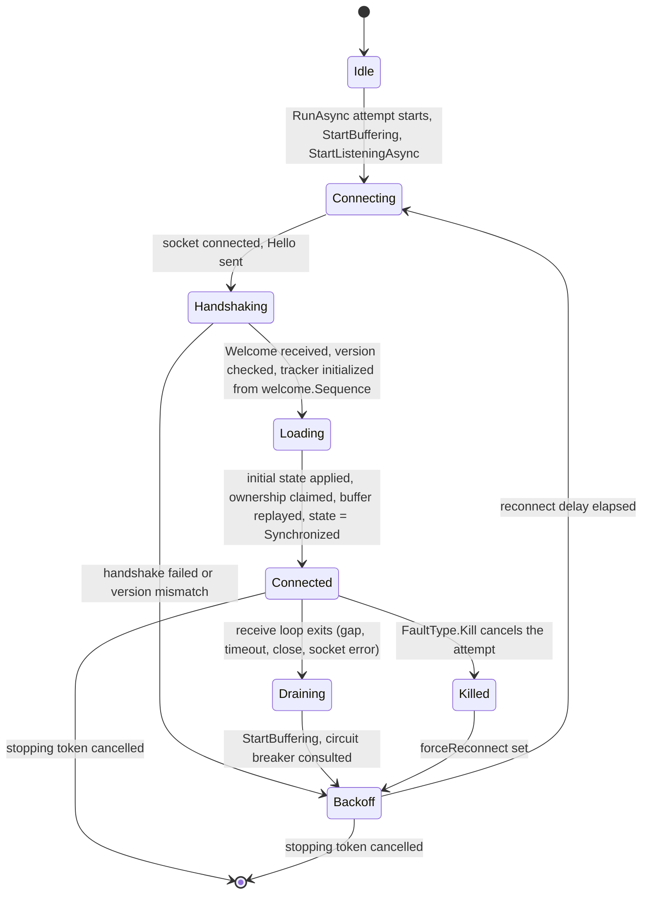
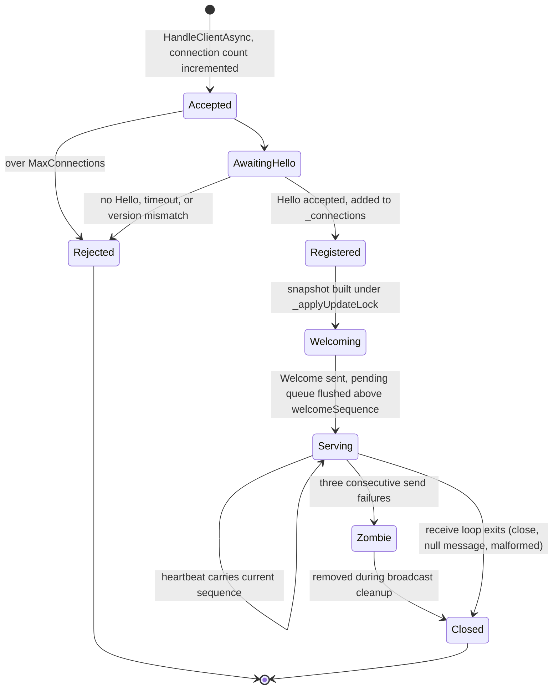

# WebSocket sync reliability: the argument in place of a model

Maintainer notes for the WebSocket synchronization protocol, covering the reliability mechanisms in both directions and the client-to-server reliability that PR C adds. Consumer-facing behaviour is in [connectors-websocket.md](../connectors-websocket.md), and the outbound delivery rules the client shares with every other connector are in [connector-delivery.md](connector-delivery.md). This document exists because the change it gates was going to be checked by a TLA+ model and will not be.

## What this document is, and what it does not prove

A TLA+ specification of this protocol was planned as the design gate for client-to-server reliability. It was ruled out of scope for a reason that has nothing to do with the protocol: the toolchain lives only on an unmerged pull request and its bootstrap ships a Linux-only JRE, so the model could have been written on this machine but not checked. An unchecked model is a second natural-language description with worse ergonomics and a false air of rigour, so it is not worth its cost. This document replaces it, deliberately and at a lower standard.

The difference matters and is the reason for this section. A checked model explores every interleaving of the modelled actions up to the modelled bound and reports a counterexample trace for any state that violates an invariant. What follows is a hand enumeration. It is systematic, it is derived from the code rather than from memory, and it is organised so that a reader can see which axis each case varies. It is not exhaustive, and no claim in it is machine-verified.

**This document is an analysis input, not the gate.** It found the scope error that reshaped PR C, and it is worth reading for that. What actually certifies PR C is the Connector Tester runs (`websocket-chaos`, `websocket-load`, `websocket-transactions`) plus a write-durability oracle, because every remaining unhandled case in the enumeration below is one that agreement alone cannot see: both sides converge, on a value nobody wrote. An agreement oracle passes on all of them. Do not treat a clean read of this document as evidence that PR C is correct.

Concretely, this document does not prove:

- **Completeness of the interleaving set.** Every case below was reached by varying one fault against one point in a state machine. Faults that compose, three or more at once, or that land inside a window this document treats as atomic, are not enumerated. Where a window is treated as atomic and that is load-bearing, it is called out.
- **Absence of a counterexample.** Each invariant carries a verdict, and several carry a counterexample found by hand. An invariant marked as holding means no counterexample was found by this analysis, not that none exists.
- **Liveness under adversarial timing.** The termination argument is an informal well-founded-decrease argument over a fault-free suffix. It assumes the reconnect backoff, the heartbeat interval and the buffer flush all fire, which a fair scheduler gives and an adversarial one does not.
- **Anything about the internals of `ApplySubjectUpdate`.** The apply is treated as an operation that either applies a whole update, throws, or silently drops part of it. Which of the three it does for a given update is out of scope here; see [connectors-subject-updates.md](../connectors-subject-updates.md).

What it does buy: the fault model is argued rather than assumed, the invariants are written from requirements rather than read off the implementation, and the places where the implementation contradicts a requirement are named. That last part is the output that a model would also have produced and that a code reading alone does not.

A note on method, because it decides whether the rest is worth reading. The state machines and the fault enumeration below are derived from the code, warts included, and cite the code. The invariants are not. They were written from what a synchronizing connector owes its caller, before the corresponding code paths were traced, precisely so that they could disagree with the implementation. An invariant read off an implementation asserts only that the code does what the code does. Every disagreement found this way is recorded in [Findings](#findings) rather than smoothed away.

## The fault model

### Why channel loss is not in it

The single most consequential framing decision here is that the channel is not a fault. Within one WebSocket connection the transport is TCP: bytes are not dropped, not duplicated, and not reordered, and a message that cannot be delivered kills the connection instead of arriving late. A framework message either arrives whole, in order, or the connection ends. This is not an assumption about a well-behaved network, it is what the transport guarantees, and `System.Net.WebSockets` surfaces a violation as a `WebSocketException` rather than as a missing message.

Modelling channel loss anyway would be actively harmful, not merely wasteful. A lossy-channel model spends its state space on interleavings that cannot occur, which is the wasteful half. The damaging half is that it makes the sequence number look like the whole answer: in a lossy-channel world every loss is a wire loss, every wire loss produces a gap, and a gap detector plus a resync is a complete design. That conclusion is wrong here, and the enumeration below is mostly a catalogue of why. The losses that actually happen in this system are endpoint-side, and an endpoint-side loss is invisible to a sequence number whenever it occurs before the sequence is stamped or after it has been validated.

So the fault model is about endpoints, and the sequence number's real job is narrower than it looks: it covers the interval between stamping on the sender and validation on the receiver, and nothing outside it.

### The four faults

**Connection kill or drop.** The connection ends at an arbitrary point. Either side may notice first, and neither learns how much of what it sent was processed. This is what `IFaultInjectable.InjectFaultAsync` injects as `FaultType.Disconnect` (`WebSocketSubjectClientSource.cs:656`, an `Abort()` on the socket) and, one level up, as `FaultType.Kill`, which cancels the current run attempt inside the monitor loop (`SubjectConnectorBase.cs:154`). It is also what a server restart, a proxy idle timeout and a process crash look like from the other end.

**Send-side loss.** A change leaves the model, is accepted by the delivery pipeline, and never reaches the socket. This has several distinct sites and none of them involve the network. `ChangeQueueProcessor.TryFlushAsync` drains its concurrent queue into `_flushChanges` (`ChangeQueueProcessor.cs:456`) and clears that list in its `finally` (`ChangeQueueProcessor.cs:490`). `ChangeQueueProcessor.Dispose` (`ChangeQueueProcessor.cs:519`) returns the merger's buffer and never flushes, and the teardown drain that covers the normal path explicitly gives up when a concurrent dispose holds the flush gate (`ChangeQueueProcessor.cs:408`). On the server side `WebSocketClientConnection.SendUpdateAsync` drops a message outright on a send-lock timeout (`WebSocketClientConnection.cs:158`) and on pending-queue overflow (`WebSocketClientConnection.cs:170`). None of these is a network event and none of them is visible to the peer at all.

**Apply-side loss.** A message arrives, is parsed, and its effect on the model is partly or wholly lost. `WebSocketSubjectHandler.ReceiveUpdatesAsync` wraps the apply in a `try` that logs, answers with an `Error`, and continues the loop (`WebSocketSubjectHandler.cs:220`). `SubjectPropertyWriter.Write` catches and logs whatever the apply throws (`SubjectPropertyWriter.cs:212`). `ConnectorCommitLease.TryAcquireCommit` returning false makes the client's `HandleUpdate` return without applying (`WebSocketSubjectClientSource.cs:627`). And `SubjectUpdateApplier` drops parts of an update it cannot resolve, at four independent sites, counted by `SubjectUpdateDiagnostics.DroppedInboundSubjectUpdates` (`SubjectUpdateApplier.cs:115` and `:344`). In every one of these the message was received, so no gap exists and no sequence mechanism can see the loss.

**Reconnect with Welcome resync.** The client reconnects, receives a complete state snapshot with the server's current sequence, applies it over its own model, and resumes. This is a fault rather than a repair because the apply is unconditional: `LoadInitialStateAsync` applies the whole Welcome state including properties the client owns (`WebSocketSubjectClientSource.cs:343`), so a local write the server never processed is overwritten by the server's older value. On the attempt-level start path `SubjectSourceBase` compensates by reconciling the write retry queue afterwards (`SubjectSourceBase.cs:301`). On the client's own monitor-loop reconnect it does not, and that asymmetry is finding [F2](#findings).

These four are the axes. Everything below is one of them landing at one point of one of the two state machines, or at one point of a workload the original enumeration did not cover: more than one client, transactions, and the ID-based applier this PR stacks on.

## The state machines

### The client source

`WebSocketSubjectClientSource` derives from `SubjectSourceBase`, so its lifecycle is the base class's attempt loop (`SubjectSourceBase.cs:258`) with a nested reconnect loop of its own (`WebSocketSubjectClientSource.cs:670`). The nesting is the part that matters and it is load-bearing for three separate conclusions below: a transport outage is handled entirely inside the inner loop and the outer attempt never notices, which is why the outer loop's reconcile step does not run on a reconnect, why the change processor is not disposed per disconnect, and why a stalled send cannot be broken by a reconnect.

**Idle to Connecting** is driven by `SubjectSourceBase.RunAsync`, which drains owned writes into the retry queue, calls `StartBuffering` on the property writer and then `StartListeningAsync` (`SubjectSourceBase.cs:270` to `:273`). Buffering means inbound updates are parked in a list rather than applied, so that the initial-state load cannot be overtaken by a live update.

**Connecting to Handshaking to Loading** is `ConnectCoreAsync` (`WebSocketSubjectClientSource.cs:217`). It retires the previous connection's commit lease, waits for the previous receive loop to exit, opens a new socket, sends `Hello`, and blocks on the first message. A `Welcome` with a version other than `WebSocketProtocol.Version` fails the attempt (`WebSocketSubjectClientSource.cs:300`). The sequence tracker is constructed per attempt, not per source, and the comment at `WebSocketSubjectClientSource.cs:246` says why: a tracker surviving a reconnect would validate the new connection's sequence numbers against the old connection's position.

**Loading to Connected** is `SubjectPropertyWriter.LoadInitialStateAndResumeAsync` (`SubjectPropertyWriter.cs:125`). It captures a generation counter before the load, applies the snapshot only if no `StartBuffering` intervened, replays the buffered updates, and transitions to `Synchronized` (`SubjectPropertyWriter.cs:176`) while still holding the writer's lock.

**Connected** is two concurrent activities on one socket. The receive loop (`WebSocketSubjectClientSource.cs:446`) reads messages, validates the sequence of each `Update` against `ClientSequenceTracker` and each `Heartbeat` against the same tracker, and hands the payload to `HandleUpdate`. The write pump is `ChangeQueueProcessor`, running inside `SubjectSourceBase.RunAsync` (`SubjectSourceBase.cs:323`), which flushes merged batches through `WriteChangesViaRetryQueueAsync` into `WriteChangesAsync` (`WebSocketSubjectClientSource.cs:387`). The two share `_connectionLock`, so at most one is on the socket at a time.

There is a third writer, easy to miss because it is on no loop: a transactional commit calls `SourceTransactionWriter.WriteToSourcesAsync`, which reaches `WriteChangesInBatchesAsync` directly (`SourceTransactionWriter.cs:164`, `:375`, `:416`) on the committing thread, bypassing the processor and the retry queue entirely. Group T is about what that costs.

**Connected to Draining** happens whenever the receive loop returns, which it does on a detected sequence gap (`WebSocketSubjectClientSource.cs:512` and `:524`), a close message, a receive timeout, a socket error, or five consecutive processing errors. Note the shape: a gap does not trigger any in-band repair in this direction. The client's entire recovery from a server-to-client gap is "drop the connection and start over".

**Draining to Backoff to Connecting** is the monitor loop (`WebSocketSubjectClientSource.cs:670`). It calls `StartBuffering`, consults the circuit breaker, waits the backoff with equal jitter, and calls `ReconnectAndResumeAsync`, which is `ConnectAsync` followed by `LoadInitialStateAndResumeAsync` (`WebSocketSubjectClientSource.cs:764`). It does not drain the change subscription and it does not reconcile the write retry queue.

The whole of Draining, Backoff and the next Connecting happens inside the task that `BackgroundTaskLifetime.Start` spawned from `StartListeningAsync` (`WebSocketSubjectClientSource.cs:99`). The outer attempt is still parked on `processor.ProcessAsync`, so nothing in this cycle disposes the processor, and a `FaultType.Kill` does not change that: it cancels the per-attempt token that `RunAttemptAsync` published (`SubjectConnectorBase.cs:134`), which is linked to the stopping token rather than being it, and the monitor loop catches the cancellation and sets `forceReconnect` (`WebSocketSubjectClientSource.cs:736`).

### A server connection

The server has one of these per client, plus one global broadcast pump and one heartbeat loop shared by all of them.

**Accepted to Registered** is the capacity check and the `Hello` exchange (`WebSocketSubjectHandler.cs:74` onwards). Registration happens before the Welcome is built (`WebSocketSubjectHandler.cs:132`), which is the register-before-Welcome pattern: from that instant broadcasts are queued per connection rather than lost.

**Registered to Welcoming to Serving.** The snapshot and the sequence it corresponds to are read together under `_applyUpdateLock` (`WebSocketSubjectHandler.cs:140`), so the snapshot is consistent with `welcomeSequence`. `SendWelcomeAsync` then flushes the queue it accumulated, sending only entries whose sequence exceeds the Welcome's (`WebSocketClientConnection.cs:128`), and stores `_welcomeSequence` so that a late broadcast on the same sequence is skipped too (`WebSocketClientConnection.cs:190`).

**Serving, inbound.** `ReceiveUpdatesAsync` (`WebSocketSubjectHandler.cs:182`) reads one message at a time and applies it under `_applyUpdateLock` with `ChangeOrigin.FromSource(connection)`. Applying under the originating connection rather than under the handler is what makes the server's own delivery rule sound; the reasoning is in [connector-delivery.md](connector-delivery.md) under the settled-values rule and must not be undone. Note what `_applyUpdateLock` does and does not exclude: it serializes inbound applies against each other and against the Welcome snapshot, and it excludes nothing on any other thread, including a transactional commit against the server's own model.

**Serving, outbound.** `BroadcastUpdateAsync` (`WebSocketSubjectHandler.cs:266`) increments `_sequence` under `_applyUpdateLock` (`:273`), serializes once, and fans the same bytes out to every connection. The increment is global, not per connection, so every client sees the same sequence for the same batch. `RunHeartbeatLoopAsync` (`WebSocketSubjectHandler.cs:301`) broadcasts the current sequence without incrementing it, and `BroadcastHeartbeatAsync` serializes one payload (`:357`) and reuses those bytes for every connection, which is a real constraint on adding any per-connection field to `Heartbeat`.

**Serving to Zombie to Closed.** Three consecutive send failures mark a connection as a zombie (`WebSocketClientConnection.cs:42`), and the next broadcast's cleanup removes and disposes it (`WebSocketSubjectHandler.cs:386`).

The server has no state per connection that survives that connection. That is the property the original client-to-server sequence design depended on, and it is also what makes the replacement design work: a fresh connection starts with nothing carried over, so anything the client wants re-asserted it has to re-assert itself.

## Sequences, gaps and repair

### Server to client, as shipped

The server stamps a monotonically increasing sequence on every broadcast batch. `WelcomePayload.Sequence` is the value at snapshot time, and the client sets its expectation to that plus one (`ClientSequenceTracker.cs:23`). Each `Update` must carry exactly the expected sequence or the client treats it as a gap (`ClientSequenceTracker.cs:34`). Each `Heartbeat` carries the server's current sequence without advancing it, and the client checks that the server is strictly behind its own expectation (`ClientSequenceTracker.cs:50`), which is how a trailing loss with no following update is caught.

The recovery is uniform and blunt: on any gap the client exits its receive loop, which drops the connection and re-enters the monitor loop, and the next `Welcome` carries complete state. There is no retransmission and no in-band repair, so the server keeps no history and needs no per-client buffer beyond the pre-Welcome queue.

This direction works, and it is the control group. The rest of this document is about why the mirror image of it is not the right answer for the other direction.

### Client to server: the mirrored design, and why it is withdrawn

The client-to-server direction has no reliability at all today. `UpdatePayload.Sequence` is documented as null for client-to-server messages, and the server does not even deserialize into `UpdatePayload`: `WebSocketClientConnection.ReceiveUpdateAsync` deserializes into `SubjectUpdate` (`WebSocketClientConnection.cs:301`), so a sequence on the wire would be discarded.

PR C was going to add the mirror image: a per-connection outbound sequence on the client, a `ConnectionSequenceTracker` per server connection, a `Resync` control message from server to client, and a `ClientHeartbeat` carrying the client's last-sent sequence so a trailing gap could be caught while the client is idle. The reference implementation is on the old branch at `6898d3f7:src/Namotion.Interceptor.WebSocket/Server/ConnectionSequenceTracker.cs` and its client-side companions.

**All four are withdrawn**, and the enumeration below is the argument. The short form: a sequence number covers exactly the interval between the stamp on the sender and the validation on the receiver. On this path that interval is short and has no drop site in it. Client-side, the stamp and the `SendAsync` would both sit inside `_connectionLock` in `WriteChangesAsync` (`WebSocketSubjectClientSource.cs:398` to `:423`), adjacent. Server-side, `ReceiveUpdateAsync` hands the parsed update straight to an apply under `_applyUpdateLock` (`WebSocketSubjectHandler.cs:192` to `:218`) with no queue, no fan-out and no timeout between them, and the only ways a message does not arrive are ones that end the connection. So the detector would have fired almost exclusively on races the mechanism itself introduced, and every loss that actually occurs in group A, and in B3, B4 and C7, sits outside the interval the sequence covers.

Dropping it also removes, at no cost, the whole apparatus the reference needed to be safe: the resync-storm bound, the connect-window ambiguity, the stamp-under-the-lock discipline, and a new lock ordering that would have put a send on the client's receive-loop path for the first time. Those were where the reference's bugs were concentrated, and they are the interleavings marked **withdrawn** below.

**The conclusion the enumeration builds and the earlier draft of this document did not draw:** once the client re-asserts, after every reconnect, everything it sent but cannot prove was applied, the gap detector has nothing left to detect that the re-assertion does not already repair. This holds for the unconditional complete owned-state push that this document originally recommended, and it holds for the in-flight form that replaces it. A gap detector plus a resync is a mechanism for finding out *which* messages to re-send; a design that re-sends all of the outstanding ones at reconnect never needs to ask. That redundancy, not the interval argument alone, is why the sequencing machinery is dropped rather than merely deprioritised.

### What PR C does instead

In priority order, matching the spec:

1. **Run the drain and reconcile on the monitor-loop reconnect.** `DrainOwnedWritesToRetryQueue` and `ReconcileRetryQueueAsync` live in `SubjectSourceBase.RunAsync` (`:297` and `:301`), which does not iterate on a transport reconnect. Cases A3 and A4. Not a protocol change, and it belongs in `SubjectSourceBase` so every connector with an inner reconnect loop gains it. Ordering is load-bearing: the reconcile has to run *after* the Welcome apply, not before, for the reason in D4.
2. **Flush the retry queue on an idle tick.** `TryFlushAsync` returns early on an empty batch (`ChangeQueueProcessor.cs:461`), so an idle client never drains parked writes at all. Case A4.
3. **A per-connection in-flight set.** Changes sent on that connection, collapsed per property, re-parked into the retry queue on connection loss, where the existing reconcile decides send, restore or drop. This is what closes A5, and it replaces the withdrawn F4 recommendation for the reason in E2.
4. **Applied-through sequence per connection on the existing `Heartbeat`**, so the client can retire in-flight entries instead of carrying them for the life of the connection. Load-bearing, not optional: `Welcome.AcknowledgesAppliedUpdates` gates item 3 outright, so on a connection where this item's field is never reported, the client never records anything into the in-flight set in the first place. See the version discussion below for what the field itself costs.
5. **Make the inbound drop counter attributable.** `SubjectUpdateDiagnostics.DroppedInboundSubjectUpdates` is a process-wide static (`SubjectUpdateDiagnostics.cs:36`); log at warning with the connection id. Cases B4 and S1.
6. **A write-durability oracle in the Connector Tester**, moved forward from PR D. Without it none of the remaining unhandled cases is visible to a chaos run, because all of them converge.

**How this was split when it came to be built.** Items 1 and 2 landed first, on their own, because they are a self-contained `Namotion.Interceptor.Connectors` reliability fix that every connector inherits and they should not wait behind the acknowledgement work. Items 3 through 6, which need a per-connection in-flight set, a wire field and a new oracle, land in a follow-up that stacks on it. The case verdicts below are written against the whole design; where a case is closed only by an item that has not landed yet, its entry says so.

### What each message carries and what a receiver does with it

| Message | Direction | Carries | Receiver behaviour |
|---|---|---|---|
| `Hello` | client to server | protocol version, format | Version mismatch answers `Error` with `VersionMismatch` and closes (`WebSocketSubjectHandler.cs:115`). Otherwise the connection registers. |
| `Welcome` | server to client | version, format, complete state, server sequence at snapshot, whether the server acknowledges applied updates | Version mismatch fails the attempt (`WebSocketSubjectClientSource.cs:370` to `:373`). Otherwise the state is stashed for `LoadInitialStateAsync`, the tracker is set to sequence + 1, and the acknowledgement capability is stored for the connection, gating whether the in-flight set is maintained at all for it. |
| `Update` | server to client | sequence, root, subjects | Sequence must equal the expectation, else the receive loop exits and the client reconnects. On match the update is applied through the commit lease. |
| `Update` | client to server | root, subjects | Applied under `_applyUpdateLock`. No sequence: `ReceiveUpdateAsync` deserializes into `SubjectUpdate` and would discard one. |
| `Heartbeat` | server to client | server's current sequence, and optionally the applied-through sequence for this connection | Must be strictly below the client's expectation, else the receive loop exits and the client reconnects. The applied-through value, if present, retires in-flight entries at or below it. |
| `Error` | server to client | code, message, optional per-property failures | Logged. `VersionMismatch` during the handshake fails the attempt; everything else is advisory and does not change client state. |

### Protocol version

PR A takes `WebSocketProtocol.Version` from 1 to 2 for the stable-ID break; master is at 1 and this branch is at 2 (`WebSocketProtocol.cs:15`). **PR C needs no further bump**, and the reasoning is worth recording because the house rule for this stack is that a wire change bumps.

PR C's wire changes are two additive fields, not one: `AppliedThrough` on `Heartbeat`, and `AcknowledgesAppliedUpdates` on `Welcome`. `JsonWebSocketSerializer` configures no `UnmappedMemberHandling`, so an older peer ignores an unknown field rather than throwing (`JsonWebSocketSerializer.cs:19`). The two fields do not carry the same absence-safety argument, and an earlier version of this document conflated them, which was itself a defect. A newer client reading no `AppliedThrough` value cannot tell "the server applied nothing" from "the server does not report this", and treating the two as equivalent re-parks and re-sends the client's entire write history at every reconnect, forever: a re-parked entry that is re-sent flows back through the write path and is recorded again, so re-park, reconcile, re-send, re-record is a closed loop, and with heartbeats disabled the client's receive timeout reconnects roughly once a minute. That is not an optimisation degrading gracefully, it is a permanent ownership grab over every property the client has ever touched. What actually degrades safely is `AcknowledgesAppliedUpdates`: its absence, whether because the peer is an older implementation or because the server has heartbeats disabled, means the client does not maintain the in-flight set for that connection at all, which is exactly the behaviour shipped before either field existed. A version whose absence degrades to the shipped behaviour is not worth a hard break that forces every peer to upgrade in lockstep; a version whose absence would otherwise degrade to unbounded re-assertion is not safe on its own, and that is why it is never read on its own, only behind the capability that gates it. Both fields are folded into version 2's definition without a further bump, and the `Version` doc comment records why the two are not symmetric.

One implementation constraint, because it was not obvious from the payload type: a shared `BroadcastHeartbeatAsync` that serializes a single `HeartbeatPayload` and fans the same bytes to every connection cannot carry a per-connection applied-through value. `BroadcastHeartbeatAsync` now serializes per connection instead, reading each connection's own `AppliedThrough` at fan-out time and building its `HeartbeatPayload` individually (`WebSocketSubjectHandler.cs:368` to `:392`). The cost is one small payload per connection per heartbeat interval, bounded by `MaxConnections`, in place of the one shared payload the old broadcast built once.

## Fault interleavings

This is the substitute for what the model would have explored. Each entry names the interleaving, the outcome that is expected of it, the mechanism that produces that outcome, and whether a test exists. Entries are marked **handled**, **partly handled**, **unhandled** or **withdrawn**. Unhandled means the case is reachable and the current or planned design does not produce a correct outcome. Withdrawn means the case existed only against the mirrored sequence design and is not reachable now that the design is dropped; it is kept rather than deleted because it is the record of why the design was dropped.

Forty-nine cases follow: eight on the client's send path, nine on the wire and the server's receive path, eight on the existing server-to-client direction, eleven on reconnect and repair, five on concurrent connections, five on transactions, and three on the seam with the ID-based applier.

### Group A: the client's send path, before anything on the wire could see the loss

Every case in this group loses a change without producing any signal on the wire, which is what makes it the group a sequence protocol structurally cannot cover.

**A1. Processor disposal discards an already-dequeued window. Handled, and the trigger this was attributed to was wrong.**
*Interleaving:* changes are dequeued from the subscription into `_changes`, the flush timer has not fired yet, and the processor is disposed.
*Expected outcome:* the buffered window reaches the server, or the writes are parked in the retry queue.
*Mechanism:* `ProcessAsync`'s `finally` cancels the linked token, awaits the flush task, and then calls `FlushRemainingChangesAsync` (`ChangeQueueProcessor.cs:351` to `:358`), which writes the drained batch under a fresh token bounded by `TeardownFlushTimeout`, five seconds by default (`ChangeQueueProcessor.cs:368` to `:417`). This landed on master in #481; PR C does not need to port it.
*Correction to the trigger:* the previously stated trigger, "up to one buffer window per disconnect", is wrong for every connector in this repository. A disconnect never ends the attempt that is awaiting `ProcessAsync`: all three clients reconnect inside a monitor loop under the listen lifetime (`WebSocketSubjectClientSource.cs:670`, `MqttSubjectClientSource.cs:217`, `OpcUaSubjectClientSource.cs:372`), the lifetime's task is only observed at `DisposeAsync` (`BackgroundTaskLifetime.cs:54`), which logs rather than rethrows, and a `FaultType.Kill` cancels only the per-attempt token. The real triggers are source stop, an exception escaping `ProcessAsync` itself, and, on the server, the change processor's own restart loop when the heartbeat loop ends (`WebSocketSubjectChangeProcessor.cs:42` to `:44`).
*Residual:* a dispose concurrent with the teardown drain holds the flush gate, so the drain returns without the batch and logs that it is discarding it (`ChangeQueueProcessor.cs:408` to `:416`). Loud rather than silent, which is the bar.
*Test:* `ChangeQueueProcessor`'s teardown flush is covered by the tests that landed with #481. What is not covered is the trigger claim itself; a test asserting that a WebSocket disconnect does *not* dispose the processor would pin the structural fact three findings depend on.

**A2. A flush is cancelled while the write handler is in flight. Handled.**
*Interleaving:* `TryFlushAsync` has drained `_changes` into `_flushChanges` and merged them, and the token fires while the write handler is running.
*Expected outcome:* the merged batch is parked for retry.
*Mechanism:* the batch is parked, and nothing on this path throws. `WriteChangesInBatchesAsync` catches the cancelled semaphore wait and returns `WriteResult.Failure` rather than propagating it (`SubjectSourceExtensions.cs:46` to `:52`), and `WriteChangesInBatchesCoreAsync` converts every exception the source raises, cancellation included, into a failed or partially failed result (`SubjectSourceExtensions.cs:120` to `:127`). `WriteChangesViaRetryQueueAsync` therefore reaches its `!result.IsFullySuccessful` branch and enqueues the failed changes (`SubjectSourceBase.cs:399` to `:404`). The comment at `SubjectSourceBase.cs:378` states the same thing from the other side: the catch-all it sits in is unreachable today because the batching helper never throws. The earlier claim that `ChangeQueueProcessor` rethrows the cancellation and the `finally` clears the batch describes a path that the write handler cannot reach.
*Caveat, which is A7's:* the parked batch is not collapsed against previously parked batches, so a run of cancelled flushes consumes one queue slot per batch per property.
*Test:* worth one anyway, asserting that a cancelled connected-phase flush leaves its changes in the retry queue, because nothing pins the no-throw contract of `WriteChangesInBatchesAsync` from this direction.

**A3. The write retry queue is not reconciled across a monitor-loop reconnect. Handled.**
*Interleaving:* the connection drops with writes parked in `WriteRetryQueue`, the client's own monitor loop reconnects, and the `Welcome` state is applied over the model.
*Expected outcome:* each parked write is either sent, restored over the loaded value, or dropped as superseded, exactly as `ReconcileRetryQueueAsync` decides on the start path.
*Mechanism:* `ReconnectAndResumeAsync` now runs `CompleteResumeAsync`, which reconciles, after `LoadInitialStateAndResumeAsync` returns (`WebSocketSubjectClientSource.cs:1149` to `:1156`), on both the drop path and the force-killed path. A resume epoch taken with `BeginResume` before the connect (`SubjectSourceBase.cs:297`, mirrored on the monitor loop) holds every write captured in between in the retry queue rather than letting it reach the new socket unjudged, so the ordering A3 needed is now structural rather than incidental. This is also what closes D4 below: nothing built from the pre-Welcome view can reach the wire before the same gate that protects A3 clears.
*Update:* previously unhandled; closed by wiring `BeginResume`/`CompleteResumeAsync` into the monitor-loop reconnect, which was previously the attempt loop's privilege only.
*Test:* `WebSocketClientLivenessTests.WhenAWriteHappensAfterReconnectButBeforeLoad_ThenItParksUntilTheLoadAndReconcileComplete` and its force-kill counterpart pin the ordering; `SubjectSourceRetryQueueTests` covers the shared gate in `SubjectSourceBase`.

**A4. Parked writes are never flushed because no further change occurs. Handled.**
*Interleaving:* as A3, and the client makes no further write to any owned property after reconnecting.
*Expected outcome:* the parked writes reach the server once the connection is back.
*Mechanism:* `SubjectSourceBase.FlushRetryQueuePeriodicallyAsync` drains the retry queue on `_retryTime` ticks whenever it is non-empty and no resume is in progress (`SubjectSourceBase.cs:498` to `:527`), started and stopped around `processor.ProcessAsync` in `RunAsync` (`:349` to `:359`). The processor's own edge-triggered flush no longer has to be the only thing that drains the queue.
*Update:* previously unhandled; closed by the idle-tick flush, which every `SubjectSourceBase` connector inherits, not only WebSocket.
*Test:* `SubjectSourceRetryQueueTests.WhenTheSourceIsIdleWithParkedWrites_ThenTheyAreFlushedWithoutAFurtherChange`.

**A5. A send that succeeded but was never applied. Handled.**
*Interleaving:* `WriteChangesAsync` completes its `SendAsync`, returning `WriteResult.Success` (`WebSocketSubjectClientSource.cs:423` to `:426`), and the connection dies before the server's receive loop applies the message.
*Expected outcome:* after reconnect the server holds the client's value.
*Mechanism:* a per-connection in-flight set, keyed by property and collapsed to one entry per property, is recorded under `_connectionLock` at the same site the send happens (`RecordInFlight`, `WebSocketSubjectClientSource.cs:753` to `:762`) and re-parked into the retry queue on connection loss (`ReParkInFlightChanges`, `:433` to `:496`), where the existing reconcile decides send, restore or drop. Not the complete owned-state push that this document originally recommended; see E2 for why that was withdrawn. Only maintained when the server's `Welcome` reports `AcknowledgesAppliedUpdates`: on a connection where it does not, whether an older server or one with heartbeats disabled, `WriteChangesAsync` sends without reserving an ordinal or recording anything (`:673` to `:681`), so this case is unhandled on that connection exactly as it always was, which is the mild degradation the capability is built to guarantee rather than a regression.
*Update:* previously unhandled; closed by the in-flight set plus the `Heartbeat.AppliedThrough` report that retires it, gated by `Welcome.AcknowledgesAppliedUpdates`.
*Test:* `InFlightWriteTests.WhenAWriteWasSentButNeverApplied_ThenItIsReAssertedAfterReconnect`, `AppliedThroughHeartbeatTests`, and several orderings in `WebSocketClientLivenessTests`; the write-durability oracle (`websocket-durability` profile) is what makes the case observable in a chaos run rather than merely in a targeted test.

**A6. A send fails with the socket still open. Handled.**
*Interleaving:* `SendAsync` throws for a reason that does not kill the connection.
*Expected outcome:* the writes are retried.
*Mechanism:* `WriteChangesAsync` catches and returns `WriteResult.Failure` (`WebSocketSubjectClientSource.cs:428` to `:432`), and the retry queue takes the changes (`SubjectSourceBase.cs:403`). The extra cost this case carried in the mirrored design, a sequence consumed by a message that never reached the wire and the spurious repair that followed, disappears with the sequence.
*Test:* covered by the retry queue tests in the connector suite; an end-to-end one would not add much.

**A7. The retry queue overflows during a long outage. Handled, with the mechanism corrected.**
*Interleaving:* the client keeps writing for longer than `WriteRetryQueueSize` allows, defaulting to 1000 entries (`WebSocketClientConfiguration.cs:53`).
*Expected outcome:* the loss is bounded, counted, and logged.
*Mechanism:* `WriteRetryQueue.Enqueue` appends and then evicts from the front until the list is back within capacity (`WriteRetryQueue.cs:78` to `:82`), counting into `QueueMetrics` and warning (`:87` to `:94`). The eviction is global, not per property.
*Correction:* the earlier claim that a per-property collapse before parking makes overwritten values superseded by definition is not what the code does on this path. `CollapsePerProperty` (`SubjectSourceBase.cs:526`) runs at two sites only: the connect-window drain (`:502`) and the reconcile (`:572`). The connected-phase path parks whatever the merged batch or its failed subset contains (`SubjectSourceBase.cs:391`, `:403`, `:413`) with no collapse across batches, so a long outage accumulates one entry per property per failed flush, and the global eviction can then discard the only pending write for a property that was never written again. That is a real loss of a settled value, not a superseded intermediate. It clears the bar because it is counted and logged, which is what [I4](#invariants) asks for, but the delivery contract does not cover it.
*Test:* the queue mechanics are covered in the connector tests. The specific interleaving, a slow-changing property evicted by a fast-changing one, is not, and should be.

**A8. A parked change on a property with no setter. Handled.**
*Interleaving:* reconcile finds a parked change whose property cannot be restored, typically a derived property whose recomputation was parked like any other write.
*Expected outcome:* the change is dropped, counted and logged rather than silently discarded.
*Mechanism:* the no-setter branch in `ReconcileRetryQueueAsync` (`SubjectSourceBase.cs:608` to `:618`), which counts into `Metrics.OutboundRetries` and warns.
*Test:* exists in the connector tests.

### Group B: the wire and the server's receive path

**B1. A gap in the client's sequence. Withdrawn.**
There is no client-to-server sequence, so there is no gap to detect. If the spec's fallback lands and `UpdatePayload.Sequence` is carried as a diagnostic only, this case returns in a much smaller form: the server counts the mismatch and closes the connection, and the reconnect's `Welcome` repairs both values and structure. One counter, one close, no storm argument.

**B2. A duplicate or lower sequence. Withdrawn.**
Same reason. In the reference this was reachable only through D2 or D3, both of which are also withdrawn.

**B3. The server's apply fails and the client is not told. Handled, with the identification gap it always had.**
*Interleaving:* an in-order update arrives and `ApplySubjectUpdate` throws.
*Expected outcome:* the update's effect is recovered, or the client learns that it was not applied.
*Mechanism:* the applied-through report closes this without a second message type. `ReceiveUpdatesAsync` catches the throw and calls `connection.OnApplyFailed()` (`WebSocketSubjectHandler.cs:239` to `:248`), which latches `AppliedThrough` at its last good value for the life of the connection and logs once, with the connection id (`WebSocketClientConnection.cs:71` to `:79`). The client's in-flight entry for the failed update is therefore never retired, so it is re-parked at the next connection loss and re-asserted by the reconcile.
*Residual:* the server still answers with an `Error` that identifies nothing, and the client still logs and discards it (`WebSocketSubjectClientSource.cs:861` to `:864`), so the repair is a side effect of the stall rather than the client ever learning which update failed. The repair also only fires once the connection actually cycles: a healthy connection that never reconnects again carries the stalled entry with no further signal beyond the one warning already logged.
*Update:* previously unhandled; closed as one instance of the same `OnApplyFailed` mechanism B4 uses, which the reference implementation this case's *Fix* text anticipated turned out to cover both.
*Test:* `WebSocketClientConnectionAppliedThroughTests` pins the unit-level stall. No integration test drives an actual `ApplySubjectUpdate` throw end to end through a reconnect; `AppliedThroughHeartbeatTests.WhenAnUpdateDropsPartOfItsContent_ThenTheAppliedThroughCountStallsAtIt` exercises the identical `OnApplyFailed` code path from B4's side instead.

**B4. The server's apply silently drops part of an update. Partly handled: attributable, not repaired.**
*Interleaving:* an in-order update arrives and `SubjectUpdateApplier` cannot resolve a subject, a collection item or a dictionary entry, so it drops that part and increments `DroppedInboundSubjectUpdateCount` without throwing (`SubjectUpdateApplier.cs:115` and `:344`).
*Expected outcome:* the dropped part is repaired.
*Mechanism:* two things now happen where nothing did before. The drop is logged at warning with the connection id, since the server applies under `ChangeOrigin.FromSource(connection)` and the drop log reads `origin.Source` (`SubjectUpdateApplier.cs:131` to `:138`, `WebSocketSubjectHandler.cs:223`). And `appliedEverything` comes back `false` for such an update, so `OnApplyFailed()` runs the same as B3's throw does, stalling `AppliedThrough` and causing the client to re-park and re-assert its in-flight entry at the next reconnect (`WebSocketSubjectHandler.cs:226` to `:237`).
*Why not Handled:* re-asserting the same update does not repair a structural resolution failure that recurs, for example a subject the server has permanently collected. Unlike B3's throw, which is plausibly transient, B4's drop can be a durable mismatch that fails identically on every resend, so the client ends up indefinitely re-carrying and re-sending an entry that never retires. That loop is now visible, not silent, but it is not the same as recovery.
*Update:* previously unhandled; the drop is now attributable to a connection and stalls acknowledgement instead of counting as applied, closing the gap [I4](#invariants) required, without claiming the underlying loss is repaired.
*Test:* `SubjectUpdateExtensionsTests.WhenAnInboundUpdateAddressesAnUnresolvableSubject_ThenTheDropIsLoggedWithItsOrigin` pins the attribution; `AppliedThroughHeartbeatTests.WhenAnUpdateDropsPartOfItsContent_ThenTheAppliedThroughCountStallsAtIt` pins the stall as a tripwire assertion, since there is no recovery to assert.

**B5. A malformed message. Handled.**
*Interleaving:* the server fails to parse an inbound message.
*Expected outcome:* the connection ends rather than continuing in an undefined state.
*Mechanism:* the `InvalidOperationException` and `JsonException` filter answers with `InvalidFormat` and breaks the receive loop (`WebSocketSubjectHandler.cs:194` to `:203`), the client sees the close, and the reconnect path takes over.
*Test:* `MalformedMessageTests` covers this.

**B6. A message over the size limit. Handled.**
*Interleaving:* a client update exceeds `MaxMessageSize`.
*Expected outcome:* the connection ends without the server buffering unboundedly.
*Mechanism:* `ReceiveUpdateAsync` throws once `ExceededMaxSize` is set (`WebSocketClientConnection.cs:285` to `:289`), which lands in B5's handler.
*Test:* exists in `WebSocketMessageReaderTests` and `MalformedMessageTests`.

**B7. A trailing gap while the client is idle. Withdrawn.**
This was the case `ClientHeartbeat` existed for. With no client-to-server sequence there is no trailing gap to report, and the substance, "an outstanding write that the server never applied while the client sits idle", is A5 and is answered by the in-flight set rather than by a heartbeat.

**B8. The client heartbeat itself is lost. Withdrawn.**
Follows B7.

**B9. A false trailing gap from reading the counter outside the send lock. Withdrawn.**
The reference read `_clientSendSequence` before acquiring `_connectionLock`, so the reported value could belong to an update that had not been sent. With no client-to-server sequence there is nothing to report. The general shape survives elsewhere and is worth keeping in mind: a value read outside the lock that owns the send can be overtaken by the send it is describing. That is T4.

### Group C: server to client, as shipped

Included because PR C must not regress them and because they are the control group: this is what a direction with working reliability looks like.

**C1. A send-lock timeout drops a broadcast. Handled.**
*Interleaving:* a slow client's previous send is still in progress when the next broadcast arrives, and `SendUpdateAsync` gives up after `SendLockTimeout`.
*Expected outcome:* the client detects the missing update and recovers.
*Mechanism:* the sequence was stamped globally before the fan-out (`WebSocketSubjectHandler.cs:273`), so the next update the client does receive carries a sequence above its expectation and it reconnects. The failure also counts toward zombie detection (`WebSocketClientConnection.cs:161`).
*Test:* must be written. There is no test for the drop path at `WebSocketClientConnection.cs:158` even though it is the most likely server-side send loss in production.

**C2. The pre-Welcome pending queue overflows. Handled.**
*Interleaving:* more than `MaxPendingUpdates` broadcasts are queued for a connection whose Welcome has not been sent.
*Expected outcome:* the client either recovers or is disposed of.
*Mechanism:* the drop at `WebSocketClientConnection.cs:170` counts as a send failure, so three of them make the connection a zombie and the next broadcast cleanup removes it. If the Welcome does get sent first, the gap is detected on the first update after it.
*Test:* `UpdatesDuringWelcome_ShouldNotBeLost` covers the non-overflow path; the overflow path is untested.

**C3. A broadcast times out. Handled.**
*Interleaving:* `Task.WhenAll` over the fan-out exceeds `BroadcastTimeout`.
*Expected outcome:* the slow clients recover on their own and the fast ones are unaffected.
*Mechanism:* the timeout is logged and the abandoned sends leave those clients short one update, which their sequence check catches (`WebSocketSubjectHandler.cs:374` to `:379`).
*Test:* none, and one is hard to write without a controllable slow client. Acceptable: the recovery path is the same one C1 exercises.

**C4. A zombie is removed mid-broadcast. Handled.**
*Interleaving:* a connection crosses three consecutive send failures and is removed while its `HandleClientAsync` is still running.
*Expected outcome:* the connection count is decremented exactly once.
*Mechanism:* the double-decrement guard in `HandleClientAsync`'s `finally`, which only decrements if it wins the `TryRemove` (`WebSocketSubjectHandler.cs:165`).
*Test:* `WebSocketServerDiagnosticsTests` covers the counter.

**C5. A broadcast lands during the Welcome snapshot. Handled.**
*Interleaving:* `BroadcastUpdateAsync` stamps a sequence, the handler reads that sequence into its Welcome snapshot, and the broadcast then reaches the now-registered connection.
*Expected outcome:* the client does not receive an update already contained in its snapshot, and does not miss one that is not.
*Mechanism:* the snapshot and its sequence are read together under `_applyUpdateLock` (`WebSocketSubjectHandler.cs:140`), and both the pending flush and later sends skip anything at or below `_welcomeSequence` (`WebSocketClientConnection.cs:128` and `:190`).
*Test:* `SendUpdateRaceTests` and `UpdatesDuringWelcome_ShouldNotBeLost`.

**C6. The client drops an update under a retired commit lease. Handled.**
*Interleaving:* an update is received, `HandleUpdate` runs, and the commit lease has been retired because a reconnect is under way.
*Expected outcome:* the update is dropped without corrupting the replacement connection's state.
*Mechanism:* `TryAcquireCommit` returns false and the apply is skipped (`WebSocketSubjectClientSource.cs:627`). The loss is real but self-healing: the only reason the lease was retired is a reconnect, and the reconnect's `Welcome` carries complete state. This is the one apply-side loss in the whole system that is covered, and it is covered by accident of what causes it.
*Test:* `WebSocketClientLivenessTests` pins several of these orderings.

**C7. The client's apply throws. Unhandled.**
*Interleaving:* an in-order update passes the sequence check and `ApplySubjectUpdate` throws inside `SubjectPropertyWriter.Write`.
*Expected outcome:* the update's effect is recovered.
*Mechanism:* none; the exception is caught and logged (`SubjectPropertyWriter.cs:212`) with the tracker already advanced. The exact mirror of B3, in the direction that is supposed to be reliable. It is milder only because the server re-broadcasts every subsequent change to the same property, so a property that keeps changing self-heals and one that does not stays wrong.
*Test:* must be written.

**C8. A heartbeat reveals a trailing server-to-client gap. Handled.**
*Interleaving:* the last update before a quiet period is lost on the send side, so no later update reveals it.
*Expected outcome:* the client detects it within one heartbeat interval, 30 seconds by default (`WebSocketServerConfiguration.cs:74`).
*Mechanism:* `IsHeartbeatInSync` requires the server's sequence to be strictly below the client's expectation (`ClientSequenceTracker.cs:50`).
*Test:* `SequenceNumberTests.Heartbeat_SequenceStaysConsistentDuringQuietPeriod` and the tracker unit tests.

### Group D: reconnect and repair

**D1. Both counters reset on reconnect. Handled.**
*Interleaving:* the connection drops and a new one is established.
*Expected outcome:* the new connection does not validate its sequences against the old connection's position.
*Mechanism:* the client builds a fresh `ClientSequenceTracker` per attempt (`WebSocketSubjectClientSource.cs:248`). The outbound half of this case goes with the outbound sequence.
*Test:* `ClientReconnect_ShouldReceiveNewWelcomeSequence`.

**D2. A repair response races a concurrent write. Withdrawn.**
The reference stamped the resync response before `SendUnderLockAsync` took the lock, so the write pump could stamp a higher sequence and reach the socket first, and the server would see a gap on the very message meant to repair one. With no second sender on the socket the interleaving does not exist. Its lesson survives in T4 and in [I9](#invariants): any second writer on this socket has to stamp, snapshot and send under one lock.

**D3. A repair response carries a stale snapshot. Withdrawn as designed, with a successor.**
The reference read the owned values before acquiring the send lock, so a write that committed and was sent in between would be followed on the wire by a repair carrying the older value. The resync path is gone, but the shape recurs wherever a payload is built from live model reads outside the lock that owns the send: T4 is the transactional version, and the in-flight re-serialization must not reintroduce it.

**D4. A repair is built from the pre-Welcome view. Handled.**
*Interleaving:* the client reconnects and something asks it to re-assert its owned state before `LoadInitialStateAndResumeAsync` has applied the Welcome.
*Expected outcome:* the client re-asserts the state it actually intends, which is what it holds after the Welcome apply plus reconciliation, not before.
*Mechanism:* the receive loop starts inside `ConnectCoreAsync` (`WebSocketSubjectClientSource.cs:388`) while the load runs afterwards in `ReconnectAndResumeAsync` (`:1151`), so there is a window in which the client is live on the new connection while its model still holds the pre-reconnect view. A repair built in that window is not empty, it is **complete and stale**: it pushes every owned value as it stood before the Welcome, over a server whose state has moved on, and the server broadcasts the reverted values to everyone, which is E2's failure mode arriving through a different door. The resume gate closes it: item 1's reconcile runs after `LoadInitialStateAndResumeAsync` returns, in the same order the attempt-level path uses (`SubjectSourceBase.cs:298` then `:328`), and the re-parked in-flight set is not flushed before it. `BeginResume` is taken before `ConnectAsync` on the monitor-loop path too (`RunMonitorLoopAsync`, held across the window `BeforeReconnectInitialStateLoad` marks), and `WriteChangesViaRetryQueueAsync` parks rather than flushes anything captured while `_resumeInProgress` is set (`SubjectSourceBase.cs:423` to `:456`), so nothing built from the pre-Welcome view can reach the wire before `CompleteResumeAsync` clears the gate after the load. The ordering no longer holds by accident of the connected-phase flush trigger; it holds because the gate makes any write in that window ineligible to send regardless of what triggers a flush.
*Update:* previously unhandled, on the strength of a mechanism this document had wrong. The earlier claim was that `ClaimPropertyOwnership` has not run yet, so `_ownership.Properties` is empty and the client answers with an empty update. That is true only on the very first connect of the source's lifetime: `_ownership` is a readonly field built once in the constructor (`WebSocketSubjectClientSource.cs:113`), `SourceOwnershipManager` removes properties only on subject detach or dispose (`SourceOwnershipManager.cs:120` and `:142`), and `ClaimSource` returns true for a re-claim because `SetSource` is idempotent (`SourcePropertyExtensions.cs:32` to `:43`). On every reconnect after the first the owned set is already fully populated, so the real hazard was the opposite of the one originally recorded, and worse. Closed as a side effect of A3's fix, since both rest on the same resume gate.
*Test:* `WebSocketClientLivenessTests.WhenAWriteHappensAfterReconnectButBeforeLoad_ThenItParksUntilTheLoadAndReconcileComplete` and `WhenAWriteHappensAfterAForceKilledReconnectButBeforeLoad_ThenItParksUntilTheLoadAndReconcileComplete` use the `BeforeReconnectInitialStateLoad` seam to land a write inside exactly this window and assert it does not reach the wire until after the load and reconcile complete.

**D5. A repair request arrives while the client is disconnected. Withdrawn.**
There is no repair request. The substance, "is the loss repaired after reconnect", is A5, and the answer is the in-flight set.

**D6. The repair response is lost. Withdrawn.**
Follows D5.

**D7. Overlapping repair requests. Withdrawn.**
There is no request, so there is nothing to rate-limit. The cost this case worried about, one complete owned-state push per request, is also what E2 shows was the wrong payload to send in the first place.

**D8. A structural mutation is lost. Withdrawn as a resync case; see S1.**
The reference's repair response was built from the flat owned-property set, which excludes structural properties (`WebSocketSubjectClientSource.cs:365`), so it could never re-create a subject. The withdrawal removes the response, not the problem: the in-flight re-park has its own version of it, which is S1, and PR D deletes the ownership filter this case rested on.

**D9. A server restart. Partly handled.**
*Interleaving:* the server process restarts, so every connection dies and the server's sequence counter restarts from zero.
*Expected outcome:* every client converges to the restarted server's state, and no client's owned writes are lost in the process.
*Mechanism:* the clients reconnect and the `Welcome` re-establishes their view. Their own owned writes are subject to A3, A4 and A5 exactly as in a single disconnect, so a client that wrote a value the old process never applied converges silently onto the new process's value.
*Test:* `ServerRestart_Instant_ClientRecovers`, `ServerRestart_WithDisconnectionWait_ClientRecovers` and `ServerRestart_WithCollectionItems_AllPropertiesResync` cover the server-to-client half. The client-to-server half is untested and currently fails.

**D10. A version mismatch after PR A's bump. Handled.**
*Interleaving:* a version-1 peer meets a version-2 peer in either direction. PR A takes the constant from 1 to 2 and PR C adds no further bump, so this is the only mismatch in the stack.
*Expected outcome:* the connection is refused with a diagnosable error rather than misinterpreting a payload.
*Mechanism:* the server rejects at `Hello` with `VersionMismatch` and closes (`WebSocketSubjectHandler.cs:115` to `:126`); the client rejects at `Welcome` and fails the attempt (`WebSocketSubjectClientSource.cs:370` to `:373`). The client then retries forever with backoff and a tripped circuit breaker, which is loud but not harmful.
*Test:* `ProtocolHandshakeTests` covers both directions and was updated for version 2 in PR A.

**D11. A repair is delayed behind a long write. Withdrawn, with a successor in I6.**
This case existed because PR C was going to put a send on the client's receive-loop path for the first time. It does not any more. What the analysis turned up while checking it does survive, and it is worse than the case it was checking: `_connectionLock` is held across a `SendAsync` that has no timeout of its own, and `ConnectAsync` waits on the same lock, so a stalled send blocks the reconnect that is supposed to clear it. That is the counterexample to [I6](#invariants).

### Group E: more than one client

Every case above this point is one client and one server, which is not the acceptance workload. `appsettings.websocket-chaos.json` runs a server plus `client-a` and `client-b`, each mutating at 100 changes per second with independent chaos schedules, and both clients claim ownership through the same `AttributeBasedPathProvider("ws")` (`WebSocketConnectorFactory.cs:22` and `:35`), so their owned sets are identical rather than disjoint. This is the axis that falsified the recommendation this document originally made.

**E1. Two clients write the same property concurrently. Handled, by last-writer-wins.**
*Interleaving:* client A and client B both write property P, and both updates reach the server.
*Expected outcome:* the system converges and no participant is left holding a value the server does not have.
*Mechanism:* `ReceiveUpdatesAsync` applies each update under `_applyUpdateLock` (`WebSocketSubjectHandler.cs:215`), so the applies are serialized and the last one wins. The resulting change is broadcast to both clients, so all three converge. There is no conflict detection and none is claimed: the earlier write is lost by design, which is the converging-observer contract in [connector-delivery.md](connector-delivery.md).
*Test:* the chaos profile exercises this continuously. A deterministic test pinning "the later arrival wins and both clients see it" is cheap and worth having.

**E2. A complete owned-state push reverts another client's newer value. Handled only because the push is withdrawn.**
*Interleaving:* client A reconnects. Its `Welcome` snapshot is taken at time T. Between T and A's push reaching the server, client B writes property P. A's push carries P as of T.
*Expected outcome:* B's write survives.
*Mechanism, under the withdrawn design:* none. A's owned set is claimed by path, not by write (`WebSocketSubjectClientSource.cs:363` to `:366`), so it contains every `ws`-attributed property whether A ever wrote it or not. The push re-asserts P at its time-T value, the server applies it, broadcasts the reverted value, and every participant converges on it. `SnapshotComparer` passes because agreement holds. B's committed write is gone with no error anywhere, which is the same silent-revert class PR D worries about, arriving a PR early through the repair mechanism itself.
*Mechanism, under the replacement:* the in-flight set contains only changes this client actually sent on this connection, so nothing A never wrote is ever re-asserted. This is exactly [I10](#invariants), whose absence from the original invariant list is why the push looked safe.
*Test:* must be written, and it is the single most valuable test in this document, because it is the one that would have caught a recommendation this analysis got wrong.

**E3. A Welcome snapshot is built while another client's update applies. Handled.**
*Interleaving:* client B connects while client A's update is being applied.
*Expected outcome:* B's snapshot is a consistent point, neither half-applied nor missing an update it will not be sent.
*Mechanism:* the snapshot and its sequence are read together under `_applyUpdateLock` (`WebSocketSubjectHandler.cs:140` to `:144`), which is the same lock the apply holds (`:215`), so B's snapshot sees A's update either wholly or not at all, and the pre-Welcome queue plus the `_welcomeSequence` filter cover the boundary in both directions (`WebSocketClientConnection.cs:128` and `:190`).
*Test:* `SendUpdateRaceTests` and `UpdatesDuringWelcome_ShouldNotBeLost` cover the single-client shape; the two-client shape is untested.

**E4. A re-parked write is restored over another client's newer value. Partly handled.**
*Interleaving:* client A disconnects with a write to P outstanding. While A is away, client B writes P. A reconnects, applies the `Welcome` (which carries B's value), and the reconcile runs.
*Expected outcome:* the reconcile can tell "the load moved the model off my value because the server never got it" from "the load moved the model off my value because someone else wrote it later", and only re-asserts in the first case.
*Mechanism:* it cannot tell them apart. `ReconcileRetryQueueAsync` asks `ChangeDeliveryFilter.IsCurrent` first, which only detects a later *local* commit (`SubjectSourceBase.cs:578`), then compares the parked value against the live one and takes the restore branch when they differ (`SubjectSourceBase.cs:601` to `:607`). B's value reaches A's model through the Welcome apply, which is a source-origin write and does not advance the local commit marker, so A restores its older value locally and the connected phase sends it. A's older write wins over B's newer one.
*Why this is partly handled rather than unhandled:* it is the correct behaviour for the case the reconcile was designed for, single client, where the load's value is by definition older than the parked write. With a second writer the premise fails, and nothing in the code carries the information that would distinguish them, because the server's applied value has no origin the client can read.
*This is the residual, stated plainly rather than as a fix waiting to land:* the applied-through report does not close this, even now that it is shipped. It retires A's own in-flight entry for P proactively, while the connection is still alive and a heartbeat reports past it, but it carries no information at the reconcile itself: once an entry has been re-parked because it was not retired in time, `ReconcileRetryQueueAsync` decides purely by comparing the parked value against the live one (`SubjectSourceBase.cs:815` onward), with no per-property applied-through check at that point. So exactly the interleaving above, A's write outstanding at disconnect, B writes the same property while A is away, still restores A's stale value over B's on reconnect, in the default configuration, whenever the server acknowledges applied updates on A's connection. This case can only arise on such a connection at all: without that capability A's in-flight set is never populated in the first place, so there is nothing parked for the reconcile to restore over B's value, which is a narrower exposure than before this PR, not a closed one. Closing it for real needs the server's applied value to carry an origin the reconcile can read, which is out of scope here; see the residual note in [connectors-websocket.md](../connectors-websocket.md#write-durability).
*Test:* `AppliedThroughHeartbeatTests` covers the case where the write *was* retired before the disconnect, which correctly does not restore; the still-open interleaving, an unretired write racing another client's write, must still be written and is invisible to an agreement oracle, needing the write-durability oracle.

**E5. Two clients reconnect at once. Partly handled.**
*Interleaving:* A and B both reconnect and both re-park and re-assert their outstanding writes.
*Expected outcome:* every property ends at the value that was committed last.
*Mechanism:* the server applies whatever arrives in arrival order and broadcasts each apply, so the system converges. Which client's value survives per property is decided by arrival order, not by commit order, and the two re-assertions can interleave per property with no relationship to when the writes happened. Convergence holds; durability is arbitrary.
*Test:* the chaos profile reaches this often. It is another write-durability-oracle case, not an agreement case.

### Group T: transactions

The spec puts the `websocket-transactions` profile in PR C, so the transactional write path is inside PR C's gate rather than PR D's. It is a different path in a way that matters: `SourceTransactionWriter` calls `WriteChangesInBatchesAsync` directly on the committing thread (`SourceTransactionWriter.cs:164`, `:375`, `:416`), so a transactional write goes through neither `ChangeQueueProcessor` nor `WriteRetryQueue`.

**T1. A disconnect mid-commit under `Rollback`. Handled.**
*Interleaving:* a transaction with `TransactionFailureHandling.Rollback` commits, the socket dies, and `WebSocketSubjectClientSource.WriteChangesAsync` returns a failure (`:415` for a closed socket, `:428` to `:432` for a throwing send).
*Expected outcome:* the commit fails loudly, and the local model does not diverge from the server.
*Mechanism:* the rollback branch reverts what reached a source, applies nothing locally, and reports every change as failed (`SubjectTransaction.cs:488` to `:496`). Nothing is parked and nothing needs to be: the model never moved. The caller gets a `SubjectTransactionException`.
*Harness gap, not a product gap:* `RandomValueMutationStrategy` catches only `OperationCanceledException` (`RandomValueMutationStrategy.cs:70`), so a chaos-induced commit failure escapes the mutation loop and kills the participant. Commit failure has to become a legitimate outcome in the harness before the profile can run.
*Test:* `WebSocketTransactionTests` covers transactional writes end to end; the mid-commit disconnect is what the chaos profile adds.

**T2. A disconnect mid-commit under `BestEffort`. Handled, at a stated cost.**
*Interleaving:* as T1, with `TransactionFailureHandling.BestEffort`.
*Expected outcome:* the properties whose source write failed are not applied locally either, so model and server still agree on them.
*Mechanism:* the failed source changes are excluded from the local apply (`SubjectTransaction.cs:500` and `:508`) and reported in the exception. Agreement holds.
*Cost, stated because it is the seam:* the write is lost rather than retried. A non-transactional write in the same situation is parked in the retry queue and re-asserted after reconnect; a transactional one is not, because it never entered the queue. That is the documented difference between the two paths, and the exception is what makes it not a silent loss.
*Test:* must be written for the mode contrast, since the two modes diverge in what the local model holds.

**T3. A transactional write is invisible to the in-flight set. Handled.**
*Interleaving:* a transactional write succeeds on the wire, the connection dies before the server applies it.
*Expected outcome:* the same as A5's: the write is re-asserted after reconnect.
*Mechanism:* built as the constraint below required. `RecordInFlight` runs inside `WriteChangesAsync` under `_connectionLock` (`WebSocketSubjectClientSource.cs:634` to `:671`), which is the send site every writer reaches regardless of path, so `SourceTransactionWriter`'s direct call into `WriteChangesInBatchesAsync` (`SourceTransactionWriter.cs:164`) lands there the same as a pump-driven write does. A transactional write is therefore recorded, re-parked on connection loss and re-asserted by the reconcile exactly like any other in-flight entry.
*Constraint on PR C, satisfied:* recording at the send site rather than in the retry-queue wrapper is what makes this work, since a transactional write never passes through `WriteChangesViaRetryQueueAsync` at all.
*Test:* `InFlightWriteTests.WhenTheWriteIsTransactional_ThenItAlsoEntersTheInFlightSet`, written against an in-flight set placed at the send site; it would fail against one placed in the retry-queue wrapper.

**T4. A payload is serialized from a half-committed model. Unhandled.**
*Interleaving:* a transaction commits on thread X while `WriteChangesAsync` builds `SubjectUpdate.CreatePartialUpdateFromChanges` on the processor's flush thread (`WebSocketSubjectClientSource.cs:418`), or, on the server, while `CreateCompleteUpdate` builds a Welcome snapshot (`WebSocketSubjectHandler.cs:143`).
*Expected outcome:* the payload reflects the model either before or after the commit, not partway through it.
*Mechanism:* none, and the guard that exists does not apply. `SubjectTransactionInterceptor.ReadProperty` consults `SubjectTransaction.Current`, an `AsyncLocal` (`SubjectTransaction.cs:13`), which is null on a thread that did not enter the transaction, so the interceptor takes its fast path at `SubjectTransactionInterceptor.cs:38` to `:42` and `ThrowIfCommittingConcurrently` (`SubjectTransaction.cs:193`) never runs. The commit-access authorization is `[ThreadStatic]` (`SubjectTransaction.cs:16` and `:92`), so it is false on that thread as well. Meanwhile `ApplyLocalChanges` applies the snapshot property by property (`SubjectTransaction.cs:382` and `:508`) with no lock that a reader on another thread takes. The serializer therefore reads a torn set. `_applyUpdateLock` does not help on the server: it excludes inbound applies, not a local commit.
*Consequence:* the update on the wire carries some of a transaction's properties and not others, and the receiver applies it as a whole. If the commit's local apply is source-marked and echo-suppressed, as the writer arranges (`SubjectTransaction.cs:455` to `:457`), no later notification re-asserts the missing half. This is the client-side analogue of the race PR D's design phase is meant to decide, and PR C's transactions profile is what will exercise it first.
*Test:* must be written with a seam. It is a genuine data race, so a deterministic test needs a hook inside the apply loop rather than timing.

**T5. A parked write and a later transactional commit on the same property. Partly handled.**
*Interleaving:* a write to P is parked in the retry queue, then a transaction commits a new value for P and writes it straight to the source.
*Expected outcome:* the parked entry does not later overwrite the committed value.
*Mechanism:* the reconcile drops it. `ChangeDeliveryFilter.IsCurrent` compares the parked change's revision against the property's latest commit revision (`ChangeDeliveryFilter.cs:48` to `:52`), and the transactional commit advances that revision, so the parked entry is judged superseded (`SubjectSourceBase.cs:578`).
*Why partly:* this holds only on the reconcile path. On the connected phase the retry queue is flushed by `WriteRetryQueue.FlushAsync` (`SubjectSourceBase.cs:388`), which writes its entries without consulting the delivery filter at all (`WriteRetryQueue.cs:160`), so a parked entry flushed after the transactional write reaches the server later and reverts it. Reachable whenever a flush failure leaves an entry parked and a transaction then commits the same property before the next flush.
*Test:* must be written.

### Group S: the seam with the ID-based applier

PR C stacks on PR A, which replaced index-based structural addressing with stable subject IDs. The applier can now both drop and fabricate subjects, and that changes the shape of any payload built from a model whose peer may have moved on.

**S1. A re-parked payload carries IDs for subjects the peer has collected. Partly handled: attributable, not repaired.**
*Interleaving:* the client's in-flight or parked set contains writes to properties of a subject that the server has since removed. On reconnect the entries are re-serialized and sent.
*Expected outcome:* the writes are applied, or their loss is attributable.
*Mechanism:* the applier defers the entry, fails to resolve the ID in the registry, drops the update and increments the counter (`SubjectUpdateApplier.cs:106` to `:116`). An unresolvable collection item or object reference takes the other branch and increments the same counter (`:339` to `:345`). Both sites feed `context.DroppedSubjectIds`, and `ApplyUpdate` logs it once at warning with the connection id from `origin.Source` (`:131` to `:138`), so the loss is now attributable to a connection rather than visible only as the process-wide rate `SubjectUpdateDiagnostics.DroppedInboundSubjectUpdates` gives (`SubjectUpdateDiagnostics.cs:36`).
*Why not Handled:* attribution is not repair. The re-sent write is dropped again if the target subject is still unresolvable, so a permanently collected subject leaves the entry looping through re-park, reconcile, re-send, drop, at every future reconnect, now loud instead of silent.
*Update:* previously unhandled; the fix this case's own text anticipated, logging at warning with the connection id at the drop sites, has landed.
*Test:* `SubjectUpdateExtensionsTests.WhenAnInboundUpdateAddressesAnUnresolvableSubject_ThenTheDropIsLoggedWithItsOrigin`, asserting the log rather than the counter, since the counter alone still cannot be attributed.

**S2. A detach between send and reconnect makes the write unattributable. Handled.**
*Interleaving:* the client writes P on subject S, the connection drops, S detaches from the graph locally, and the drain runs.
*Expected outcome:* the write is dropped deliberately, and the drop is counted.
*Mechanism:* `SourceOwnershipManager.OnSubjectDetaching` removes S's properties from the owned set and clears their source (`SourceOwnershipManager.cs:120` to `:139`), so `DrainOwnedWritesToRetryQueue` sees a change whose property no longer resolves to this source. It now distinguishes this case from a change this source never owned in the first place: if the change's subject is unregistered, the discard is counted and logged at warning once per drain (`SubjectSourceBase.cs:606` to `:632`).
*Update:* previously unhandled, with no counter and no log; now logged and counted, matching its own expected outcome exactly, since the drop is deliberate rather than a repair candidate.
*Test:* `SubjectSourceRetryQueueTests.WhenASubjectDetachesBeforeTheDrain_ThenItsDiscardedWritesAreCountedAndLogged`.

**S3. A re-parked payload creates a subject the peer does not have. Partly handled.**
*Interleaving:* the re-serialized payload references a subject ID the peer does not know.
*Expected outcome:* either the subject is created with complete state, or the reference is dropped and counted, never a phantom populated from a partial update.
*Mechanism:* `SubjectUpdateApplier` creates only when `IsSubjectComplete` says the update carries complete state for that ID (`:327` to `:338`) and drops otherwise (`:339` to `:345`). Whether the re-serialized payload sets `completeSubjectIds` for such a subject depends on PR A's emit rules, which are outside this document's scope; see [connectors-subject-updates.md](../connectors-subject-updates.md).
*Test:* covered in principle by PR A's `StableIdApplyTests`; the specific payload shape a re-park produces is not, and should be.

A note rather than a case, because it is a scheduled change and not a defect: several cases above rest on the owned set containing no structural properties, which is `ClaimPropertyOwnership`'s `!p.CanContainSubjects` filter (`WebSocketSubjectClientSource.cs:570`). **PR D deletes that filter.** From that PR onward the owned set includes collection, dictionary and object-reference properties, so D8's premise disappears, S1 and S3 widen from "a subject the payload references" to "a subject the payload creates or removes", and E2's owned-set size stops being bounded by the scalar property count. Nothing here needs to change for PR C, but nothing here should be relied on after PR D without re-reading it.

### Roster

| Group | Cases | Handled | Partly handled | Unhandled | Withdrawn |
|---|---|---|---|---|---|
| A: client send path | 8 | 8 | 0 | 0 | 0 |
| B: wire and server receive | 9 | 3 | 1 | 0 | 5 |
| C: server to client | 8 | 7 | 0 | 1 | 0 |
| D: reconnect and repair | 11 | 3 | 1 | 0 | 7 |
| E: more than one client | 5 | 3 | 2 | 0 | 0 |
| T: transactions | 5 | 3 | 1 | 1 | 0 |
| S: the applier seam | 3 | 1 | 2 | 0 | 0 |
| **Total** | **49** | **28** | **7** | **2** | **12** |

The two remaining unhandled cases are C7 and T4, and both are still silent: no attributable log, no repair. A3, A4, A5, B3 (its identification gap aside), D4, S2 and T3 are what this PR closed; before, every one of them converged silently too, on the wrong value, which is what made a write-durability oracle necessary to see any of them fail in a chaos run rather than sufficient on its own. The seven partly-handled cases, B4, D9, E4, E5, T5, S1 and S3, are the more instructive group now: each has a repair or a report that covers part of its interleaving but not all of it, and E4 in particular is this PR's stated residual rather than a case waiting on a fix that has not landed; see [Findings](#findings) and the residual note in [connectors-websocket.md](../connectors-websocket.md#write-durability).

## Why recovery terminates

Termination is the claim that after the last fault, the two sides reach agreement in a bounded number of messages, and that an indefinite run of faults does not accumulate state. Three separate arguments, because three separate things could go wrong.

**No repair loop.** The withdrawn design needed a careful argument here, because it had an in-band request that could be triggered by the response to a previous one, and the whole `ResyncTo` mechanism existed to bound it. With the request gone, the argument collapses to something that needs no mechanism: the only repair in the system is the reconnect, which is triggered by a connection ending and produces exactly one `Welcome` plus one reconcile. A repair cannot trigger a repair, because nothing the client sends causes the server to ask for anything, and nothing the server sends causes the client to drop the connection except a sequence gap, which a `Welcome` does not carry. This is strictly better than the property the withdrawn design bought with `ResyncTo`, and it is bought by not having the mechanism.

**No livelock between the two sides.** A server-to-client gap is repaired out of band: the client drops the connection and the next `Welcome` supplies complete state. A client-to-server loss is repaired at the same reconnect, from the client's own in-flight set. Both repairs ride the same event, so there is no second repair channel to interact with the first. The dangerous variant would be a symmetric design where each side's repair message can itself be lost and trigger the other side's repair; this design cannot express that cycle. The one construct that could reintroduce it is a state digest, where a mismatch that no repair can fix produces one request per heartbeat forever. That is why the digest is out of scope here, and why it needs a consecutive-mismatch cap if it ever lands.

**No unbounded growth, with one counterexample.** Per-connection state on the server is one `long` and is discarded with the connection; connections themselves are capped by `MaxConnections`, 1000 by default (`WebSocketServerConfiguration.cs:56`). The pre-Welcome queue is capped at `MaxPendingUpdates` with drops counted. The write retry queue is a ring capped at `WriteRetryQueueSize`, 1000 by default. The in-flight set is collapsed per property, so on a connection where the server acknowledges applied updates it is bounded by the size of the owned set. That bound is a memory bound only, not a correctness one: an owned-set-sized set that never shrinks is exactly the closed loop of re-park, reconcile, re-send, re-record that converges on every property the client has ever written, so a connection where the server does not acknowledge does not maintain the set at all rather than merely accepting that larger, unretired bound. A second, narrower discard applies inside an acknowledging connection too: `ReParkInFlightChanges` discards rather than re-parks the in-flight set only when the ending connection's own receive timeout is what ended it and no applied-through value was ever observed on it, on the reasoning that no heartbeat could possibly have arrived within a connection that short-lived (`WebSocketSubjectClientSource.cs:464` to `:484`). Any other reason the connection ended, a transport drop, a forced kill, a server restart or a graceful close, says nothing about whether the server would eventually have reported one, so those still re-park rather than discard. What is not bounded is the change processor's own queue: `maxQueueDepth` is null for every `SubjectSourceBase` connector (`SubjectSourceBase.cs:311`) and for the server's processor (`WebSocketSubjectHandler.cs:412`), on the argument that it drains into the bounded ring on every flush. That argument fails when the flush stops draining, which is [I6](#invariants).

**What the argument rests on.** A fair scheduler, so that the flush timer, the heartbeat and the reconnect backoff all fire. A finite fault sequence, since nothing here claims progress under an adversary that faults on every message. And a write path that keeps making progress, which I6 shows it does not have to.

## Invariants

Written from what a synchronizing connector owes its caller, not from the code. Each is phrased so that a reader can falsify it with an experiment, and each carries a verdict against the implementation as it stands with PR C's planned design. The verdicts are the point of the exercise: of the eleven, six are violated outright, two in part, and three hold.

**I1. No committed write to a client-owned property is lost without an error.** Write a value on a client, inject any single endpoint fault from the fault model, let the system quiesce with no further writes, and read the server. It must hold the written value, or the client must have surfaced an error. *Was violated by A3, A4, A5, B3 and T3; those are fixed. B4 still violates it.* A5 used to be the sharpest counterexample: `SendAsync` returned success, the connection died before the apply, and the reconnect's `Welcome` overwrote the client's own value with the server's older one, with nothing logging anything. The in-flight set now re-asserts it, and the same re-assertion is what fixes A3, A4, T3 and, via the applied-through stall, B3. What remains is B4: the server logs the drop with the connection id, but nothing is sent to the client, so no error is surfaced there, and if the resend keeps hitting the same unresolvable subject the write is genuinely lost rather than merely delayed.

**I2. After faults quiesce, both sides agree on every synchronized property.** Run a chaos sequence of kills and disconnects, stop faulting, wait for the source to report `Synchronized`, and compare the two models property by property. They must be equal. *Holds for values, violated for structure.* The value case is carried by the `Welcome` snapshot in one direction and by the in-flight re-park in the other, now that A5 is fixed. The structural case is still S1 and B4: a write to a subject the peer has collected is dropped, and, unlike when this invariant was first written, the drop is now attributable to a connection through a log line; attribution is not repair, and the two sides still disagree on the property itself. Note that I2 is strictly weaker than I1 and can hold while I1 fails, which is exactly what E2 and E4 do: both sides agree, on the wrong value. This is why an agreement oracle is not a durability oracle.

**I3. Recovery is bounded.** After the last fault, agreement is reached within a bounded number of messages and a bounded wall-clock time, and the work done per fault does not grow with the number of faults already survived. *Holds.* One `Welcome` plus one reconcile per reconnect; the reconcile's send set is bounded by `WriteRetryQueueSize`; the time bound is one backoff plus one load. The conditional this invariant previously carried, "provided the two lock-ordering fixes land", was about the withdrawn design and is discharged by withdrawing it.

**I4. Every loss is either repaired or reported.** For each fault site in the model, either a mechanism repairs the loss, or a counter, log or source state makes it visible to an operator. Silent partial loss is the failure this rules out. *Violated*, by C7 (logged but never repaired and never attributable to an update or a connection) and E4 (the loss is a successful-looking restore, so nothing signals it as a loss at all). B3, B4, S1 and S2 no longer violate it: B3 and B4 are logged with the connection id and stall the applied-through count, so the client re-asserts at the next reconnect rather than silently losing the write; S1 is logged with the connection id, even though the resend it triggers can recur if the target subject is never created; and S2 is logged and counted when the drain discards a write for a subject that has already detached. A4 no longer has a loss to report: the idle flush drains what used to sit unreported. This is the invariant that most clearly separates what a sequence protocol does from what PR C needs to do, because every violation of it lives outside the interval a sequence number covers, and it is also the invariant where "attributable" and "repaired" are easiest to conflate: F9's argument is that an unattributed process-wide counter does not actually satisfy this invariant, only a log a connection can be tied to does.

**I5. One loss costs at most one repair, and a repair never causes another.** Inject exactly one client-to-server loss, count repair events until quiescence, and expect one. *Holds by construction.* The only repair is the reconnect, and nothing a repair sends can cause the peer to ask for another. The previous form of this invariant, "a single detected gap causes at most one resync request", was violated by the reference in two ways; both go with the mechanism.

**I6. No tracker, counter or queue grows without bound across an indefinite run of faults.** Run faults for an extended period and watch per-connection memory, the retry queue depth and the buffered change queue. All must be bounded by configuration rather than by history. *Violated.* Counterexample, all of it on paths that exist today: `WriteChangesAsync` acquires `_connectionLock` and calls `SendAsync` with no timeout of its own (`WebSocketSubjectClientSource.cs:398` and `:423`), so a peer that stops reading without closing wedges the send. The stalled handler is inside `TryFlushAsync`, which holds `_flushGate`, so every later flush returns at the try-enter (`ChangeQueueProcessor.cs:443`) while the dequeue loop keeps enqueuing, and `_maxQueueDepth` is null for this source (`SubjectSourceBase.cs:311`) so nothing drops. `_changes` grows with the write rate, bounded by nothing in configuration. Worse, the stall is self-sustaining: the receive loop times out after `ReceiveTimeout` and the monitor loop reconnects, but `ConnectAsync` waits on the same `_connectionLock` (`WebSocketSubjectClientSource.cs:206`) under a token the stalled send does not observe, so the reconnect cannot break it, and a `FaultType.Kill` only restarts the wait. Nothing short of stopping the source recovers.
*Effect of #481:* none on this analysis. The bounded teardown flush covers the drain at `ProcessAsync` exit (`ChangeQueueProcessor.cs:368`); it does not bound the connected-phase queue, and it cannot run while the processing loop is still alive. A send timeout on `WriteChangesAsync`, or a bounded `maxQueueDepth` for the client source, would close it; neither is in PR C's scope today and this invariant is the argument for putting one of them there.
*A second, unrelated counterexample:* `ConnectCoreAsync` bounds only the transport connect with `ConnectTimeout`; the Hello send and the Welcome read use the caller's token with no timeout of their own, so a server that accepts a connection and never speaks holds the resume gate and `_connectionLock` indefinitely. `ReadMessageWithTimeoutAsync` already exists in `WebSocketMessageReader` and is not used on this path.

**I7. Sequence numbers arrive in strictly increasing order within a connection.** Record the sequences seen by each receiver and check monotonicity. *Holds.* The only stamping site is `BroadcastUpdateAsync` under `_applyUpdateLock` (`WebSocketSubjectHandler.cs:271` to `:274`), and the fan-out reuses one serialization. The client-to-server half of this invariant is withdrawn with the counter it described.

**I8. A repair never moves a property backwards.** After a repair, no property may hold a value older than one the receiver had already applied. *Violated by E4 only, now that A3 is fixed.* A3 used to break this on every monitor-loop reconnect, replaying parked writes unreconciled; running the reconcile after the load closes that. What remains is E4: the reconcile's restore branch cannot distinguish "the load moved the model off my value because the server never got it" from "because another client wrote it later", so a reconnecting client can still push its stale write back over a value another client committed while it was away. The applied-through report this PR ships tells a client only about its own ordinals, not about which client's write the server actually applied, so it does not carry the information the reconcile would need to tell the two apart; closing this needs an origin on the server's applied value, which is out of scope here and is the residual documented in [connectors-websocket.md](../connectors-websocket.md#write-durability).

**I9. Updates from one client apply to the server in the order that client committed them.** Write a sequence of values to one property and check that the server's final value is the last one. *Violated once transactions are in play.* Within the write pump it holds: batches are merged in commit order by `ChangeMerger` and stamped and sent under one lock, and the retry queue is flushed before the current batch (`SubjectSourceBase.cs:388`) so a reconnect does not reorder. What breaks it is the second writer that has always been there and that the earlier draft attributed to the resync path instead: `SourceTransactionWriter` writes on the committing thread (`SourceTransactionWriter.cs:164`), serialized against the pump only by `_connectionLock` and ordered against it not at all. T5 is the concrete way that costs a value.

**I10. No repair re-asserts a value the repairing client did not itself write.** Have client A own a property it never writes, have client B write it, disconnect and reconnect A, and check that the property still holds B's value. *Violated by the withdrawn design, holds under the replacement.* This invariant was missing from the original list, and its absence is precisely why the unconditional complete owned-state push looked safe: ownership is claimed by path rather than by write (`WebSocketSubjectClientSource.cs:363` to `:366`), so "my owned state" and "what I wrote" are different sets, and only the second one is safe to re-assert. E2 is the counterexample. The in-flight set satisfies it by containing only changes the client sent.

**I11. A source reports `Synchronized` only when it has converged.** Wait on `WaitForSynchronizationAsync`, and on completion the source must have nothing outstanding that the peer has not seen. *Violated, narrowed rather than closed.* `LoadInitialStateAndResumeAsync` still transitions to `Synchronized` internally (`SubjectPropertyWriter.cs:176`) before the reconcile that `ReconnectAndResumeAsync` runs afterwards (`WebSocketSubjectClientSource.cs:1149` to `:1156`) has judged the parked writes, so `WaitForSynchronizationAsync` can still complete while writes are outstanding. What A3's fix changes is the size of the window, not whether one exists: previously a reconnect could leave writes parked and unreconciled indefinitely, until the next change happened to trigger a flush, or forever under A4. Now the window is bounded by the reconcile plus the flush of whatever it restores or sends, which runs unconditionally on every reconnect rather than waiting on a later event. This document's own design argued for ordering the reconcile before the `Synchronized` transition rather than after, and this stack does not do that: `SubjectPropertyWriter` reports `Synchronized` from inside the writer lock as part of the load, and threading the resume gate's reconcile into that same critical section was judged a larger change to shared, connector-agnostic infrastructure than this PR should make. The deviation is deliberate, not overlooked, and it is why I11 stays *Violated*, narrowed, rather than moving to *Handled*.

Two invariants that a reader might expect and that this design deliberately does not offer. **Intermediate values are not recovered.** A repair carries the current value of each outstanding property, not the history, so a write that was superseded before the repair is gone. That is the same converging-observer contract the rest of the connector stack documents in [connector-delivery.md](connector-delivery.md), and it is why I1 is phrased about the settled value rather than about every write. **A successful send is not an acknowledgement.** Nothing in the protocol acknowledges a client-to-server update today, so the client cannot know that its write was applied. A5 is the price of that, and the in-flight set plus the applied-through report is the cheapest way to pay it.

## Findings

The items PR C should act on, in the order of how much they cost if ignored.

**F1. The sequence protocol cannot see the losses in this system, and PR C must not be scoped as though it can.** Group A loses changes before anything is stamped; B3, B4 and C7 lose them after validation; E2, E4 and T4 lose them where no message is missing at all. A per-message sequence covers exactly the interval between the stamp and the validation, which on this path is a few lines inside two locks with no drop site in it. Withdrawing the sequencing, `Resync` and `ClientHeartbeat` machinery removes the resync-storm bound, the connect-window ambiguity, the stamp-under-the-lock discipline and a new receive-loop lock ordering, which is where the reference's bugs were concentrated, and loses nothing, because a design that re-asserts everything outstanding at reconnect never needs to ask which messages to re-send.

**F2. The client's monitor-loop reconnect skips the reconcile that the attempt-level start path performs. Landed.** `ReconnectAndResumeAsync` connects and loads (`WebSocketSubjectClientSource.cs:764`); the drain and reconcile live in `SubjectSourceBase.RunAsync` (`:297` and `:301`), which does not iterate on a transport reconnect. Parked writes were therefore replayed unreconciled and only when the next change happened to trigger a flush, which in an idle client is never. A3, A4 and D4 were all this one defect, and all three are closed by the same fix: `BeginResume`/`CompleteResumeAsync` now wrap the monitor-loop reconnect the same way they wrap the attempt loop. It landed in `SubjectSourceBase` as a resume helper, so every connector with an inner reconnect loop gains it, not only WebSocket. Order matters: reconcile after the load, which is satisfied. It does not run before the `Synchronized` transition, because that transition happens inside the load itself rather than after it; see I11 for why that gap was judged acceptable rather than folded into this change.

**F3. A successful `SendAsync` is treated as an acknowledgement. Landed.** A write that reached the socket but not the model used to go unretried, with the reconnect's `Welcome` then overwriting it locally (A5). The fix is a per-connection in-flight set of changes sent on that connection, collapsed per property, re-parked into the retry queue on connection loss, where the existing reconcile decides send, restore or drop. It is recorded inside `WriteChangesAsync` under `_connectionLock` rather than in the retry-queue wrapper, which is what keeps the transactional path from bypassing it entirely (T3).

**F4. The unconditional complete owned-state push after every `Welcome` is withdrawn.** This document recommended it, and it is wrong under the shipped multi-client chaos profile. Ownership is claimed by path, not by write (`WebSocketSubjectClientSource.cs:363` to `:366`), so a client's owned set contains properties it never wrote; a complete push re-asserts those over state that has moved on, the server broadcasts the reverted values, and every participant converges on a stale value while `SnapshotComparer` passes because agreement holds (E2). The missing invariant that would have caught it is I10. The in-flight set replaces it and satisfies I10 by construction. The same reasoning applies to any repair built from live reads of the whole owned set, including one built in the pre-Welcome window (D4).

**F5. The `ChangeQueueProcessor` teardown flush has landed, and the trigger it was attributed to was wrong.** #481 added `FlushRemainingChangesAsync` (`ChangeQueueProcessor.cs:368`), so PR C does not port it. The claim it was justified by, "one buffer window per disconnect", does not hold for any connector here: all three clients reconnect inside a monitor loop under the listen lifetime, and a disconnect never ends the attempt awaiting `ProcessAsync`. The real triggers are source stop, an exception escaping `ProcessAsync`, and the server-side processor's restart loop. The correction matters beyond bookkeeping, because the same structural fact is what makes F2 the highest-value item: the outer attempt does not iterate on a reconnect, so nothing it does runs on one.

**F6. Case A2 was misclassified and the retry queue already covers it.** `WriteChangesInBatchesAsync` converts every failure, cancellation included, into a `WriteResult` rather than throwing (`SubjectSourceExtensions.cs:46` to `:52` and `:120` to `:127`), so `WriteChangesViaRetryQueueAsync` parks the merged batch (`SubjectSourceBase.cs:399` to `:404`) and the comment at `SubjectSourceBase.cs:378` names the throwing path as unreachable. Recorded because the misclassification inflated the case for a mechanism that is not needed.

**F7. The retry queue's eviction is global, and the connected phase parks uncollapsed.** `WriteRetryQueue.Enqueue` evicts the oldest entries from the whole queue (`WriteRetryQueue.cs:78` to `:82`), and `CollapsePerProperty` (`SubjectSourceBase.cs:526`) runs only on the drain and reconcile paths, not on the connected-phase park. A long outage can therefore evict the only pending write for a property that was never written again, which is a settled value and not a superseded intermediate. It is counted and logged, so it clears I4, but the claim that the delivery contract covers it is wrong. Collapsing per property before parking on the connected path would make the occupancy proportional to the number of properties written, as the drain path already is.

**F8. The server never tells the client what it applied. Landed, and it closes less than this finding originally claimed.** B3 and B4 made an apply failure or partial drop invisible: the `Error` the server sends back identifies nothing, and the client treats it as advisory. Reporting an applied-through sequence per connection on the existing `Heartbeat` closes B3, B4 and A5's reconnect half: the server advances it only past an apply that fully succeeded, so a failed or partly dropped update stalls it and the client's in-flight entry for that update is re-parked and re-asserted at the next reconnect. It does not close E4's ambiguity, and this finding was wrong to claim it would. The field lets a client retire its own in-flight entries; it carries no origin for the server's applied value, so a reconcile that has already had to re-park an unretired write still cannot tell "the server never got mine" from "someone else's write is now current", which is exactly E4's open interleaving. Closing that needs a different field, one that lets the reconcile attribute the live value's writer, not one that lets a client account for its own sends. It was worth one wire field and needed no version bump (see [Protocol version](#protocol-version)), and it did need per-connection heartbeat serialization, because `BroadcastHeartbeatAsync` used to serialize once and reuse the bytes; it now serializes per connection, at the cost of one small payload per connection per heartbeat interval (`WebSocketSubjectHandler.cs:368` to `:392`).

**F9. The inbound drop counter cannot be attributed. Landed for B4 and S1.** `SubjectUpdateDiagnostics.DroppedInboundSubjectUpdates` is a process-wide static incremented at four independent sites (`SubjectUpdateDiagnostics.cs:23` to `:36`), so on its own it is visible only as a rate with no connection, no subject and no property. `SubjectUpdateApplier.ApplyUpdate` now logs once per apply at warning, with the connection id read from `ChangeOrigin.Source`, whenever any of those sites dropped something (`SubjectUpdateApplier.cs:131` to `:138`), which is what B4 and S1 rest on. S3's own drop site is not confirmed to feed the same log path by this review. Logging at warning with the connection id at the drop sites is what "counted rather than invisible" actually requires, and it is the difference between I4 holding and I4 being technically satisfied by a number nobody can act on.

**F10. Transactional writes are on a different path and PR C's own gate exercises it.** `SourceTransactionWriter` bypasses the processor and the retry queue (`SourceTransactionWriter.cs:164`), so a transactional write is never parked (T2), and is ordered against the pump only by `_connectionLock` (I9, T5). T3 is closed: the in-flight set is recorded at the send site inside `WriteChangesAsync`, which a transactional write reaches the same as a pump-driven one, so it is no longer invisible to it. Separately, the commit-access guard is `AsyncLocal` plus `[ThreadStatic]` (`SubjectTransaction.cs:13` and `:16`), so a serialization walk on any other thread reads through a commit with no guard at all and can emit a half-committed set (T4, still unhandled). The `websocket-transactions` profile runs into these; the harness accepts commit failure as a legitimate outcome (`RandomValueMutationStrategy.cs:70`), which is what let the profile run at all.

**F11. Most of the tests this document called for have landed; what remains needs the oracle or is out of scope for this PR.** A4, A5, D4, S1, S2 and T3 all have a targeted test now, and E2, the case that falsified this document's own recommendation, is covered by `AppliedThroughHeartbeatTests.WhenTheServerAcknowledgedAWrite_ThenAReconnectDoesNotReAssertItOverANewerValue` for the retired-in-time half of it. What is still missing is the genuinely open half: E4's still-outstanding-write race, E5, and E2's own two-client shape under chaos rather than a single targeted test, all of which need the write-durability oracle to be observable at all, which is why moving it forward from PR D was not optional. C7 and T4 remain untested as well as unhandled; both are out of this PR's scope rather than merely deferred.
