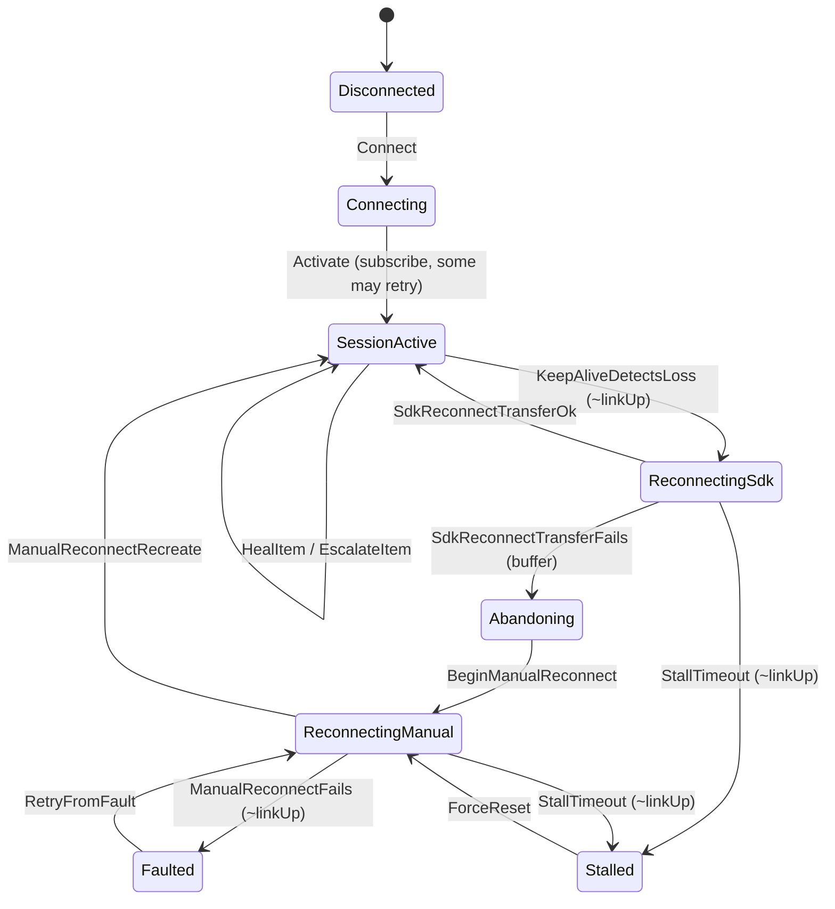

# OPC UA client lifecycle model

Prose companion to `OpcUaClient.tla`. The `.tla` file is the machine-checked
source of truth; this file explains it. Transitions are extracted from
`Namotion.Interceptor.OpcUa/Client`; invariants are stated independently.

The model captures the two correctness fixes from PR #359, both surfaced by this
formalization, and its mutation checks reproduce the pre-fix bugs:

1. A transiently-failed monitored item is kept for retry and escalated to
   polling if it keeps failing, never dropped and left dark.
2. Notifications are buffered from the moment a session is abandoned, so no stale
   value from the abandoned subscription is applied during the reconnect gap.

## State variables

- `state`: one of `Disconnected, Connecting, SessionActive, ReconnectingSdk,
  Abandoning, ReconnectingManual, Stalled, Faulted`.
- `linkUp`: adversary-controlled reachability of the server/link.
- `cover`: per item, its delivery coverage, one of `Subscribed` (live),
  `Retrying` (transiently failed, kept in the subscription for the health
  monitor), `Polling` (escalated to polling fallback, still covered), or
  `Orphaned` (dropped and lost, the fix-1 bug state, unreachable in the fixed
  model).
- `buffering`: updates are buffered during a manual reconnect or session abandon.
- `stalled`: a reconnect exceeded its deadline.

## Transitions



`linkUp` may drop and recover in any state (the adversary), so the diagram shows
the client's reactions rather than the link edges. When subscriptions are
(re)created, each item either subscribes or transiently fails into `Retrying`;
the health monitor then heals it back to `Subscribed` or escalates it to
`Polling`. A retryable item is never sent to `Orphaned`.

## Invariants (independent of the code)

- **NoOrphanedItem** (fix 1): in `SessionActive`, no item is `Orphaned`. A
  transiently-failed item is kept and healed or escalated, never dropped and left
  dark. Mutation-proven: sending transient failures to `Orphaned` (the pre-fix
  `FilterOutFailedMonitoredItemsAsync` behavior) makes TLC produce a
  counterexample.
- **BufferingOnlyDuringManualRecovery:** buffering is on only inside the manual
  recovery window (`Abandoning`, `ReconnectingManual`, `Faulted`, `Stalled`),
  never while `SessionActive` or during the SDK transfer path.
- **BufferingCoversAbandon** (fix 2): buffering is on from the moment of abandon
  (`Abandoning`). Mutation-proven: not buffering at abandon (the pre-fix
  `AbandonCurrentSession` behavior) leaves an `Abandoning` state with buffering
  off and TLC reports a violation.

## Liveness

- **Convergence:** if the link eventually stays up, the client eventually reaches
  `SessionActive` with every item covered (subscribed or escalated to polling)
  and stays there (`<>[]Converged`). Checked under weak fairness on the progress
  actions, including item escalation; the adversary and failure branches are left
  unfair. Mutation-proven: dropping fairness on escalation lets a `Retrying` item
  stay uncovered forever, and TLC reports a temporal violation. The weaker
  `<>Converged` is satisfied by the first activation and cannot detect a failure
  to re-converge after a reconnect; `<>[]Converged` can.

The model checks with `Items = {i1, i2}` and `PollingEnabled = TRUE` (the
default). With polling disabled the escalation action is unavailable and a
`Retrying` item stays until the node itself recovers, which is the best available
outcome rather than a bug.

## Deferred to iteration 2

Value-level convergence (per-item server and client values, notification
delivery, buffer-then-replay), plus multi-client conflict. A `lastChangeSeq` per
item will be introduced then.

## Running

From the repository root:

```bash
tools/tla/check-opcua.sh
```
