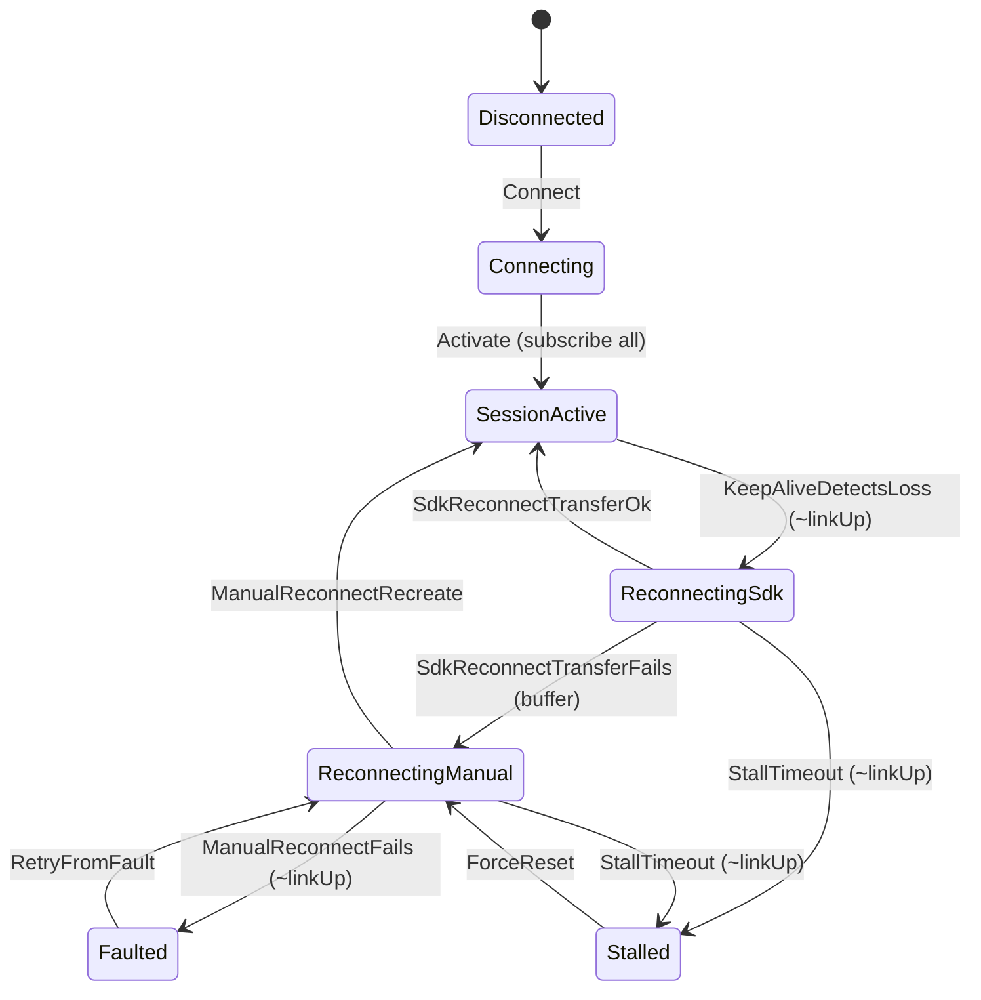

# OPC UA client lifecycle model

Prose companion to `OpcUaClient.tla`. The `.tla` file is the machine-checked
source of truth; this file explains it. Transitions are extracted from
`Namotion.Interceptor.OpcUa/Client`; invariants are stated independently.

## State variables

- `state`: one of `Disconnected, Connecting, SessionActive, ReconnectingSdk,
  ReconnectingManual, Stalled, Faulted`.
- `linkUp`: adversary-controlled reachability of the server/link.
- `subscribed`: per item, whether it is currently subscribed.
- `buffering`: updates are buffered during a manual reconnect.
- `stalled`: a reconnect exceeded its deadline.

## Transitions



`linkUp` may drop and recover in any state (the adversary), so the diagram shows
the client's reactions rather than the link edges.

## Invariants (independent of the code)

- **NoOrphanedItem:** in `SessionActive`, every item is subscribed. No monitored
  item is silently left unsubscribed after the client settles. This is what
  holds across the transfer-fails path: reaching `SessionActive` again requires
  every item re-subscribed, so a failed SDK transfer cannot orphan an item.
- **BufferingOnlyDuringManualRecovery:** buffering is on only while a manual
  reconnect is in flight (`ReconnectingManual`, `Faulted`, `Stalled`), never
  while `SessionActive`.

Both are mutation-proven: weakening the corresponding action makes TLC produce a
counterexample.

## Liveness

- **Convergence:** if the link eventually stays up, the client eventually
  reaches `SessionActive` with all items subscribed **and stays there**
  (`<>[]Converged`). The weaker "converges at least once" is satisfied by the
  first activation and cannot detect a failure to re-converge after a reconnect,
  so the stronger stay-converged form is used. Checked under weak fairness on the
  progress actions; the adversary (`LinkDrops`, `LinkRecovers`) and the failure
  branches are left unfair. Mutation-proven: dropping fairness on
  `ManualReconnectRecreate` makes TLC report a temporal violation.

## Deferred to iteration 2

Value-level convergence (per-item server and client values, notification
delivery, buffer-then-replay), plus polling, read-after-write, and multi-client
conflict. A `lastChangeSeq` per item will be introduced then.

## Running

From the repository root:

```bash
tools/tla/check-opcua.sh
```
