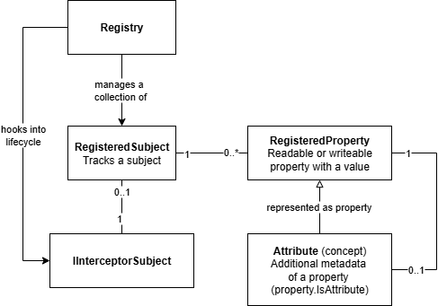

# Registry

The `Namotion.Interceptor.Registry` package provides a powerful tracking system that automatically discovers and manages interceptor subjects and their properties. It enables advanced features like property attributes (metadata attached to properties), dynamic property discovery, and hierarchical subject relationships. Unlike reflection-based approaches, the registry maintains full type safety while providing dynamic capabilities.



## Setup

Enable registry tracking in your interceptor context:

```csharp
var context = InterceptorSubjectContext
    .Create()
    .WithRegistry(); // Enables automatic subject and property tracking

var car = new Car(context);
```

The registry integrates with other interceptor features and automatically includes context inheritance to ensure child subjects participate in the registry.

## Accessing registry subjects and properties

Every subject provides access to its registry information:

```csharp
var tire = new Tire(context);
var registeredTire = tire.TryGetRegisteredSubject();

foreach (var prop in registeredTire.Properties)
{
    Console.WriteLine($"{prop.Name} ({prop.Type.Name})");
}
```

## Enumerate property attributes

The registry makes it easy to find metadata associated with properties:

```csharp
// Get all attributes for a specific property
var property = registered.TryGetProperty("Pressure");
foreach (var attribute in property!.Attributes)
{
    Console.WriteLine($"{attribute.AttributeMetadata.AttributeName}: {attribute.Reference.GetValue()}");
}
```

## Define attributes using properties

Property attributes solve the common problem of where to store metadata about your properties. Instead of external configuration or attributes that disappear at runtime, you can define metadata as actual properties:

```csharp
[InterceptorSubject]
public partial class Tire
{
    public partial decimal Pressure { get; set; }

    [PropertyAttribute(nameof(Pressure), "Minimum")]
    public partial decimal Pressure_Minimum { get; set; }

    [PropertyAttribute(nameof(Pressure), "Maximum")] 
    public partial decimal Pressure_Maximum { get; set; }
}
```

This pattern provides several benefits:

- **Type Safety**: Metadata is strongly typed
- **Trackable**: Changes to metadata are tracked like any other property
- **Bindable**: Metadata can be bound to external sources (MQTT, OPC UA, etc.)
- **Discoverable**: Metadata is accessible at runtime through the registry

## Dynamic property and attribute creation

The registry allows you to dynamically add properties and attributes to registered subjects at runtime. This enables building flexible systems that can extend object models programmatically.

### Add properties

Use `AddProperty` to create new trackable properties on a subject:

```csharp
var registered = subject.TryGetRegisteredSubject();

// Add a simple property with getter and setter
registered.AddProperty("DynamicValue", typeof(string),
    getValue: s => _dynamicStorage["DynamicValue"],
    setValue: (s, v) => _dynamicStorage["DynamicValue"] = v);

// Add a read-only property
registered.AddProperty("ReadOnlyInfo", typeof(DateTime),
    getValue: s => DateTime.Now,
    setValue: null);
```

Use `AddDerivedProperty` to create computed properties that automatically track dependencies:

```csharp
// Add a derived property that depends on other properties
registered.AddDerivedProperty("Status", typeof(string),
    getValue: s => s.IsActive ? "Running" : "Stopped",
    setValue: null);
```

Derived properties automatically participate in change tracking and will update when their dependencies change.

### Lifecycle tracking for dynamic properties

Dynamic properties (including derived) fully participate in lifecycle tracking when `WithLifecycle()` or `WithFullPropertyTracking()` is enabled. If a dynamic property holds a reference to another subject, that subject is automatically attached to the lifecycle graph with proper reference counting. For example, a `AddDerivedProperty<Tire>("FirstTire", ...)` that returns the first tire from a collection would give that tire a reference count of 2 — one from the collection property and one from the derived property.

When the underlying data changes, derived properties are re-evaluated and lifecycle tracking reconciles the old and new subjects automatically (attaching new subjects, detaching removed ones).

When a dynamic property is added, its initial value triggers a change event with `OldValue = null`, representing a transition from "property did not exist" to its initial value. This ensures interceptors (lifecycle, change tracking, etc.) correctly process the initial state.

### Add attributes

Use `AddAttribute` on any property to attach metadata dynamically:

```csharp
var pressureProperty = registered.Properties.First(p => p.Name == "Pressure");

// Add a unit attribute
pressureProperty.AddAttribute("Unit", typeof(string),
    getValue: s => "bar",
    setValue: null);

// Add validation attributes
pressureProperty.AddAttribute("MinValue", typeof(decimal),
    getValue: s => 0.0m,
    setValue: (s, v) => /* store min value */);
```

Use `AddDerivedAttribute` to create computed metadata that updates automatically:

```csharp
// Add a derived attribute that computes the maximum based on current value
pressureProperty.AddDerivedAttribute("DynamicMax", typeof(decimal),
    getValue: s => ((decimal)pressureProperty.Reference.GetValue()) * 1.5m,
    setValue: null);
```

This pattern is useful for creating adaptive metadata that changes based on the current state of your properties.

## Custom property initializers

Implement `ISubjectPropertyInitializer` in a .NET attribute to automatically add metadata attributes when properties are created:

```csharp
public class UnitAttribute : Attribute, ISubjectPropertyInitializer
{
    private readonly string _unit;

    public UnitAttribute(string unit) => _unit = unit;

    public void InitializeProperty(RegisteredSubjectProperty property)
    {
        property.AddAttribute("Unit", typeof(string), _ => _unit, null);
    }
}

// Usage - automatically creates a Unit attribute
[Unit("°C")]
public partial decimal Temperature { get; set; }
```

This pattern allows you to define reusable metadata behaviors that are automatically applied when subjects are registered.

## Subject IDs

The registry provides a subject ID system that assigns stable string identifiers to subjects. This is useful for protocol-level lookups where connectors (e.g., WebSocket) need to identify subjects by string IDs.

### Assign and retrieve IDs

Use `GetOrAddSubjectId` to lazily generate a stable 22-character base62-encoded ID, or `SetSubjectId` to assign a known ID **before** the subject has one:

```csharp
var context = InterceptorSubjectContext
    .Create()
    .WithFullPropertyTracking()
    .WithRegistry();

var car = new Car(context);

// Option A: Generate a stable ID on first call, return the same ID on subsequent calls
var id = car.GetOrAddSubjectId(); // e.g. "5Gk3mR7pLqWx9nYvBtHz01"

// Option B: Assign a known ID (e.g., from an incoming protocol message)
// Must be called before the subject has an ID; reassignment throws.
var car2 = new Car(context);
car2.SetSubjectId("my-car-001");
```

### Look up subjects by ID

Use `ISubjectIdRegistry` to look up subjects by their assigned ID:

```csharp
var idRegistry = context.GetService<ISubjectIdRegistry>();
if (idRegistry.TryGetSubjectById("my-car-001", out var subject))
{
    // subject is the Car instance
}
```

### Lifecycle integration

Subject IDs are automatically managed during the subject lifecycle:

- **On attach**: If a subject already has an ID (e.g., set before attachment), it is auto-registered in the reverse index. If the ID conflicts with an existing subject, registration is silently skipped to avoid aborting the lifecycle.
- **On detach**: The reverse index entry is automatically cleaned up.
- **Immutability**: Once a subject has an ID, calling `SetSubjectId` with a **different** ID throws an `InvalidOperationException`. Calling with the **same** ID is a no-op. This prevents accidental identity changes that could corrupt the object graph.
- **Duplicate prevention**: Calling `SetSubjectId` with an ID that is already in use by a different subject throws an `InvalidOperationException`.

### Without a registry

Subject IDs also work without a registry configured — IDs are stored directly in the subject's `Data` dictionary. However, the reverse index lookup (`TryGetSubjectById`) requires a registry.
