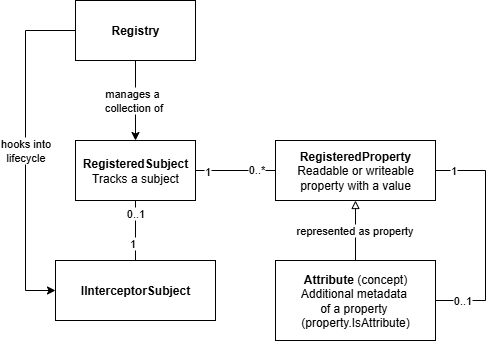

# Registry

The `Namotion.Interceptor.Registry` package provides a powerful tracking system that automatically discovers and manages interceptor subjects and their properties. It enables advanced features like property attributes (metadata attached to properties), dynamic property discovery, and hierarchical subject relationships. Unlike reflection-based approaches, the registry maintains full type safety while providing dynamic capabilities.



## Setup

Enable registry tracking in your interceptor context:

```csharp
var context = InterceptorSubjectContext
    .Create()
    .WithRegistry(); // Enables automatic subject and property tracking

var car = new Car(context);
```

The registry integrates with other interceptor features and automatically includes context inheritance to ensure child subjects participate in the registry.

## Accessing registry subjects and properties

Every subject provides access to its registry information:

```csharp
var tire = new Tire(context);
var registeredTire = tire.TryGetRegisteredSubject();

foreach (var prop in registeredTire.Properties)
{
    Console.WriteLine($"{prop.Name} ({prop.Type.Name})");
}
```

You can also resolve a specific registered property from a strongly-typed expression, including nested paths across subjects:

```csharp
// Direct property
var pressureProperty = tire.TryGetRegisteredProperty(t => t.Pressure);

// Nested path, including collection or dictionary segments
var frontPressureProperty = car.TryGetRegisteredProperty(c => c.Tires[0].Pressure);
```

Member-access hops resolve through the registry; index and dictionary segments evaluate against the object graph. The lookup is null-safe either way: if a subject along the path is null or not tracked by the registry, the method returns `null` instead of throwing.

### Structural child relationships

A property which holds subjects exposes its outgoing relationships as `Children`. Each entry carries the child subject and the `Index` of that exact occurrence: a position for a collection, a key for a dictionary, or `null` for a direct subject reference.

```csharp
var tiresProperty = car.TryGetRegisteredProperty(c => c.Tires)!;

foreach (var child in tiresProperty.Children)
{
    Console.WriteLine($"{child.Index}: {child.Subject}");
}
```

Relationships preserve occurrences rather than distinct subjects. If the same subject appears under two dictionary keys or at two collection positions, `Children` contains two entries. The child's `RegisteredSubject.Parents` and tracking `GetParents()` results likewise contain both incoming relationships. Removing one occurrence removes only its relationship. The child loses its membership in that property only when the final occurrence is removed.

The exact outgoing order is the source enumeration order:

- A direct subject produces one relationship with `Index == null`.
- An `IDictionary` produces subject-valued entries with the exact keys returned by its enumerator. Reconciliation treats those keys as opaque metadata and does not call their equality or hash implementations.
- A declared read-only dictionary shape uses the keys from its enumerated `KeyValuePair<,>` values.
- Other supported collections and enumerables use zero-based enumeration positions. Positions occupied by non-subject values still count, although those values do not produce relationships.
- `null`, strings, non-subject values, and unsupported values produce no relationship.

Within one parent property, incoming `Parents` and `GetParents()` entries retain that same occurrence order. Parent-property groups retain their attachment order, so reconciling one property does not reorder relationships contributed by other properties.

### Membership and reference counts

Relationship occurrences and lifecycle membership are deliberately different. `GetReferenceCount()` and `RegisteredSubject.ReferenceCount` count parent-property lifecycle references, not `Children` or `Parents` entries. Within one lifecycle interceptor, repeated occurrences of the same child in one property contribute one reference. The first occurrence creates the membership and the final removal removes it. Different parent properties each contribute their own reference. When a context resolves several lifecycle interceptors, each interceptor can contribute once for the same membership.

Code that needs a distinct membership count must therefore group relationships by parent property and child subject using subject reference identity. `Children.Length`, `Parents.Length`, and `GetParents().Length` are occurrence counts.

### Reconciliation and in-place mutation

Assigning a structural property reconciles it from one complete enumeration of its current backing value. Assigning the same non-string enumerable instance is an explicit structural refresh. When value-equality tracking suppresses that equal assignment, the backing setter is not called and normal value-change, derived-change, transaction, and connector-write notifications remain suppressed, but structural relationships are still reconciled. Without value-equality tracking, the normal setter runs and lifecycle processing still reconciles the structure.

An in-place mutation with no intercepted property assignment remains invisible. Reassign the same container instance, or preferably assign an immutable replacement, to publish the new structure. Detach uses the last successfully reconciled state, so an invisible mutation cannot change which memberships are detached. The library also cannot make a user collection safe when another thread mutates it during enumeration. Applications must synchronize such access or use immutable replacements.

If enumeration fails, the exception propagates and relationship metadata remains at its previous coherent generation. A later successful assignment can retry reconciliation.

### Snapshots, paths, and concurrency

`RegisteredSubjectProperty.Children`, `RegisteredSubject.Parents`, and `GetParents()` return immutable point-in-time snapshots. A previously returned array never changes after a later reorder, re-key, attach, or detach. Read the property again to obtain the current generation.

Writers are serialized by lifecycle tracking and relationship views are published as coherent immutable generations. A reader overlapping a write can observe the previous generation or a newer generation, but never a partially initialized array or new indices combined with an old order. The different child and parent views are not one graph-wide transaction and may briefly show different generations during a write. After intercepted writes, attach operations, and detach operations finish, the views converge to the last successfully enumerated structure. This is a quiescent-consistency guarantee. It assumes no structural operation is still in progress and no unassigned in-place mutation has occurred since the last successful reconciliation.

Singular Registry path APIs are deterministic when a subject has several incoming relationships. Without an explicit root, `TryGetPath()` follows the first current parent relationship. With an explicit root, it performs a depth-first search and returns the first relationship sequence that reaches that root. Duplicate occurrences within one property are considered in current source enumeration order, so the first occurrence wins. The Registry does not provide an API that returns every possible path.

### Relationship handler API

`IPropertyLifecycleHandler` now handles property attach and detach only. Its former `RefreshCollectionProperty(PropertyReference, object?)` method has been removed. Custom consumers of structural relationships should implement `IPropertyRelationshipHandler.ReconcileChildRelationships`. Each successful reconciliation supplies the complete ordered sequence of immutable `SubjectPropertyRelationship` occurrences, and property detach supplies an empty sequence. Consumers should replace their property group from that sequence rather than treating the callback as an incremental index update.

## Enumerate property attributes

The registry makes it easy to find metadata associated with properties:

```csharp
// Get all attributes for a specific property
var property = registered.TryGetProperty("Pressure");
foreach (var attribute in property!.Attributes)
{
    Console.WriteLine($"{attribute.AttributeMetadata.AttributeName}: {attribute.GetValue()}");
}
```

## Define attributes using properties

Property attributes solve the common problem of where to store metadata about your properties. Instead of external configuration or attributes that disappear at runtime, you can define metadata as actual properties:

```csharp
[InterceptorSubject]
public partial class Tire
{
    public partial decimal Pressure { get; set; }

    [PropertyAttribute(nameof(Pressure), "Minimum")]
    public partial decimal Pressure_Minimum { get; set; }

    [PropertyAttribute(nameof(Pressure), "Maximum")] 
    public partial decimal Pressure_Maximum { get; set; }
}
```

This pattern provides several benefits:

- **Type Safety**: Metadata is strongly typed
- **Trackable**: Changes to metadata are tracked like any other property
- **Bindable**: Metadata can be bound to external sources (MQTT, OPC UA, etc.)
- **Discoverable**: Metadata is accessible at runtime through the registry

## Dynamic property and attribute creation

The registry allows you to dynamically add properties and attributes to registered subjects at runtime. This enables building flexible systems that can extend object models programmatically.

### Add properties

Use `AddProperty` to create new trackable properties on a subject:

```csharp
var registered = subject.TryGetRegisteredSubject();

// Add a simple property with getter and setter
registered.AddProperty("DynamicValue", typeof(string),
    getValue: s => _dynamicStorage["DynamicValue"],
    setValue: (s, v) => _dynamicStorage["DynamicValue"] = v);

// Add a read-only property
registered.AddProperty("ReadOnlyInfo", typeof(DateTime),
    getValue: s => DateTime.Now,
    setValue: null);
```

Use `AddDerivedProperty` to create computed properties that automatically track dependencies:

```csharp
// Add a derived property that depends on other properties
registered.AddDerivedProperty("Status", typeof(string),
    getValue: s => s.IsActive ? "Running" : "Stopped",
    setValue: null);
```

Derived properties automatically participate in change tracking and will update when their dependencies change.

### Lifecycle tracking for dynamic properties

Dynamic properties (including derived) fully participate in lifecycle tracking when `WithLifecycle()` or `WithFullPropertyTracking()` is enabled. If a dynamic property holds a reference to another subject, that subject is automatically attached to the lifecycle graph with proper reference counting. For example, a `AddDerivedProperty<Tire>("FirstTire", ...)` that returns the first tire from a collection would give that tire a reference count of 2: one from the collection property and one from the derived property.

When the underlying data changes, derived properties are re-evaluated and lifecycle tracking reconciles the old and new subjects automatically (attaching new subjects, detaching removed ones).

When a dynamic property is added, its initial value triggers a change event with `OldValue = null`, representing a transition from "property did not exist" to its initial value. This ensures interceptors (lifecycle, change tracking, etc.) correctly process the initial state.

### Add attributes

Use `AddAttribute` on any property to attach metadata dynamically:

```csharp
var pressureProperty = registered.Properties.First(p => p.Name == "Pressure");

// Add a unit attribute
pressureProperty.AddAttribute("Unit", typeof(string),
    getValue: s => "bar",
    setValue: null);

// Add validation attributes
pressureProperty.AddAttribute("MinValue", typeof(decimal),
    getValue: s => 0.0m,
    setValue: (s, v) => /* store min value */);
```

Use `AddDerivedAttribute` to create computed metadata that updates automatically:

```csharp
// Add a derived attribute that computes the maximum based on current value
pressureProperty.AddDerivedAttribute("DynamicMax", typeof(decimal),
    getValue: s => ((decimal)pressureProperty.GetValue()!) * 1.5m,
    setValue: null);
```

This pattern is useful for creating adaptive metadata that changes based on the current state of your properties.

## Custom property initializers

Implement `ISubjectPropertyInitializer` to automatically add metadata attributes when properties are attached. There are two ways to register an initializer:

**As an attribute.** When you own the attribute class, implement the interface directly on it:

```csharp
public class UnitAttribute : Attribute, ISubjectPropertyInitializer
{
    private readonly string _unit;

    public UnitAttribute(string unit) => _unit = unit;

    public void InitializeProperty(RegisteredSubjectProperty property)
    {
        property.AddAttribute("Unit", typeof(string), _ => _unit, null);
    }
}

// Automatically creates a "Unit" attribute when the property is registered
[Unit("°C")]
public partial decimal Temperature { get; set; }
```

**As a global initializer.** Register an `ISubjectPropertyInitializer` on the context to run for every property that gets attached. This allows initialization based on any source, e.g. reflection attributes or external configuration.

```csharp
public class DefaultValueInitializer : ISubjectPropertyInitializer
{
    public void InitializeProperty(RegisteredSubjectProperty property)
    {
        var attribute = property.ReflectionAttributes
            .OfType<DefaultValueAttribute>()
            .FirstOrDefault();

        if (attribute is not null)
        {
            property.AddAttribute("DefaultValue", property.Type,
                _ => attribute.Value, null);
        }
    }
}

var context = InterceptorSubjectContext
    .Create()
    .WithFullPropertyTracking();

context.AddService<ISubjectPropertyInitializer>(new DefaultValueInitializer());
```

## Subject IDs

The registry provides a subject ID system that assigns stable string identifiers to subjects. This is useful for protocol-level lookups where connectors (e.g., WebSocket) need to identify subjects by string IDs.

### Assign and retrieve IDs

Use `GetOrAddSubjectId` to lazily generate a stable 22-character base62-encoded ID, or `SetSubjectId` to assign a known ID **before** the subject has one:

```csharp
var context = InterceptorSubjectContext
    .Create()
    .WithFullPropertyTracking()
    .WithRegistry();

var car = new Car(context);

// Option A: Generate a stable ID on first call, return the same ID on subsequent calls
var id = car.GetOrAddSubjectId(); // e.g. "5Gk3mR7pLqWx9nYvBtHz01"

// Option B: Assign a known ID (e.g., from an incoming protocol message)
// Must be called before the subject has an ID; reassignment throws.
var car2 = new Car(context);
car2.SetSubjectId("my-car-001");
```

### Look up subjects by ID

Use `ISubjectIdRegistry` to look up subjects by their assigned ID:

```csharp
var idRegistry = context.GetService<ISubjectIdRegistry>();
if (idRegistry.TryGetSubjectById("my-car-001", out var subject))
{
    // subject is the Car instance
}
```

### ID assignment rules

- **Immutable after first assignment**: Once a subject has an ID, calling `SetSubjectId` with a *different* ID throws `InvalidOperationException`. This prevents accidental ID conflicts in concurrent scenarios.
- **Same-ID is a no-op**: Calling `SetSubjectId` with the same ID that is already assigned is safe and does nothing.
- **Unique across subjects**: Calling `SetSubjectId` with an ID that is already in use by a different subject throws `InvalidOperationException`.

### Lifecycle integration

Subject IDs are automatically managed during the subject lifecycle:

- **On attach**: If a subject already has an ID (e.g., set before attachment), it is auto-registered in the reverse index. If the ID conflicts with an existing subject, registration is silently skipped to avoid aborting the lifecycle.
- **On detach**: The reverse index entry is automatically cleaned up.
- **Deferred reverse-index registration**: `SetSubjectId` and `GetOrAddSubjectId` only store the ID in the subject's `Data` dictionary until the subject is attached to the graph via the lifecycle. The reverse index (`TryGetSubjectById`) is populated by the lifecycle attach handler, preventing orphaned index entries for subjects that are never attached.

### Without a registry

Subject IDs also work without a registry configured. IDs are stored directly in the subject's `Data` dictionary. However, the reverse index lookup (`TryGetSubjectById`) requires a registry.
