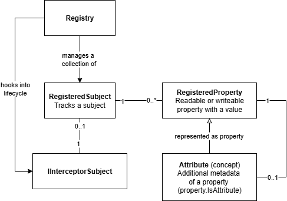

# Registry

The Registry package provides a powerful tracking system that automatically discovers and manages interceptor subjects and their properties. It enables advanced features like property attributes (metadata attached to properties), dynamic property discovery, and hierarchical subject relationships. Unlike reflection-based approaches, the registry maintains full type safety while providing dynamic capabilities.



## Setup

Enable registry tracking in your interceptor context:

```csharp
var context = InterceptorSubjectContext
    .Create()
    .WithRegistry(); // Enables automatic subject and property tracking

var car = new Car(context);
```

The registry integrates with other interceptor features and automatically includes context inheritance to ensure child subjects participate in the registry.

## Define attributes

Property attributes solve the common problem of where to store metadata about your properties. Instead of external configuration or attributes that disappear at runtime, you can define metadata as actual properties:

```csharp
[InterceptorSubject]
public partial class Tire
{
    public partial decimal Pressure { get; set; }

    [PropertyAttribute(nameof(Pressure), "Minimum")]
    public partial decimal Pressure_Minimum { get; set; }

    [PropertyAttribute(nameof(Pressure), "Maximum")] 
    public partial decimal Pressure_Maximum { get; set; }
}
```

This pattern provides several benefits:

- **Type Safety**: Metadata is strongly typed
- **Trackable**: Changes to metadata are tracked like any other property
- **Bindable**: Metadata can be bound to external sources (MQTT, OPC UA, etc.)
- **Discoverable**: Metadata is accessible at runtime through the registry

## Dynamic property and attribute creation

The registry allows you to dynamically add properties and attributes to registered subjects at runtime. This enables building flexible systems that can extend object models programmatically.

### Add properties

Use `AddProperty` to create new trackable properties on a subject:

```csharp
var registered = subject.TryGetRegisteredSubject();

// Add a simple property with getter and setter
registered.AddProperty("DynamicValue", typeof(string),
    getValue: s => _dynamicStorage["DynamicValue"],
    setValue: (s, v) => _dynamicStorage["DynamicValue"] = v);

// Add a read-only property
registered.AddProperty("ReadOnlyInfo", typeof(DateTime),
    getValue: s => DateTime.Now,
    setValue: null);
```

Use `AddDerivedProperty` to create computed properties that automatically track dependencies:

```csharp
// Add a derived property that depends on other properties
registered.AddDerivedProperty("Status", typeof(string),
    getValue: s => s.IsActive ? "Running" : "Stopped",
    setValue: null);
```

Derived properties automatically participate in change tracking and will update when their dependencies change.

### Add attributes

Use `AddAttribute` on any property to attach metadata dynamically:

```csharp
var pressureProperty = registered.Properties.First(p => p.Name == "Pressure");

// Add a unit attribute
pressureProperty.AddAttribute("Unit", typeof(string),
    getValue: s => "bar",
    setValue: null);

// Add validation attributes
pressureProperty.AddAttribute("MinValue", typeof(decimal),
    getValue: s => 0.0m,
    setValue: (s, v) => /* store min value */);
```

Use `AddDerivedAttribute` to create computed metadata that updates automatically:

```csharp
// Add a derived attribute that computes the maximum based on current value
pressureProperty.AddDerivedAttribute("DynamicMax", typeof(decimal),
    getValue: s => ((decimal)pressureProperty.Reference.GetValue()) * 1.5m,
    setValue: null);
```

This pattern is useful for creating adaptive metadata that changes based on the current state of your properties.

## Accessing registry subjects and properties

Every subject provides access to its registry information:

```csharp
var tire = new Tire(context);
var registeredTire = tire.TryGetRegisteredSubject();

foreach (var prop in registeredTire.Properties)
{
    Console.WriteLine($"{prop.Name} ({prop.Type.Name})");
}
```

## Enumerate property attributes

The registry makes it easy to find metadata associated with properties:

```csharp
// Get all attributes for a specific property
var property = registered.TryGetProperty("Pressure");
foreach (var attribute in property!.Attributes)
{
    Console.WriteLine($"{attribute.AttributeMetadata.AttributeName}: {attribute.Reference.GetValue()}");
}
```

## Custom property initializers

Implement `ISubjectPropertyInitializer` in a .NET attribute to automatically add metadata attributes when properties are created:

```csharp
public class UnitAttribute : Attribute, ISubjectPropertyInitializer
{
    private readonly string _unit;

    public UnitAttribute(string unit) => _unit = unit;

    public void InitializeProperty(RegisteredSubjectProperty property)
    {
        property.AddAttribute("Unit", typeof(string), _ => _unit, null);
    }
}

// Usage - automatically creates a Unit attribute
[Unit("°C")]
public partial decimal Temperature { get; set; }
```

This pattern allows you to define reusable metadata behaviors that are automatically applied when subjects are registered.

## Thread safety mutations

The registry provides thread-safe access to all data and includes a synchronization mechanism for updates:

```csharp
var registry = context.GetRequiredService<ISubjectRegistry>();
registry.ExecuteSubjectUpdate(() => {
    // All updates here are synchronized
    tire.Pressure = 2.5m;
    tire.Pressure_Minimum = 2.0m;
});
```

This ensures consistent state when multiple threads are modifying subjects or when the registry needs to update its internal tracking structures.
