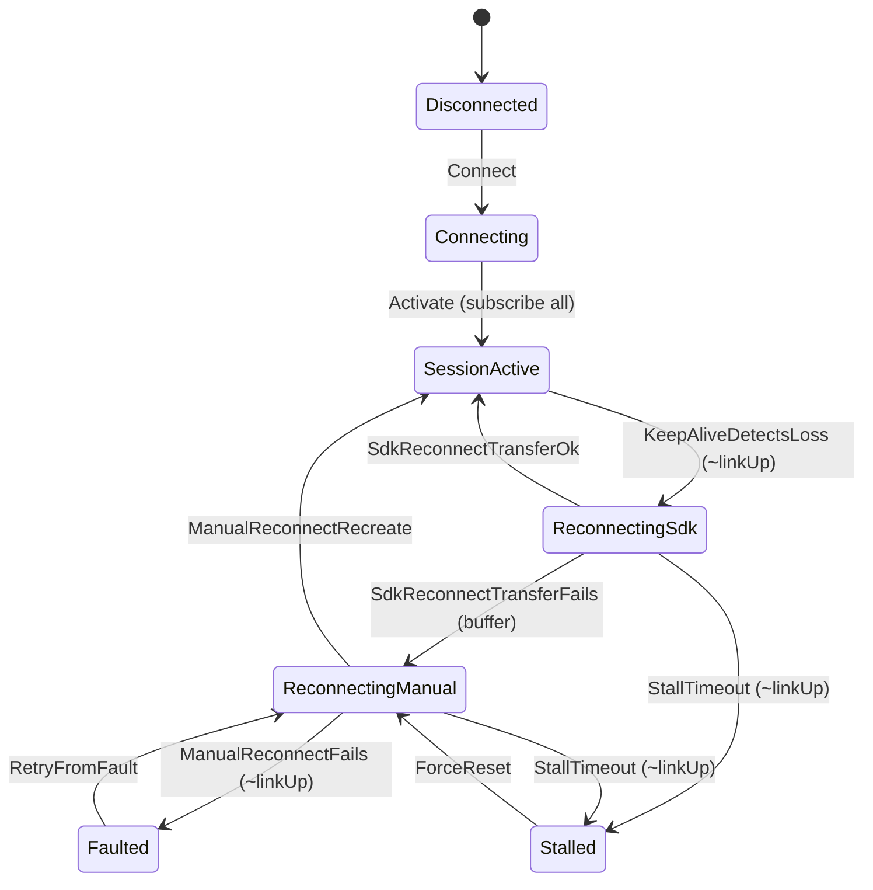

# OPC UA Client Formal Model (Iteration 1, Phase 1) Implementation Plan

> **For agentic workers:** REQUIRED SUB-SKILL: Use superpowers:subagent-driven-development (recommended) or superpowers:executing-plans to implement this plan task-by-task. Steps use checkbox (`- [ ]`) syntax for tracking.

**Goal:** Build a TLC-model-checked TLA+ model of the OPC UA client's session and subscription lifecycle, with a readable narrative and a reusable formal-modeling process doc.

**Architecture:** Extract the client's real state machine (from `Namotion.Interceptor.OpcUa/Client`) as a small abstract model, and assert correctness properties stated independently of the code (from OPC UA semantics and the reliability bar). Build the model incrementally: each task adds a slice of behavior and re-runs TLC, so every addition is exhaustively checked. Safety invariants first, then a liveness property under fairness.

**Tech Stack:** TLA+ / TLC (already set up rootless under `tools/tla/`, TLC 2.19 on Temurin JRE 17). No C# changes in this phase.

**Scope note:** This is Phase 1 of iteration 1. Phase 2 (trace validation: instrument the C# client, run the integration suite to emit traces, check them against this model with TLC) gets its **own plan**, written after this model is locked, because the trace-checking spec must match this model's final variables and actions. See the design spec `docs/superpowers/specs/2026-07-07-opcua-client-formal-model-design.md`.

**Prerequisite already in place:** `tools/tla/bootstrap.sh` and `tools/tla/tlc` exist and pass `tools/tla/tlc selftest/Smoke.tla`. If a fresh checkout, run `tools/tla/bootstrap.sh` once first.

---

## File Structure

- Create: `docs/formal/README.md` — the durable, reusable process doc (the two verification modes, the extract-transitions-write-invariants-independently rule, file layout, TLC commands, how to read a counterexample, the per-iteration loop). Stubbed in Task 1, filled in Task 7.
- Create: `docs/formal/opcua-client/OpcUaClient.tla` — the machine-checked model (built up across Tasks 2 to 6).
- Create: `docs/formal/opcua-client/OpcUaClient.cfg` — the TLC configuration (grown across Tasks 2, 4, 6).
- Create: `docs/formal/opcua-client/OpcUaClient.md` — the prose narrative plus a Mermaid state diagram (Task 7).
- Create: `tools/tla/check-opcua.sh` — a convenience runner for the model (Task 7).
- Modify: `.gitignore` — ignore TLC scratch under `docs/formal/**/states/` (Task 1).

Each task ends in a committable, TLC-green state.

---

### Task 1: Scaffold docs/formal and the process doc stub

**Files:**
- Create: `docs/formal/README.md`
- Create: `docs/formal/opcua-client/.gitkeep`
- Modify: `.gitignore`

- [ ] **Step 1: Create the process doc stub**

Create `docs/formal/README.md`:

```markdown
# Formal models

Machine-checked TLA+ models of concurrency- and failure-sensitive parts of this
repo, plus the process for authoring and maintaining them. Run with the rootless
toolchain in `tools/tla/` (see `tools/tla/README.md`).

## Two verification modes

1. **Model-check the design (TLC).** An abstract model (state variables and
   allowed transitions) plus correctness properties. TLC enumerates every
   reachable state within bounds and returns a counterexample on violation.
   Finds design bugs; needs no code and no tests.
2. **Trace-validate the code.** Instrument the implementation to emit a trace of
   abstract state transitions, run the test suite to generate traces, and check
   each trace is a legal behavior of the model. Binds code to the checked design,
   but only on executions the tests exercise.

They are complementary: model-checking is exhaustive over the model; trace
validation confirms the code matches the model on sampled runs.

## The rule that keeps it honest

Extract the transitions from the code (faithfully, including its warts), but
write the invariants independently (from requirements, never from the code). An
invariant derived from the code only confirms "the code does what the code does".

## Models

- `opcua-client/` — OPC UA client session and subscription lifecycle.

## Running a model

<!-- Filled in Task 7 with exact commands. -->

## Reading a counterexample

<!-- Filled in Task 7. -->

## The per-iteration loop

<!-- Filled in Task 7. -->
```

- [ ] **Step 2: Keep the model directory and ignore TLC scratch**

Create an empty `docs/formal/opcua-client/.gitkeep`.

Append to `.gitignore`:

```
# TLC scratch output under formal models
docs/formal/**/states/
```

- [ ] **Step 3: Commit**

```bash
git add docs/formal/.gitignore .gitignore
git add docs/formal/README.md docs/formal/opcua-client/.gitkeep
git commit -m "docs(formal): scaffold formal models directory and process doc stub"
```

---

### Task 2: Base lifecycle model (connect, activate, adversary link) with the no-orphaned-item invariant

**Files:**
- Create: `docs/formal/opcua-client/OpcUaClient.tla`
- Create: `docs/formal/opcua-client/OpcUaClient.cfg`

The model declares all five state variables from the start (even ones unused until later tasks) so later tasks add actions without rewriting `Init`, `vars`, or `TypeOK`. `buffering` and `stalled` stay `FALSE` until Tasks 4 and 5 use them.

- [ ] **Step 1: Write the base model**

Create `docs/formal/opcua-client/OpcUaClient.tla`:

```tla
---- MODULE OpcUaClient ----
\* Abstract model of the OPC UA client session and subscription lifecycle.
\* Transitions are extracted from Namotion.Interceptor.OpcUa/Client; invariants
\* are stated independently from OPC UA semantics and the reliability bar.
EXTENDS Naturals

CONSTANT Items          \* set of monitored item ids, e.g. {i1, i2}

VARIABLES
    state,              \* session lifecycle state
    linkUp,             \* adversary: server/link reachable
    subscribed,         \* [Items -> BOOLEAN]: which items are subscribed now
    buffering,          \* updates buffered during a manual reconnect
    stalled             \* reconnect deadline exceeded (Stalled bookkeeping)

vars == << state, linkUp, subscribed, buffering, stalled >>

States == { "Disconnected", "Connecting", "SessionActive",
            "ReconnectingSdk", "ReconnectingManual", "Stalled", "Faulted" }

AllSubscribed   == \A i \in Items : subscribed[i]
NoneSubscribed  == [i \in Items |-> FALSE]
EverySubscribed == [i \in Items |-> TRUE]

TypeOK ==
    /\ state \in States
    /\ linkUp \in BOOLEAN
    /\ subscribed \in [Items -> BOOLEAN]
    /\ buffering \in BOOLEAN
    /\ stalled \in BOOLEAN

Init ==
    /\ state = "Disconnected"
    /\ linkUp = TRUE
    /\ subscribed = NoneSubscribed
    /\ buffering = FALSE
    /\ stalled = FALSE

\* --- Adversary: the link may drop and later recover in any state ---
LinkDrops ==
    /\ linkUp
    /\ linkUp' = FALSE
    /\ UNCHANGED << state, subscribed, buffering, stalled >>

LinkRecovers ==
    /\ ~linkUp
    /\ linkUp' = TRUE
    /\ UNCHANGED << state, subscribed, buffering, stalled >>

\* --- Initial connect and activation (session + create subscriptions) ---
Connect ==
    /\ state = "Disconnected"
    /\ linkUp
    /\ state' = "Connecting"
    /\ UNCHANGED << linkUp, subscribed, buffering, stalled >>

Activate ==
    /\ state = "Connecting"
    /\ linkUp
    /\ state' = "SessionActive"
    /\ subscribed' = EverySubscribed
    /\ UNCHANGED << linkUp, buffering, stalled >>

Next ==
    \/ LinkDrops \/ LinkRecovers
    \/ Connect \/ Activate

Spec == Init /\ [][Next]_vars

\* ---------------- Invariants (independent of the code) ----------------
NoOrphanedItem == (state = "SessionActive") => AllSubscribed
====
```

- [ ] **Step 2: Write the TLC config**

Create `docs/formal/opcua-client/OpcUaClient.cfg`:

```
CONSTANT Items = {i1, i2}
SPECIFICATION Spec
INVARIANT TypeOK
INVARIANT NoOrphanedItem
```

- [ ] **Step 3: Run TLC and verify it passes**

Run:

```bash
( cd docs/formal/opcua-client && ../../../tools/tla/tlc OpcUaClient.tla )
```

Expected: `Model checking completed. No error has been found.`

- [ ] **Step 4: Prove the invariant has teeth (mutation check)**

Temporarily break `Activate` so it activates without subscribing. Change its `subscribed'` line to:

```tla
    /\ subscribed' = NoneSubscribed
```

Run the same command. Expected: `Error: Invariant NoOrphanedItem is violated.` followed by a two-state counterexample (Disconnected then SessionActive with nothing subscribed). This confirms the invariant is not vacuous.

Then revert the line back to `/\ subscribed' = EverySubscribed` and re-run; expected `No error has been found.`

- [ ] **Step 5: Clean scratch and commit**

```bash
rm -rf docs/formal/opcua-client/states
git add docs/formal/opcua-client/OpcUaClient.tla docs/formal/opcua-client/OpcUaClient.cfg
git rm --cached docs/formal/opcua-client/.gitkeep 2>/dev/null || true
rm -f docs/formal/opcua-client/.gitkeep
git commit -m "feat(formal): base OPC UA client lifecycle model with no-orphaned-item invariant"
```

---

### Task 3: SDK auto-reconnect with subscription transfer

Adds the keep-alive loss detection and the SDK reconnect path where subscriptions are transferred (kept) across the new session. Anchors: `SessionManager.OnKeepAlive` / `OnReconnectComplete`.

**Files:**
- Modify: `docs/formal/opcua-client/OpcUaClient.tla`

- [ ] **Step 1: Add the two actions**

In `OpcUaClient.tla`, add these actions after `Activate`:

```tla
\* --- SDK keep-alive notices the link is gone ---
KeepAliveDetectsLoss ==
    /\ state = "SessionActive"
    /\ ~linkUp
    /\ state' = "ReconnectingSdk"
    /\ UNCHANGED << linkUp, subscribed, buffering, stalled >>

\* --- SDK auto-reconnect: subscriptions transferred to the new session ---
SdkReconnectTransferOk ==
    /\ state = "ReconnectingSdk"
    /\ linkUp
    /\ state' = "SessionActive"
    /\ subscribed' = EverySubscribed
    /\ UNCHANGED << linkUp, buffering, stalled >>
```

- [ ] **Step 2: Add them to `Next`**

Replace the `Next` definition with:

```tla
Next ==
    \/ LinkDrops \/ LinkRecovers
    \/ Connect \/ Activate
    \/ KeepAliveDetectsLoss
    \/ SdkReconnectTransferOk
```

- [ ] **Step 3: Run TLC and verify it passes**

Run:

```bash
( cd docs/formal/opcua-client && ../../../tools/tla/tlc OpcUaClient.tla )
```

Expected: `Model checking completed. No error has been found.` The reachable state count is larger than Task 2 (the `ReconnectingSdk` state now appears).

- [ ] **Step 4: Clean scratch and commit**

```bash
rm -rf docs/formal/opcua-client/states
git add docs/formal/opcua-client/OpcUaClient.tla
git commit -m "feat(formal): add SDK auto-reconnect with subscription transfer"
```

---

### Task 4: Transfer-fails and manual reconnect with buffering

Adds the path where the SDK transfer fails (server restart), old subscriptions are lost, and a manual reconnect recreates them from scratch while buffering updates. Anchors: `SessionManager` transfer-failure branch and `OpcUaSubjectClientSource.ReconnectSessionAsync`. Introduces the `BufferingOnlyDuringManualRecovery` invariant, which only gains teeth now that `buffering` becomes true.

**Files:**
- Modify: `docs/formal/opcua-client/OpcUaClient.tla`
- Modify: `docs/formal/opcua-client/OpcUaClient.cfg`

- [ ] **Step 1: Add the two actions**

In `OpcUaClient.tla`, add after `SdkReconnectTransferOk`:

```tla
\* --- SDK auto-reconnect: transfer fails, fall to manual recreate ---
SdkReconnectTransferFails ==
    /\ state = "ReconnectingSdk"
    /\ linkUp
    /\ state' = "ReconnectingManual"
    /\ subscribed' = NoneSubscribed      \* old subscriptions lost
    /\ buffering' = TRUE
    /\ UNCHANGED << linkUp, stalled >>

\* --- Manual reconnect recreates subscriptions from scratch ---
ManualReconnectRecreate ==
    /\ state = "ReconnectingManual"
    /\ linkUp
    /\ state' = "SessionActive"
    /\ subscribed' = EverySubscribed
    /\ buffering' = FALSE
    /\ UNCHANGED << linkUp, stalled >>
```

- [ ] **Step 2: Add them to `Next`**

Replace `Next` with:

```tla
Next ==
    \/ LinkDrops \/ LinkRecovers
    \/ Connect \/ Activate
    \/ KeepAliveDetectsLoss
    \/ SdkReconnectTransferOk \/ SdkReconnectTransferFails
    \/ ManualReconnectRecreate
```

- [ ] **Step 3: Add the buffering invariant**

At the end of the module (after `NoOrphanedItem`), add:

```tla
BufferingOnlyDuringManualRecovery ==
    buffering => state \in { "ReconnectingManual", "Faulted", "Stalled" }
```

- [ ] **Step 4: Register the invariant in the config**

Add to `OpcUaClient.cfg` under the existing invariants:

```
INVARIANT BufferingOnlyDuringManualRecovery
```

- [ ] **Step 5: Run TLC and verify it passes**

Run:

```bash
( cd docs/formal/opcua-client && ../../../tools/tla/tlc OpcUaClient.tla )
```

Expected: `Model checking completed. No error has been found.`

- [ ] **Step 6: Prove the buffering invariant has teeth (mutation check)**

Temporarily change `ManualReconnectRecreate` to not clear buffering: replace its `buffering' = FALSE` line with `UNCHANGED buffering` (and remove `buffering` from... note it is not in the UNCHANGED tuple, so change the last line to `/\ UNCHANGED << linkUp, buffering, stalled >>` and delete the `buffering' = FALSE` conjunct). Run TLC.

Expected: `Error: Invariant BufferingOnlyDuringManualRecovery is violated.` (a `SessionActive` state with `buffering = TRUE`).

Then revert: restore `/\ buffering' = FALSE` and `/\ UNCHANGED << linkUp, stalled >>`, and re-run; expected `No error has been found.`

- [ ] **Step 7: Clean scratch and commit**

```bash
rm -rf docs/formal/opcua-client/states
git add docs/formal/opcua-client/OpcUaClient.tla docs/formal/opcua-client/OpcUaClient.cfg
git commit -m "feat(formal): add transfer-fails manual reconnect with buffering invariant"
```

---

### Task 5: Stall detection, force reset, and fault retry

Adds the remaining recovery paths: a reconnect that stalls because the link never returns, a force reset back to a clean manual reconnect, and a manual-reconnect fault with health-check retry. Anchors: `SessionManager.TryForceResetIfStalled`, the fault/retry loop in `OpcUaSubjectClientSource`.

**Files:**
- Modify: `docs/formal/opcua-client/OpcUaClient.tla`

- [ ] **Step 1: Add the four actions**

In `OpcUaClient.tla`, add after `ManualReconnectRecreate`:

```tla
\* --- Manual reconnect fails while the link is still down ---
ManualReconnectFails ==
    /\ state = "ReconnectingManual"
    /\ ~linkUp
    /\ state' = "Faulted"
    /\ UNCHANGED << linkUp, subscribed, buffering, stalled >>

\* --- Health check retries after a fault ---
RetryFromFault ==
    /\ state = "Faulted"
    /\ state' = "ReconnectingManual"
    /\ buffering' = TRUE
    /\ UNCHANGED << linkUp, subscribed, stalled >>

\* --- Reconnect exceeded its deadline (link never returned) ---
StallTimeout ==
    /\ state \in { "ReconnectingSdk", "ReconnectingManual" }
    /\ ~linkUp
    /\ state' = "Stalled"
    /\ stalled' = TRUE
    /\ UNCHANGED << linkUp, subscribed, buffering >>

\* --- Force reset drops to a clean manual reconnect ---
ForceReset ==
    /\ state = "Stalled"
    /\ state' = "ReconnectingManual"
    /\ subscribed' = NoneSubscribed
    /\ buffering' = TRUE
    /\ stalled' = FALSE
    /\ UNCHANGED << linkUp >>
```

- [ ] **Step 2: Add them to `Next`**

Replace `Next` with:

```tla
Next ==
    \/ LinkDrops \/ LinkRecovers
    \/ Connect \/ Activate
    \/ KeepAliveDetectsLoss
    \/ SdkReconnectTransferOk \/ SdkReconnectTransferFails
    \/ ManualReconnectRecreate \/ ManualReconnectFails \/ RetryFromFault
    \/ StallTimeout \/ ForceReset
```

- [ ] **Step 3: Run TLC and verify it passes**

Run:

```bash
( cd docs/formal/opcua-client && ../../../tools/tla/tlc OpcUaClient.tla )
```

Expected: `Model checking completed. No error has been found.` All seven states are now reachable.

- [ ] **Step 4: Clean scratch and commit**

```bash
rm -rf docs/formal/opcua-client/states
git add docs/formal/opcua-client/OpcUaClient.tla
git commit -m "feat(formal): add stall detection, force reset, and fault retry"
```

---

### Task 6: Liveness under fairness

Adds the liveness property: if the link eventually stays up, the client eventually converges to `SessionActive` with all items subscribed. This requires weak fairness on the progress actions so the model cannot stall forever by refusing to make progress.

**Files:**
- Modify: `docs/formal/opcua-client/OpcUaClient.tla`
- Modify: `docs/formal/opcua-client/OpcUaClient.cfg`

- [ ] **Step 1: Add fairness and fold it into `Spec`**

In `OpcUaClient.tla`, add a `Fairness` definition immediately before the `Spec` line, then update `Spec`:

```tla
Fairness ==
    /\ WF_vars(Connect)
    /\ WF_vars(Activate)
    /\ WF_vars(KeepAliveDetectsLoss)
    /\ WF_vars(SdkReconnectTransferOk)
    /\ WF_vars(ManualReconnectRecreate)
    /\ WF_vars(RetryFromFault)
    /\ WF_vars(ForceReset)

Spec == Init /\ [][Next]_vars /\ Fairness
```

Leave the adversary actions (`LinkDrops`, `LinkRecovers`) and the failure branches (`SdkReconnectTransferFails`, `ManualReconnectFails`, `StallTimeout`) unfair: they may happen but are never forced.

- [ ] **Step 2: Add the liveness property**

At the end of the module, add:

```tla
Converged == state = "SessionActive" /\ AllSubscribed

\* If the link eventually stays up forever, the client eventually converges and
\* stays converged. The weaker <>Converged is satisfied by the first Activate and
\* cannot detect a failure to re-converge after a reconnect; <>[]Converged can.
Liveness == (<>[]linkUp) => <>[]Converged
```

- [ ] **Step 3: Register the property in the config**

Add to `OpcUaClient.cfg`:

```
PROPERTY Liveness
```

- [ ] **Step 4: Run TLC and verify it passes**

Run:

```bash
( cd docs/formal/opcua-client && ../../../tools/tla/tlc OpcUaClient.tla )
```

Expected: `Model checking completed. No error has been found.` TLC now also reports temporal-property checking.

Troubleshooting: if TLC reports a `Liveness` counterexample, it will show a cycle where the link is eventually always up but the client never converges. The usual cause is a missing `WF_vars(...)` on a progress action along that cycle; add it to `Fairness`. Do not add fairness to `LinkDrops`, `LinkRecovers`, or the failure branches, that would change what the model claims.

- [ ] **Step 5: Prove liveness has teeth (mutation check)**

Temporarily remove `WF_vars(ManualReconnectRecreate)` from `Fairness`. Run TLC. Expected: a `Liveness` violation (a behavior that reaches `ReconnectingManual` with the link up but never recreates, so never converges). Then restore the line and re-run; expected `No error has been found.`

- [ ] **Step 6: Clean scratch and commit**

```bash
rm -rf docs/formal/opcua-client/states
git add docs/formal/opcua-client/OpcUaClient.tla docs/formal/opcua-client/OpcUaClient.cfg
git commit -m "feat(formal): add liveness under fairness (eventual convergence)"
```

---

### Task 7: Narrative, diagram, process doc, and convenience runner

Adds the human-facing artifacts alongside the checked model and finishes the process doc with real commands.

**Files:**
- Create: `docs/formal/opcua-client/OpcUaClient.md`
- Create: `tools/tla/check-opcua.sh`
- Modify: `docs/formal/README.md`

- [ ] **Step 1: Write the model narrative with a state diagram**

Create `docs/formal/opcua-client/OpcUaClient.md`:

````markdown
# OPC UA client lifecycle model

Prose companion to `OpcUaClient.tla`. The `.tla` file is the machine-checked
source of truth; this file explains it. Transitions are extracted from
`Namotion.Interceptor.OpcUa/Client`; invariants are stated independently.

## State variables

- `state`: one of `Disconnected, Connecting, SessionActive, ReconnectingSdk,
  ReconnectingManual, Stalled, Faulted`.
- `linkUp`: adversary-controlled reachability of the server/link.
- `subscribed`: per item, whether it is currently subscribed.
- `buffering`: updates are buffered during a manual reconnect.
- `stalled`: a reconnect exceeded its deadline.

## Transitions



`linkUp` may drop and recover in any state (the adversary), so the diagram shows
the client's reactions rather than the link edges.

## Invariants (independent of the code)

- **NoOrphanedItem:** in `SessionActive`, every item is subscribed. No monitored
  item is silently left unsubscribed after the client settles.
- **BufferingOnlyDuringManualRecovery:** buffering is on only while a manual
  reconnect is in flight (`ReconnectingManual`, `Faulted`, `Stalled`), never
  while `SessionActive`.

## Liveness

- **Convergence:** if the link eventually stays up, the client eventually
  reaches `SessionActive` with all items subscribed. Checked under weak fairness
  on the progress actions; the adversary and failure branches are left unfair.

## Deferred to iteration 2

Value-level convergence (per-item server and client values, notification
delivery, buffer-then-replay), plus polling, read-after-write, and multi-client
conflict. A `lastChangeSeq` per item will be introduced then.

## Running

From the repository root:

```bash
tools/tla/check-opcua.sh
```
````

- [ ] **Step 2: Write the convenience runner**

Create `tools/tla/check-opcua.sh`:

```bash
#!/usr/bin/env bash
# Model-check the OPC UA client lifecycle model.
set -euo pipefail
here="$(cd "$(dirname "${BASH_SOURCE[0]}")" && pwd)"
model="$here/../../docs/formal/opcua-client"
( cd "$model" && "$here/tlc" OpcUaClient.tla )
```

- [ ] **Step 3: Make it executable and run it**

Run:

```bash
chmod +x tools/tla/check-opcua.sh
tools/tla/check-opcua.sh
```

Expected: `Model checking completed. No error has been found.`

- [ ] **Step 4: Fill the process doc's remaining sections**

In `docs/formal/README.md`, replace the three `<!-- Filled in Task 7 -->` placeholders:

Under **Running a model**:

```markdown
From the repository root, one-time toolchain setup then run a model:

    tools/tla/bootstrap.sh
    tools/tla/check-opcua.sh   # OPC UA client lifecycle

Any model runs directly with the wrapper:

    ( cd docs/formal/<model-dir> && ../../../tools/tla/tlc <Module>.tla )
```

Under **Reading a counterexample**:

```markdown
On a violation TLC prints `Error: Invariant <name> is violated.` (or a temporal
counterexample) followed by a numbered sequence of states from the initial state
to the violating one. Read it as: perform these actions in this order and the
property breaks at the last state. To confirm an invariant is meaningful, weaken
a guard on purpose and check TLC produces a counterexample (a mutation check).
```

Under **The per-iteration loop**:

```markdown
1. Extend the model with the next concern.
2. Model-check with TLC first; fix design bugs before instrumenting.
3. (Trace validation, once wired) extend the instrumentation.
4. Re-run the checks until green.
5. Commit model and instrumentation together.
```

- [ ] **Step 5: Commit**

```bash
git add docs/formal/opcua-client/OpcUaClient.md tools/tla/check-opcua.sh docs/formal/README.md
git commit -m "docs(formal): add OPC UA model narrative, diagram, runner, and process doc"
```

---

## Deferred: Phase 2 (trace validation) gets its own plan

Written after this model is locked, because the trace-checking spec must match the model's final variables and actions. It will cover: extend the toolchain with the TLA+ Community Modules jar (for JSON parsing in TLC); define the trace JSON schema (one line per transition: action plus observed abstract state); a C# trace collector behind `OpcUaSubjectClientSource.OnCurrentSessionChanged` plus the reconnect metrics, opt-in so normal runs are unaffected; a mapping from concrete client state to the abstract state; a `[Trait("Category","Formal")]` test that runs the existing integration suite with collection on and then runs TLC in trace-checking mode over the collected traces (plus a negative test with a corrupted trace to prove the check can fail); and CI wiring (`actions/setup-java` plus the `tools/tla/` wrapper), gated on the user opting in since we are working locally for now.

---

## Self-Review

**Spec coverage (against `docs/superpowers/specs/2026-07-07-opcua-client-formal-model-design.md`):**
- Two verification modes and the extract-transitions rule: Task 1 process doc, Task 7 fills it. Covered.
- Lifecycle scope (seven states, the actions): Tasks 2 to 5. Covered.
- Safety invariants (no orphaned item, buffering exclusivity): Tasks 2 and 4, with mutation checks. Covered.
- Liveness (eventual convergence): Task 6. Covered.
- Toolchain: prerequisite already in place; runner added in Task 7. Covered.
- Artifacts and where they live (spec vs process doc vs model files): Tasks 1 and 7. Covered.
- Phase 2 (trace validation): explicitly deferred to its own plan, with contents summarized. Covered by deferral, per the spec's phase split.
- The "no lost re-subscription across transfer-fails" invariant from the spec is realized as `NoOrphanedItem` holding across the `SdkReconnectTransferFails -> ManualReconnectRecreate` path (Task 4), since convergence to `SessionActive` requires `AllSubscribed`.

**Placeholder scan:** No TBD/TODO left in delivered files after Task 7 (the Task 1 stub's placeholders are explicitly filled in Task 7 Step 4). Every code step shows complete content.

**Type consistency:** Variable names (`state`, `linkUp`, `subscribed`, `buffering`, `stalled`), state string literals, and action names are identical across Tasks 2 to 7. `vars`, `Init`, and `TypeOK` declare all five variables in Task 2, so later tasks never rewrite them. The `.cfg` grows monotonically (Task 2 invariants, Task 4 adds one invariant, Task 6 adds the property).

---

## Execution Handoff

Plan complete and saved to `docs/superpowers/plans/2026-07-07-opcua-client-formal-model-iteration-1.md`.
