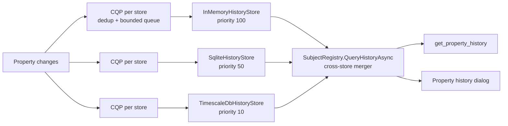

# Time-Series History Design (Planning Spec)

> **Temporary planning artifact.** This is the working design produced during brainstorming. The permanent architecture doc lives at `src/HomeBlaze/HomeBlaze/Data/Docs/architecture/design/history.md` and is updated to reflect the *actually implemented* design as the final task of Phase A and Phase B (see the implementation plan). This spec supersedes the two earlier planning branches (`docs/history-mvp-plan` and `feature/homeblaze-history`), combining the per-subject store engine from the MVP plan with the SQLite tier, move tracking, and snapshot model from the full-system plan.

## Overview

The history system records property changes over time, enabling historical queries, trend analysis, graph reconstruction, and AI-driven insights. It must work on low-powered devices (Raspberry Pi / SD cards) with many changes over long retention, and scale up to industrial deployments (50K+ subjects, 10K+ changes/sec).

Each **history store is a standalone subject**: an `[InterceptorSubject]` `BackgroundService` with its own `ChangeQueueProcessor`, recording and serving history independently. There is **no central orchestrator**. This follows the same pattern as connectors (OPC UA, MQTT, WebSocket) and matches the canonical architecture decision: a central dispatcher would add a single point of failure and couple the stores together. Stores are configured by dropping a JSON file into the graph, discovered via the registry, and queried by a stateless cross-store merger.

### Scope and phasing

The design is complete end-to-end so the schema, interfaces, and value encoding are forward-compatible. Implementation is staged in two phases so a correct, visible slice ships first and the riskiest reconstruction logic sits on a proven core.

| Capability | Phase |
|---|---|
| Per-subject stores: InMemory, SQLite, TimescaleDB | **v1** |
| Typed-column recording (`value_long` / `value_double` / `value_json`) | **v1** |
| Raw + bucketed queries, cross-store merge (per-bucket single-owner dispatch) | **v1** |
| Aggregations: `Last`, `First`, `Average`, `TimeWeightedAverage`, `Minimum`, `Maximum`, `Sum`, `Count`, `StdDev` | **v1** |
| Move tracking (per-store detection, storage, chain resolution) | **v1** |
| Property-history chart dialog + `get_property_history` MCP tool | **v1** |
| Snapshots (periodic whole-graph + backwards scan + replay) | **v1.1** |
| Structural recording (subject-bearing `[State]` properties as path references) | **v1.1** |
| `get_snapshot` / `get_snapshots` MCP tools | **v1.1** |

Snapshots and structural recording are deliberately deferred: they roughly double the surface and test matrix, they are the least-proven part (replay over moves and structural changes), and they are genuinely additive (a separate table plus a widened eligibility predicate that lands new values in the existing `value_json` column). Nothing shipped in v1 has to be undone to add them.

## Phase 0: prerequisites

Three shared-infrastructure changes precede the history packages. None depend on history, all are independently useful, and they touch core libraries shared by other connectors. They ship together as a **single Phase 0 prerequisite PR** (with tests) that merges before the feature work.

Delivery is three sequential PRs that build on each other: **Phase 0** (these prerequisites), then **Phase A** (v1), then **Phase B** (v1.1). Each merges to `master` before the next begins, so dependent code builds on a settled API rather than a long-lived stacked branch that would need rebasing every time an upstream PR changes during review.

1. **Promote `ThroughputCounter`.** It is currently `internal sealed` in `Namotion.Interceptor.OpcUa`. Move it to `Namotion.Interceptor.Connectors` and make it `public` so OPC UA connectors and the history stores share one lock-free 60-second sliding-window rate counter. `Namotion.Interceptor.Connectors` already hosts `ChangeQueueProcessor`, so no new dependency is introduced.

2. **Add a minimal `ICanonicalPathResolver` to `HomeBlaze.Abstractions`.** A store needs exactly one thing from path resolution: a subject's canonical path. Referencing the heavy `HomeBlaze.Services` layer (nine project references) for that single call would over-couple the store packages, so instead define a one-method abstraction `string? GetCanonicalPath(IInterceptorSubject subject)` in the lean `HomeBlaze.Abstractions` (it references only `Namotion.Interceptor`, and the history abstractions already depend on it for `KnownAttributes.State` / `StateMetadata`). `SubjectPathResolver` in `HomeBlaze.Services` implements it as `GetPath(subject, PathStyle.Canonical)`. Stores resolve it from the context service registry and stay off `HomeBlaze.Services`. This is narrower and better placed than the broad three-method `ISubjectPathResolver` the earlier full-system plan proposed (the history system never needs `ResolveSubject` or `PathStyle`), and it keeps the recording path trivially unit-testable.

3. **Add opt-in bounded-queue backpressure to `ChangeQueueProcessor`.** The processor's queue is currently unbounded; the canonical architecture already specifies "bounded queue semantics, oldest dropped on overflow." Add an optional `maxQueueDepth` constructor parameter (default `null` = unbounded, preserving current connector behavior). When set and exceeded, the oldest unprocessed change is dropped and a drop counter increments. This makes the `DropCount` `[State]` metric below real rather than aspirational. Because it lives in `ChangeQueueProcessor`, the knob is exposed uniformly: any consumer (OPC UA, MQTT, WebSocket) can opt in, which matters most on the central UNS where the WebSocket handler sees the highest aggregate change rate.

   Because it changes hot-path behavior, the Phase 0 PR covers it with explicit tests (overflow drops the oldest entry and increments the counter; the default-null path leaves every existing connector byte-for-byte unchanged). One semantic note for connector adopters: a dropped change in a *sync* connector is not just a metric, it is a downstream divergence (a client never receives that value), so the right overload reaction for a connector is usually to trigger a resync rather than accept silent loss. History stores can drop freely (a bounded gap in a passive log); connectors choosing to bound should pair it with a resync policy. That per-connector policy is follow-up; Phase 0 only adds and exposes the mechanism, with the default leaving every existing connector unchanged.

## Architecture



Each store independently subscribes to the change pipeline, filters with the same eligibility predicate, deduplicates within its own buffer window, and records to its backend. Stores expose a `Coverage` window and a `Priority`; a stateless merger discovers all `IHistoryStore` subjects from the registry and stitches their results.

### Recent-tail coverage

The InMemory store (priority 100, `Coverage.To = now`) is the recent-tail leg: it answers the most recent samples at full resolution while persistent stores trail "now" by roughly their flush interval. Persistent stores (SQLite, TimescaleDB) set `Coverage.To` to their last committed sample's timestamp, so the merger automatically routes the live edge to InMemory.

To avoid a blind window between InMemory eviction and a persistent store's commit, the cross-store sizing constraint is `InMemory.MaxAge >= 2 * FlushInterval` of any companion persistent store. The default configs satisfy it. It is documented in the `MaxAge` config doc comment, surfaced as edit-component helper text, and (fast-follow) validated at runtime. InMemory ships in the default configuration so recent queries always have a covering store; the merger surfaces an explicit "recent tail uncovered" signal rather than silently returning a gap if it is ever removed.

### Package structure

| Package | Role |
|---|---|
| `HomeBlaze.History.Abstractions` | `IHistoryStore`, query/result records, `HistoryAggregations`, `HistoryEligibility`, `HistoryColumns`, `BucketAlignment`, and the `SubjectRegistry.QueryHistoryAsync` cross-store merger. References `Namotion.Interceptor.Registry`. No storage implementation. |
| `HomeBlaze.History.Abstractions.Tests` | Eligibility, column dispatch, bucket alignment, merger (raw + bucketed planners, sequential-budget executor). No external dependencies. |
| `HomeBlaze.History.InMemory` | `InMemoryHistoryStore` subject. Ring buffer per property path. Priority 100. |
| `HomeBlaze.History.InMemory.Blazor` | `InMemoryHistoryStoreEditComponent.razor`. |
| `HomeBlaze.History.InMemory.Tests` | Recording, retention, raw/bucketed queries, time-weighted-average look-back, moves, oversize placeholder. |
| `HomeBlaze.History.Sqlite` | `SqliteHistoryStore` subject. Partitioned database files, typed columns, native SQL aggregation. Priority 50. |
| `HomeBlaze.History.Sqlite.Blazor` | `SqliteHistoryStoreEditComponent.razor`. |
| `HomeBlaze.History.Sqlite.Tests` | Partitioning, schema, retention sweep, native aggregation, moves. |
| `HomeBlaze.History.TimescaleDb` | `TimescaleDbHistoryStore` subject. Npgsql binary `COPY`, hypertable storage, `drop_chunks` retention. Priority 10. |
| `HomeBlaze.History.TimescaleDb.Blazor` | `TimescaleDbHistoryStoreEditComponent.razor`. |
| `HomeBlaze.History.TimescaleDb.Tests` | Integration tests via Testcontainers (`[Trait("Category","Integration")]`). |

The `get_property_history` MCP tool lives in the existing `HomeBlaze.AI` (it depends on `HomeBlaze.History.Abstractions`); base `Namotion.Interceptor.Mcp` stays free of history concerns. Target framework `net10.0` throughout, matching the HomeBlaze tree.

## Abstractions

```csharp
public interface IHistoryStore : IInterceptorSubject
{
    int Priority { get; }                              // higher = preferred for overlapping ranges
    HistoryCoverage Coverage { get; }
    IReadOnlySet<string> SupportedAggregations { get; }

    Task<HistorySeries> QueryAsync(HistoryQuery query, CancellationToken cancellationToken);

    /// Most recent sample at or before <paramref name="asOf"/> for the property path
    /// (following move chains), or null if none. Used by TimeWeightedAverage integration
    /// and Last LOCF gap-fill.
    ValueTask<HistoryPoint?> GetSampleAtOrBeforeAsync(
        string propertyPath, DateTimeOffset asOf, CancellationToken cancellationToken);
}

public readonly record struct HistoryCoverage(DateTimeOffset From, DateTimeOffset To)
{
    public bool Contains(HistoryCoverage other) => other.From >= From && other.To <= To;
    public bool Overlaps(HistoryCoverage other) => other.From < To && other.To > From;
}

public record HistoryQuery(
    string PropertyPath,
    DateTimeOffset From,
    DateTimeOffset To,
    TimeSpan? Bucket = null,                            // null => raw query
    string Aggregation = HistoryAggregations.Last,
    int MaxPoints = 10_000);

public record HistoryPoint(DateTimeOffset Timestamp, double? Number, JsonElement? Json);

public record HistorySeries(string PropertyPath, ImmutableArray<HistoryPoint> Points, bool Truncated);
```

A single `QueryAsync` serves both raw (`Bucket == null`) and bucketed queries; the store dispatches internally. Returning the newest `MaxPoints` results (ascending by timestamp) is the contract every store honors so the merger can compose them.

### Aggregation identifiers

Aggregations are PascalCase strings, not a closed enum, so per-store specialization and additive growth need no abstraction churn. The MCP boundary accepts case-insensitive input and normalizes; internal equality uses `StringComparer.Ordinal`.

```csharp
public static class HistoryAggregations
{
    public const string Last                = "Last";
    public const string First               = "First";
    public const string Average             = "Average";              // count-weighted sample mean
    public const string TimeWeightedAverage = "TimeWeightedAverage";  // duration-weighted (UI default for numeric)
    public const string Minimum             = "Minimum";
    public const string Maximum             = "Maximum";
    public const string Sum                 = "Sum";
    public const string Count               = "Count";
    public const string StdDev              = "StdDev";

    public static readonly IReadOnlySet<string> Universal =
        new HashSet<string>(StringComparer.Ordinal) { Last, Count };
}
```

`Average` is the count-weighted sample mean; `TimeWeightedAverage` weights each sample by how long its value held. For irregularly-spaced state values (the dominant data shape) time-weighted is the correct mean and is the UI default for numeric properties, labelled "Average"; the sample mean appears lower as "Sample Average".

### Eligibility predicate

`HasHistory()` is the single source of truth for whether a property is recorded and whether the UI offers the history action. It is type-based and reads the HomeBlaze registry attribute (there is no `IsState` member on `RegisteredSubjectProperty`; "is state" is the presence of the `HB:State` attribute, and "has children" is `CanContainSubjects`).

```csharp
public static class HistoryEligibility
{
    public static bool HasHistory(this RegisteredSubjectProperty property)
    {
        if (property.TryGetAttribute(KnownAttributes.State) is null) return false; // not [State]
        if (property.CanContainSubjects) return false;                            // structural (v1.1)
        return IsRecordableType(property.Type);
    }

    public static bool IsRecordableType(Type type)
    {
        var t = Nullable.GetUnderlyingType(type) ?? type;
        if (t == typeof(double) || t == typeof(float)) return true;  // value_double
        if (IsBigIntCompatible(t)) return true;                       // value_long
        if (t == typeof(decimal)) return true;                        // value_json (lossless)
        if (t == typeof(string)) return true;                         // value_json
        if (t.IsEnum) return true;                                    // value_json (enum name)
        return false;                                                 // complex types deferred
    }

    static bool IsBigIntCompatible(Type t) =>
        t == typeof(long)  || t == typeof(int)  || t == typeof(short) ||
        t == typeof(sbyte) || t == typeof(byte) || t == typeof(ushort) ||
        t == typeof(uint)  || t == typeof(ulong) || t == typeof(bool);
}
```

The `IsCumulative` / `IsDiscrete` flags on the `StateMetadata` behind the `HB:State` attribute govern UI display concerns (aggregation-dropdown gating, future `Rate`/`StateDuration` enablement) but do not affect recording. In v1.1 the `CanContainSubjects` exclusion is lifted: subject-bearing `[State]` properties become eligible and are recorded as path references in `value_json` (see Structural Recording).

### Column dispatch

`ValueColumnFor` is the single source of truth for routing a value into a column (write) and building column-targeted SQL (read).

```csharp
public enum ValueColumn { Long, Double, Json }

public static class HistoryColumns
{
    public static ValueColumn ValueColumnFor(Type propertyType)
    {
        var t = Nullable.GetUnderlyingType(propertyType) ?? propertyType;
        if (t == typeof(double) || t == typeof(float)) return ValueColumn.Double;
        if (IsBigIntCompatible(t)) return ValueColumn.Long;
        return ValueColumn.Json;  // decimal, string, enum, (v1.1) path references
    }

    // ulong values above long.MaxValue spill to value_json; read paths COALESCE across both.
    public static bool IsUlongProperty(Type propertyType) =>
        (Nullable.GetUnderlyingType(propertyType) ?? propertyType) == typeof(ulong);
}
```

Typed columns preserve `long` exactly (a single `numeric REAL` column would silently corrupt counters above 2^53) and keep `decimal` lossless. The same three columns map cleanly across backends: `bigint` / `double precision` / `jsonb` in PostgreSQL, `INTEGER` / `REAL` / `TEXT` in SQLite, and a typed `Sample` struct in memory.

### Look-back primitive

`GetSampleAtOrBeforeAsync` returns the most recent sample at or before `asOf`, following the property's move chain. It serves time-weighted-average integration (the value held entering a bucket), `Last` LOCF gap-fill (carry forward into empty buckets, including from before `query.From`), and (in Phase 2) `Rate`/`Delta` on sparse counters. Returning null is honest: the system never invents history it did not record.

### Bucket alignment

All backends must produce buckets at identical timestamps for the same `(bucket size, sample timestamps)` so the merger never interleaves duplicates. All use the epoch-anchored formula matching Postgres `time_bucket`:

```csharp
public static DateTimeOffset BucketStart(DateTimeOffset ts, TimeSpan bucket)
{
    var ticksFromEpoch = (ts - DateTimeOffset.UnixEpoch).Ticks;
    return DateTimeOffset.UnixEpoch.AddTicks((ticksFromEpoch / bucket.Ticks) * bucket.Ticks);
}
```

## Recording path

Each store is a `BackgroundService` subject. In `ExecuteAsync` it constructs a `ChangeQueueProcessor` (own `BufferTime` coalesce window, opt-in `maxQueueDepth`) and runs its process loop, mirroring `SubjectSourceBase`. For each change in a flushed batch:

```csharp
var property = change.Property.TryGetRegisteredProperty();
if (property is null || !property.HasHistory()) continue;

var path = _pathResolver.GetCanonicalPath(property.Subject) + "/" + property.Name;
DetectMove(property.Subject, path, change.Timestamp);   // see Move Tracking
Record(path, change);                                    // route by ValueColumnFor(property.Type)
```

`_pathResolver` is an `ICanonicalPathResolver` (Phase 0), resolved from the context service registry and backed by `SubjectPathResolver`, so the store package depends on the lean `HomeBlaze.Abstractions` rather than the heavy `HomeBlaze.Services` layer. Resolution happens only at this boundary: everything below it (ring buffer, retention, aggregation, query, and the move-detection comparison) operates on plain canonical-path strings, so that logic is unit-tested with literal paths and no graph, while the change-to-path glue is verified by an integration test against the real resolver.

`Record` routes the new value into the correct column:

| Value | Column | Notes |
|---|---|---|
| `double` / `float` | `value_double` | |
| integer types, `bool` | `value_long` | `bool` as 0/1 |
| `ulong` ≤ `long.MaxValue` | `value_long` | range-checked at write |
| `ulong` > `long.MaxValue` | `value_json` | rare overflow |
| `decimal` | `value_json` | lossless JSON number |
| `string`, `enum` | `value_json` | enum stored as name |
| `null` | all columns null | explicit null is meaningful |

### Oversize and refused values

Only `string` is unbounded. Each store serializes JSON into a pooled buffer with a hard `MaxJsonSize` cap (default 8 KB). On overflow it writes a placeholder row `{ "$oversize": true, "size": <n> }` so the timeline is preserved, and increments an `OversizeCount` `[State]` metric. Numerics, bool, and enums are bounded by type; types outside the allow-list are blocked by `HasHistory()` before reaching the store.

## Move tracking

Subjects are identified by canonical path (no stable persistent IDs). When a subject is renamed or reparented, history must remain queryable across the change. Move tracking lives entirely **inside each store**, with no shared coordinator, which fits the per-subject model and is nearly free.

### Detection (write side)

Each store already resolves the canonical path of every change it records. Move detection is therefore one extra dictionary comparison: maintain a per-store `Dictionary<IInterceptorSubject, string> _lastKnownPath` (object-reference identity is stable while the app runs). On each recorded change, compare the resolved path to the last known one; if it differs, write a `MoveRecord(timestamp, fromPath, toPath)` to the store's own moves table, stamped with the **change's timestamp**, and update the dictionary. Stamping with the change timestamp (not wall-clock) makes all stores converge on the same move record, so the legs stay consistent at merge time. Lifecycle detach removes the dictionary entry.

**Limitation:** detection depends on in-memory object identity, so moves across app restarts are not detected (subject IDs regenerate on restart). In practice moves are manual actions performed while the app runs.

### Storage and resolution (read side)

Each store stores only the moves within its own coverage window, which is exactly what it needs, because a store only resolves chains for ranges it serves. Move-following is encapsulated in `QueryAsync` and `GetSampleAtOrBeforeAsync`:

1. Resolve the path chain backwards from the queried path through the store's moves table (visited set prevents cycles).
2. Time-scope each path in the chain to its valid interval (move-in to move-out).
3. Query each path for its valid sub-range and merge chronologically, tagging results with the queried path.

Because the chain expansion happens inside the store and results are returned under the queried path, the cross-store merger never has to know moves exist, and per-bucket dispatch keeps working unchanged. The cost when there are no moves (the common case) is a single empty lookup.

## Query path

Two query shapes, dispatched on whether `Bucket` is null; both honor the newest-N contract and return ascending by timestamp.

### Newest-N contract

For a sub-range, every store returns at most `MaxPoints` results representing the newest samples (raw) or newest buckets (bucketed). For SQL backends this is `ORDER BY ... DESC LIMIT MaxPoints + 1` then re-sorted ascending; the `+ 1` detects overflow without a separate count and sets `Truncated`. In-memory takes the last N of a binary-search slice.

### Aggregate fragments

| Aggregation | SQL fragment | Empty bucket |
|---|---|---|
| `Last` | LOCF over the carried value | most recent prior value; null before first sample |
| `First` | first value in bucket | null |
| `Average` | `avg(<column>)` | null |
| `TimeWeightedAverage` | `LEAD()`-with-carry integration (toolkit fast-path on Timescale) | held value via look-back; null before first sample |
| `Minimum` / `Maximum` | `min` / `max` | null |
| `Sum` | `sum` | null |
| `Count` | `count(*)` | `0` (a real fact, not a gap) |
| `StdDev` | `stddev_samp` | null |

Empty buckets are encoded as explicit `null` entries in the wire format (not absent), so consumers do not have to recompute bucket boundaries. `Count` returns 0; `Last` and `TimeWeightedAverage` carry the held value; other aggregations return null and the chart shows a visual gap.

Numeric aggregations on a `value_json`-stored property (decimal, string, enum) raise `HistoryAggregationNotSupportedException`. For `ulong` properties whose values straddle `long.MaxValue`, a COALESCE-aware SQL variant reads both `value_long` and `value_json`; all other types use the single-column path.

## Cross-store merge

The merger is a stateless extension on the registry: a query-type-specific **planner** plus a shared **executor**.

```csharp
public static async Task<HistorySeries> QueryHistoryAsync(
    this ISubjectRegistry registry, HistoryQuery query, CancellationToken ct)
{
    var stores = registry.KnownSubjects.Keys.OfType<IHistoryStore>()
        .OrderByDescending(s => s.Priority).ToArray();

    CheckEligibility(stores, query);
    var plan = query.Bucket is null ? PlanRawDispatch(stores, query)
                                    : PlanBucketedDispatch(stores, query);
    return await ExecuteWithBudget(plan, query, ct);
}
```

- **Eligibility check.** Every part of `[From, To]` must be servable by some store supporting the requested aggregation (universal aggregations `Last`/`Count` skip the check). Otherwise `HistoryAggregationNotSupportedException` carries the `available` set.
- **Raw planner (coverage subtraction).** Higher-priority stores claim their range first; lower-priority stores fill the remaining gaps. Each store gets a non-overlapping sub-range.
- **Bucketed planner (per-bucket dispatch).** Each bucket is assigned to a single store: the highest-priority store whose `Coverage` fully contains the bucket's effective range. Consecutive same-store buckets group into one ranged sub-query. **No bucket is ever computed from two stores**, which sidesteps the "average of averages" problem entirely. Every aggregation is trivially correct per bucket because each bucket has one source of truth.
- **Sequential-budget executor.** Stores are queried in priority order, each receiving the *remaining* budget (no over-fetching); newest-first within each store; dedup via `TryAdd` (higher-priority value wins on identical timestamps); `Truncated` set honestly when a sub-query truncates or the budget runs out.

A store that throws during `QueryAsync` propagates the error; the merger never silently swallows it, so a misconfigured TimescaleDB cannot masquerade as "no data".

### Resulting behaviour

| Query | Routing |
|---|---|
| last 30 s | InMemory contains every bucket; persistent stores never touched |
| last 1 h, raw | InMemory serves the recent tail; SQLite/Timescale serve the rest with the remaining budget |
| last 1 h, bucket = 10 s | Per-bucket dispatch: older buckets from a persistent store, newest from InMemory |
| Timescale offline, last 30 s | InMemory still answers; the outage is invisible for ranges it covers |
| Timescale offline, last 7 d | InMemory answers the tail; Timescale's `Coverage.To` is frozen at last successful flush; the gap is honest empty buckets |

## Time-weighted average

Time-weighted average is **universally supported** by every numeric-capable store via a portable implementation, because the portable formulation is needed for SQLite anyway. This is a simplification over toolkit-gated availability: there is no capability gap to advertise and no "TWA not supported" error path.

- **Portable baseline (SQLite, plain PostgreSQL, TimescaleDB).** A `LEAD()`-over-ordered-samples query with a carry sample from before the bucket's left edge, so the first bucket starts with a known value. Each sample's validity interval `[ts, next_ts)` is clipped per bucket; the bucket value is `sum(value * duration) / sum(duration)`. The query also returns `weighted_sum` and `total_duration` so cross-partition and (Phase 2) cross-leg merges combine without re-reading rows.
- **InMemory.** Trapezoidal/step integration with the same look-back semantics.
- **TimescaleDB toolkit fast-path.** When `timescaledb_toolkit` is present, `average(time_weight('locf', ts, value))` replaces the portable query transparently. The toolkit is a performance optimization only; it never changes which aggregations are available. A `ToolkitAvailable` `[State]` flag remains for observability.

**Load-bearing parity test:** identical samples written to InMemory, SQLite, and TimescaleDB (toolkit and non-toolkit) must produce identical time-weighted-average values across a battery of edge cases (empty bucket, single-sample bucket, boundary-sample bucket, look-back-only bucket). This equivalence is what makes the unified merger sound.

## Store implementations

### InMemoryHistoryStore (priority 100)

`ConcurrentDictionary<string, PropertyBuffer>` keyed by property path; each buffer is an array-backed ring with a per-buffer lock, created on first write. `MaxAge` (default 60 s) evicts old samples; `MaxPointsPerProperty` (default 1000) caps a runaway property. `Coverage = [max(StartTime, now - MaxAge), now]`. No shutdown flush: InMemory is a hot buffer / dev / test store, lost on restart. Metrics: `RecordedCount`, `OversizeCount`, `EvictedCount`, `TrackedPropertyCount`, `TotalSampleCount`, `EstimatedMemoryBytes`, incoming/recorded rates.

### SqliteHistoryStore (priority 50)

The edge / Raspberry-Pi tier: real persistence with no external server. One database file per configurable interval (`Daily` / `Weekly` / `Monthly`), plus a small moves database.

```sql
CREATE TABLE history (
    ts            INTEGER NOT NULL,   -- ticks (UTC)
    path          TEXT    NOT NULL,   -- canonical property path
    value_long    INTEGER,
    value_double  REAL,
    value_json    TEXT,
    PRIMARY KEY (path, ts)
) WITHOUT ROWID;                       -- clustered B-tree IS the (path, ts) index
```

WAL mode for concurrent reads during writes; batched `INSERT OR REPLACE` per partition in one transaction; one open connection per active partition (typically 1-2). Native aggregation via the portable `LEAD()` time-weighted-average SQL. Retention sweeps whole partition files older than `now - MaxAge` (no per-row deletes that would thrash WAL); periodic `PRAGMA wal_checkpoint(TRUNCATE)`. `Coverage.To` tracks the last committed sample; `MinAge ≈ FlushInterval` (default 10 s).

### TimescaleDbHistoryStore (priority 10)

The industrial tier. Npgsql native, no ORM (EF migrations fight `create_hypertable` and change-tracking is exactly the hot-path overhead to avoid).

```sql
CREATE TABLE IF NOT EXISTS property_history (
  ts            timestamptz       NOT NULL,
  path          text              NOT NULL,
  value_long    bigint            NULL,
  value_double  double precision  NULL,
  value_json    jsonb             NULL
);
SELECT create_hypertable('property_history', 'ts',
    chunk_time_interval => INTERVAL '1 day', if_not_exists => true);
CREATE INDEX IF NOT EXISTS ix_property_history_path_ts ON property_history (path, ts DESC);
```

Batched binary `COPY` (`NpgsqlBinaryImporter`) per `FlushInterval`; daily chunks make future compression granular; idempotent schema bootstrap with a seeded `history_schema_version`. Retention via `drop_chunks(older_than => now() - MaxAge)`, dropping whole chunks atomically. A toolkit probe (`CREATE EXTENSION IF NOT EXISTS timescaledb_toolkit`) sets `ToolkitAvailable` and is re-run on reconnect; it only toggles the time-weighted-average fast-path. `Coverage.To` is a high-water-mark: seeded at bootstrap from `MAX(ts)`, advanced after each successful `COPY`, frozen during outages so the merger routes around the gap instead of getting silent holes. Shutdown performs a final synchronous `COPY` bounded by `ShutdownFlushTimeout`; on crash, up to `FlushInterval` of samples are lost (documented). Metrics: `Status`, `QueueDepth`, `DropCount`, `OversizeCount`, `RecordedCount`, incoming/recorded rates, `LastFlushUtc`, `LastError`, `ToolkitStatus`, `EstimatedStorageBytes`.

The recommended production image is `timescale/timescaledb-ha:pg16-latest` (bundles the toolkit); the base image works with a degraded (still-correct, portable) time-weighted average.

## UI

- **Edit components**, one per store (matching `HomeBlaze.OpcUa.Blazor`): general settings + advanced knobs + a status block. The InMemory `MaxAge` field shows the `>= 2 * FlushInterval` helper text.
- **Property history dialog**, reachable from any `[State]` property whose `HasHistory()` is true when at least one `IHistoryStore` exists. Range presets (1h/6h/24h/7d/30d/custom), auto bucket (≈ range/200 rounded to a sane interval), aggregation dropdown, `MudTimeSeriesChart` (MudBlazor 9.2, no new dependency). The chart converts each series into `ChartSeries`, splitting at null entries into same-styled runs so gaps render as visual breaks; `Last`/time-weighted responses have no interior nulls and draw a continuous (stepped) line.
- **Aggregation gating.** Cumulative (counter) properties offer only `Last`/`First`/`Minimum`/`Maximum`/`Count`. Others filter by column type (numeric vs JSON) intersected with the union of `SupportedAggregations`. Time-weighted average is labelled "Average" (default for numeric) with a tooltip; sample mean is "Sample Average".

## MCP tool

`get_property_history` in `HomeBlaze.AI`, declared as an `McpToolInfo` (the codebase uses interface-based `IMcpToolProvider`, not attributes):

| Parameter | Required | Default | Notes |
|---|---|---|---|
| `paths` | yes | | one or more canonical property paths |
| `from` | yes | | ISO 8601; bare timestamps treated as UTC |
| `to` | no | now | ISO 8601 |
| `bucket` | no | null (raw) | `TimeSpan`-parseable, e.g. `5m` |
| `aggregation` | no | `Last` | case-insensitive match against `HistoryAggregations` |

The tool queries multiple properties in one call: `from`/`to`/`bucket`/`aggregation` apply to every path, and the response is a per-path map, each entry carrying a `value_type` hint (`number` / `string` / `boolean` / `enum`), the `points` array (null entries for gaps), and `truncated`. This lets an AI agent compare related signals (for example temperature and humidity) in a single request.

Multi-property is a thin fan-out, not an engine change: `HistoryQuery` stays single-path, the cross-store merger exposes a multi-path overload that runs the per-path queries (parallelizable), and the chart dialog reuses it to draw multiple series. Unknown aggregation or aggregation-not-servable-over-range returns a structured error with the `available` set, with no silent fallback. Empty results and unknown paths are not errors. `MaxPoints` is not exposed (10 000 raw / 1 000 bucketed caps per path keep responses bounded; callers narrow `from`/`to` for detail).

## Configuration summary

| Knob | InMemory | SQLite | TimescaleDB |
|---|---|---|---|
| `Priority` | 100 | 50 | 10 |
| `MaxAge` (retention) | 60 s | 365 d | 365 d |
| `FlushInterval` | n/a (direct) | 10 s | 5 s |
| `BufferTime` (CQP coalesce) | 250 ms | 250 ms | 250 ms |
| `PartitionInterval` | n/a | Weekly | n/a (1-day chunks) |
| `ConnectionString` / `DatabasePath` | n/a | path | required |
| `MaxPointsPerProperty` | 1000 | n/a | n/a |
| `ShutdownFlushTimeout` | n/a | n/a | 10 s |
| `MaxJsonSize` | 8 KB | 8 KB | 8 KB |

Global `appsettings.json` holds nothing history-specific in v1; each store self-configures from its JSON subject definition.

## v1.1 layer: snapshots and structural recording

Designed in now for forward compatibility; implemented after v1 ships. Both build additively on the v1 stores.

### Structural recording

Lifting the `CanContainSubjects` exclusion in `HasHistory()` makes subject-bearing `[State]` properties eligible, recorded as **lightweight path references** in `value_json` (never serialized object graphs):

| Held value | Recorded as |
|---|---|
| single subject reference | canonical path string (or null) |
| dictionary of subjects | JSON array of keys |
| collection of subjects | JSON array of child paths |

This is the "graph shape" half of history: it lets snapshot replay reconstruct subjects added or removed between snapshots, not just scalar values on pre-existing subjects.

### Snapshots

Each store takes periodic whole-graph snapshots on its own `SnapshotInterval` into its own `snapshots` table (gzipped JSON blob). Reconstruction at time `T` is owned by the store covering `T`: scan partitions/chunks **backwards** from `T` to the nearest snapshot (typically 1-2 reads), then replay scalar and structural changes forward to `T`. Replay follows move chains using the same per-store resolution as queries. Partial snapshots filter to a subtree; `GetSnapshotsAsync` streams an `IAsyncEnumerable` series.

### MCP tools

`get_snapshot(path, time)` and `get_snapshots(path, from, to, interval)` join `get_property_history` in `HomeBlaze.AI`, both following moves transparently. `get_snapshots` is capped (100 per request) with a truncation indicator.

## Tests

**Unit (no Docker):** eligibility over every recordable/refused type; column dispatch including `ulong`; bucket-alignment parity with `time_bucket`; InMemory recording/retention/raw+bucketed/time-weighted look-back/oversize/moves; merger raw planner (disjoint, overlapping, throwing store, empty registry), bucketed planner (per-bucket dispatch, consecutive grouping, right-edge clipping), executor (budget exhaustion, newest-first, dedup, truncation), eligibility check; MCP parameter parsing, case-insensitive aggregation, error shape, `value_type`.

**SQLite:** partitioning, `WITHOUT ROWID` schema, retention file sweep, native aggregation, move resolution.

**Integration (TimescaleDB, `[Trait("Category","Integration")]`, excluded from default run):** two Testcontainers fixtures (toolkit-available `timescaledb-ha`, toolkit-absent base); schema bootstrap idempotency, recording into each typed column, `ulong` overflow COALESCE, oversize placeholder, newest-N raw, bucketed correctness, retention via `drop_chunks`, coverage high-water-mark across flush/outage/restart, backpressure drop, reconnect, shutdown flush. **Cross-store:** the time-weighted-average parity battery across InMemory + SQLite + TimescaleDB; per-bucket dispatch across stores; bucket-alignment concatenation never duplicates; move chains resolve consistently across legs. Fixtures skip with a clear message when Docker is unreachable.

## Known limitations

- **Type changes hide prior data.** Changing a property's declared type shifts the read column; old-type samples become invisible to the new query path. Avoid in production.
- **Crash data loss.** Up to `FlushInterval` of samples lost on hard crash (SIGKILL/OOM); graceful shutdown drains.
- **InMemory-only loses history on restart.** It is a hot buffer / dev / test store, not a production substitute.
- **Live-edge bucket inaccuracy for large buckets.** When `bucket_size > InMemory.MaxAge`, the rightmost bucket may omit up to `FlushInterval` of samples (error `FlushInterval / bucket_size`, ≤1.7% at 5-min buckets). Raise `MaxAge` for pixel-perfect live edges; a combinable-partial-aggregate path is a post-v1 refinement.
- **Move tracking is runtime-only.** Moves across restarts are not detected (in-memory identity).
- **Multiple stores against one database duplicate rows.** HA/failover belongs at the Npgsql connection layer, not at the store-instance layer.

## Key decisions

| Decision | Choice | Rationale |
|---|---|---|
| Orchestration | Per-subject stores, no central service | Matches the connector pattern and the canonical architecture; no single point of failure; each store self-configures and isolates failures |
| Value storage | Typed columns (`value_long`/`value_double`/`value_json`) | Precision-correct for `long` and `decimal`; maps cleanly across PostgreSQL/SQLite/memory |
| Cross-bucket aggregation | Per-bucket single-owner dispatch | Eliminates "average of averages"; every aggregation trivially correct per bucket |
| Recent-tail coverage | InMemory as priority-100 leg + sizing constraint | Live edge always served at full resolution; no central buffer needed |
| Time-weighted average | Portable baseline everywhere, toolkit as fast-path | Needed for SQLite anyway; removes capability-gating complexity; one correctness contract |
| Move tracking | Per-store detection + storage | Reuses the path already resolved for recording; correctly scoped to each store; merger stays move-agnostic |
| Aggregation identifiers | PascalCase strings | Per-store specialization and additive growth without abstraction churn |
| Snapshots / structural | v1.1, additive | Riskiest part; sits on a proven core; separate table + widened predicate, no rework |
| Backpressure | Opt-in bounded queue, drop oldest | Matches documented intent; never blocks the hot path; existing connectors unaffected |

## Open questions / future work

**Fast-follow:** runtime validation of the `MaxAge >= 2 * FlushInterval` constraint; per-range re-evaluation of the aggregation dropdown; CSV/JSON export from the dialog; `Median`/`Percentile` (toolkit `approx_percentile` vs native `percentile_cont`). (Multi-property query is in v1; the dialog's multi-series compare builds on it.)

**Phase 2 (after v1.1):** `Rate`/`Delta` for cumulative properties (toolkit `counter_agg`; in-process for InMemory; look-back already present); `StateDuration` for discrete properties; server-side `Interpolate` gap-fill for smoothly-varying signals; recording complex types beyond path references; TimescaleDB continuous aggregates and native compression once production bucket sizes are known.

**Deferred:** property-path normalization lookup table (trigger: `EstimatedStorageBytes` alarms); per-property `[Historize]`/`[NoHistory]` opt-in/out and store-level glob filters; cross-sink auto-tier migration; cross-restart move tracking; plain PostgreSQL / QuestDB sinks (both lack hypertables, `time_bucket`, `drop_chunks`). InfluxDB is ruled out (v3 proprietary/cloud-only, v2 restrictive license, Flux deprecated).
