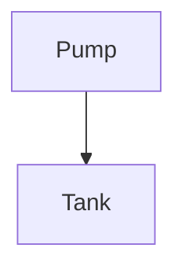
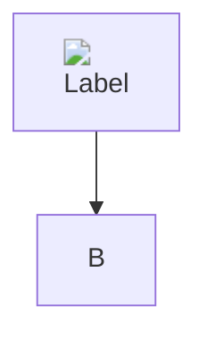

# Diagrams Demo

```mermaid
graph TD
    Pump --> Tank
```

```mermaid
this is not a diagram
```

```mermaid
%%{init: {"securityLevel": "loose", "htmlLabels": true, "flowchart": {"htmlLabels": true}}}%%
graph TD
    A["<img src='http://127.0.0.1:9/exfiltrate.png'> Label"] --> B
    click A "http://127.0.0.1:9/clicked" "Tooltip"
    click B call alert()
```
