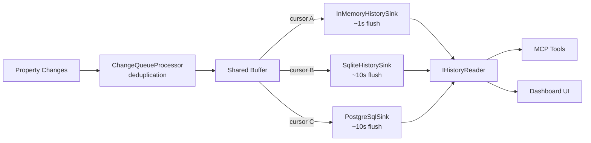
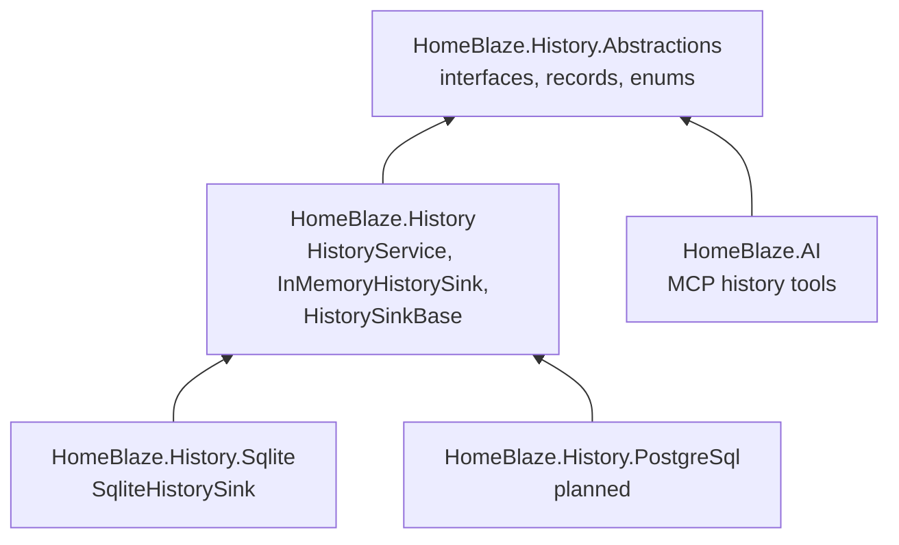
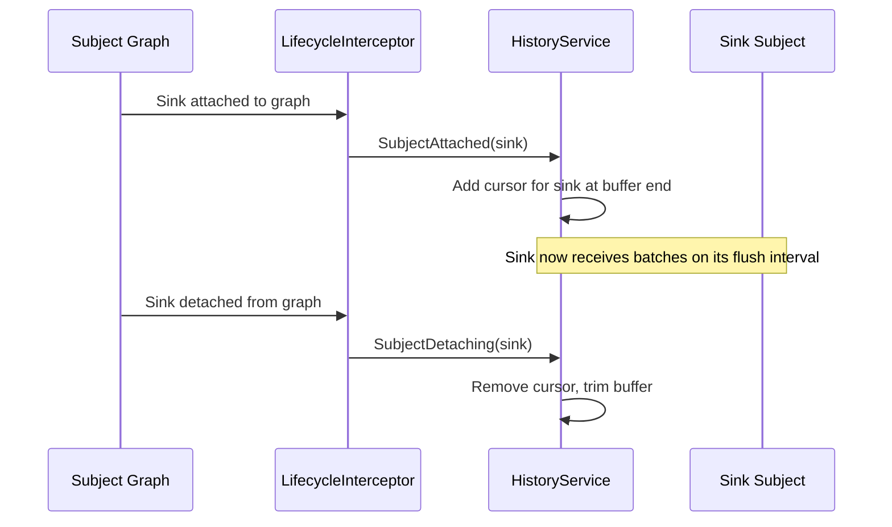
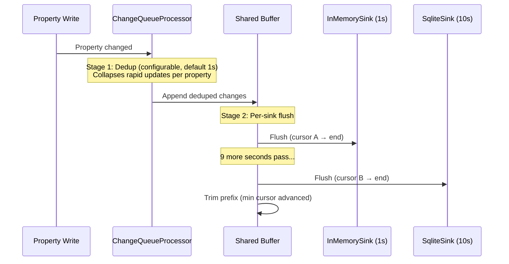
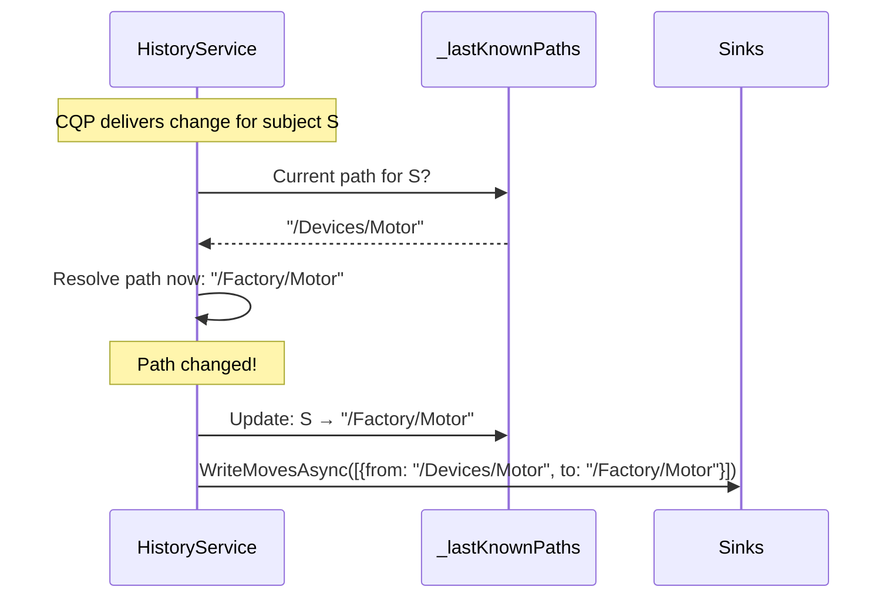
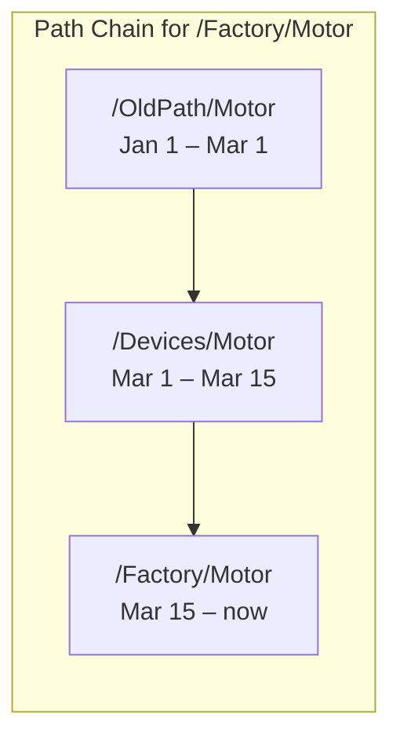
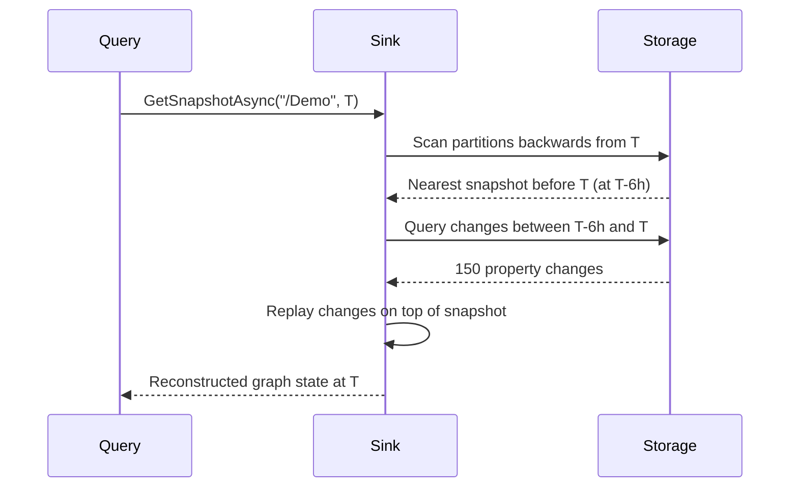
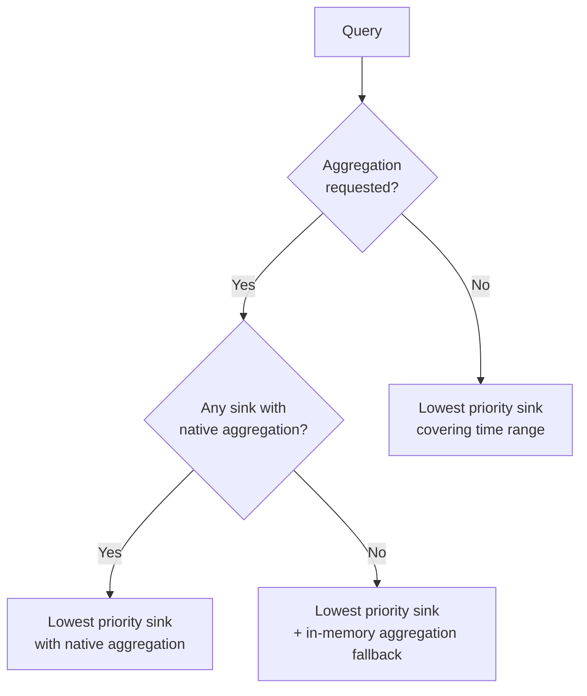

# Time-Series History Design

## Overview

The history system records property changes over time, enabling historical queries, trend analysis, graph reconstruction, and AI-driven insights.

The `HistoryService` is a DI-registered singleton `BackgroundService` that orchestrates change capture, buffering, and distribution. Sinks are subjects in the graph — the service discovers them automatically via lifecycle events. Each deployment chooses the sink(s) appropriate for its scale, and any storage backend can be added via the `IHistorySink` interface.

## Architecture

### High-Level Data Flow



### Components

| Component | Responsibility |
|-----------|---------------|
| `HistoryService` | DI singleton BackgroundService that owns the CQP subscription, shared buffer, per-sink cursors, move detection, and snapshot scheduling |
| `HistorySinkBase` | Abstract base class for sinks. Each sink is an `[InterceptorSubject]` — a subject in the graph |
| `InMemoryHistorySink` | Fast recent lookups (minutes) and comprehensive testing |
| `SqliteHistorySink` | Long-term local storage with partitioned databases |
| `HistoryMcpToolProvider` | MCP tools for AI agents to query history |

### Package Structure



`HomeBlaze.History` and `HomeBlaze.AI` are independent peers — both depend on `HomeBlaze.History.Abstractions` but not on each other.

## Sink Discovery

Sinks are subjects in the graph. The `HistoryService` discovers them automatically via lifecycle attach/detach events — no polling, no explicit registration:



Multiple sinks run simultaneously (e.g., in-memory for fast AI queries + SQLite for long-term). Each is independent — a failing sink is logged and skipped, never blocking others.

## Two-Stage Buffering

The write path has two distinct buffering stages to optimize both deduplication and I/O efficiency:



### Stage 1 — CQP Deduplication

The `ChangeQueueProcessor` collapses rapid property changes. If a property changes 10 times within the dedup interval, only one record is kept (oldest old value + newest new value). The dedup interval is configured globally via `appsettings.json` because there is one `HistoryService` per application.

### Stage 2 — Per-Sink Flush

Each sink has its own `FlushInterval` (a `[Configuration]` property). The `HistoryService` maintains a cursor per sink into the shared buffer. On each sink's flush tick, the buffer is sliced from that sink's cursor to the end and written. The buffer prefix is trimmed once all cursors have advanced past it.

Memory is bounded: the buffer only holds records between the fastest and slowest sink's last flush.

## Property Filtering

The `HistoryService` records:

| Property Type | Recorded? | How |
|---------------|-----------|-----|
| `[State]` scalar (numbers, strings, booleans) | Yes | Stored by value type (numeric inline, others as JSON) |
| `[State]` structural (`CanContainSubjects`) | Yes | Stored as lightweight path references (subject paths, dictionary keys) — not full serialized content |
| `[Configuration]` | No | Already persisted by the configuration system |
| Properties on `IHistorySink` subjects | No | Filtered out to prevent self-recording feedback loop |

### Self-Recording Prevention

Sinks have bookkeeping properties (`RecordsWritten`, `Status`, `LastSnapshotTime`). These are deliberately plain properties (not `[State]`) so they don't enter the change pipeline. Additionally, the CQP property filter excludes any subject implementing `IHistorySink` as a safety net.

### Structural Property Recording

When a `[State]` property holds subjects (e.g., a device collection), the history system records **path references** rather than serialized object content:

| Value Type | Recorded As |
|------------|-------------|
| Single subject reference | Canonical path string |
| Dictionary of subjects | JSON array of dictionary keys |
| Collection of subjects | JSON array of subject paths |

This enables graph structure reconstruction between snapshots without bloating the database.

## Value Serialization

All values are stored in a format that guarantees lossless round-tripping:

| .NET Type | Storage | Round-Trip |
|-----------|---------|------------|
| `null` | — | `JsonValueKind.Null` (not `Undefined`) |
| Numeric (`double`, `int`, etc.) | Inline `numeric_value` column | Exact numeric value |
| `bool` | `numeric_value` (1.0/0.0) | `true`/`false` (not 1.0/0.0) |
| `string` | JSON-encoded in `raw_value` | Exact string value |
| Complex objects | JSON-serialized in `raw_value` | `JsonElement` (dynamic) |

Typed deserialization is available via extension methods when the caller knows the property type or has access to the subject's registry metadata.

## Move Tracking

Subjects are identified by canonical path (no stable persistent IDs). When a subject's path changes (rename, reorganization), history must remain queryable across the rename.

### Write Side — Change Detection



The `HistoryService` maintains a `Dictionary<IInterceptorSubject, string>` mapping subjects to their last known path. Object reference identity is stable while the app is running. On lifecycle detach, the entry is removed.

**Limitation:** Move tracking depends on in-memory object identity. Moves across app restarts cannot be detected. In practice this is rarely a problem since moves are manual actions that happen while the app is running.

### Read Side — Path Chain Resolution

When `FollowMoves = true` on a query, the sink resolves the full path chain:



The query is expanded: each path in the chain is queried for its valid time range, then results are merged chronologically. This applies to raw queries, aggregated queries, and snapshot reconstruction.

`FollowMoves` defaults to `false` — callers opt in explicitly.

## Aggregation

The history system supports seven aggregation types: **Average**, **Minimum**, **Maximum**, **Sum**, **Count**, **First**, **Last**.

### Separate Query API

Raw and aggregated queries have distinct return types:

| Method | Returns | Use Case |
|--------|---------|----------|
| `QueryAsync` | `IReadOnlyList<HistoryRecord>` | Raw property values over time |
| `QueryAggregatedAsync` | `IReadOnlyList<AggregatedRecord>` | Bucketed statistics (average, min, max, sum, count per bucket) |

`AggregatedRecord` contains bucket start/end, all aggregation fields, and first/last values — richer than a single number.

### Cross-Partition Merging

When a query spans multiple storage partitions (e.g., multiple weeks in SQLite), aggregation runs in SQL per partition, then merges:

| Aggregation | Merge Strategy |
|-------------|----------------|
| Average | Weighted by count: `(sum1 + sum2) / (count1 + count2)` |
| Minimum | Min of minimums |
| Maximum | Max of maximums |
| Sum | Sum of sums |
| Count | Sum of counts |
| First | Earliest by timestamp |
| Last | Latest by timestamp |

Sinks that support native aggregation (e.g., SQLite with SQL GROUP BY) set `SupportsNativeAggregation = true`. The `HistoryService` provides a fallback in-memory aggregation for sinks that don't.

## Snapshot Reconstruction

Periodic snapshots capture the full graph state. To reconstruct at time T:



Key design choices:
- **Backwards scan** — partitions are searched from target time backwards, stopping at the first snapshot found. Typically 1-2 partition reads.
- **Partial snapshots** — `GetSnapshotAsync("/Demo", T)` filters to paths under `/Demo/` only.
- **Snapshot series** — `GetSnapshotsAsync` returns `IAsyncEnumerable<HistorySnapshot>` for memory-efficient iteration over time ranges.

Snapshot frequency is configurable per sink via `SnapshotInterval`. Daily snapshots mean worst case ~24 hours of log replay.

## Sink Implementations

### InMemoryHistorySink

| Aspect | Detail |
|--------|--------|
| Purpose | Fast recent lookups + comprehensive testing |
| Storage | In-memory lists |
| Retention | Configurable `MaxRetention` (default 10 minutes) |
| Flush interval | 1s (near-real-time) |
| Aggregation | In-memory LINQ |
| Move tracking | Full (list scan) |

### SqliteHistorySink

| Aspect | Detail |
|--------|--------|
| Purpose | Long-term local storage |
| Storage | Partitioned SQLite databases (one per day/week/month) |
| Retention | Configurable `RetentionDays` (old partition files deleted) |
| Flush interval | 10s (batched transactions) |
| Aggregation | Native SQL GROUP BY |
| Move tracking | Separate `history-moves.db` |

#### Partition Layout

```
history/
  history-2026-W14.db       # history + snapshots tables
  history-2026-W13.db
  history-moves.db           # move records (small, single DB)
```

Each partition DB uses `WITHOUT ROWID` with a composite primary key `(subject_path, property_name, timestamp)` for optimal range scan performance. WAL mode enables concurrent reads during writes.

Snapshots are stored as gzipped JSON blobs in each partition's `snapshots` table — always read whole and decompressed, never partially queried.

### Future: PostgreSQL Sink (TimescaleDB / QuestDB)

For deployments beyond SQLite's scale (~5,000 subjects, ~1,000 changes/sec). Both use the PostgreSQL wire protocol via Npgsql, so a single `HomeBlaze.History.PostgreSql` project supports both backends. The user picks their backend by choosing which Docker container to run.

| Candidate | Strengths |
|-----------|-----------|
| TimescaleDB | Mature, PostgreSQL ecosystem, continuous aggregates, compression |
| QuestDB | Fast ingestion, low resource usage, Apache 2.0 |

## MCP Tool Integration

Three history tools are exposed via MCP for AI agent access:

| Tool | Purpose | Key Parameters |
|------|---------|----------------|
| `get_property_history` | Raw or aggregated property values over time | `path`, `properties[]`, `from`, `to`, `bucketSize?`, `aggregation?`, `followMoves?` |
| `get_snapshot` | Reconstruct graph state at a point in time | `path`, `time` |
| `get_snapshots` | Snapshot series over a time range | `path`, `from`, `to`, `interval` |

Tools are implemented in `HomeBlaze.AI` using `IMcpToolProvider`. They resolve the best available `IHistoryReader` from the `HistoryService` (by priority and capability) and delegate queries. The tools depend only on `HomeBlaze.History.Abstractions` — no coupling to specific sink implementations.

## Query Routing

When multiple sinks are active, the `HistoryService` selects the best reader for each query:



Lower priority number = higher preference. Priority is configurable per sink.

## Configuration

### Global (appsettings.json)

```json
{
  "History": {
    "DeduplicationInterval": "00:00:01"
  }
}
```

### Per-Sink

Each sink is a subject with its own `[Configuration]` properties:

| Property | Type | Default | Description |
|----------|------|---------|-------------|
| `FlushInterval` | TimeSpan | 10s | How often the sink receives batched writes |
| `SnapshotInterval` | TimeSpan | 1 day | How often full graph snapshots are taken |
| `RetentionDays` | int | 365 | How long data is kept |
| `Priority` | int | 100 | Query routing preference (lower = preferred) |

Sink-specific properties (e.g., `DatabasePath`, `PartitionInterval` for SQLite) are defined on each sink class.

## Scale Tiers

| Tier | Sink | Subjects | Changes/sec | Infrastructure |
|------|------|----------|-------------|----------------|
| Development | InMemory | Any | Unlimited | None |
| Edge / Home | SQLite | ~5,000 | ~1,000 | Embedded, no server |
| Industrial | TimescaleDB / QuestDB | 50,000+ | 10,000+ | External PostgreSQL |
| Custom | Any `IHistorySink` | Depends | Depends | User-provided storage backend |

Multiple tiers can run simultaneously. A typical production deployment might use InMemory (fast AI queries) + SQLite (local persistence) + TimescaleDB (central long-term storage).

### History Locality

Each HomeBlaze instance manages its own history independently. In a multi-node deployment, the central UNS naturally accumulates full history because it receives all property changes from all satellites via WebSocket — no explicit history sync protocol is needed.

Satellites can install history sinks independently for local history, which is useful for offline operation or edge analytics. When a satellite reconnects, only live property changes flow to the central UNS — historical data is not retroactively synced (this is a follow-up item).

### Ruled-Out Sink Backends

| Backend | Why Not |
|---------|---------|
| InfluxDB | v3 is proprietary/cloud-only, v2 has restrictive license, Flux query language deprecated. Risky long-term investment |
| File-based (CSV/JSON) | Considered as simplest option but SQLite provides better query performance at similar complexity. Can be added later via `IHistorySink` if human-readable logs are needed |

## Key Decisions

| Decision | Choice | Rationale |
|----------|--------|-----------|
| History is optional | DI service + sink subjects | Not all nodes need history. The service is only active when sink subjects exist in the graph |
| History locality | Local per instance, central accumulates naturally | No explicit history sync protocol needed — side effect of UNS topology |
| Central orchestrator vs per-sink CQP | Central `HistoryService` with shared CQP | Enables two-stage buffering, move detection, and snapshot scheduling in one place. Per-sink CQP would duplicate deduplication and prevent shared move tracking |
| Per-sink flush intervals | Cursor-based shared buffer | In-memory sink needs ~1s for fast queries, SQLite needs ~10s for efficient I/O. Cursors avoid per-sink buffer duplication |
| Sink bookkeeping properties | Plain properties (not `[State]`) | Prevents self-recording feedback loop without complex filtering |
| Move tracking scope | Runtime only (no cross-restart) | Subject IDs are in-memory only (regenerated on restart). In practice, moves happen while the app is running |
| Aggregation API | Separate `QueryAggregatedAsync` | Different return types for raw vs aggregated. No ambiguity, richer aggregated data |
| Structural property recording | Lightweight path references | Enables graph reconstruction between snapshots without bloating storage |
| Value serialization | JSON-encoded for all types | Lossless round-tripping including booleans, nulls, and strings |
| Snapshot search direction | Backwards from target time | O(1) in common case (1-2 partition reads) vs O(N) scanning forward |
| `FollowMoves` default | `false` | Explicit opt-in. Move tracking adds query complexity and most queries don't need it |

## Backpressure and Overload

The `ChangeQueueProcessor` uses a bounded queue with deduplication. Under sustained load beyond what sinks can absorb:

- The CQP deduplicates aggressively — rapid updates to the same property collapse into one record
- The shared buffer grows until the slowest sink flushes
- Per-sink exception isolation ensures a slow or failing sink doesn't block others

Queue depth and error counts are exposed via sink `Status` properties so operators can detect overload (e.g., by increasing sink throughput, reducing property filter scope, or adjusting flush intervals).

### Rejected Alternatives

| Alternative | Why Not |
|-------------|---------|
| Unbounded in-memory buffering | OOM risk under sustained load, especially on central UNS receiving changes from all satellites |
| Backpressure the change pipeline | Would block the hot path — property writes, connector sync, and UI updates would stall because a history sink is slow |
| Per-sink CQP (each sink subscribes independently) | Duplicates deduplication work. Prevents shared move tracking and snapshot scheduling. Central orchestrator is simpler |

## Follow-Up Items

### Retention Policies
- Per-property or per-type retention (currently global per sink)
- Downsampling strategy for long-term storage (e.g., keep 1-minute resolution for 30 days, then downsample to hourly)
- Automatic tier migration (move data from fast tier to slow tier as it ages)

### History Export/Import
- Backup and migration tooling for history databases
- Format for portable history archives (e.g., Parquet, CSV)

### UI Integration
- Blazor chart components for visualizing property history
- Time-range picker with aggregation controls
- Snapshot diff view (compare graph state at two points in time)

### Additional Aggregation Types
- `Median` — requires all raw values, cannot be merged across partitions
- `StandardDeviation` — possible with Welford's algorithm (track count, sum, sum of squares)
- `Range` (max - min) and `Delta` (last - first) — trivially derived client-side from existing aggregations

### Performance Optimization
- Connection pooling for SQLite partitions (currently open/close per operation)
- Snapshot index for fast lookup without scanning partition files
- Benchmark suite for write throughput and query latency under load

### ISubjectUpdateProcessor Integration
- The recent `ISubjectUpdateProcessor` system for filtering attributes may provide an alternative mechanism for controlling which properties are historized. Evaluate whether this should replace or complement the current `[State]` attribute filtering.

## Open Questions

- Should history recording be opt-out per subject (e.g., `[ExcludeFromHistory]` attribute) for subjects that produce high-frequency noise?
- Should the `InMemoryHistorySink` be auto-registered (always present) rather than requiring a JSON config file?
- How should history behave during FluentStorage file sync (bulk subject attach/detach)?
