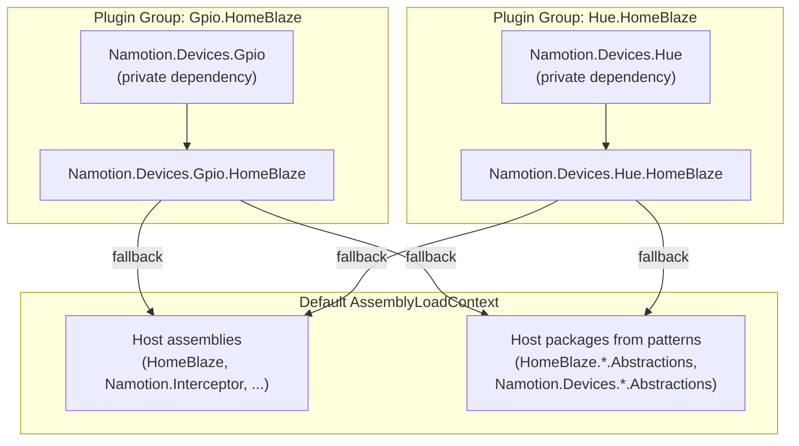
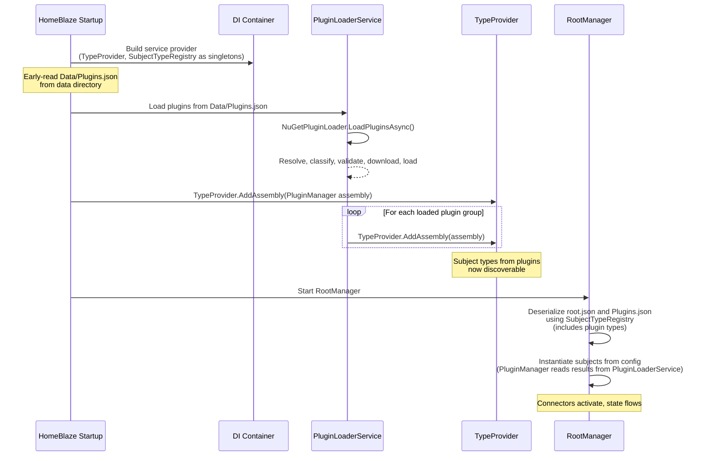

# Plugin System Design

Everything in HomeBlaze is a subject, and a plugin is simply a NuGet package that provides subject types. Connectors, agents, document stores, device subjects, UI components, and business logic are all delivered as plugins.

## What a Plugin Provides

One or more `[InterceptorSubject]` classes. That is the only contract.

| Role             | Example                                                            |
|------------------|--------------------------------------------------------------------|
| Device connector | An OPC UA client subject with `[SourcePath]` properties            |
| Protocol server  | An MQTT or OPC UA server subject exposing the graph                |
| AI agent         | A `BackgroundService` subject with LLM integration                 |
| Document store   | A storage subject managing files                                   |
| Dashboard        | A subject with `[SubjectEditor(typeof(...))]` for custom Blazor UI |
| Business logic   | A subject with `[Operation]` methods and `[Derived]` properties    |
| Domain model     | A domain-specific subject (Press, Motor, Thermostat)               |

Plugins can also include Blazor UI components (widgets, editors, setup forms) associated with their subjects via `[SubjectComponent]` attributes.

## Plugin Loading Modes

### Build-time (compiled in)

Core plugins are standard NuGet `<PackageReference>` entries. Their assemblies are part of the host application and loaded into the default `AssemblyLoadContext`.

### Runtime (dynamic)

Additional plugins are resolved and loaded at startup using the standalone `Namotion.NuGet.Plugins` library. This library is general-purpose with no HomeBlaze dependency. See its [README](../../../../Namotion.NuGet.Plugins/README.md) for full API documentation, usage examples, and configuration reference.

The runtime loader handles:
- Transitive dependency resolution via NuGet API
- Dependency classification (host vs plugin-private)
- Semantic version compatibility validation
- Per-plugin-group `AssemblyLoadContext` isolation
- Local `.nupkg` file loading

## HomeBlaze-Specific Architecture

### Configuration (`Data/Plugins.json`)

Plugin configuration lives in `Data/Plugins.json` relative to the application directory. The path can be overridden via the `PluginConfigPath` setting in `appsettings.json`.

Because `Plugins.json` is also a subject configuration file, it includes a `$type` discriminator so the subject system can deserialize it as a `PluginManager`:

```json
{
  "$type": "HomeBlaze.Plugins.PluginManager",
  "feeds": [
    { "name": "nuget.org", "url": "https://api.nuget.org/v3/index.json" }
  ],
  "hostPackages": [
    "HomeBlaze.*.Abstractions",
    "Namotion.Devices.*.Abstractions"
  ],
  "plugins": [
    { "packageName": "Namotion.Devices.Gpio.HomeBlaze", "version": "0.1.0" },
    { "packageName": "MyLocalPlugin", "path": "plugins/MyLocalPlugin.1.0.0.nupkg" }
  ]
}
```

| Field | Purpose |
|-------|---------|
| `$type` | Subject type discriminator for `PluginManager` |
| `feeds` | NuGet package sources, tried in order |
| `hostPackages` | Glob patterns for shared contract assemblies loaded into the default context |
| `plugins` | Plugin packages to load (by name/version from feeds, or local `.nupkg` path) |

### Subject Model

The plugin system uses two subjects in the `HomeBlaze.Plugins` namespace:

**PluginManager** -- owns plugin configuration and runtime state. Implements `IConfigurable` so it can be deserialized from `Plugins.json` via the `$type` discriminator. Its `[Configuration]` properties (`Plugins`, `Feeds`, `HostPackages`) are persisted. Its `[State]` property `LoadedPlugins` is a `Dictionary<string, PluginInfo>` keyed by package name, populated at startup from `PluginLoaderService`.

**PluginInfo** (in `HomeBlaze.Plugins.Models`) -- represents a loaded plugin. Has `[State]` properties (`Name`, `Version`, `AssemblyCount`, `Status`), a `[Derived]` title, and an `[Operation]` to remove the plugin. Holds a reference to its parent `PluginManager`.

DTOs (`PluginConfigEntry`, `PluginFeedEntry`) also live in the `Models` namespace.

### Assembly Isolation

Each plugin package and its private dependencies are loaded into a dedicated `AssemblyLoadContext`. Assemblies classified as "host" (from the host's `deps.json` or matching `hostPackages` patterns) are loaded into the default context so that types are shared between host and all plugins.



This model ensures that when a plugin implements a host-defined interface (e.g., `ITemperatureSensor`), the type identity is shared. Plugin-private dependencies are fully isolated -- different plugins can use different versions of the same library without conflict.

### Bootstrap Sequence

Plugin loading happens before the subject system starts, because configuration deserialization references subject types from plugins.



The key ordering constraints:
1. **Build DI** -- `TypeProvider`, `SubjectTypeRegistry`, and `PluginLoaderService` are registered as singletons
2. **Load plugins** -- `PluginLoaderService` resolves, downloads, and loads plugins after `app.Build()` but before hosted services start
3. **Register types** -- Plugin assemblies are fed to `TypeProvider` so `SubjectTypeRegistry` discovers their `[InterceptorSubject]` types
4. **Deserialize config** -- `RootManager` deserializes `root.json` and `Plugins.json` using the now-complete type registry. `PluginManager` reads already-loaded results from `PluginLoaderService`

### PluginLoaderService

`PluginLoaderService` is a core DI service (not a subject) that bridges `Namotion.NuGet.Plugins` and HomeBlaze. It reads `Data/Plugins.json` via `PluginConfiguration.LoadFrom()`, initializes `HostDependencyResolver.FromDepsJson()` to detect host assemblies, passes `hostPackages` patterns from the JSON config to the loader, and exposes the `NuGetPluginLoader` instance so `PluginManager` can read loaded plugin state at deserialization time.

### Sample Plugin

`HomeBlaze.SamplePlugin` is a reference implementation demonstrating how to build a plugin package. It is a single Razor SDK project that produces a `.nupkg` on build via `GeneratePackageOnBuild`. The sample includes a device subject, a widget component, and an edit component with dirty tracking and validation events. The default `Data/Plugins.json` loads it from a local `.nupkg` path.

### Plugin Updates

Plugins support unload and reload but not hot-reload. In practice, HomeBlaze restarts to pick up plugin changes. The update cycle is: unload the plugin group, update the version in `Plugins.json`, reload via `LoadPluginsAsync`.

## Key Decisions

| Decision | Choice | Rationale |
|----------|--------|-----------|
| Plugin contract | Subject types only | Everything is a subject -- no separate plugin interfaces |
| Distribution | NuGet packages | Standard .NET ecosystem, versioning, feeds |
| Loading modes | Build-time + runtime | Core compiled in, extensibility via dynamic loading |
| Bootstrap | DI service + subject | `PluginLoaderService` loads before subjects; `PluginManager` reflects state after deserialization |
| Configuration | `Data/Plugins.json` with `$type` | Subject config file co-located with other data files |
| Assembly isolation | Per-plugin-group `AssemblyLoadContext` | Isolates plugins while sharing host types via default context |
| Dependency resolution | Eager transitive with validation | Full dependency tree resolved before loading, semver validated |
| Version conflicts | Fail-fast for host conflicts | Inconsistent default context is unsafe; plugin failures are isolated |
| Runtime loader | `Namotion.NuGet.Plugins` (standalone) | General-purpose, no HomeBlaze dependency |
| Plugin updates | Restart (no hot-reload) | Simplifies lifecycle |
