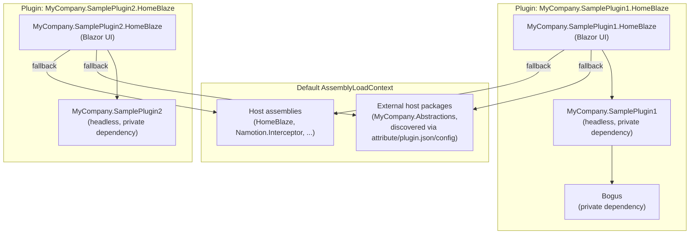
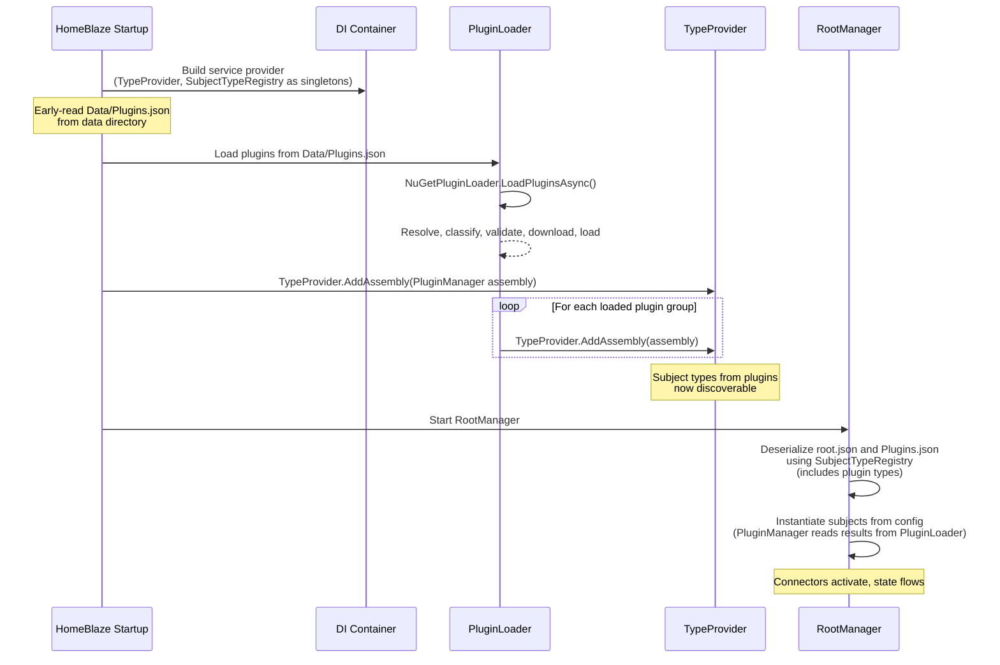

# Plugin System Design

Everything in HomeBlaze is a subject, and a plugin is simply a NuGet package that provides subject types. Connectors, agents, document stores, device subjects, UI components, and business logic are all delivered as plugins.

## What a Plugin Provides

One or more `[InterceptorSubject]` classes. That is the only contract.

| Role             | Example                                                            |
|------------------|--------------------------------------------------------------------|
| Device connector | An OPC UA client subject with `[SourcePath]` properties            |
| Protocol server  | An MQTT or OPC UA server subject exposing the graph                |
| AI agent         | A `BackgroundService` subject with LLM integration                 |
| Document store   | A storage subject managing files                                   |
| Dashboard        | A subject with `[SubjectEditor(typeof(...))]` for custom Blazor UI |
| Business logic   | A subject with `[Operation]` methods and `[Derived]` properties    |
| Domain model     | A domain-specific subject (Press, Motor, Thermostat)               |

Plugins can also include Blazor UI components (widgets, editors, setup forms) associated with their subjects via `[SubjectComponent]` attributes.

## Plugin Loading Modes

### Build-time (compiled in)

Core plugins are standard NuGet `<PackageReference>` entries. Their assemblies are part of the host application and loaded into the default `AssemblyLoadContext`.

### Runtime (dynamic)

External plugins are resolved and loaded at startup using the standalone `Namotion.NuGet.Plugins` library. This library is general-purpose with no HomeBlaze dependency. See its [README](../../../../../Namotion.NuGet.Plugins/README.md) for full API documentation, usage examples, and configuration reference.

The runtime loader handles:
- Transitive dependency resolution via NuGet API
- Dependency classification (host vs plugin-private)
- Semantic version compatibility validation
- Per-plugin-group `AssemblyLoadContext` isolation
- Local folder feeds (NuGet SDK resolves from directory paths natively)

## HomeBlaze-Specific Architecture

### Configuration (`Data/Plugins.json`)

Plugin configuration lives in `Data/Plugins.json` relative to the application directory. The path can be overridden via the `PluginConfigPath` setting in `appsettings.json`.

Because `Plugins.json` is also a subject configuration file, it includes a `$type` discriminator so the subject system can deserialize it as a `PluginManager`:

```json
{
  "$type": "HomeBlaze.Plugins.PluginManager",
  "feeds": [
    { "name": "local", "url": "Plugins" }
  ],
  "hostPackages": [],
  "plugins": [
    { "packageName": "MyCompany.SamplePlugin1.HomeBlaze", "version": "1.0.0" },
    { "packageName": "MyCompany.SamplePlugin2.HomeBlaze", "version": "1.0.0" }
  ]
}
```

Feeds can be remote NuGet V3 service index URLs or local folder paths. In the example above, the `"local"` feed points to a `Plugins` directory relative to the application, where `.nupkg` files are placed at build time. The NuGet SDK resolves packages from local directories natively. The `hostPackages` array is empty because host-shared packages are now discovered automatically (see [Host-Shared Package Discovery](#host-shared-package-discovery) below).

| Field | Purpose |
|-------|---------|
| `$type` | Subject type discriminator for `PluginManager` |
| `feeds` | NuGet package sources (remote URLs or local folder paths), tried in order |
| `hostPackages` | Manual override patterns for shared contract assemblies loaded into the default context (typically empty when using automatic discovery) |
| `plugins` | Plugin packages to load by name and optional version from the configured feeds |

### Subject Model

The plugin system uses two subjects in the `HomeBlaze.Plugins` namespace:

**PluginManager** -- owns plugin configuration and runtime state. Implements `IConfigurable` so it can be deserialized from `Plugins.json` via the `$type` discriminator. Its `[Configuration]` properties (`Plugins`, `Feeds`, `HostPackages`) are persisted. Its `[State]` property `LoadedPlugins` is a `Dictionary<string, Plugin>` keyed by package name, populated at startup from `PluginLoader`.

**Plugin** (in `HomeBlaze.Plugins.Models`) -- represents a loaded plugin. Has `[State]` properties (`Name`, `Version`, `Description`, `Authors`, `IconUrl`, `Tags`, `Assemblies` (string[]), `HostDependencies`, `PrivateDependencies`, `Status`, `StatusMessage`), `[Derived]` properties (`Title`, `IconName`, `IconColor`), and a parameterless `[Operation] RemovePlugin()` that uses `this.Name`. Holds a reference to its parent `PluginManager`.

DTOs (`PluginEntry`, `PluginFeedEntry`) also live in the `Models` namespace.

### Assembly Isolation

Each plugin package and its private dependencies are loaded into a dedicated `AssemblyLoadContext`. Assemblies classified as "host" (from the host's `deps.json`, automatic discovery, or matching `HostPackages` patterns) are loaded into the default context so that types are shared between host and all plugins.



This model ensures that when a plugin implements a host-defined interface (e.g., `ITemperatureSensor`), the type identity is shared. Plugin-private dependencies are fully isolated -- different plugins can use different versions of the same library without conflict.

### Bootstrap Sequence

Plugin loading happens before the subject system starts, because configuration deserialization references subject types from plugins.



The key ordering constraints:
1. **Build DI** -- `TypeProvider`, `SubjectTypeRegistry`, and `PluginLoader` are registered as singletons
2. **Load plugins** -- `PluginLoader` resolves, downloads, and loads plugins after `app.Build()` but before hosted services start
3. **Register types** -- Plugin assemblies are fed to `TypeProvider` so `SubjectTypeRegistry` discovers their `[InterceptorSubject]` types
4. **Deserialize config** -- `RootManager` deserializes `root.json` and `Plugins.json` using the now-complete type registry. `PluginManager` reads already-loaded results from `PluginLoader`

### PluginLoader

`PluginLoader` is a core DI service (not a subject) that bridges `Namotion.NuGet.Plugins` and HomeBlaze. It reads `Data/Plugins.json` via `PluginConfiguration.LoadFrom()`, initializes `HostDependencyResolver.FromDepsJson()` (which uses `DependencyContext.Default` to detect host assemblies including both NuGet packages and project references), passes `hostPackages` patterns from the JSON config to the loader, and exposes the `NuGetPluginLoader` instance so `PluginManager` can read loaded plugin state at deserialization time.

### Sample Plugins

The sample plugins demonstrate the recommended headless/UI separation pattern and the host-shared package discovery mechanism:

- **`MyCompany.Abstractions`** -- a shared contract package defining the `IMyDevice` interface. Declares itself as host-shared via `[assembly: AssemblyMetadata("Namotion.NuGet.Plugins.HostShared", "true")]`, so the loader automatically loads it into the default `AssemblyLoadContext` without any manual `HostPackages` configuration.
- **`MyCompany.SamplePlugin1`** -- a headless library containing a temperature sensor device subject that generates fake sensor data using the Bogus library. Implements `IMyDevice` from `MyCompany.Abstractions`. This package has no Blazor or UI dependencies.
- **`MyCompany.SamplePlugin1.HomeBlaze`** -- a Razor SDK project containing Blazor UI components (widget and edit components) for the sample temperature sensor. It references `MyCompany.SamplePlugin1` as a dependency and includes a `plugin.json` declaring `hostDependencies`.
- **`MyCompany.SamplePlugin2`** -- a second headless library containing a light sensor device subject. Also implements `IMyDevice`.
- **`MyCompany.SamplePlugin2.HomeBlaze`** -- a Razor SDK project containing Blazor UI components for the light sensor. Follows the same pattern as plugin 1.

All projects produce `.nupkg` files on build via `GeneratePackageOnBuild`. Listing `MyCompany.SamplePlugin1.HomeBlaze` in `Plugins.json` transitively pulls in `MyCompany.SamplePlugin1` and `MyCompany.Abstractions`. The default `Data/Plugins.json` loads both sample plugins from a local folder feed pointing to the `Plugins` directory. Because both plugins share `MyCompany.Abstractions` in the default context, type identity is preserved -- `IMyDevice` is the same type across all plugins.

### Plugin Updates

Plugins support unload and reload but not hot-reload. In practice, HomeBlaze restarts to pick up plugin changes. The update cycle is: unload the plugin group, update the version in `Plugins.json`, reload via `LoadPluginsAsync`.

### Host-Shared Package Discovery

Plugin dependencies that need to be shared across plugins (e.g., contract/abstractions packages) must be loaded into the default `AssemblyLoadContext` to preserve type identity. The loader discovers host-shared packages through three complementary mechanisms:

1. **Assembly attribute** -- The contract package author adds `[assembly: AssemblyMetadata("Namotion.NuGet.Plugins.HostShared", "true")]`. The loader detects this via `System.Reflection.Metadata` without loading the assembly into any context.
2. **`plugin.json` manifest** -- The plugin author includes a `plugin.json` file in the nupkg root with a `hostDependencies` array listing packages that should be host-shared. This is useful when the contract author has not added the attribute.
3. **`HostPackages` configuration** -- The host author lists glob patterns in the loader options as a manual fallback.

These three sources are additive -- a package is host-shared if any source declares it so. See the [Namotion.NuGet.Plugins README](../../../../../Namotion.NuGet.Plugins/README.md) for full details on each mechanism.

> **Note:** UI libraries like MudBlazor are automatically detected as host dependencies when the host application references them (they appear in the host's `deps.json`). If a plugin requires an incompatible major version (e.g., MudBlazor v8 when the host uses v9), the version validation will flag this as a conflict during Phase 3.

## Key Decisions

| Decision | Choice | Rationale |
|----------|--------|-----------|
| Plugin contract | Subject types only | Everything is a subject -- no separate plugin interfaces |
| Distribution | NuGet packages | Standard .NET ecosystem, versioning, feeds |
| Loading modes | Build-time + runtime | Core compiled in, extensibility via dynamic loading |
| Bootstrap | DI service + subject | `PluginLoader` loads before subjects; `PluginManager` reflects state after deserialization |
| Configuration | `Data/Plugins.json` with `$type` | Subject config file co-located with other data files |
| Assembly isolation | Per-plugin-group `AssemblyLoadContext` | Isolates plugins while sharing host types via default context |
| Dependency resolution | Eager transitive with validation | Full dependency tree resolved before loading, semver validated |
| Version conflicts | Fail-fast for host conflicts | Inconsistent default context is unsafe; plugin failures are isolated |
| Runtime loader | `Namotion.NuGet.Plugins` (standalone) | General-purpose, no HomeBlaze dependency |
| Plugin updates | Restart (no hot-reload) | Simplifies lifecycle |
| Host-shared discovery | Automatic via attribute + plugin.json + manual config | Three complementary actors (contract author, plugin author, host author) can declare packages as host-shared; manual config becomes a fallback, not the primary mechanism |
