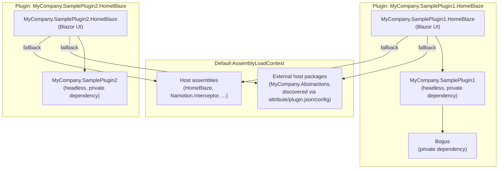
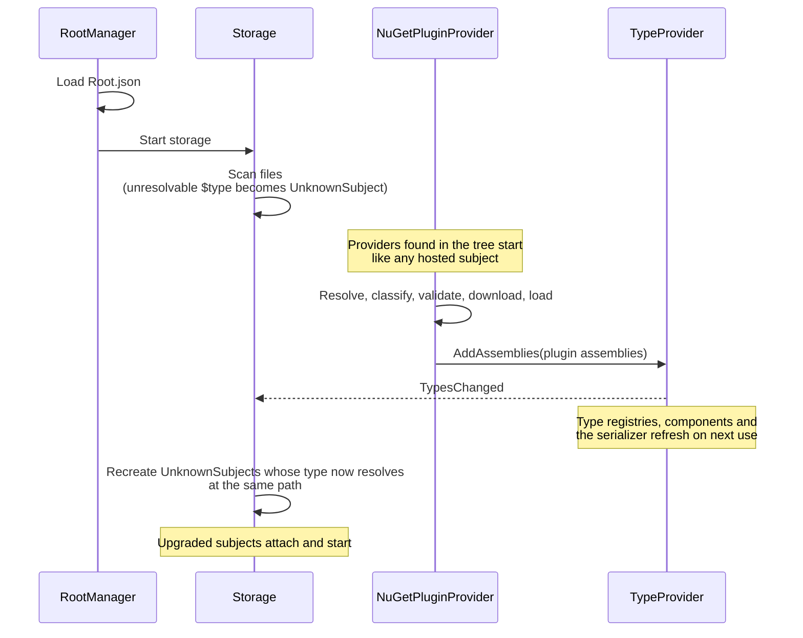

# Plugin System Design

Everything in HomeBlaze is a subject, and a plugin is simply a NuGet package that provides subject types. Connectors, agents, document stores, device subjects, UI components, and business logic are all delivered as plugins.

## What a Plugin Provides

One or more `[InterceptorSubject]` classes. That is the only contract.

| Role             | Example                                                            |
|------------------|--------------------------------------------------------------------|
| Device connector | An OPC UA client subject with `[SourcePath]` properties            |
| Protocol server  | An MQTT or OPC UA server subject exposing the graph                |
| AI agent         | A `BackgroundService` subject with LLM integration                 |
| Document store   | A storage subject managing files                                   |
| Dashboard        | A subject with `[SubjectEditor(typeof(...))]` for custom Blazor UI |
| Business logic   | A subject with `[Operation]` methods and `[Derived]` properties    |
| Domain model     | A domain-specific subject (Press, Motor, Thermostat)               |

Plugins can also include Blazor UI components (widgets, editors, setup forms) associated with their subjects via `[SubjectComponent]` attributes.

## Plugin Loading Modes

### Build-time (compiled in)

Core plugins are standard NuGet `<PackageReference>` entries. Their assemblies are part of the host application and loaded into the default `AssemblyLoadContext`.

### Runtime (dynamic)

External plugins are resolved and loaded at runtime by plugin provider subjects (see [Plugin Providers](#plugin-providers)) using the standalone `Namotion.NuGet.Plugins` library. This library is general-purpose with no HomeBlaze dependency. See its [README](../../../../../../Namotion.NuGet.Plugins/README.md) for full API documentation, usage examples, and configuration reference.

The runtime loader handles:
- Transitive dependency resolution via NuGet API
- Dependency classification (host vs plugin-private)
- Semantic version compatibility validation
- Per-plugin-group `AssemblyLoadContext` isolation
- Local folder feeds (NuGet SDK resolves from directory paths natively)

## HomeBlaze-Specific Architecture

### Plugin Providers

A plugin provider is a subject that loads plugin assemblies at runtime and adds them to the `TypeProvider`. HomeBlaze ships one provider type, `NuGetPluginProvider`, and its instances are ordinary JSON subject files that can live anywhere in the subject tree. There is no fixed configuration path: every `NuGetPluginProvider` in the tree loads its plugins when it starts. The container seed ships one provider as `Files/Plugins.json` with nuget.org as its only feed and no plugins. Several providers can coexist (see [Multiple Providers](#multiple-providers)).

### Configuration

The development data folder contains this `Files/Plugins.json`:

```json
{
  "$type": "HomeBlaze.Plugins.NuGetPluginProvider",
  "feeds": [
    { "name": "local", "url": "../Plugins" },
    { "name": "nuget.org", "url": "https://api.nuget.org/v3/index.json" }
  ],
  "hostPackages": [],
  "hostIdentifier": "HomeBlaze",
  "plugins": [
    { "packageName": "MyCompany.SamplePlugin1.HomeBlaze", "version": "1.0.0" },
    { "packageName": "MyCompany.SamplePlugin2.HomeBlaze", "version": "1.0.0" }
  ]
}
```

The `local` feed is a folder path relative to the data folder `src/HomeBlaze/HomeBlaze/Data`, so it points to `src/HomeBlaze/HomeBlaze/Plugins`, where the sample plugin builds place their `.nupkg` files. The `hostPackages` array is empty because host-shared packages are discovered automatically (see [Host-Shared Package Discovery](#host-shared-package-discovery) below). The file sets no `cacheDirectory`, so downloaded packages are kept in `Plugins/Cache` in the data folder and are not downloaded again after a restart.

| Field | Purpose |
|-------|---------|
| `$type` | `HomeBlaze.Plugins.NuGetPluginProvider` |
| `feeds` | NuGet package sources, tried in order. Each entry has a `name`, a `url` and an optional `apiKey`. The URL is a NuGet V3 service index, an absolute folder path, a `file:` URI, or a folder path relative to the data folder. Entries without a URL are skipped with a warning; when no feed is left, nuget.org is used. |
| `hostIdentifier` | Host identifier for assembly attribute matching (required for automatic discovery via attributes) |
| `hostPackages` | Manual override patterns for shared contract assemblies loaded into the default context (typically empty when using automatic discovery) |
| `cacheDirectory` | Folder for downloaded plugin packages. A relative path resolves against the data folder; empty or missing means `Plugins/Cache`. |
| `plugins` | Plugin packages to load by `packageName` and optional `version` from the configured feeds |

See [Configuration](../../administration/configuration.md#data-folder) for the data folder layout.

### Subject Model

The plugin system uses two subjects in the `HomeBlaze.Plugins` namespace:

**NuGetPluginProvider** loads the configured packages and shows their state. It is a hosted subject (`BackgroundService`) that implements `IConfigurable`. Its `[Configuration]` properties (`Feeds`, `HostPackages`, `HostIdentifier`, `CacheDirectory`, `Plugins`) are persisted to its JSON file. Its `[State]` properties are `LoadedPlugins`, a `Dictionary<string, Plugin>` keyed by package name, and `IsRestartRequired`, which is set when a configuration change only takes effect after a restart. The provider icon turns to the warning color when a restart is required or a plugin failed to load. Its operations are:

- **Add Plugin** adds a package name and version to `Plugins` and loads the package right away.
- **Retry Failed Plugins** tries again to load every plugin that failed, for example after a feed was unreachable.

**Plugin** represents one configured package. It has `[State]` properties (`Name`, `Version`, `Description`, `Authors`, `IconUrl`, `Tags`, `Assemblies`, `HostDependencies`, `PrivateDependencies`, `Status`, `StatusMessage`), `[Derived]` properties (`Title`, `IconName`, `IconColor`), and a **Remove Plugin** operation that removes the package from the provider's configuration. A package that failed to load has the status Error and the reason in `StatusMessage`.

The DTOs `PluginEntry` and `PluginFeedEntry` live in the `HomeBlaze.Plugins.Models` namespace.

### Changing Plugins

A provider creates one loader from its configuration and keeps it until the process exits, because unloading assemblies that live subjects still use is not safe. This decides which changes apply right away:

| Change | Takes effect |
|--------|--------------|
| Add a plugin | Immediately. The package is loaded and its types become available. |
| Remove a plugin, or change its version | After a restart. The plugin shows a message and `IsRestartRequired` is set. |
| Remove or change a plugin that failed to load | Immediately, because none of its types were registered. |
| Change `feeds`, `hostPackages`, `hostIdentifier` or `cacheDirectory` after the first package was loaded | After a restart. `IsRestartRequired` is set. |

The same rules apply whether the change is made through the operations, the property editor, or by editing the JSON file on disk. Edits on disk are picked up by the storage and applied in the background, so a slow package download does not hold up other file changes. Reverting a pending change clears the restart message again.

### Assembly Isolation

Each plugin package and its private dependencies are loaded into a dedicated `AssemblyLoadContext`. Assemblies classified as "host" (from the host's `deps.json`, automatic discovery, or matching `HostPackages` patterns) are loaded into the default context so that types are shared between host and all plugins.



This model ensures that when a plugin implements a host-defined interface (e.g., `ITemperatureSensor`), the type identity is shared. Plugin-private dependencies are fully isolated -- different plugins can use different versions of the same library without conflict.

### Bootstrap Sequence

Plugins load after the subject tree is up. Files whose type comes from a plugin start as placeholders and are upgraded in place once a provider has added the type.



The key steps:
1. **Load the tree**: `RootManager` loads `Root.json` and the storages scan their files. A JSON file whose `$type` cannot be created yet becomes an [`UnknownSubject`](#unknown-types).
2. **Load plugins**: every `NuGetPluginProvider` in the tree starts, loads its packages and adds their assemblies to `TypeProvider` with `AddAssemblies`.
3. **Refresh**: `TypeProvider` raises `TypesChanged`. `SubjectTypeRegistry`, `SubjectComponentRegistry` and `ConfigurableSubjectSerializer` rebuild their caches when they next see a new type list, and every storage recreates its `UnknownSubject`s whose type now resolves.
4. **Settle**: whatever is still unknown after all providers have finished stays an `UnknownSubject` with its reason.
5. **Startup completes**: the `StartupGate` on the subject context completes once the root is loaded, the queued hosted subject starts ran, the storages finished their first scan, every provider finished its initial load and the placeholder upgrades this triggered are done. Each of these defers the gate through `IStartupCompletion` until its work ran. Subjects that build a one-time view of the tree wait for it: the OPC UA server starts only then, so subjects of plugin types are in its address space.

`HomeBlaze.Plugins` itself is registered with `TypeProvider` at startup so that `NuGetPluginProvider` files resolve during the first scan.

### Unknown Types

A JSON file with a `$type` that cannot be created becomes an `UnknownSubject` instead of being dropped. This happens when no loaded assembly has the type, when creating the subject throws, or when the file is not valid JSON but contains `"$type"`. The subject shows a warning icon, the `$type` value and the reason, and keeps the path the real subject would have (the file name without `.json`), so references to that path work once the type arrives.

The file of an `UnknownSubject` is never rewritten: it stays exactly as authored until the real type takes over. Its raw JSON can be edited and the file deleted like any other file. Saving it, or changing it on disk, recreates the subject from the file, which yields the real subject when the type can now be created, or an `UnknownSubject` with the current reason. When types are added, storages upgrade their `UnknownSubject`s automatically; a file with invalid JSON only changes when the file itself changes. See [Subjects, Storage & Files](../../administration/subjects.md#file-types) for how JSON files are classified.

### Multiple Providers

Each `NuGetPluginProvider` has its own loader and its own `LoadedPlugins`, so several providers can coexist, for example one per feed or per team. They share the process, which has consequences:

- **Shared contracts load once per process.** A host-shared package (see [Host-Shared Package Discovery](#host-shared-package-discovery)) is loaded once into the default `AssemblyLoadContext`, and the first loaded version wins for all providers. Keep plugins that share a contract package in one provider when they need different versions of it, so the loader can pick one version that satisfies all of them.
- **Duplicate type names are skipped.** When a provider adds a type whose full name is already registered from another assembly, the type is skipped and a warning names both assemblies. The plugin's `StatusMessage` lists the skipped types.
- **The cache can be shared.** Packages are extracted into a temporary folder and moved into place, so providers that use the same `cacheDirectory` do not corrupt each other's extractions.

### Writing a Provider

`NuGetPluginProvider` is one way to add types. Any subject can be a plugin provider: get `TypeProvider` injected and call `AddAssemblies` with the assemblies to register. To configure the provider from a JSON file like `NuGetPluginProvider`, also implement `IConfigurable` (see [Configurable Subjects](../../development/configurable-subject.md)).

```csharp
[InterceptorSubject]
public partial class MyPluginProvider : BackgroundService
{
    private readonly TypeProvider _typeProvider;

    public MyPluginProvider(TypeProvider typeProvider)
    {
        _typeProvider = typeProvider;
    }

    protected override Task ExecuteAsync(CancellationToken stoppingToken)
    {
        var assemblies = LoadMyAssemblies();
        var skippedTypes = _typeProvider.AddAssemblies(assemblies);
        // Log skippedTypes: their full names are already registered from other assemblies.
        return Task.CompletedTask;
    }
}
```

`AddAssemblies` raises `TypesChanged` once when at least one type was added, and storages then upgrade their `UnknownSubject`s automatically. Handlers of `TypesChanged` run synchronously on the calling thread. Removing assemblies is not supported: added types stay registered until the process exits.

### Sample Plugins

The sample plugins demonstrate the recommended headless/UI separation pattern and the host-shared package discovery mechanism:

- **`MyCompany.Abstractions`** -- a shared contract package defining the `IMyDevice` interface. Declares itself as host-shared via `[assembly: AssemblyMetadata("Namotion.NuGet.Plugins.HostPackage", "HomeBlaze")]`, so the loader automatically loads it into the default `AssemblyLoadContext` without any manual `HostPackages` configuration.
- **`MyCompany.SamplePlugin1`** -- a headless library containing a temperature sensor device subject that generates fake sensor data using the Bogus library. Implements `IMyDevice` from `MyCompany.Abstractions`. This package has no Blazor or UI dependencies.
- **`MyCompany.SamplePlugin1.HomeBlaze`** -- a Razor SDK project containing Blazor UI components (widget and edit components) for the sample temperature sensor. It references `MyCompany.SamplePlugin1` as a dependency and includes a `plugin.json` declaring `hostDependencies`.
- **`MyCompany.SamplePlugin2`** -- a second headless library containing a light sensor device subject. Also implements `IMyDevice`.
- **`MyCompany.SamplePlugin2.HomeBlaze`** -- a Razor SDK project containing Blazor UI components for the light sensor. Follows the same pattern as plugin 1.

All projects produce `.nupkg` files on build via `GeneratePackageOnBuild`. Listing `MyCompany.SamplePlugin1.HomeBlaze` in `Plugins.json` transitively pulls in `MyCompany.SamplePlugin1` and `MyCompany.Abstractions`. The development `Data/Files/Plugins.json` loads both sample plugins from the local folder feed shown in [Configuration](#configuration). Because both plugins share `MyCompany.Abstractions` in the default context, type identity is preserved -- `IMyDevice` is the same type across all plugins.

### Host-Shared Package Discovery

Plugin dependencies that need to be shared across plugins (e.g., contract/abstractions packages) must be loaded into the default `AssemblyLoadContext` to preserve type identity. The loader discovers host-shared packages through three complementary mechanisms:

1. **Assembly attribute** -- The contract package author adds `[assembly: AssemblyMetadata("Namotion.NuGet.Plugins.HostPackage", "HomeBlaze")]`. The value is a host identifier; the loader only recognizes this attribute when `HostIdentifier` is configured in the options and the attribute value matches (case-insensitive). The loader detects this via `System.Reflection.Metadata` without loading the assembly into any context.
2. **`plugin.json` manifest** -- The plugin author includes a `plugin.json` file in the nupkg root with a `hostDependencies` array listing packages that should be host-shared. This is useful when the contract author has not added the attribute.
3. **`HostPackages` configuration** -- The host author lists glob patterns in the loader options as a manual fallback.

These three sources are additive -- a package is host-shared if any source declares it so. See the [Namotion.NuGet.Plugins README](../../../../../../Namotion.NuGet.Plugins/README.md) for full details on each mechanism.

> **Note:** UI libraries like MudBlazor are automatically detected as host dependencies when the host application references them (they appear in the host's `deps.json`). If a plugin requires an incompatible major version (e.g., MudBlazor v8 when the host uses v9), the version validation will flag this as a conflict during Phase 3.

The container image reports the released versions of the Namotion libraries in its `deps.json`, so plugins are validated against those versions. A build from source reports `0.1.0` for these libraries, so a plugin built against a released version of them is rejected there as a version conflict.

## Key Decisions

| Decision | Choice | Rationale |
|----------|--------|-----------|
| Plugin contract | Subject types only | Everything is a subject -- no separate plugin interfaces |
| Distribution | NuGet packages | Standard .NET ecosystem, versioning, feeds |
| Loading modes | Build-time + runtime | Core compiled in, extensibility via dynamic loading |
| Bootstrap | Provider subjects in the tree, placeholders for unknown types | Plugins load like any other subject; files whose type arrives later upgrade in place |
| Configuration | `NuGetPluginProvider` JSON files anywhere in the tree | Plugin configuration is ordinary subject configuration; several providers can coexist |
| Provider contract | `TypeProvider.AddAssemblies` and `TypesChanged` | No new interface or host service; any subject can contribute types |
| Assembly isolation | Per-plugin-group `AssemblyLoadContext` | Isolates plugins while sharing host types via default context |
| Dependency resolution | Eager transitive with validation | Full dependency tree resolved before loading, semver validated |
| Version conflicts | Fail-fast for host conflicts | Inconsistent default context is unsafe; plugin failures are isolated |
| Runtime loader | `Namotion.NuGet.Plugins` (standalone) | General-purpose, no HomeBlaze dependency |
| Plugin updates | Adding is immediate; removing and updating need a restart | Loaded assemblies cannot be unloaded safely while subjects use them |
| Host-shared discovery | Automatic via attribute + plugin.json + manual config | Three complementary actors (contract author, plugin author, host author) can declare packages as host-shared; manual config becomes a fallback, not the primary mechanism |

## Known Limitations

- **Removing a provider keeps its types.** Deleting a provider file leaves the types it added registered until the next restart.
- **Plugins added at runtime are missing from OPC UA until the server restarts.** The OPC UA server builds its address space once when it starts and adds no nodes for subjects attached later. Subjects whose type comes from a plugin added while running, and the subjects upgraded from placeholders because of it, appear in OPC UA after the server is restarted (its Stop and Start operations, or a restart of the application).
- **Reconnecting a storage loads packages again.** Changing a storage's own configuration recreates all its subjects, including any `NuGetPluginProvider` in it. The new provider loads its packages again into new load contexts. The types registered by the earlier copy are kept and the new copies are skipped as duplicates, and the memory of the earlier copies is only released on restart.

## Planned

### Runtime Plugin Unload/Reload

Currently removing or updating a plugin requires an application restart. Runtime unloading is planned but involves several challenges beyond assembly unloading:

1. **Assembly unloading** -- `NuGetPluginLoader.UnloadPlugin()` already supports unloading the plugin's `AssemblyLoadContext`. However, host-shared assemblies loaded into the default context cannot be unloaded.
2. **Subject instance lifecycle** -- When a plugin is unloaded, subject instances created from plugin types are still live in the object graph. These must either be removed from the graph entirely, or converted to placeholders that preserve their state without requiring the original type, as [`UnknownSubject`](#unknown-types) already does for files whose type is not loaded.
3. **Reload sequence** -- After unloading, the updated plugin version must be downloaded, loaded into a fresh `AssemblyLoadContext`, and subject instances re-created from the preserved state.
4. **UI invalidation** -- Blazor components from the old plugin must be replaced or removed when the plugin is unloaded.
