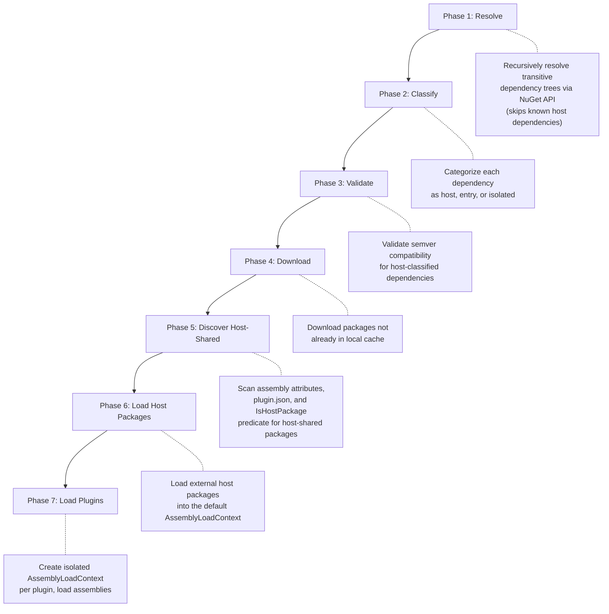
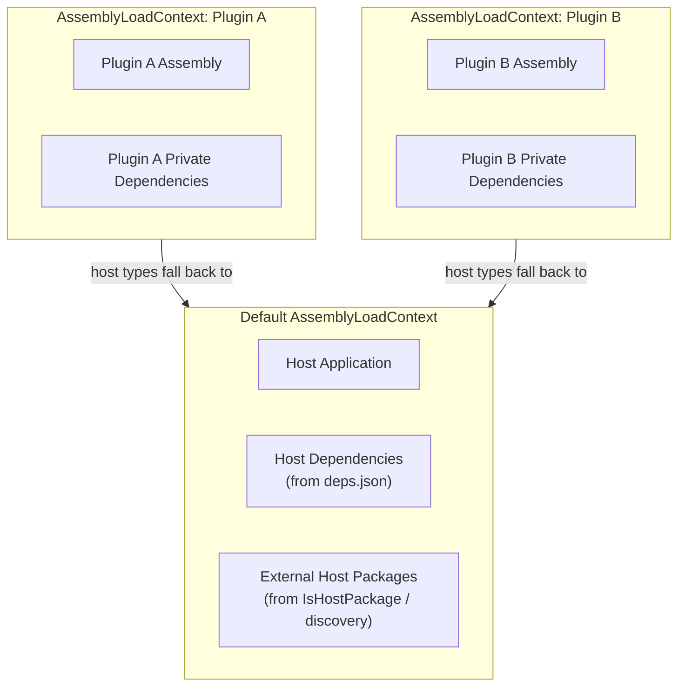

# Namotion.NuGet.Plugins

A standalone .NET library for loading NuGet packages as plugins at runtime. It provides isolated assembly contexts, transitive dependency resolution, and semantic version compatibility validation -- all without runtime reflection or manual assembly management.

## Features

- Download and load NuGet packages as plugins at runtime
- Transitive dependency resolution using the NuGet API
- Per-plugin assembly isolation via `AssemblyLoadContext`
- Automatic host dependency detection from `deps.json`
- Automatic host-shared package discovery via assembly attributes and plugin.json
- Semantic version compatibility validation
- Predicate-based host package matching
- Support for multiple NuGet feeds with authentication
- Local folder feeds (NuGet SDK resolves from directory paths natively)
- Graceful partial failure (one plugin failing does not block others)
- Type discovery across loaded plugins

## Installation

```shell
dotnet add package Namotion.NuGet.Plugins
```

## Usage

```csharp
using Namotion.NuGet.Plugins.Configuration;
using Namotion.NuGet.Plugins.Loading;

var options = new NuGetPluginLoaderOptions
{
    Feeds = [NuGetFeed.NuGetOrg],
    HostDependencies = HostDependencyResolver.FromDepsJson(),
    IsHostPackage = name => NuGetPackageNameMatcher.IsMatchAny(name, ["MyCompany.*.Abstractions"]),
};

using var loader = new NuGetPluginLoader(options);

var result = await loader.LoadPluginsAsync(
[
    new NuGetPluginReference("MyCompany.Plugin.Sensors", "1.0.0"),
    new NuGetPluginReference("MyCompany.Plugin.Actuators", "2.1.0"),
], CancellationToken.None);

if (!result.Success)
{
    foreach (var failure in result.Failures)
    {
        Console.WriteLine($"Plugin '{failure.PackageName}' failed: {failure.Reason}");
    }
}

// Access plugin metadata
foreach (var plugin in result.LoadedPlugins)
{
    Console.WriteLine($"Loaded: {plugin.PackageName} v{plugin.PackageVersion}");
    Console.WriteLine($"  Description: {plugin.Metadata.Description}");
    Console.WriteLine($"  Authors: {plugin.Metadata.Authors}");
    Console.WriteLine($"  Dependencies: {plugin.Dependencies.Count}");
}

// Discover types implementing a shared interface
foreach (var type in loader.GetTypes<ISensorDevice>())
{
    Console.WriteLine($"Found sensor: {type.FullName}");
}
```

## Configuration

### NuGetPluginLoaderOptions

| Property | Type | Default | Description |
|---|---|---|---|
| `Feeds` | `IReadOnlyList<NuGetFeed>` | `[NuGetFeed.NuGetOrg]` | NuGet package sources to search, in priority order |
| `IsHostPackage` | `Func<string, bool>?` | `null` | Predicate that determines whether a package should be loaded as a host assembly |
| `HostDependencies` | `HostDependencyResolver?` | `null` | Host dependency map for version validation |
| `CacheDirectory` | `string?` | `null` | Local directory for downloaded packages (auto-generated temp dir if null) |

The `CacheDirectory` option controls where extracted packages are stored. When omitted, a temporary directory with a unique name is created per loader instance -- packages are re-downloaded on every application restart. Set `CacheDirectory` to a stable path (e.g., `Path.Combine(Environment.GetFolderPath(Environment.SpecialFolder.LocalApplicationData), "MyApp", "plugins")`) to cache packages across restarts.

## Host Dependency Resolution

The host dependency map tells the loader which packages and versions the host application already provides. This serves two purposes:

1. **Classification** -- dependencies already in the host are not loaded into plugin-private contexts.
2. **Validation** -- the loader checks that plugin requirements are compatible with host versions.

### FromDepsJson (recommended)

Uses `Microsoft.Extensions.DependencyModel` to read the running application's dependency context, which contains all NuGet packages and project references with exact versions. This is the most complete and accurate method.

```csharp
var options = new NuGetPluginLoaderOptions
{
    HostDependencies = HostDependencyResolver.FromDepsJson(),
};
```

The parameterless overload uses `DependencyContext.Default`, which is populated automatically by the runtime from the application's `{app}.deps.json` file. Both NuGet packages and project references are included in the host dependency map.

There are also overloads for specific scenarios:

```csharp
// From a specific assembly's dependency context
HostDependencyResolver.FromDepsJson(typeof(MyApp).Assembly);

// From a deps.json file path (uses DependencyContextJsonReader)
HostDependencyResolver.FromDepsJson("/path/to/app.deps.json");
```

> **Note:** `DependencyContext.Default` is not available for AOT-compiled or single-file published applications. Use one of the `FromAssemblies` overloads in those cases.

### FromAssemblies (loaded assemblies)

Builds the dependency map from actual `Assembly` objects, using their assembly versions. Useful when deps.json is unavailable.

```csharp
var options = new NuGetPluginLoaderOptions
{
    HostDependencies = HostDependencyResolver.FromAssemblies(
        AppDomain.CurrentDomain.GetAssemblies()),
};
```

### FromAssemblies (explicit tuples)

For testing or edge cases, you can provide name/version pairs manually:

```csharp
var options = new NuGetPluginLoaderOptions
{
    HostDependencies = HostDependencyResolver.FromAssemblies(
        ("Microsoft.Extensions.Logging", new Version(9, 0, 0)),
        ("System.Text.Json", new Version(9, 0, 0))),
};
```

## Host Package Sharing

Plugins typically need to share certain packages with the host application so that types like interfaces and contracts have the same identity across all contexts. There are three mechanisms for declaring which packages should be host-shared, each suited to a different actor:

| Actor | Mechanism | When to use |
|---|---|---|
| Contract/abstractions author | Assembly attribute | You own the shared library and want it always treated as host |
| Plugin author | `plugin.json` manifest | You depend on a third-party contract you don't own |
| Host author | `IsHostPackage` predicate in loader options | Manual fallback / escape hatch |

All three mechanisms are additive -- a package is host-shared if *any* source declares it so.

### IsHostPackage predicate

The `IsHostPackage` predicate on `NuGetPluginLoaderOptions` determines which plugin dependencies should be treated as host assemblies rather than loaded into isolated plugin contexts.

Packages for which the predicate returns `true` are downloaded from the configured feeds and loaded into the default `AssemblyLoadContext`, making them available to both the host and all plugins.

```csharp
var options = new NuGetPluginLoaderOptions
{
    // Use NuGetPackageNameMatcher for glob-based matching
    IsHostPackage = name => NuGetPackageNameMatcher.IsMatchAny(name,
    [
        "MyCompany.*.Abstractions",  // Shared interface packages
        "Shared.Contracts",          // Exact match
    ]),
};
```

The `NuGetPackageNameMatcher` utility class provides glob-based matching where `*` matches one or more characters including dots, consistent with NuGet package source mapping conventions:

| Pattern | Matches | Does not match |
|---|---|---|
| `MyCompany.*.Abstractions` | `MyCompany.Devices.Abstractions`, `MyCompany.Devices.Philips.Abstractions` | `Microsoft.Extensions.Logging.Abstractions` |
| `MyCompany.*` | `MyCompany.Core`, `MyCompany.Devices`, `MyCompany.Devices.Philips.Hue` | `OtherCompany.Core` |
| `Exact.Package` | `Exact.Package` | `Exact.Package.Extra` |

You can also use any custom logic:

```csharp
var options = new NuGetPluginLoaderOptions
{
    IsHostPackage = name => name.StartsWith("MyCompany.") && name.EndsWith(".Abstractions"),
};
```

### Assembly attribute

The author of a shared contract package adds a single assembly-level attribute:

```csharp
[assembly: AssemblyMetadata("Namotion.NuGet.Plugins.HostShared", "true")]
```

This uses `System.Reflection.AssemblyMetadataAttribute` from the BCL, so it requires zero additional dependencies. The loader reads this attribute via `System.Reflection.Metadata` from the extracted DLL on disk, without loading the assembly into any `AssemblyLoadContext`.

### plugin.json hostDependencies

The plugin author creates a `plugin.json` file in their project listing packages that should be host-shared:

```json
{
  "schemaVersion": 1,
  "hostDependencies": ["ThirdParty.Contracts"]
}
```

And includes it in the nupkg via the csproj:

```xml
<None Include="plugin.json" Pack="true" PackagePath="" />
```

The loader reads `plugin.json` from the root of the extracted nupkg. This is useful when the plugin depends on a third-party contract package that does not have the `HostShared` assembly attribute.

## Plugin Manifest (plugin.json)

The `plugin.json` file is an optional manifest that a plugin author can include in the root of their NuGet package. It allows the plugin to declare host dependencies and carry consumer-defined metadata.

### Schema

The loader owns two fields:

| Field | Type | Purpose |
|---|---|---|
| `schemaVersion` | `int` | Format version for forward compatibility (currently `1`) |
| `hostDependencies` | `string[]` | Package names to classify as host-shared |

Everything else in the JSON file is consumer-defined and opaque to the loader. The full parsed JSON is exposed via `NuGetPlugin.PluginManifest` as `JsonElement?`, so consumers can read their own custom fields without any coupling to the loader.

### Example

```json
{
  "schemaVersion": 1,
  "hostDependencies": ["MyCompany.Abstractions"],
  "minimumHostVersion": "3.0.0",
  "diRegistrations": ["MyCompany.Device1.SensorService"]
}
```

In this example, the loader reads `schemaVersion` and `hostDependencies`. The consuming application (e.g., HomeBlaze) reads `minimumHostVersion` and `diRegistrations` from `plugin.PluginManifest` -- no coupling between the loader and any specific consumer.

### Accessing the manifest

```csharp
foreach (var plugin in result.LoadedPlugins)
{
    if (plugin.PluginManifest is { } manifest)
    {
        if (manifest.TryGetProperty("minimumHostVersion", out var version))
        {
            Console.WriteLine($"Plugin requires host >= {version.GetString()}");
        }
    }
}
```

If the package does not contain a `plugin.json`, `PluginManifest` is `null`. If the file exists but is malformed JSON, it is silently ignored and `PluginManifest` is `null`.

## Feeds and Authentication

Configure multiple NuGet feeds with optional API key authentication. Downloads are retried up to 5 times with exponential backoff on transient HTTP errors.

### Feed resolution order

Feeds are tried in the order they are listed. When searching for a package:
- If a feed **has the package**: it is used immediately; subsequent feeds are not tried.
- If a feed **does not have the package** (not found): the next feed is tried.
- If a feed **fails** (network error, authentication error): the error propagates immediately. Subsequent feeds are **not** tried as a fallback.

This means feed order implies trust priority. An internal feed listed before nuget.org ensures internal packages are always resolved from the trusted source. If that feed is unreachable, loading fails rather than silently falling back to a public feed -- preventing dependency confusion attacks.

Feeds can be remote NuGet V3 service index URLs or local folder paths. The NuGet SDK resolves packages from local directories natively, so a folder containing `.nupkg` files works as a feed without any special handling.

```csharp
var options = new NuGetPluginLoaderOptions
{
    Feeds =
    [
        // Local folder feed (packages resolved from directory)
        new NuGetFeed("local", "/path/to/plugins"),

        // Public feed (default)
        NuGetFeed.NuGetOrg,

        // Private Azure DevOps feed
        new NuGetFeed(
            "private",
            "https://pkgs.dev.azure.com/myorg/_packaging/myfeed/nuget/v3/index.json",
            apiKey: "your-pat-token"),

        // Private GitHub Packages feed
        new NuGetFeed(
            "github",
            "https://nuget.pkg.github.com/myorg/index.json",
            apiKey: "ghp_token"),
    ],
};
```

## Type Discovery

After loading plugins, you can discover types across all loaded plugins:

```csharp
// Find all types implementing an interface
IEnumerable<Type> sensorTypes = loader.GetTypes<ISensorDevice>();

// Find types with a custom predicate
IEnumerable<Type> allControllers = loader.GetTypes(
    type => type.Name.EndsWith("Controller") && !type.IsAbstract);

// Per-plugin discovery
foreach (var plugin in loader.LoadedPlugins)
{
    var types = plugin.GetTypes<ISensorDevice>();
    Console.WriteLine($"{plugin.PackageName}: {types.Count()} sensor types");
}
```

`GetTypes<T>()` returns concrete (non-abstract, non-interface) types assignable to `T`. The type `T` must come from a host assembly so that the type identity matches across the host and plugin contexts.

## Unloading Plugins

Individual plugins can be unloaded at runtime:

```csharp
var plugin = loader.LoadedPlugins.First(p => p.PackageName == "MyCompany.Plugin.Sensors");
bool wasUnloaded = loader.UnloadPlugin(plugin);
```

This disposes the plugin's `AssemblyLoadContext` (which is collectible), allowing the runtime to reclaim the loaded assemblies. Note that any objects instantiated from plugin types must be released before the GC can fully collect the context.

Disposing the `NuGetPluginLoader` itself unloads all plugins and removes the default context resolving hook.

### Reload behavior

**What can be reloaded without restart:**
- Plugin-private (Isolated) assemblies live in collectible `AssemblyLoadContext` instances and are fully unloadable. Reloading plugins with different private dependencies works without process restart.

**What requires a process restart:**
- External host assemblies (loaded into the default `AssemblyLoadContext` via `IsHostPackage`, assembly attributes, or plugin.json) cannot be unloaded. They accumulate across reload cycles. If a new plugin set requires a different version of an external host package, a process restart is needed.

**Host assemblies from deps.json** are already loaded before the plugin system starts and are not affected by plugin lifecycle.

## Failure Handling

The loader distinguishes between two levels of failure:

### Host-level failures (fail all)

These failures prevent any plugins from loading because they would result in an inconsistent default `AssemblyLoadContext`:

- **Version conflicts with host dependencies** -- throws `NuGetPluginVersionConflictException`
- **Incompatible version ranges for shared host packages** -- throws `NuGetPluginVersionConflictException`
- **Host package download failure** -- exception propagates, nothing is loaded

### Plugin-level failures (isolated)

These failures skip the affected plugin while other plugins continue loading normally:

- **Package not found or download error** -- reported in `NuGetPluginLoadResult.Failures`
- **Dependency resolution failure** -- reported in `NuGetPluginLoadResult.Failures`
- **Assembly load error within a plugin** -- reported in `NuGetPluginLoadResult.Failures`

```csharp
var result = await loader.LoadPluginsAsync(plugins, cancellationToken);

// Host-level conflicts throw before reaching here.
// Plugin-level failures are reported in the result:
foreach (var failure in result.Failures)
{
    logger.LogWarning("Plugin '{Plugin}' failed to load: {Reason}",
        failure.PackageName, failure.Reason);

    if (failure.Conflicts != null)
    {
        foreach (var conflict in failure.Conflicts)
        {
            switch (conflict)
            {
                case NuGetPluginHostConflict host:
                    logger.LogWarning("  Host conflict: {Package} requires {Required} but host has {HostVersion} (plugin {Plugin})",
                        host.PackageName, host.RequiredVersion, host.HostVersion, host.PluginName);
                    break;
                case NuGetPluginRangeConflict range:
                    logger.LogWarning("  Range conflict: {Package} has incompatible ranges from {Plugins}",
                        range.PackageName, string.Join(", ", range.PluginRanges.Select(r => $"'{r.PluginName}' ({r.VersionRange})")));
                    break;
            }
        }
    }
}

// Successfully loaded plugins are available regardless of other failures:
foreach (var plugin in result.LoadedPlugins)
{
    logger.LogInformation("Loaded plugin '{Plugin}' v{Version} with {Count} assemblies.",
        plugin.PackageName, plugin.PackageVersion, plugin.Assemblies.Count);
}
```

## Limitations

- **No native library support** -- the `runtimes/` folder inside NuGet packages is ignored; plugins with native dependencies (e.g., `libgit2sharp`) will not work.
- **No hot-reload** -- changing a plugin requires unloading and reloading; there is no in-place update mechanism.
- **No deps.json for AOT or single-file** -- AOT-compiled and single-file published applications do not generate `deps.json`. Use `HostDependencyResolver.FromAssemblies()` instead.
- **No plugin-to-plugin direct dependencies** -- plugins cannot reference types from other plugins. Use `IsHostPackage` to share contracts via host-loaded packages, or use assembly attributes / plugin.json for automatic discovery.
- **No plugin signing or trust verification** -- packages are loaded without signature validation.
- **Host assemblies are permanent** -- external host packages loaded into the default `AssemblyLoadContext` cannot be unloaded by the .NET runtime. They accumulate across plugin reload cycles; a process restart clears them.
- **`FromAssemblies()` version accuracy** -- the `HostDependencyResolver.FromAssemblies()` fallback uses assembly versions (e.g., `9.0.0.0`) which may diverge from NuGet package versions (e.g., `9.0.5`). Prefer `FromDepsJson()` when available.
- **Framework reference assemblies** -- framework assemblies (e.g., `System.Text.Json` from the shared runtime) are not listed in `deps.json` as NuGet packages. They are detected at load time via the Trusted Platform Assemblies (TPA) list and do not participate in version conflict detection. In single-file or AOT-published applications, the TPA list is unavailable and framework assemblies will be treated as plugin-private unless explicitly configured via `HostDependencyResolver.FromAssemblies()`.
- **Assembly version vs. NuGet version** -- third-party packages may have assembly versions that diverge from their NuGet package versions (e.g., assembly version `4.0.0.0` for NuGet version `13.0.3`). The version validation uses NuGet versions from `deps.json`, but runtime assembly binding uses assembly versions. This can cause `FileLoadException` at runtime for third-party host packages that bump their assembly version on every release, even when NuGet version validation passes. Microsoft packages handle this correctly via unification.

## Thread Safety

- `LoadPluginsAsync` is not thread-safe and must not be called concurrently on the same loader instance.
- Package extraction (`PackageExtractor`) is not thread-safe for the same cache directory.
- `GetTypes<T>()` and `LoadedPlugins` are safe to call from any thread after loading completes.

## Architecture and Internals

This section describes the internal design of the loader. It is not required for using the library, but is useful for understanding its behavior in detail or contributing to it.

### Load Pipeline

The loader processes plugins through seven sequential phases:



The library is fully standalone with no application-specific dependencies. It uses the NuGet SDK (`NuGet.Protocol`, `NuGet.Frameworks`) for package resolution and download, and .NET's `AssemblyLoadContext` (collectible) for isolation and unloading.

Transitive dependencies are resolved recursively using the NuGet V3 API. For each package, the loader reads its dependency groups, selects the group matching the host's target framework, and resolves each dependency to the highest version satisfying the declared version range. When multiple packages require the same transitive dependency, the highest resolved version is used.

### Dependency Classification

Dependencies are classified at two stages: during resolution (Phase 1) and during assembly loading (Phase 7).

#### Resolution-time classification

During transitive dependency resolution, the resolver skips dependencies that are already known to be provided by the host. This prevents unnecessary NuGet API calls and avoids downloading packages that won't be used:

| Condition | Action |
|---|---|
| Package exists in `HostDependencyResolver` (from `DependencyContext`) | Skipped -- not resolved, not downloaded |
| `IsHostPackage` predicate returns `true` | Skipped -- not resolved, not downloaded |

This means the resolved dependency tree only contains the plugin itself and its genuinely private dependencies.

#### Post-resolution classification

Every dependency in the resolved tree is classified into one of three categories. The classifier checks these rules in order and uses the first match:

| Priority | Category | Condition | Where loaded |
|---|---|---|---|
| 1 | **Entry** | Package is one of the configured plugin requests | Plugin's isolated `AssemblyLoadContext` |
| 2 | **Host** | Package exists in `HostDependencyResolver` | Default `AssemblyLoadContext` (already present) |
| 3 | **Host** | `IsHostPackage` predicate returns `true` | Default `AssemblyLoadContext` (downloaded and loaded) |
| 4 | **Host** | Package discovered as host-shared (assembly attribute or plugin.json) | Default `AssemblyLoadContext` (downloaded and loaded) |
| 5 | **Isolated** | None of the above | Plugin's isolated `AssemblyLoadContext` |

#### Load-time framework assembly detection

During Phase 7, before loading each assembly into the plugin's isolated context, the loader checks whether the assembly is part of the .NET shared framework by consulting the Trusted Platform Assemblies (TPA) list. The TPA list is set by the runtime at startup and contains every assembly available in the default load context, including shared framework assemblies (e.g., `Microsoft.AspNetCore.Components`, `System.Text.Json`, `Microsoft.Extensions.Caching.Memory`). If an assembly name appears in the TPA list, it is treated as a host assembly and the plugin context falls back to the default context for it. This ensures type identity is preserved for framework types without requiring explicit configuration.

> **Note:** In single-file or AOT-published applications, the TPA list may be unavailable. In that case, framework assemblies are treated as plugin-private, which is the safe default. Framework sharing can still be configured explicitly via `HostDependencyResolver.FromAssemblies()`.

#### External host packages

The distinction between priority 2, 3, and 4 matters at runtime:

- **deps.json host packages** (priority 2) are already loaded in the host process. The loader skips downloading them entirely and only validates version compatibility. Their transitive dependencies are skipped during resolution since they are already satisfied by the host.
- **Predicate-matched host packages** (priority 3) are *not* in the host process. The loader fully resolves their entire transitive dependency tree, classifies all transitive dependencies as Host, downloads them from NuGet, extracts them, and loads their assemblies into the default `AssemblyLoadContext` via a `Resolving` event hook. This makes them available to both the host and all plugins. These are called "external host packages".
- **Discovered host-shared packages** (priority 4) behave identically to predicate-matched packages at load time -- their transitive trees are also fully resolved and classified as Host. The only difference is how they were discovered (via assembly attribute or plugin.json rather than the `IsHostPackage` predicate).

When multiple plugins depend on the same external host package, the loader computes the common subset of all their version ranges using `VersionRange.CommonSubSet()`. If a common range exists, the highest available version within that range is used. If no common subset exists (e.g., Plugin A needs `>= 2.0.0` and Plugin B needs `< 2.0.0`), this is a version conflict that fails all plugins.

When loading external host packages (Phase 6), if multiple plugins resolve the same external host package to different versions (but within a compatible range), the highest resolved version is loaded. This is deterministic regardless of plugin enumeration order.

#### Host-shared discovery flow

During Phase 5, the loader discovers host-shared packages by combining all three sources:

```
For each plugin:
  a. Read plugin.json from extracted nupkg -> collect hostDependencies
For each dependency in the resolved tree:
  b. Read DLL via System.Reflection.Metadata -> check for HostShared attribute
  c. Check against IsHostPackage predicate (manual config)
Union of (a) + (b) + (c) -> classify as host
```

Steps (a), (b), and (c) are additive. A package is host-shared if any source declares it so. The existing `HostDependencyResolver` (deps.json detection) continues to handle packages the host already references -- that path is unchanged and does not require discovery.

### Assembly Isolation Model

The loader uses per-plugin `AssemblyLoadContext` instances to enforce isolation, with fallback to the default context for host assemblies.



Each plugin gets a collectible `AssemblyLoadContext` that overrides `Load()` with a three-step fallback:

1. If the assembly name is classified as host (including framework assemblies detected at load time), return `null` -- this falls back to the default context, ensuring shared type identity.
2. If the assembly name matches a private dependency with a known file path, load it from the package cache.
3. Otherwise, return `null` to let the default resolution handle it.

The loader also registers a `Resolving` handler on `AssemblyLoadContext.Default` to resolve external host packages (predicate-matched or discovered packages that are not in the host's deps.json but need to be shared across all contexts).

> **Design note:** External host packages loaded into the default `AssemblyLoadContext` share static state across all plugins. This is intentional -- it enables patterns like shared caches, connection pools, and singleton registrations. Plugin authors should be aware that static fields in host-shared packages are process-global.

#### Host assemblies

Loaded into the default `AssemblyLoadContext`. This category includes:

- **DependencyContext host packages** -- assemblies already present in the host process (NuGet packages and project references from the host's `DependencyContext`). Not downloaded, only version-validated. Their transitive dependencies are skipped during resolution.
- **External host packages** -- packages matching the `IsHostPackage` predicate or discovered as host-shared via assembly attributes and plugin.json. Downloaded from NuGet and loaded into the default context on demand via the `Resolving` hook. Their transitive dependencies are also skipped during resolution.
- **Framework assemblies** -- assemblies from the .NET shared framework (e.g., `Microsoft.AspNetCore.Components`, `System.Text.Json`) that appear in the Trusted Platform Assemblies (TPA) list. These are detected automatically at load time without explicit configuration, regardless of whether they have been loaded into the process yet.

Host assemblies are shared across the host application and all plugins. This ensures that when a plugin implements a host-defined interface (e.g., `ISensorDevice`), the type identity is the same across all contexts.

#### Plugin-private assemblies

Loaded into an isolated, collectible `AssemblyLoadContext` per plugin. Everything not classified as a host assembly is plugin-private. Each plugin gets its own copy, enabling:

- **Independent versions** -- Plugin A can use `Newtonsoft.Json 12.x` while Plugin B uses `13.x`
- **No cross-contamination** -- a bug in one plugin's dependency does not affect others
- **Clean unloading** -- disposing a plugin unloads its entire context

#### Plugins

Each configured plugin package forms a loading unit. The top-level package and its transitive dependencies (that are not host-classified) share one `AssemblyLoadContext`. For example, if `Sensors.App` depends on `Sensors.Core`, both are loaded in the same context so they can share types directly.

#### Target framework selection

When extracting assemblies from a `.nupkg`, the loader selects the best matching target framework from the `lib/` folder. It checks for exact matches in priority order (net10.0, net9.0, net8.0, ..., netstandard2.0), then falls back to the NuGet `FrameworkReducer` for compatibility matching against the running runtime version.

### Version Validation Rules

Version validation applies only to **deps.json host packages** (priority 2 in the classification table). These packages are already loaded in the host, so the plugin must be compatible with the host's exact version:

| Rule | Example | Result |
|---|---|---|
| **Major must match** | Plugin needs `2.x`, host has `1.x` | Conflict |
| **Plugin minor <= host minor** | Plugin needs `1.2`, host has `1.3` | OK |
| **Plugin minor <= host minor** | Plugin needs `1.4`, host has `1.3` | Conflict |
| **Patch ignored** | Plugin needs `1.2.5`, host has `1.2.0` | OK |

**External host packages** (priority 3 and 4) are not version-validated against the host since they don't exist in the host yet. Instead, when multiple plugins require the same external host package, the loader computes the common subset of all their version ranges and resolves the highest available version within that range. If no common subset exists, this is a conflict error.

> **Why these rules are stricter than NuGet defaults:** The version compatibility rules are intentionally stricter than NuGet's range-based semantics. A plugin built against `Microsoft.Extensions.Logging 9.1.0` may use APIs introduced in 9.1 that are not present in 9.0. The conservative "major must match, plugin minor <= host minor" rule prevents subtle runtime failures from API surface differences within the same major version.

### Namespace Organization

The library is organized into sub-namespaces by responsibility:

| Namespace | Contents |
|---|---|
| `Namotion.NuGet.Plugins` | Root types: `NuGetPluginLoadResult`, `NuGetPluginFailure`, `NuGetPluginConflict`, `NuGetPackageMetadata`, `NuGetPluginDependency`, `NuGetPluginVersionConflictException`, `PackageNotFoundException`, `NuGetDependencyClassification`, `NuGetNuGetPackageNameMatcher`, `NuGetVersionCompatibility` |
| `Namotion.NuGet.Plugins.Configuration` | Options, configuration, and feed types: `NuGetPluginLoaderOptions`, `HostDependencyResolver`, `NuGetFeed`, `NuGetPluginReference` |
| `Namotion.NuGet.Plugins.Loading` | Loader and plugin types: `NuGetPluginLoader`, `NuGetPlugin` |
| `Namotion.NuGet.Plugins.Repository` | NuGet feed access: `INuGetPackageRepository`, `NuGetPackageRepository`, `CompositeNuGetPackageRepository`, `NuGetPackage`, `NuGetPackageDownload` |
| `Namotion.NuGet.Plugins.Resolution` | Dependency graph resolution: `DependencyGraphResolver`, `DependencyNode`, `IDependencyInfoProvider`, `NuGetDependencyInfoProvider`, `HostPackageVersionResolver` |

## API Reference

### NuGetPluginLoader (`Namotion.NuGet.Plugins.Loading`)

The main entry point. Implements `IDisposable`.

| Member | Description |
|---|---|
| `NuGetPluginLoader(options, logger?)` | Constructor. Logger is optional and defaults to `NullLogger`. |
| `LoadPluginsAsync(plugins, cancellationToken)` | Resolves, validates, downloads, and loads the given plugin requests. Returns `NuGetPluginLoadResult`. |
| `LoadedPlugins` | All currently loaded plugins. |
| `GetTypes<T>()` | Finds all concrete types assignable to `T` across all loaded plugins. |
| `GetTypes(predicate)` | Finds all types matching a predicate across all loaded plugins. |
| `UnloadPlugin(plugin)` | Unloads a specific `NuGetPlugin`. Returns `true` if found and unloaded. |
| `Dispose()` | Unloads all plugins and removes the default context resolving hook. |

### NuGetPluginReference (`Namotion.NuGet.Plugins.Configuration`)

```csharp
public record NuGetPluginReference(
    string PackageName,
    string? Version = null);
```

- `PackageName` -- the NuGet package ID.
- `Version` -- the desired version (optional; resolves to latest if null).

### NuGetPluginLoadResult (`Namotion.NuGet.Plugins`)

| Member | Description |
|---|---|
| `Success` | `true` if there are no failures. |
| `LoadedPlugins` | Plugins that loaded successfully (`IReadOnlyList<NuGetPlugin>`). |
| `Failures` | Plugins that failed, with reasons and optional conflict details. |

### NuGetPlugin (`Namotion.NuGet.Plugins.Loading`)

Represents one loaded plugin and its private dependencies. Implements `IDisposable`.

| Member | Description |
|---|---|
| `PackageName` | The NuGet package ID. |
| `PackageVersion` | The resolved version that was loaded. |
| `Metadata` | Package metadata extracted from the nuspec (`NuGetPackageMetadata`). |
| `Nuspec` | The raw nuspec as an `XDocument?`, for fields not covered by `Metadata`. |
| `PluginManifest` | The parsed `plugin.json` as a `JsonElement?`, or null if absent. |
| `Dependencies` | Classified dependencies for this plugin (`IReadOnlyList<NuGetPluginDependency>`). |
| `Assemblies` | All assemblies loaded in this plugin's context. |
| `GetTypes<T>()` | Finds concrete types assignable to `T` within this plugin. |
| `GetTypes(predicate)` | Finds types matching a predicate within this plugin. |
| `Dispose()` | Unloads the plugin's `AssemblyLoadContext`. |

### NuGetPackageMetadata (`Namotion.NuGet.Plugins`)

Common nuspec fields as strongly-typed properties. Populated by parsing the nuspec from the extracted nupkg at load time.

```csharp
public record NuGetPackageMetadata
{
    public string Title { get; init; }
    public string Description { get; init; }
    public string Authors { get; init; }
    public string? IconUrl { get; init; }
    public string? ProjectUrl { get; init; }
    public string? LicenseUrl { get; init; }
    public IReadOnlyList<string> Tags { get; init; }
}
```

For fields not covered by `NuGetPackageMetadata`, use `NuGetPlugin.Nuspec` which provides the full nuspec as an `XDocument`.

### NuGetPluginDependency (`Namotion.NuGet.Plugins`)

Surfaces the dependency classification that the loader computes internally.

```csharp
public record NuGetPluginDependency
{
    public required string PackageName { get; init; }
    public required string Version { get; init; }
    public required NuGetDependencyClassification Classification { get; init; }
}
```

### NuGetDependencyClassification (`Namotion.NuGet.Plugins`)

```csharp
public enum NuGetDependencyClassification
{
    Host,       // Loaded into the default (host) assembly context
    Entry,      // A top-level plugin package in its own assembly context
    Isolated    // A transitive dependency in the plugin's isolated context
}
```

### NuGetPluginLoaderOptions (`Namotion.NuGet.Plugins.Configuration`)

| Property | Type | Default | Description |
|---|---|---|---|
| `Feeds` | `IReadOnlyList<NuGetFeed>` | `[NuGetFeed.NuGetOrg]` | NuGet package sources to search, in priority order |
| `IsHostPackage` | `Func<string, bool>?` | `null` | Predicate that determines whether a package should be loaded as a host assembly |
| `HostDependencies` | `HostDependencyResolver?` | `null` | Host dependency map for version validation |
| `CacheDirectory` | `string?` | `null` | Local directory for downloaded packages (auto-generated temp dir if null) |

### HostDependencyResolver (`Namotion.NuGet.Plugins.Configuration`)

Uses `Microsoft.Extensions.DependencyModel` to read dependency information. Both NuGet packages and project references are included in the host dependency map.

| Member | Description |
|---|---|
| `FromDepsJson()` | Uses `DependencyContext.Default` to read the running application's dependencies (recommended). |
| `FromDepsJson(assembly)` | Uses `DependencyContext.Load(assembly)` to read a specific assembly's dependencies. |
| `FromDepsJson(path)` | Reads a deps.json file at the specified path using `DependencyContextJsonReader`. |
| `FromAssemblies(assemblies)` | Builds from loaded `Assembly` objects. |
| `FromAssemblies(tuples)` | Builds from explicit `(string Name, Version Version)` tuples. |
| `Dependencies` | All known host packages and their versions. |
| `Contains(packageName)` | Whether the host has this package. |
| `GetVersion(packageName)` | Gets the host's version of a package, or null. |

### NuGetFeed (`Namotion.NuGet.Plugins.Configuration`)

| Member | Description |
|---|---|
| `NuGetFeed(name, url, apiKey?)` | Constructor. |
| `NuGetFeed.NuGetOrg` | Pre-configured feed for `https://api.nuget.org/v3/index.json`. |
| `Name` | Display name. |
| `Url` | NuGet V3 service index URL or local folder path. |
| `ApiKey` | Optional authentication token. |

## Future Enhancements

The following features are not yet implemented but may be added in future versions:

- **Package signature verification** -- validate NuGet package signatures to ensure packages haven't been tampered with.
- **Additional authentication schemes** -- support for bearer tokens and other credential types beyond API keys.
- **Concurrent plugin loading** -- parallel resolution and download of independent plugins.
- **Package extraction cancellation** -- `CancellationToken` support during package extraction.
- **Native library support** -- override `LoadUnmanagedDll` in `PluginAssemblyLoadContext` to resolve native libraries from `runtimes/{rid}/native/` folders inside NuGet packages, enabling plugins with native dependencies (e.g., SkiaSharp, SQLite).
- **Satellite assembly support** -- resolve culture-specific resource assemblies from `lib/{tfm}/{culture}/` folders for plugins that ship localized translations.
