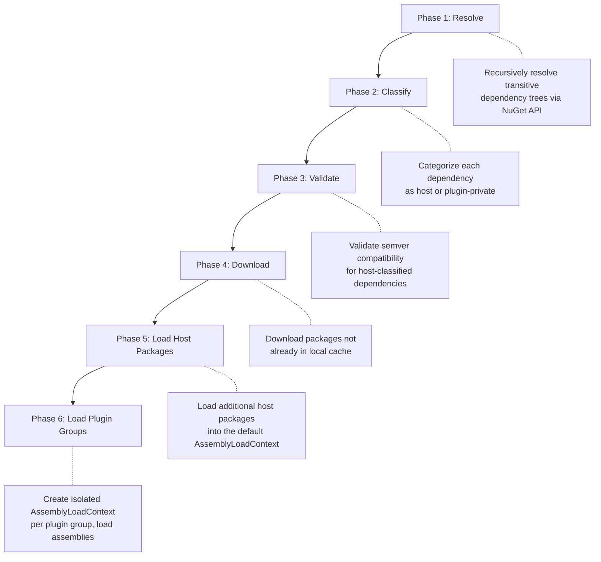
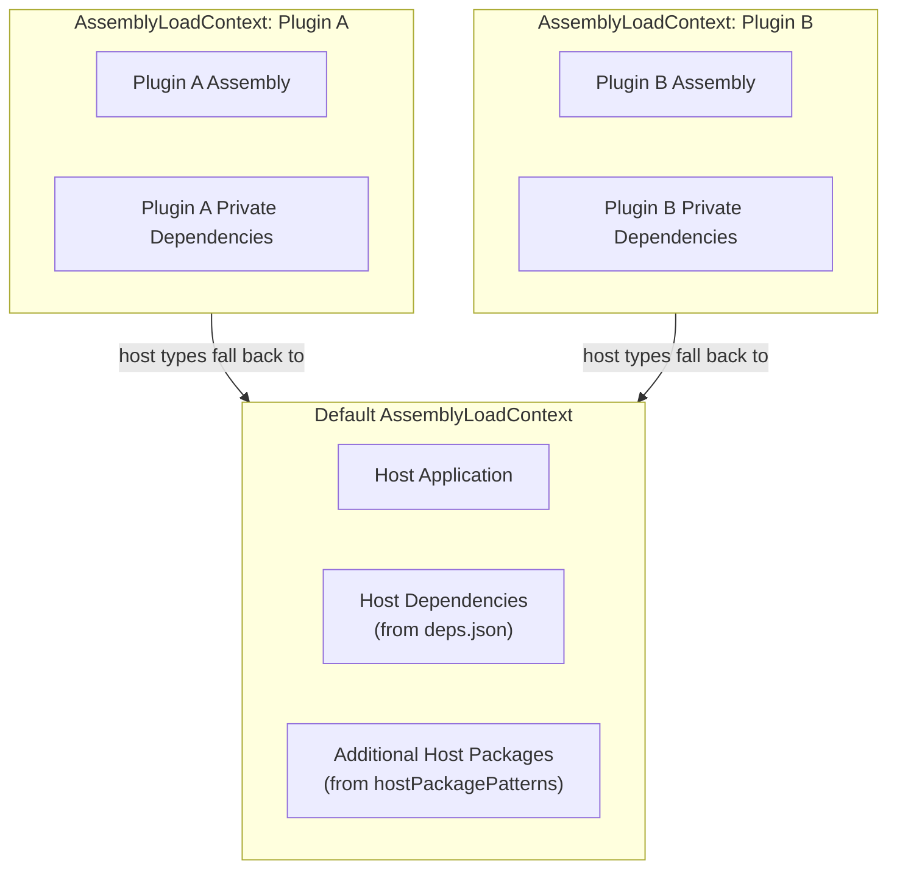

# Namotion.NuGet.Plugins

A standalone .NET library for loading NuGet packages as plugins at runtime. It provides isolated assembly contexts, transitive dependency resolution, and semantic version compatibility validation -- all without runtime reflection or manual assembly management.

## Features

- Download and load NuGet packages as plugins at runtime
- Transitive dependency resolution using the NuGet API
- Per-plugin assembly isolation via `AssemblyLoadContext`
- Automatic host dependency detection from `deps.json`
- Semantic version compatibility validation
- Glob-based host package pattern matching
- Support for multiple NuGet feeds with authentication
- Local `.nupkg` file loading
- Graceful partial failure (one plugin failing does not block others)
- Type discovery across loaded plugins

## Installation

```shell
dotnet add package Namotion.NuGet.Plugins
```

## Architecture Overview

The library is structured around a six-phase load pipeline that processes plugin requests into isolated, running assemblies:

1. **Resolve** -- recursively resolve each plugin's full transitive dependency tree via the NuGet API
2. **Classify** -- categorize each dependency as host (shared), plugin (top-level), or plugin-private (isolated)
3. **Validate** -- check semantic version compatibility for host-classified dependencies
4. **Download** -- fetch packages not already in the local cache
5. **Load Host Packages** -- load additional host packages into the default `AssemblyLoadContext`
6. **Load Plugin Groups** -- create an isolated `AssemblyLoadContext` per plugin group and load assemblies

The library is fully standalone with no application-specific dependencies. It uses the NuGet SDK (`NuGet.Protocol`, `NuGet.Frameworks`) for package resolution and download, and .NET's `AssemblyLoadContext` (collectible) for isolation and unloading.

## Namespace Organization

The library is organized into sub-namespaces by responsibility:

| Namespace | Contents |
|---|---|
| `Namotion.NuGet.Plugins` | Root types: `NuGetPluginLoadResult`, `NuGetPluginFailure`, `NuGetPluginConflict`, `PackageNameMatcher`, `VersionCompatibility`, `DependencyClassifier` |
| `Namotion.NuGet.Plugins.Configuration` | Options, configuration, and feed types: `NuGetPluginLoaderOptions`, `HostDependencyResolver`, `NuGetFeed`, `NuGetPluginRequest` |
| `Namotion.NuGet.Plugins.Loading` | Loader and assembly context: `NuGetPluginLoader`, `NuGetPluginGroup`, `PluginAssemblyLoadContext`, `PackageExtractor` |
| `Namotion.NuGet.Plugins.Repository` | NuGet feed access: `INuGetPackageRepository`, `NuGetPackageRepository`, `CompositeNuGetPackageRepository`, `NuGetPackageInfo` |
| `Namotion.NuGet.Plugins.Resolution` | Dependency graph resolution: `DependencyGraphResolver`, `DependencyNode`, `IDependencyInfoProvider`, `NuGetDependencyInfoProvider`, `HostPackageVersionResolver` |

## Quick Start

```csharp
using Namotion.NuGet.Plugins.Configuration;
using Namotion.NuGet.Plugins.Loading;

var options = new NuGetPluginLoaderOptions
{
    Feeds = [NuGetFeed.NuGetOrg],
    HostDependencies = HostDependencyResolver.FromDepsJson(),
    HostPackagePatterns = ["MyCompany.*.Abstractions"],
};

using var loader = new NuGetPluginLoader(options);

var result = await loader.LoadPluginsAsync(
[
    new NuGetPluginRequest("MyCompany.Plugin.Sensors", "1.0.0"),
    new NuGetPluginRequest("MyCompany.Plugin.Actuators", "2.1.0"),
], CancellationToken.None);

if (!result.Success)
{
    foreach (var failure in result.Failures)
    {
        Console.WriteLine($"Plugin '{failure.PackageName}' failed: {failure.Reason}");
    }
}

// Discover types implementing a shared interface
foreach (var type in loader.GetTypes<ISensorDevice>())
{
    Console.WriteLine($"Found sensor: {type.FullName}");
}
```

## Load Flow

The loader processes plugins through six sequential phases:



## Configuration

### NuGetPluginLoaderOptions (`Namotion.NuGet.Plugins.Configuration`)

| Property | Type | Default | Description |
|---|---|---|---|
| `Feeds` | `IReadOnlyList<NuGetFeed>` | `[NuGetFeed.NuGetOrg]` | NuGet package sources to search, in priority order |
| `HostPackagePatterns` | `IReadOnlyList<string>` | `[]` | Glob patterns for packages that should be loaded as host assemblies |
| `HostDependencies` | `HostDependencyResolver?` | `null` | Host dependency map for version validation |
| `CacheDirectory` | `string?` | `null` | Local directory for downloaded packages (auto-generated temp dir if null) |

## Host Dependency Resolution

The host dependency map tells the loader which packages and versions the host application already provides. This is used for two purposes:

1. **Classification** -- dependencies already in the host are not loaded into plugin-private contexts.
2. **Validation** -- the loader checks that plugin requirements are compatible with host versions.

### FromDepsJson (recommended)

Parses the running application's `{app}.deps.json` file, which contains all NuGet package references with exact versions. This is the most complete and accurate method.

```csharp
var options = new NuGetPluginLoaderOptions
{
    HostDependencies = HostDependencyResolver.FromDepsJson(),
};
```

The method automatically detects the deps.json location from the entry assembly. If the entry assembly's file is not found (e.g., inside a test host), it falls back to searching `AppContext.BaseDirectory` for any `*.deps.json` files and merges them.

> **Note:** `deps.json` is not available for AOT-compiled or single-file published applications. Use one of the `FromAssemblies` overloads in those cases.

### FromAssemblies (loaded assemblies)

Builds the dependency map from actual `Assembly` objects, using their assembly versions. Useful when deps.json is unavailable.

```csharp
var options = new NuGetPluginLoaderOptions
{
    HostDependencies = HostDependencyResolver.FromAssemblies(
        AppDomain.CurrentDomain.GetAssemblies()),
};
```

### FromAssemblies (explicit tuples)

For testing or edge cases, you can provide name/version pairs manually:

```csharp
var options = new NuGetPluginLoaderOptions
{
    HostDependencies = HostDependencyResolver.FromAssemblies(
        ("Microsoft.Extensions.Logging", new Version(9, 0, 0)),
        ("System.Text.Json", new Version(9, 0, 0))),
};
```

## Host Package Patterns

Host package patterns determine which plugin dependencies should be treated as host assemblies rather than loaded into isolated plugin contexts. This is essential for sharing types and interfaces between the host and plugins.

Patterns use `*` to match any characters within a single dot-separated segment:

| Pattern | Matches | Does not match |
|---|---|---|
| `MyCompany.*.Abstractions` | `MyCompany.Devices.Abstractions` | `Microsoft.Extensions.Logging.Abstractions` |
| `MyCompany.*` | `MyCompany.Core`, `MyCompany.Devices` | `OtherCompany.Core` |
| `Exact.Package` | `Exact.Package` | `Exact.Package.Extra` |

Packages matching these patterns are downloaded from the configured feeds and loaded into the default `AssemblyLoadContext`, making them available to both the host and all plugin groups.

```csharp
var options = new NuGetPluginLoaderOptions
{
    HostPackagePatterns =
    [
        "MyCompany.*.Abstractions",  // Shared interface packages
        "Shared.Contracts",          // Exact match
    ],
};
```

## Dependency Classification

Every dependency in the resolved tree is classified into one of three categories. The classifier checks these rules in order and uses the first match:

| Priority | Category | Condition | Where loaded |
|---|---|---|---|
| 1 | **Plugin** | Package is one of the configured plugin requests | Plugin's isolated `AssemblyLoadContext` |
| 2 | **Host** | Package exists in the host's `deps.json` (via `HostDependencyResolver`) | Default `AssemblyLoadContext` (already present) |
| 3 | **Host** | Package name matches a `HostPackagePatterns` glob | Default `AssemblyLoadContext` (downloaded and loaded) |
| 4 | **Plugin-private** | None of the above | Plugin's isolated `AssemblyLoadContext` |

The distinction between priority 2 and 3 matters at runtime:

- **deps.json host packages** (priority 2) are already loaded in the host process. The loader skips downloading them entirely and only validates version compatibility.
- **Pattern-matched host packages** (priority 3) are *not* in the host process. The loader downloads them from NuGet, extracts them, and loads their assemblies into the default `AssemblyLoadContext` via a `Resolving` event hook. This makes them available to both the host and all plugins. These are called "additional host packages".

When multiple plugins depend on the same additional host package, the loader computes the common subset of all their version ranges using `VersionRange.CommonSubSet()`. If a common range exists, the highest available version within that range is used. If no common subset exists (e.g., Plugin A needs `>= 2.0.0` and Plugin B needs `< 2.0.0`), this is a version conflict that fails all plugins.

## Assembly Isolation Model

The loader uses per-plugin `AssemblyLoadContext` instances to enforce isolation, with fallback to the default context for host assemblies.



Each plugin group gets a collectible `AssemblyLoadContext` that overrides `Load()` with a three-step fallback:

1. If the assembly name is classified as host, return `null` -- this falls back to the default context, ensuring shared type identity.
2. If the assembly name matches a private dependency with a known file path, load it from the package cache.
3. Otherwise, return `null` to let the default resolution handle it.

The loader also registers a `Resolving` handler on `AssemblyLoadContext.Default` to resolve additional host packages (pattern-matched packages that are not in the host's deps.json but need to be shared across all contexts).

### Host assemblies

Loaded into the default `AssemblyLoadContext`. This category includes:

- **deps.json host packages** -- assemblies already present in the host process. Not downloaded, only version-validated.
- **Additional host packages** -- packages matching `HostPackagePatterns` that are not in deps.json. Downloaded from NuGet and loaded into the default context on demand via the `Resolving` hook.

Host assemblies are shared across the host application and all plugin groups. This ensures that when a plugin implements a host-defined interface (e.g., `ISensorDevice`), the type identity is the same across all contexts.

### Plugin-private assemblies

Loaded into an isolated, collectible `AssemblyLoadContext` per plugin group. Everything not classified as a host assembly is plugin-private. Each plugin group gets its own copy, enabling:

- **Independent versions** -- Plugin A can use `Newtonsoft.Json 12.x` while Plugin B uses `13.x`
- **No cross-contamination** -- a bug in one plugin's dependency does not affect others
- **Clean unloading** -- disposing a plugin group unloads its entire context

### Plugin groups

Each configured plugin package forms a group. The top-level package and its transitive dependencies (that are not host-classified) share one `AssemblyLoadContext`. For example, if `Sensors.App` depends on `Sensors.Core`, both are loaded in the same context so they can share types directly.

### Target framework selection

When extracting assemblies from a `.nupkg`, the loader selects the best matching target framework from the `lib/` folder. It checks for exact matches in priority order (net10.0, net9.0, net8.0, ..., netstandard2.0), then falls back to the NuGet `FrameworkReducer` for compatibility matching against the running runtime version.

## Version Validation Rules

Version validation applies only to **deps.json host packages** (priority 2 in the classification table). These packages are already loaded in the host, so the plugin must be compatible with the host's exact version:

| Rule | Example | Result |
|---|---|---|
| **Major must match** | Plugin needs `2.x`, host has `1.x` | Conflict |
| **Plugin minor <= host minor** | Plugin needs `1.2`, host has `1.3` | OK |
| **Plugin minor <= host minor** | Plugin needs `1.4`, host has `1.3` | Conflict |
| **Patch ignored** | Plugin needs `1.2.5`, host has `1.2.0` | OK |

**Additional host packages** (priority 3) are not version-validated against the host since they don't exist in the host yet. Instead, when multiple plugins require the same additional host package, the loader computes the common subset of all their version ranges and resolves the highest available version within that range. If no common subset exists, this is a conflict error.

## Failure Handling

The loader distinguishes between two levels of failure:

### Host-level failures (fail all)

These failures prevent any plugins from loading because they would result in an inconsistent default `AssemblyLoadContext`:

- **Version conflicts with host dependencies** -- throws `NuGetPluginVersionConflictException`
- **Incompatible version ranges for shared host packages** -- throws `NuGetPluginVersionConflictException`
- **Host package download failure** -- exception propagates, nothing is loaded

### Plugin-group failures (isolated)

These failures skip the affected plugin group while other groups continue loading normally:

- **Package not found or download error** -- reported in `NuGetPluginLoadResult.Failures`
- **Dependency resolution failure** -- reported in `NuGetPluginLoadResult.Failures`
- **Assembly load error within a group** -- reported in `NuGetPluginLoadResult.Failures`

```csharp
var result = await loader.LoadPluginsAsync(plugins, cancellationToken);

// Host-level conflicts throw before reaching here.
// Plugin-level failures are reported in the result:
foreach (var failure in result.Failures)
{
    logger.LogWarning("Plugin '{Plugin}' failed to load: {Reason}",
        failure.PackageName, failure.Reason);

    if (failure.Conflicts != null)
    {
        foreach (var conflict in failure.Conflicts)
        {
            logger.LogWarning("  Conflict: {Assembly} requires {Required} but host has {Available} (requested by {RequestedBy})",
                conflict.AssemblyName, conflict.RequiredVersion, conflict.AvailableVersion, conflict.RequestedBy);
        }
    }
}

// Successfully loaded plugins are available regardless of other failures:
foreach (var plugin in result.LoadedPlugins)
{
    logger.LogInformation("Loaded plugin '{Plugin}' v{Version} with {Count} assemblies.",
        plugin.PackageName, plugin.PackageVersion, plugin.Assemblies.Count);
}
```

## Type Discovery

After loading plugins, you can discover types across all loaded plugin groups:

```csharp
// Find all types implementing an interface
IEnumerable<Type> sensorTypes = loader.GetTypes<ISensorDevice>();

// Find types with a custom predicate
IEnumerable<Type> allControllers = loader.GetTypes(
    type => type.Name.EndsWith("Controller") && !type.IsAbstract);

// Per-plugin-group discovery
foreach (var group in loader.LoadedPlugins)
{
    var types = group.GetTypes<ISensorDevice>();
    Console.WriteLine($"{group.PackageName}: {types.Count()} sensor types");
}
```

`GetTypes<T>()` returns concrete (non-abstract, non-interface) types assignable to `T`. The type `T` must come from a host assembly so that the type identity matches across the host and plugin contexts.

## Local File-Based Plugins

You can load plugins from local `.nupkg` files by specifying the `Path` property on `NuGetPluginRequest`:

```csharp
var result = await loader.LoadPluginsAsync(
[
    new NuGetPluginRequest("MyLocalPlugin", Path: "plugins/MyLocalPlugin.1.0.0.nupkg"),
], CancellationToken.None);
```

File-based plugins are extracted and loaded directly without NuGet feed resolution. Note that transitive dependency resolution is not performed for file-based plugins -- only the assemblies inside the `.nupkg` are loaded.

## Custom Feeds with Authentication

Configure multiple NuGet feeds with optional API key authentication. Feeds are tried in order; the first feed that has the requested package wins. Downloads are retried up to 5 times with exponential backoff on transient HTTP errors.

```csharp
var options = new NuGetPluginLoaderOptions
{
    Feeds =
    [
        // Public feed (default)
        NuGetFeed.NuGetOrg,

        // Private Azure DevOps feed
        new NuGetFeed(
            "private",
            "https://pkgs.dev.azure.com/myorg/_packaging/myfeed/nuget/v3/index.json",
            apiKey: "your-pat-token"),

        // Private GitHub Packages feed
        new NuGetFeed(
            "github",
            "https://nuget.pkg.github.com/myorg/index.json",
            apiKey: "ghp_token"),
    ],
};
```

## Unloading Plugins

Individual plugin groups can be unloaded at runtime:

```csharp
bool wasUnloaded = loader.UnloadPlugin("MyCompany.Plugin.Sensors");
```

This disposes the plugin's `AssemblyLoadContext` (which is collectible), allowing the runtime to reclaim the loaded assemblies. Note that any objects instantiated from plugin types must be released before the GC can fully collect the context.

Disposing the `NuGetPluginLoader` itself unloads all plugin groups and removes the default context resolving hook.

## Limitations

- **No native library support** -- the `runtimes/` folder inside NuGet packages is ignored; plugins with native dependencies (e.g., `libgit2sharp`) will not work.
- **No hot-reload** -- changing a plugin requires unloading and reloading; there is no in-place update mechanism.
- **No deps.json for AOT or single-file** -- AOT-compiled and single-file published applications do not generate `deps.json`. Use `HostDependencyResolver.FromAssemblies()` instead.
- **No plugin-to-plugin direct dependencies** -- plugins cannot reference types from other plugin groups. Use `HostPackagePatterns` to share contracts via host-loaded packages.
- **No plugin signing or trust verification** -- packages are loaded without signature validation.

## API Reference

### NuGetPluginLoader (`Namotion.NuGet.Plugins.Loading`)

The main entry point. Implements `IDisposable`.

| Member | Description |
|---|---|
| `NuGetPluginLoader(options, logger?)` | Constructor. Logger is optional and defaults to `NullLogger`. |
| `LoadPluginsAsync(plugins, cancellationToken)` | Resolves, validates, downloads, and loads the given plugin requests. Returns `NuGetPluginLoadResult`. |
| `LoadedPlugins` | All currently loaded plugin groups. |
| `GetTypes<T>()` | Finds all concrete types assignable to `T` across all loaded plugins. |
| `GetTypes(predicate)` | Finds all types matching a predicate across all loaded plugins. |
| `UnloadPlugin(packageName)` | Unloads a specific plugin group by package name. Returns `true` if found and unloaded. |
| `Dispose()` | Unloads all plugins and removes the default context resolving hook. |

### NuGetPluginRequest (`Namotion.NuGet.Plugins.Configuration`)

```csharp
public record NuGetPluginRequest(
    string PackageName,
    string? Version = null,
    string? Path = null);
```

- `PackageName` -- the NuGet package ID.
- `Version` -- the desired version (optional; resolves to latest if null). Used for feed-based plugins.
- `Path` -- path to a local `.nupkg` file (optional). When set, the plugin is loaded from disk instead of a feed.

### NuGetPluginLoadResult (`Namotion.NuGet.Plugins`)

| Member | Description |
|---|---|
| `Success` | `true` if there are no failures. |
| `LoadedPlugins` | Plugin groups that loaded successfully. |
| `Failures` | Plugin groups that failed, with reasons and optional conflict details. |

### NuGetPluginGroup (`Namotion.NuGet.Plugins.Loading`)

Represents one loaded plugin and its private dependencies. Implements `IDisposable`.

| Member | Description |
|---|---|
| `PackageName` | The NuGet package ID. |
| `PackageVersion` | The resolved version that was loaded. |
| `Assemblies` | All assemblies loaded in this group's context. |
| `GetTypes<T>()` | Finds concrete types assignable to `T` within this group. |
| `GetTypes(predicate)` | Finds types matching a predicate within this group. |
| `Dispose()` | Unloads the group's `AssemblyLoadContext`. |

### HostDependencyResolver (`Namotion.NuGet.Plugins.Configuration`)

| Member | Description |
|---|---|
| `FromDepsJson()` | Parses the host's `deps.json` (recommended). |
| `FromDepsJson(path)` | Parses a specific `deps.json` file. |
| `FromAssemblies(assemblies)` | Builds from loaded `Assembly` objects. |
| `FromAssemblies(tuples)` | Builds from explicit `(string Name, Version Version)` tuples. |
| `Dependencies` | All known host packages and their versions. |
| `Contains(packageName)` | Whether the host has this package. |
| `GetVersion(packageName)` | Gets the host's version of a package, or null. |

### NuGetFeed (`Namotion.NuGet.Plugins.Configuration`)

| Member | Description |
|---|---|
| `NuGetFeed(name, url, apiKey?)` | Constructor. |
| `NuGetFeed.NuGetOrg` | Pre-configured feed for `https://api.nuget.org/v3/index.json`. |
| `Name` | Display name. |
| `Url` | NuGet V3 service index URL. |
| `ApiKey` | Optional authentication token. |
